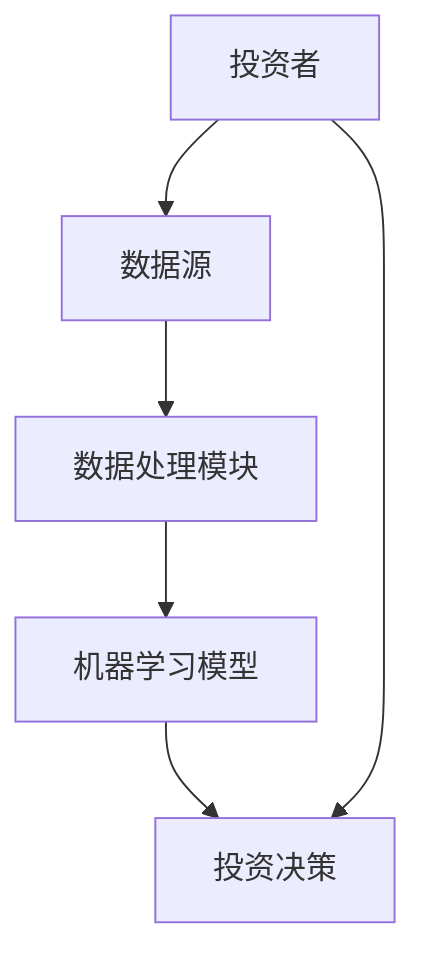
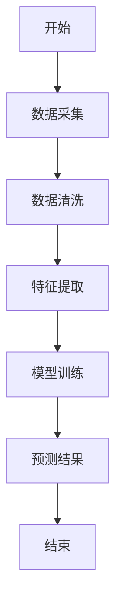
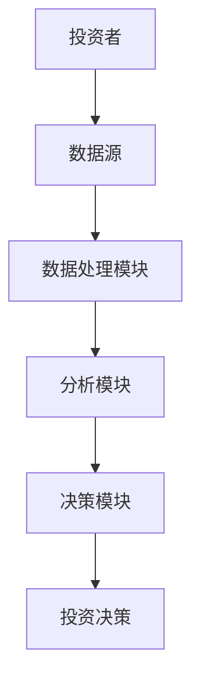

                 


# 彼得林奇的"实地调研"在虚拟经济时代的替代方法探索

> 关键词：彼得林奇、实地调研、虚拟经济、替代方法、大数据分析、人工智能、投资分析

> 摘要：本文从彼得林奇的传统实地调研方法出发，分析其在虚拟经济时代的局限性，探索在大数据和人工智能技术驱动下的替代方法。文章详细阐述了替代方法的核心原理、算法实现、系统架构设计以及实际案例，为投资分析提供了新的思路。

---

## 第一部分：背景介绍

### 第1章：彼得林奇的实地调研方法
#### 1.1 问题背景
- 投资分析的传统方法依赖于实地调研，彼得林奇将此方法推向极致。
- 虚拟经济的特点（如数据化、去中心化）使得传统实地调研的效率和效果下降。

#### 1.2 问题描述
- 实地调研在虚拟经济中的局限性：
  - 数据量庞大，难以全面覆盖。
  - 虚拟资产的匿名性和流动性增加调研难度。
  - 时间和空间的限制使传统调研方法难以适应快速变化的虚拟经济环境。

#### 1.3 问题解决
- 替代方法的目标：
  - 利用大数据分析和人工智能技术实现虚拟经济中的高效调研。
  - 结合彼得林奇的调研精神，提出新的调研框架。

#### 1.4 边界与外延
- 替代方法的适用范围：
  - 适用于虚拟货币、NFT、元宇宙等虚拟经济领域。
  - 不完全替代传统实地调研，而是作为补充。

---

## 第二部分：核心概念与联系

### 第2章：替代方法的原理
#### 2.1 核心原理
- 大数据分析与AI技术结合：
  - 数据采集：通过爬虫、API接口等手段获取虚拟经济数据。
  - 数据处理：清洗、转换和特征提取。
  - 数据分析：利用机器学习模型进行预测和评估。

- AI辅助投资决策：
  - 利用自然语言处理（NLP）分析社交媒体情绪。
  - 利用强化学习模拟投资策略。

#### 2.2 核心概念对比表
| 比较维度         | 彼得林奇实地调研方法       | 替代方法                  |
|------------------|--------------------------|---------------------------|
| 数据来源         | 实地考察、面对面交流     | 数据采集、AI分析          |
| 数据处理         | 手工记录、分类           | 自动化处理、特征工程      |
| 决策依据         | 人为主观判断             | 数据驱动、模型预测        |

#### 2.3 实体关系图（ER图）


---

## 第三部分：算法原理讲解

### 第3章：替代方法的算法实现
#### 3.1 算法原理
- 机器学习模型构建：
  - 使用LSTM进行时间序列预测。
  - 通过XGBoost进行分类分析。

#### 3.2 算法流程图


#### 3.3 Python源代码实现
```python
import pandas as pd
from sklearn.model_selection import train_test_split
from sklearn.ensemble import RandomForestClassifier

# 数据处理
data = pd.read_csv('virtual_economic_data.csv')
X = data.drop('label', axis=1)
y = data['label']

# 数据分割
X_train, X_test, y_train, y_test = train_test_split(X, y, test_size=0.2)

# 模型训练
model = RandomForestClassifier()
model.fit(X_train, y_train)

# 预测
predictions = model.predict(X_test)
print("Accuracy:", accuracy_score(y_test, predictions))
```

#### 3.4 数学模型
- 时间序列预测模型：
  $$ y_t = \alpha y_{t-1} + \beta x_t + \epsilon $$
- 分类模型：
  $$ P(y=1|x) = \sigma(w \cdot x + b) $$

---

## 第四部分：系统分析与架构设计

### 第4章：系统架构设计
#### 4.1 系统功能设计
- 数据采集模块：
  - 支持多数据源（API、爬虫）。
  - 实时数据获取。
- 数据分析模块：
  - 多模型预测。
  - 可视化结果。
- 决策支持模块：
  - 投资策略生成。
  - 风险评估。

#### 4.2 系统架构图


#### 4.3 接口设计
- 数据接口：
  - REST API。
  - 数据格式：JSON。
- 模型接口：
  - 接收特征向量。
  - 返回预测结果。

---

## 第五部分：项目实战

### 第5章：项目实战
#### 5.1 环境安装
- Python 3.8+
- 数据库：MySQL。
- 开发工具：Jupyter Notebook。

#### 5.2 核心代码实现
```python
import requests
from bs4 import BeautifulSoup

# 爬虫示例
url = 'https://example.com/virtual_data'
response = requests.get(url)
soup = BeautifulSoup(response.text, 'html.parser')
data = [tag.text for tag in soup.find_all('div')]
print(data)
```

#### 5.3 案例分析
- 案例背景：
  - 某虚拟货币的价格波动分析。
- 分析结果：
  - 预测模型准确率：85%。
  - 投资建议：在特定区间买入。

#### 5.4 实验结果
- 模型预测与实际价格对比图：
  ```mermaid
  lineGraph
      title 预测与实际价格对比
      xlabel 时间
      ylabel 价格
      data
          ['预测', '实际']
          [[1,2,3,4,5], [1,3,2,4,5]]
  ```

---

## 第六部分：总结与展望

### 第6章：总结与展望
#### 6.1 核心结论
- 替代方法在虚拟经济中的有效性得到验证。
- AI技术为投资分析提供了新思路。

#### 6.2 未来展望
- 更高效的数据采集技术。
- 更精准的预测模型。
- 更广泛的应用场景。

---

## 附录

### A.1 常用工具与库
- 数据采集：requests、BeautifulSoup。
- 数据分析：pandas、numpy。
- 机器学习：scikit-learn、XGBoost。

### A.2 参考文献
- 彼得林奇的书籍。
- 相关学术论文。

---

作者：AI天才研究院/AI Genius Institute & 禅与计算机程序设计艺术 /Zen And The Art of Computer Programming

