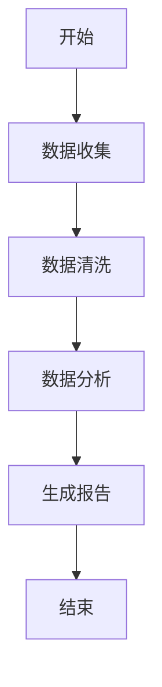

                 


```markdown
# 彼得林奇的"实地调研"在远程办公时代的调整

> 关键词：彼得林奇，实地调研，远程办公，投资方法，数字化转型，数据分析

> 摘要：在远程办公普及的背景下，传统的实地调研方法面临挑战。本文探讨彼得林奇实地调研的核心理念，分析其在远程环境下的调整策略，提出基于数据收集、分析和投资决策的数字化转型方案。通过系统设计和算法优化，结合项目实战案例，详细解读远程调研的实现方法，为投资者提供实践指导。

---

# 第一部分: 背景介绍与核心概念

## 第1章: 彼得林奇实地调研方法概述

### 1.1 实地调研的核心理念
实地调研是彼得林奇投资方法的重要组成部分，强调通过亲身观察和与管理层沟通，获取公司运营状况的第一手信息。这种方法依赖于面对面的交流、实地考察和数据收集，旨在识别潜在的投资机会和风险。

### 1.2 远程办公时代的挑战
远程办公的普及改变了传统的工作模式，也对实地调研提出了新的挑战：
- **信息获取的局限性**：无法面对面交流，难以全面了解公司运营状况。
- **数据收集的难度**：依赖于线上工具，数据的真实性和完整性可能受到影响。
- **投资决策的风险**：基于不完整信息的决策可能导致投资失误。

### 1.3 本书的核心问题与目标
本书旨在探讨如何在远程办公环境下，调整和优化彼得林奇的实地调研方法，提出一套结合数字化工具和数据分析的投资策略，确保在远程条件下仍能高效、准确地进行投资决策。

---

## 第2章: 实地调研的核心概念与联系

### 2.1 核心概念的定义与属性
实地调研的核心概念包括：
- **调研对象**：目标公司、管理层、员工、客户等。
- **数据来源**：公司财务报表、行业报告、市场反馈等。
- **分析方法**：定性分析、定量分析、趋势分析等。

### 2.2 实地调研的ER实体关系图
```mermaid
er
  %% 实地调研的ER实体关系图
  %% 定义实体
  entity(调研对象) {
    id
    名称
    类型
  }
  entity(数据来源) {
    id
    类型
    来源渠道
  }
  entity(分析方法) {
    id
    名称
    描述
  }
  %% 定义关系
 调研对象 -- 数据来源: 数据来源于调研对象
 调研对象 -- 分析方法: 使用分析方法进行分析
 数据来源 -- 分析方法: 分析方法基于数据来源进行分析
```

---

## 第3章: 实地调研在远程办公环境下的调整策略

### 3.1 远程调研的核心原理
远程调研依赖于数字化工具和数据分析技术，通过线上渠道收集和处理数据，结合算法模型进行投资决策。

### 3.2 算法原理的详细讲解
#### 3.2.1 算法流程图


#### 3.2.2 算法实现的Python源代码
```python
import pandas as pd
import numpy as np

def collect_data():
    # 数据收集函数，模拟从线上渠道获取数据
    data = pd.DataFrame({
        '调研对象': ['公司A', '公司B'],
        '数据来源': ['财务报表', '行业报告'],
        '时间戳': ['2023-01-01', '2023-01-02']
    })
    return data

def data_cleaning(data):
    # 数据清洗函数
    data['数值'] = data['数值'].fillna(0)
    return data

def data_analysis(data):
    # 数据分析函数
    summary = data.describe()
    return summary

def generate_report(summary):
    # 生成报告函数
    print("数据分析结果：")
    print(summary)

# 主函数
def main():
    data = collect_data()
    cleaned_data = data_cleaning(data)
    analysis_result = data_analysis(cleaned_data)
    generate_report(analysis_result)

if __name__ == "__main__":
    main()
```

#### 3.2.3 数学模型与公式
在远程调研中，数据分析的核心是构建预测模型。以下是一个简单的线性回归模型：
$$ y = \beta_0 + \beta_1x + \epsilon $$
其中：
- \( y \) 是目标变量（如公司业绩）
- \( x \) 是自变量（如行业趋势）
- \( \beta_0 \) 和 \( \beta_1 \) 是回归系数
- \( \epsilon \) 是误差项

---

## 第4章: 系统分析与架构设计方案

### 4.1 系统分析与设计概述
#### 4.1.1 系统分析
- **问题场景**：远程环境下，如何高效收集和分析数据。
- **系统目标**：构建一个支持远程调研的数据分析平台。

#### 4.1.2 系统设计
- **功能模块**：
  - 数据收集模块：从线上渠道获取数据。
  - 数据清洗模块：处理数据中的缺失值和异常值。
  - 数据分析模块：使用算法模型进行分析。
  - 报告生成模块：输出分析结果。

### 4.2 系统架构设计


---

## 第5章: 项目实战与案例分析

### 5.1 环境安装
- **工具安装**：安装Python、Pandas、NumPy等库。
  ```bash
  pip install pandas numpy
  ```

### 5.2 核心实现
- **数据收集**：使用爬虫或API获取数据。
- **数据清洗**：处理数据中的缺失值和异常值。
- **数据分析**：使用机器学习模型进行预测。

### 5.3 案例分析
- **案例背景**：分析某公司的业绩趋势。
- **数据处理**：清洗数据并构建时间序列模型。
- **结果解读**：预测公司未来业绩。

### 5.4 项目小结
通过项目实战，验证了远程调研方法的有效性，并总结了实施过程中的经验教训。

---

## 第6章: 最佳实践与总结

### 6.1 最佳实践
- **工具选择**：选择适合的数字化工具，如远程会议软件、数据分析平台。
- **数据管理**：确保数据的安全性和完整性。
- **持续优化**：根据实际效果不断调整调研方法。

### 6.2 小结
在远程办公时代，彼得林奇的实地调研方法需要结合数字化工具和数据分析技术进行调整。通过系统设计和算法优化，投资者可以在远程条件下仍能高效、准确地进行投资决策。

### 6.3 注意事项
- 避免过度依赖线上数据，确保数据的真实性和全面性。
- 定期验证模型的准确性，及时调整分析方法。

### 6.4 拓展阅读
- 推荐阅读《彼得林奇选股术》和《远程办公的未来》等书籍，深入了解投资方法和远程办公的最新趋势。

---

# 作者：AI天才研究院/AI Genius Institute & 禅与计算机程序设计艺术 /Zen And The Art of Computer Programming
```

