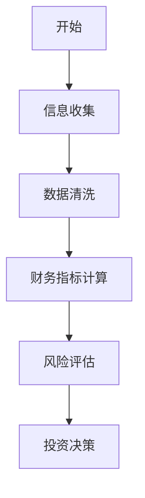
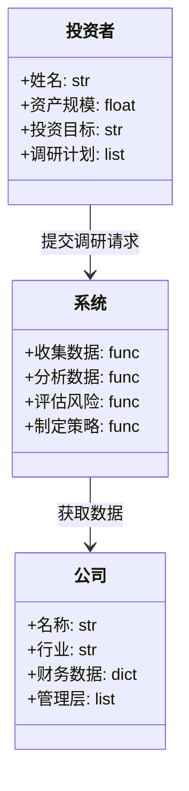
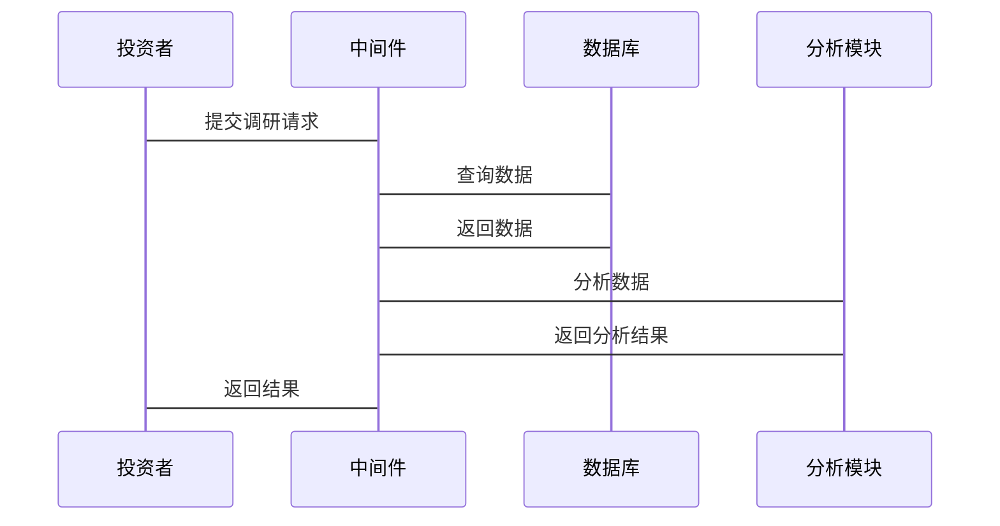

                 


# 彼得林奇的"实地调研"注意事项

## 关键词：彼得林奇、实地调研、投资策略、风险管理、财务分析

## 摘要：  
彼得·林奇是全球著名的基金经理，他强调实地调研在投资决策中的重要性。本文将系统地分析彼得林奇的实地调研方法，探讨其实地调研的核心概念、流程、系统架构及其实战应用，最后总结最佳实践和注意事项。

---

# 第一部分: 彼得林奇的实地调研背景与核心概念

## 第1章: 背景介绍

### 1.1 实地调研的背景与重要性

#### 1.1.1 投资领域的实地调研背景  
在金融投资领域，信息不对称是一个长期存在的问题。投资者需要通过各种渠道获取信息以做出明智决策。实地调研作为一种主动获取信息的方式，能够帮助投资者更深入地了解企业的真实状况。

#### 1.1.2 彼得林奇实地调研的重要性  
彼得·林奇是富达投资集团的传奇基金经理，他强调实地调研的重要性。他认为，仅仅依靠财务报表和市场数据是不够的，还需要通过实地调研来验证数据的真实性，了解管理层的能力和公司的运营情况。

#### 1.1.3 实地调研与投资决策的关系  
实地调研能够帮助投资者发现潜在的风险和机会，从而做出更准确的投资决策。通过实地调研，投资者可以更全面地评估公司的基本面，发现财务报表中隐藏的信息，从而提高投资的成功率。

### 1.2 彼得林奇的调研方法

#### 1.2.1 彼得林奇的调研核心理念  
彼得·林奇的调研理念强调“亲自去看、去听、去问”。他认为，只有通过实地调研，才能真正了解企业的运营状况、管理层的素质以及潜在的风险。

#### 1.2.2 与传统投资方法的区别  
与传统的依赖市场数据和财务报表分析不同，实地调研更加注重第一手的信息获取。通过实地调研，投资者可以更直观地了解企业的实际情况，发现财务数据背后的故事。

---

## 第2章: 核心概念与联系

### 2.1 实地调研的核心要素

#### 2.1.1 公司基本面分析  
公司基本面分析是实地调研的核心内容之一。包括对公司所在行业的分析、公司的市场地位、产品竞争力、财务状况等。

#### 2.1.2 管理层能力评估  
管理层的能力评估是实地调研的重要部分。通过与管理层的访谈，投资者可以了解他们的战略规划、管理风格和决策能力。

#### 2.1.3 财务数据核实  
财务数据核实是实地调研的关键步骤。通过与公司财务部门的沟通，投资者可以验证财务报表的真实性，发现潜在的财务问题。

### 2.2 调研方法对比分析

#### 2.2.1 不同调研方法的优缺点对比（表格形式）

| 调研方法       | 优点                           | 缺点                           |
|----------------|--------------------------------|--------------------------------|
| 电话调研       | 成本低，效率高                 | 信息量有限，难以深入         |
| 现场调研       | 信息全面，准确性高             | 成本高，时间长                 |
| 问卷调研       | 数据量大，覆盖面广             | 真实性不足，难以深入         |

#### 2.2.2 实地调研与其他调研方式的联系（Mermaid ER图）

```mermaid
erd
    管理层能力 --> 公司基本面
    公司基本面 --> 财务数据
    财务数据 --> 投资决策
```

---

## 第3章: 实地调研流程与算法原理

### 3.1 实地调研流程

#### 3.1.1 信息收集阶段  
在信息收集阶段，投资者需要收集与目标公司相关的所有信息，包括行业报告、财务报表、公司公告等。

#### 3.1.2 数据分析阶段  
在数据分析阶段，投资者需要对收集到的数据进行分析，包括财务指标分析、行业趋势分析等。

#### 3.1.3 风险评估阶段  
在风险评估阶段，投资者需要根据分析结果评估投资风险，并制定相应的投资策略。

### 3.2 调研算法原理

#### 3.2.1 数据清洗与预处理（Python代码示例）

```python
import pandas as pd

# 加载数据
data = pd.read_csv('financial_data.csv')

# 删除缺失值
data = data.dropna()

# 标准化处理
from sklearn.preprocessing import StandardScaler
scaler = StandardScaler()
data_scaled = scaler.fit_transform(data)
```

#### 3.2.2 财务指标计算（数学公式）

$$
ROE = \frac{\text{净利润}}{\text{股东权益}} \times 100\%
$$

$$
ROA = \frac{\text{净利润}}{\text{总资产}} \times 100\%
$$

#### 3.2.3 风险评估模型（Mermaid流程图）



---

## 第4章: 系统分析与架构设计方案

### 4.1 问题场景介绍  
在投资决策过程中，投资者需要处理大量的信息，包括财务数据、行业报告、公司公告等。为了提高效率，投资者可以采用系统化的调研方法。

### 4.2 系统功能设计

#### 4.2.1 领域模型（Mermaid类图）



### 4.3 系统架构设计（Mermaid架构图）


### 4.4 系统交互设计（Mermaid序列图）



---

## 第5章: 项目实战

### 5.1 环境安装

#### 5.1.1 安装Python和相关库  
```bash
pip install pandas numpy matplotlib
```

#### 5.1.2 安装Jupyter Notebook  
```bash
pip install jupyter
```

### 5.2 核心代码实现

#### 5.2.1 数据清洗与预处理

```python
import pandas as pd

# 加载数据
data = pd.read_csv('financial_data.csv')

# 删除缺失值
data = data.dropna()

# 标准化处理
from sklearn.preprocessing import StandardScaler
scaler = StandardScaler()
data_scaled = scaler.fit_transform(data)
```

#### 5.2.2 风险评估模型

```python
def calculate_ROE(net_profit, equity):
    return (net_profit / equity) * 100

def calculate_ROA(net_profit, total_assets):
    return (net_profit / total_assets) * 100

# 示例数据
net_profit = 1000000
equity = 5000000
total_assets = 10000000

# 计算ROE和ROA
roe = calculate_ROE(net_profit, equity)
roa = calculate_ROA(net_profit, total_assets)

print(f"ROE: {roe}%")
print(f"ROA: {roa}%")
```

### 5.3 案例分析

#### 5.3.1 案例背景  
假设我们正在评估一家科技公司的投资价值。我们需要通过实地调研了解公司的基本面、管理层能力和财务状况。

#### 5.3.2 数据分析  
通过分析公司的财务数据，我们发现公司的ROE和ROA均高于行业平均水平，说明公司的盈利能力较强。

#### 5.3.3 投资决策  
基于以上分析，我们认为这家公司具有较高的投资价值，建议投资者进行投资。

### 5.4 项目小结  
通过实地调研，我们能够更全面地了解公司的实际情况，发现潜在的风险和机会，从而做出更明智的投资决策。

---

## 第6章: 最佳实践与注意事项

### 6.1 最佳实践 tips

#### 6.1.1 提前做好调研计划  
在进行实地调研之前，投资者需要制定详细的调研计划，明确调研的目标、内容和时间安排。

#### 6.1.2 多渠道获取信息  
投资者应该通过多种渠道获取信息，包括与管理层访谈、参观公司生产车间、与行业专家交流等。

#### 6.1.3 持续跟踪与更新  
投资环境是动态变化的，投资者需要持续跟踪公司的最新动态，及时调整投资策略。

### 6.2 小结  
实地调研是投资决策中不可或缺的一部分。通过实地调研，投资者可以更全面地了解公司的实际情况，发现潜在的风险和机会，从而做出更明智的投资决策。

### 6.3 注意事项

#### 6.3.1 避免信息偏差  
投资者在进行实地调研时，需要注意信息的客观性和准确性，避免受到公司管理层的主观影响。

#### 6.3.2 风险管理  
投资者需要在实地调研过程中严格控制风险，确保投资决策的科学性和可行性。

### 6.4 拓展阅读  
推荐投资者阅读彼得·林奇的《彼得·林奇的投资之道》一书，深入了解他的投资理念和实地调研方法。

---

## 作者：AI天才研究院/AI Genius Institute & 禅与计算机程序设计艺术 /Zen And The Art of Computer Programming

