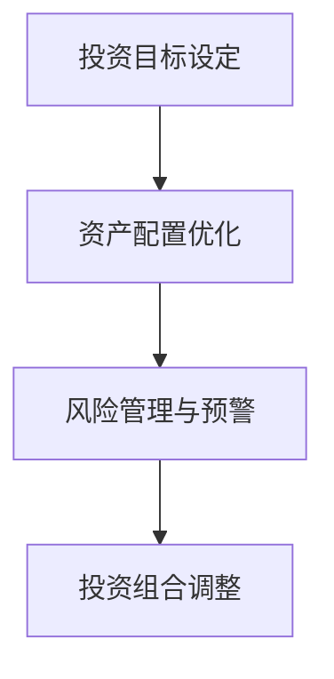

                 

# 彼得林奇的"家庭投资"在不同生命阶段的调整

## 关键词：彼得·林奇，家庭投资，生命周期，资产配置，风险管理

## 摘要：  
本文通过分析彼得·林奇的家庭投资理念，探讨在不同生命阶段如何调整投资策略以实现财务目标。文章从单身、成家立业、上有老下有小到退休生活四个阶段，详细阐述了每个阶段的财务需求、投资目标和策略调整，并结合数学模型和实际案例，为读者提供可操作的指导。

---

## 第一部分：彼得·林奇家庭投资理念概述

### 第1章：彼得·林奇与家庭投资概述

#### 1.1 彼得·林奇的生平与投资理念  
彼得·林奇是美国著名投资专家，以其独特的选股能力和长期投资理念闻名。他的家庭投资理念强调通过合理的资产配置和长期持有优质资产，实现财富的稳健增长。  

#### 1.2 家庭投资的核心概念与背景  
家庭投资是指通过合理配置资金，实现财务目标的过程。不同生命阶段的财务需求和风险承受能力不同，因此需要动态调整投资策略。  

---

## 第二部分：家庭投资在不同生命阶段的调整策略

### 第2章：单身阶段的家庭投资策略

#### 2.1 单身阶段的财务状况分析  
单身阶段通常收入稳定，但可能缺乏长期的财务负担。此时，可以承担较高风险的投资，追求高收益。  

#### 2.2 投资目标与风险承受能力  
目标：资本增值为主，同时建立应急基金。  
风险承受能力：较高，可以配置股票、成长型基金等。  

#### 2.3 投资组合配置建议  
建议配置60%股票、30%债券、10%现金。  

#### 2.4 投资策略的数学模型与公式  
目标函数：  
$$ \max \text{收益} = w_1 r_1 + w_2 r_2 + \dots + w_n r_n $$  
约束条件：  
$$ w_1 + w_2 + \dots + w_n = 1 $$  
$$ w_i \geq 0 $$  

---

### 第3章：成家立业阶段的家庭投资策略

#### 3.1 家庭形成期的财务需求  
成家后，可能面临房贷、子女教育等支出，需要稳健的投资策略。  

#### 3.2 投资目标的调整与优化  
目标：平衡收益与风险，注重长期稳健增长。  
风险承受能力：中等，可以配置股票、债券、房地产信托基金等。  

#### 3.3 资产配置的动态调整  
建议配置50%股票、30%债券、20%房地产信托基金。  

#### 3.4 投资组合的风险管理  
使用动态资产配置模型，定期调整投资比例。  

---

### 第4章：上有老下有小阶段的家庭投资策略

#### 4.1 家庭成长期的财务压力  
上有老人医疗费用，下有子女教育支出，需要降低投资风险。  

#### 4.2 投资目标的重新定位  
目标：保值为主，兼顾增值。  
风险承受能力：较低，配置债券、货币基金、黄金等。  

#### 4.3 资产配置的保守化调整  
建议配置30%股票、50%债券、20%现金。  

#### 4.4 家庭资产的保值与增值平衡  
通过多元化配置，平衡风险与收益。  

---

### 第5章：退休生活阶段的家庭投资策略

#### 5.1 退休阶段的财务需求  
退休后收入减少，需要稳定的现金流。  

#### 5.2 投资目标的稳健化  
目标：稳定收益，保障生活质量。  
风险承受能力：最低，配置债券、货币基金、固定收益信托等。  

#### 5.3 资产配置的低风险导向  
建议配置70%债券、20%货币基金、10%固定收益信托。  

#### 5.4 资产传承与税务规划  
通过信托、保险等方式，优化资产传承。  

---

## 第三部分：家庭投资的数学模型与算法原理

### 第6章：投资组合优化的数学模型

#### 6.1 投资组合优化的定义与目标  
通过优化资产配置，实现收益最大化或风险最小化。  

#### 6.2 投资组合优化的数学公式  
$$ \text{目标函数：} \quad \min \sigma^2 \quad \text{在} \quad \mu \geq \mu_{\text{min}} $$  
$$ \text{约束条件：} \quad \sum w_i = 1, \quad w_i \geq 0 $$  

---

### 第7章：动态资产配置的算法原理

#### 7.1 动态资产配置的定义与特点  
根据市场变化，动态调整资产配置比例。  

#### 7.2 动态资产配置的数学模型  
$$ \text{动态调整公式：} \quad w_t = w_{t-1} + \delta t $$  

---

## 第四部分：家庭投资的系统架构与风险管理

### 第8章：系统架构设计

#### 8.1 系统功能设计  
- 投资目标设定  
- 资产配置优化  
- 风险管理与预警  

#### 8.2 系统架构图  

---

## 第五部分：实战案例与总结

### 第9章：实战案例分析

#### 9.1 案例背景  
以一个成家立业的家庭为例，分析如何配置资产。  

#### 9.2 投资组合实现  
配置50%股票、30%债券、20%房地产信托基金。  

#### 9.3 实际案例分析  
通过市场变化，动态调整资产配置比例，实现稳健收益。  

---

## 第六部分：总结与展望

### 第10章：总结与展望

#### 10.1 总结  
彼得·林奇的家庭投资理念强调动态调整和风险管理，不同生命阶段需要不同的投资策略。  

#### 10.2 展望  
未来，随着市场变化和技术进步，家庭投资策略将更加智能化和个性化。  

---

## 作者：AI天才研究院/AI Genius Institute & 禅与计算机程序设计艺术 /Zen And The Art of Computer Programming

---

**本文内容仅用于技术研究与交流，不构成投资建议。投资需谨慎，决策请自行判断。**

