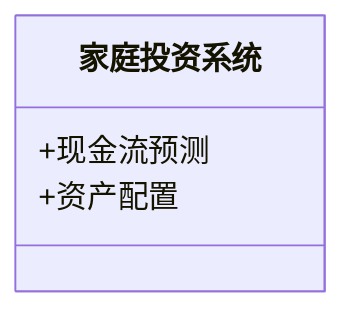

                 


# 彼得林奇的"家庭投资"在通胀环境下的资产配置

**关键词**：彼得林奇，家庭投资，资产配置，通货膨胀，投资策略，风险管理

**摘要**：本文深入探讨了彼得·林奇的家庭投资理念及其在通货膨胀环境下的资产配置策略。通过分析不同资产类别的通胀表现、系统化投资模型的设计与实现，以及实战案例的详细解读，为读者提供一套在通胀环境下优化家庭资产配置的科学方法和实践指导。

---

# 第1章: 通货膨胀与资产配置的背景

## 1.1 通货膨胀的基本概念

### 1.1.1 通货膨胀的定义与衡量指标

通货膨胀是指物价总水平在一段时间内持续上涨，导致货币购买力下降的经济现象。衡量通货膨胀的主要指标包括消费者价格指数（CPI）、生产者价格指数（PPI）和GDP平减指数。通货膨胀对个人和企业都有深远影响，尤其是在家庭投资领域，通货膨胀会导致资产价值波动加剧，投资收益的不确定性增加。

### 1.1.2 通货膨胀对企业与个人的影响

对个人而言，通货膨胀可能导致实际收入下降，储蓄和固定收益资产的价值缩水。对企业来说，通货膨胀可能引发成本上升、利润减少，进而影响股价表现。因此，在通货膨胀环境下，合理的资产配置显得尤为重要。

### 1.1.3 资产配置在通货膨胀环境下的重要性

资产配置是将资金分配到不同资产类别（如股票、债券、现金等）的过程，旨在在不同市场环境下平衡风险和收益。在通货膨胀环境下，合理的资产配置可以帮助家庭抵御通胀风险，保护和提升资产的实际价值。

## 1.2 彼得·林奇与家庭投资理念

### 1.2.1 彼得·林奇的个人背景与投资风格

彼得·林奇是美国著名的投资经理人，以其在富达基金（Fidelity）的卓越表现而闻名。他的投资风格注重长期价值，强调深入研究和分散投资。林奇的家庭投资理念主张将家庭资产分散配置，以抵御市场波动和经济周期的影响。

### 1.2.2 家庭投资的核心理念

林奇认为，家庭投资的目标是实现资产的保值与增值，同时注重风险控制。他提倡根据家庭的财务状况、风险承受能力和投资目标，制定个性化的资产配置方案。

### 1.2.3 家庭投资与通货膨胀的关系

通货膨胀会侵蚀固定收益资产的价值，而股票等风险资产可以通过资本增值对抗通胀。因此，在通货膨胀环境下，家庭投资需要注重资产的多样化配置，尤其是增加抗通胀资产（如股票、房地产投资信托基金）的比重。

## 1.3 资产配置的基本原理

### 1.3.1 资产配置的定义与分类

资产配置是将资金分配到不同资产类别以实现风险和收益的优化。常见的资产类别包括股票、债券、现金、房地产等。资产配置的核心在于通过分散投资降低风险，同时抓住不同资产在不同经济周期下的表现机会。

### 1.3.2 不同经济周期下的资产配置策略

在通货膨胀上升期，股票、商品等风险资产表现较好；在通货膨胀下降期，债券、现金等固定收益资产可能更优。因此，家庭投资需要根据经济周期的变化动态调整资产配置。

### 1.3.3 资产配置与风险控制的关系

资产配置是风险管理的重要工具。通过合理的资产配置，可以在不同市场环境下平衡风险和收益，避免过度集中投资导致的损失。

---

# 第2章: 家庭投资的核心概念与联系

## 2.1 家庭投资的核心要素

### 2.1.1 投资目标与财务规划

家庭投资的目标包括保值、增值、教育基金、退休基金等。财务规划是实现投资目标的基础，需要考虑家庭的收入、支出、负债和时间 horizon。

### 2.1.2 投资期限与资金流动性

投资期限决定了资产的流动性需求。长期投资可以承受更高的风险，而短期投资需要保持较高的流动性以应对资金需求。

### 2.1.3 风险承受能力与资产分配

风险承受能力是家庭投资的核心要素之一。根据风险偏好，家庭可以将资产分配到不同风险等级的资产类别中。

### 2.1.4 资产配置的动态调整

资产配置不是一成不变的，需要根据市场变化、家庭财务状况和投资目标进行动态调整。

## 2.2 资产类别与通胀环境的关系

### 2.2.1 股票、债券、现金等资产的通胀表现

- **股票**：在通货膨胀初期，企业盈利增长可能超过通胀，股票价值上升。但长期高通胀可能导致利率上升，抑制股票表现。
- **债券**：债券的票面利率固定，但在通货膨胀环境下，债券的实际收益可能下降。长期债券的利率风险更大。
- **现金**：现金在通货膨胀环境下购买力下降，但流动性高，适合作为短期储备资金。
- **房地产**：房地产作为实物资产，通常能够通过租金上涨和资产升值抵御通货膨胀。

### 2.2.2 实物资产与金融资产的对比

实物资产（如房地产、黄金）通常具有较强的抗通胀能力，而金融资产（如股票、债券）的表现则取决于市场环境和通胀水平。

### 2.2.3 多资产配置的优缺点分析

多资产配置的优点是分散风险，降低单一资产类别波动带来的影响；缺点是需要较高的投资知识和管理成本。

## 2.3 家庭投资与通胀的实体关系图


---

# 第3章: 资产配置的数学模型与算法

## 3.1 资产配置的数学模型

### 3.1.1 马科维茨有效前沿理论

马科维茨的有效前沿理论是资产配置的重要基础。该理论认为，投资者可以通过合理配置不同资产，实现风险和收益的最优组合。

$$\text{最大化 } \mu_p \text{ 在给定 } \sigma_p$$

其中，$\mu_p$ 是投资组合的预期收益，$\sigma_p$ 是投资组合的风险（标准差）。

### 3.1.2 现金比率的计算公式

现金比率是用来衡量流动资产与总负债的比例，公式为：

$$\text{现金比率} = \frac{\text{流动资产}}{\text{总负债}}$$

---

## 3.2 基于通胀环境的资产权重调整算法

### 3.2.1 算法概述

根据通胀水平调整各资产类别的权重，以优化投资组合的抗通胀能力。

### 3.2.2 算法步骤

1. 确定当前通胀率。
2. 根据通胀率调整股票、债券、现金等资产的权重。
3. 计算调整后的投资组合收益和风险。
4. 动态优化资产配置。

### 3.2.3 通胀调整算法的数学模型

$$\text{权重调整} = \text{基准权重} \times (1 + \text{通胀率})$$

---

## 3.3 家庭投资的实战算法

### 3.3.1 现金管理算法

```python
def cash_management(cash, inflation_rate):
    return cash * (1 + inflation_rate)
```

### 3.3.2 股票与债券配比算法

```python
def asset_allocation(stocks, bonds, inflation):
    stocks_weight = stocks / (stocks + bonds + cash)
    bonds_weight = bonds / (stocks + bonds + cash)
    return stocks_weight, bonds_weight
```

---

# 第4章: 系统分析与架构设计

## 4.1 问题场景介绍

### 4.1.1 家庭投资面临的通胀挑战

通货膨胀可能导致家庭资产贬值，投资收益不稳定。

### 4.1.2 系统化资产配置的必要性

通过系统化的方法，优化资产配置，降低通胀风险。

## 4.2 系统功能设计

### 4.2.1 系统架构图



### 4.2.2 系统功能模块

- 现金流预测模块：根据家庭收入和支出预测未来现金流。
- 资产配置模块：根据通胀环境和家庭目标优化资产配置。

## 4.3 系统架构设计


---

# 第5章: 项目实战

## 5.1 环境安装与配置

### 5.1.1 Python环境安装

安装Python和必要的库（如numpy、pandas）。

### 5.1.2 数据获取

获取历史通胀数据和资产收益数据。

## 5.2 核心实现源代码

```python
import numpy as np
import pandas as pd

def compute_portfolio_return(weights, returns):
    return np.dot(weights.T, returns)

def compute_portfolio_risk(weights, returns_covariance):
    return np.sqrt(np.dot(weights.T, np.dot(returns_covariance, weights)))

# 示例数据
returns = pd.DataFrame({
    '股票': [0.1, 0.05, 0.08],
    '债券': [0.02, 0.03, 0.04],
    '现金': [0.01, 0.01, 0.01]
})

covariance = returns.cov()

# 计算投资组合收益和风险
weights = np.array([0.5, 0.3, 0.2])
portfolio_return = compute_portfolio_return(weights, returns)
portfolio_risk = compute_portfolio_risk(weights, covariance)

print("投资组合收益:", portfolio_return)
print("投资组合风险:", portfolio_risk)
```

## 5.3 代码应用解读与分析

上述代码通过计算不同资产类别的权重，优化投资组合的收益和风险。在通货膨胀环境下，可以通过调整权重，选择更具抗通胀能力的资产。

---

# 小结

本文通过分析通货膨胀对家庭投资的影响，结合彼得·林奇的家庭投资理念，提出了在通胀环境下的资产配置策略。通过数学模型和系统设计，帮助读者制定个性化的投资方案，实现资产的保值与增值。

---

**作者：AI天才研究院/AI Genius Institute & 禅与计算机程序设计艺术 /Zen And The Art of Computer Programming**

