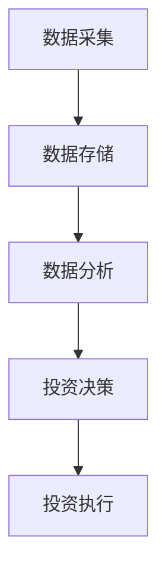
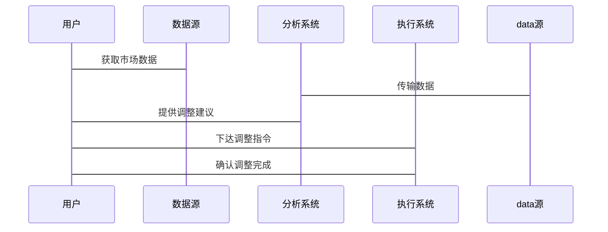

                 


---

# 彼得林奇的"家庭投资组合"在后疫情时代的调整策略

> 关键词：疫情、全球经济、投资策略、彼得·林奇、家庭投资组合、资产配置、风险管理

> 摘要：后疫情时代，全球经济面临前所未有的挑战与机遇。本文从彼得·林奇的经典投资理念出发，结合疫情对全球经济的深远影响，系统性地分析家庭投资组合的核心要素与调整策略。通过详细解读股票、债券、现金等资产的配置优化，探讨投资组合的风险管理与动态调整方法。文章还结合实际案例，提供后疫情时代家庭投资组合的优化方案，并总结了最佳实践与注意事项。

---

## 第一部分: 后疫情时代的投资环境与彼得·林奇投资理念的演变

### 第1章: 后疫情时代的全球经济与投资环境

#### 1.1 疫情对全球经济的深远影响

- 1.1.1 疫情对全球经济的冲击与复苏  
  - 疫情导致全球经济活动停滞，企业倒闭潮、失业率上升、消费萎缩等问题加剧。  
  - 疫情后的经济复苏呈现区域分化，新兴市场与发展中国家面临更大的挑战。  
  - 疫情加速了数字化转型，远程办公、电子商务等新兴行业的崛起。

- 1.1.2 后疫情时代的经济新常态  
  - 经济增速放缓，通胀压力上升，全球货币政策转向宽松。  
  - 疫情后供应链断裂，全球产业链重构，跨国投资与贸易面临不确定性。  
  - 数字经济与绿色经济成为后疫情时代经济增长的新引擎。

- 1.1.3 疫情对投资环境的长期影响  
  - 资本市场波动加剧，股票、债券等资产价格波动性显著增加。  
  - 疫情后央行大规模量化宽松政策导致债券收益率下降，股票估值上升。  
  - 疫情加速了投资者对风险资产的重新评估，资产配置需求发生变化。

#### 1.2 彼得·林奇投资理念的核心思想

- 1.2.1 投资的长期性与价值导向  
  - 林奇强调长期投资，避免短期波动干扰投资决策。  
  - 价值投资的核心是寻找基本面良好、估值合理的公司。  

- 1.2.2 风险控制与资产配置的重要性  
  - 林奇认为，合理的资产配置是投资组合的核心。  
  - 风险控制是投资成功的基石，需根据市场环境动态调整。  

- 1.2.3 投资组合的动态调整策略  
  - 定期评估投资组合的表现，及时调整以适应市场变化。  
  - 根据经济周期调整资产配置比例，降低整体风险。  

#### 1.3 家庭投资组合的基本概念与目标

- 1.3.1 投资组合的定义与构成要素  
  - 投资组合是多种资产的组合，旨在分散风险、提高收益。  
  - 家庭投资组合通常包括股票、债券、现金等资产。  

- 1.3.2 家庭投资组合的目标与特征  
  - 目标：保值增值、风险可控、流动性合理。  
  - 特征：分散化、长期性、动态调整。  

- 1.3.3 投资组合的风险与收益平衡  
  - 高收益意味着高风险，需根据家庭风险承受能力调整。  
  - 分散化投资是平衡风险与收益的有效手段。  

---

## 第二部分: 家庭投资组合的核心要素与调整策略

### 第2章: 家庭投资组合的构成与风险分析

#### 2.1 家庭投资组合的资产配置

- 2.1.1 股票、债券、现金等资产的分类与特点  

| 资产类型 | 特点 | 风险 | 收益 |
|----------|------|------|------|
| 股票     | 潜在收益高，流动性好 | 高      | 高      |
| 债券     | 收益稳定，风险较低 | 中低     | 中低     |
| 现金     | 流动性高，风险最低 | 极低     | 低       |

- 2.1.2 不同资产类别的风险与收益对比  
  - 股票：长期收益高，但波动性大。  
  - 债券：收益稳定，但收益率较低。  
  - 现金：流动性好，但收益最低。  

- 2.1.3 资产配置的动态调整原则  
  - 根据市场变化调整股票、债券等资产比例。  
  - 保持适度的现金储备以应对突发事件。  

#### 2.2 投资组合的风险管理

- 2.2.1 系统性风险与非系统性风险的区分  
  - 系统性风险：市场整体波动带来的风险。  
  - 非系统性风险：特定资产或行业带来的风险。  

- 2.2.2 投资组合的分散化策略  
  - 通过多样化投资降低非系统性风险。  
  - 定期评估投资组合的相关性，避免过度集中。  

- 2.2.3 风险承受能力的评估与调整  
  - 根据家庭财务状况和风险偏好动态调整。  
  - 在市场波动加剧时，适当降低风险敞口。  

#### 2.3 家庭财务状况与投资目标的匹配

- 2.3.1 家庭财务状况的全面评估  
  - 收入来源、支出结构、资产规模等。  
  - 确定可投资资金的规模与流动性需求。  

- 2.3.2 投资目标的设定与分解  
  - 短期目标：应急储备金。  
  - 中期目标：子女教育、购房等。  
  - 长期目标：退休储备。  

- 2.3.3 财务状况变化对投资组合的影响  
  - 收入增加时，可适当增加高风险资产比例。  
  - 支出增加时，需调整资产流动性。  

---

### 第3章: 彼得·林奇投资策略的后疫情时代调整

#### 3.1 股票投资策略的调整

- 3.1.1 疫情后股票市场的变化与机会  
  - 疫情后科技股、医疗股表现优异。  
  - 周期性行业（如旅游、航空）复苏潜力大。  

- 3.1.2 高质量股票的筛选标准  
  - 企业基本面良好，财务健康。  
  - 行业龙头公司具有更强的抗风险能力。  

- 3.1.3 长期持有与波段操作的平衡  
  - 长期持有优质股票，避免频繁交易。  
  - 根据市场波动进行适度的波段操作。  

#### 3.2 债券投资策略的优化

- 3.2.1 疫情后债券市场的风险与收益分析  
  - 债券收益率下降，但波动性较低。  
  - 信用风险上升，需选择评级高的债券。  

- 3.2.2 债券在投资组合中的作用  
  - 稳定收益，降低整体波动性。  
  - 在市场下跌时提供避险功能。  

- 3.2.3 债券投资的注意事项  
  - 关注利率变化对债券价格的影响。  
  - 避免投资期限过长的债券，以防流动性风险。  

#### 3.3 现金与流动性管理

- 3.3.1 现金储备的合理规模  
  - 一般建议保留3-6个月的日常开支。  
  - 根据市场环境动态调整现金比例。  

- 3.3.2 现金在投资组合中的角色  
  - 短期流动性需求的保障。  
  - 投资机会出现时的资金准备。  

- 3.3.3 现金流动性与投资机会的平衡  
  - 在市场低点增加现金配置，等待投资机会。  
  - 在市场高点减少现金比例，增加风险资产配置。  

---

## 第三部分: 投资组合的动态调整与优化

### 第4章: 投资组合的动态调整与优化

#### 4.1 投资组合的定期评估与调整

- 4.1.1 定期评估的必要性与方法  
  - 每季度或每半年进行一次全面评估。  
  - 使用财务指标（如夏普比率、最大回撤等）衡量表现。  

- 4.1.2 投资组合调整的触发条件  
  - 市场环境变化（如通胀上升、经济周期转变）。  
  - 家庭财务状况变化（如收入增加或减少）。  
  - 资产配置比例偏离目标范围。  

- 4.1.3 调整过程  
  - 根据评估结果，调整资产配置比例。  
  - 逐步实施调整，避免一次性大幅变动。  

#### 4.2 系统分析与架构设计方案

- 4.2.1 问题场景介绍  
  - 疫情后投资环境复杂，家庭需要动态调整投资组合。  
  - 投资者需具备快速响应市场变化的能力。  

- 4.2.2 系统功能设计  
  - 风险评估模块：分析市场风险与家庭风险承受能力。  
  - 资产配置模块：根据评估结果优化资产比例。  
  - 动态调整模块：根据市场变化自动触发调整。  

- 4.2.3 系统架构设计  
  - 分为数据采集、分析、决策、执行四个模块。  
  - 使用Mermaid图展示系统架构：  



- 4.2.4 系统接口设计  
  - 数据接口：与市场数据源对接。  
  - 用户接口：提供调整建议与实时监控。  

- 4.2.5 系统交互流程图  
  - 使用Mermaid序列图展示交互流程：  



---

## 第四部分: 项目实战与案例分析

### 第5章: 项目实战与案例分析

#### 5.1 项目介绍

- 疫情后家庭投资组合优化方案。  
- 目标：根据家庭财务状况与市场环境，优化投资组合配置。  

#### 5.2 核心实现源代码

```python
import pandas as pd
import numpy as np

def calculate_asset Allocation(portfolio, market_data):
    # 计算当前投资组合的收益与风险
    portfolio_return = np.mean(portfolio['return'])
    portfolio_risk = np.std(portfolio['return'])
    
    # 计算市场平均收益与风险
    market_return = np.mean(market_data['return'])
    market_risk = np.std(market_data['return'])
    
    # 计算夏普比率
    sharpe_ratio = (portfolio_return - market_return) / market_risk
    
    return sharpe_ratio, portfolio_risk, portfolio_return

# 示例数据
market_data = pd.DataFrame({
    'return': [0.05, 0.03, 0.07, 0.02, 0.06]
})

portfolio = pd.DataFrame({
    'return': [0.04, 0.04, 0.06, 0.03, 0.05]
})

sharpe_ratio, portfolio_risk, portfolio_return = calculate_asset_Allocation(portfolio, market_data)
print(f"夏普比率：{sharpe_ratio}\n投资组合风险：{portfolio_risk}\n投资组合收益：{portfolio_return}")
```

---

## 第五部分: 总结与展望

### 第6章: 总结与展望

#### 6.1 最佳实践 tips

- 定期评估投资组合，及时调整。  
- 根据市场环境变化，动态优化资产配置。  
- 保持适度的现金储备，应对突发事件。  

#### 6.2 小结

- 后疫情时代，全球经济面临新的挑战与机遇。  
- 彼得·林奇的投资理念为家庭投资组合的优化提供了重要指导。  
- 动态调整与风险控制是后疫情时代投资成功的关键。  

#### 6.3 注意事项

- 避免盲目跟风，根据自身情况调整。  
- 保持长期投资心态，避免短期波动干扰。  
- 定期学习市场变化，提升投资能力。  

#### 6.4 拓展阅读

- 《彼得·林奇的投资哲学》  
- 《投资组合管理》  

---

## 作者

作者：AI天才研究院/AI Genius Institute & 禅与计算机程序设计艺术 /Zen And The Art of Computer Programming

