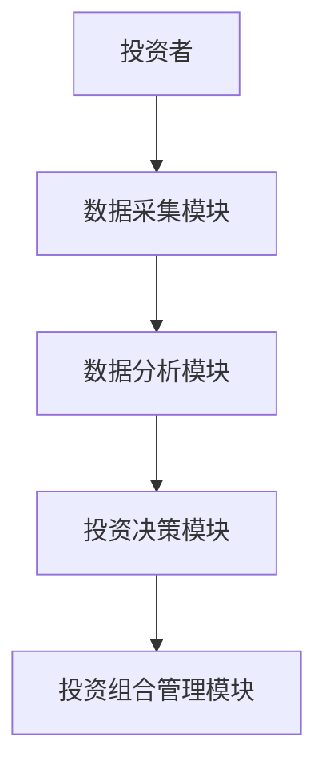
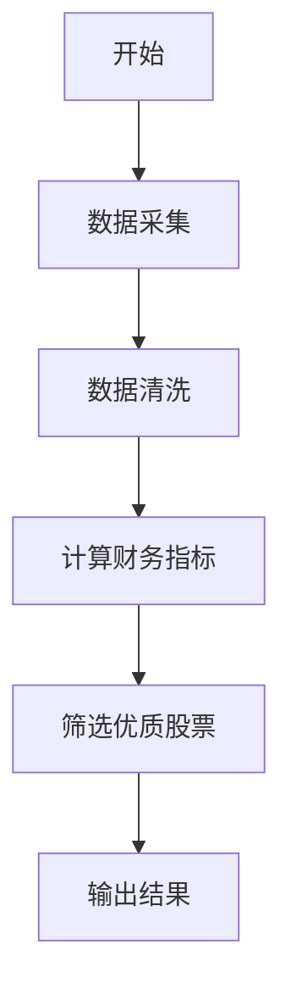

                 


# 彼得林奇的"家庭股票"投资法则

> **关键词**：彼得·林奇，家庭股票，投资法则，股票分析，风险管理，长期持有

> **摘要**：本文深入探讨了彼得·林奇的家庭股票投资法则，结合技术分析与投资策略，通过详细的方法论和实际案例，揭示了家庭股票投资的核心逻辑、系统架构与实战技巧。文章从背景介绍、核心概念、算法原理到系统设计与项目实战，全面解析了家庭股票投资的逻辑与实践路径，为投资者提供了深度的理论支持与实用的操作指南。

---

## 第一章：家庭股票投资的背景与核心概念

### 1.1 彼得·林奇与家庭股票投资概述

#### 1.1.1 彼得·林奇的背景与投资理念
彼得·林奇（Peter Lynch）是美国著名的职业基金经理人，曾担任富达麦哲伦基金（Fidelity Magellan Fund）的经理，创造了令人瞩目的投资业绩。他提倡“业余投资者”也能通过基本面分析和长期持有优质股票，获得超越市场的回报。林奇的投资理念强调深入研究企业基本面，关注企业的竞争优势和财务健康，避免短期市场波动的干扰。

#### 1.1.2 家庭股票的定义与特点
家庭股票是指那些适合普通投资者长期持有的优质股票，具有以下特点：
- **低门槛**：适合个人或家庭进行小额投资。
- **长期稳定性**：选择具备持续增长潜力的企业。
- **易理解性**：投资者可以通过简单的财务指标和行业分析，识别出优质股票。

#### 1.1.3 家庭股票与其他投资方式的对比
与股票投资中的其他方式（如指数基金、短期交易）相比，家庭股票投资更注重长期持有、分散风险和深入的企业分析。通过选择优质企业，家庭股票能够在市场波动中保持稳定，为投资者提供稳健的回报。

---

### 1.2 家庭股票的核心要素

#### 1.2.1 家庭股票的基本面分析
基本面分析是家庭股票投资的核心方法，包括对企业财务状况、行业地位、盈利能力等方面的研究。

- **财务指标分析**：重点关注市盈率（P/E）、市净率（P/B）、ROE（净资产收益率）等指标。
- **企业竞争优势**：分析企业的市场地位、品牌影响力、成本优势等。
- **行业分析**：选择具备长期增长潜力的行业，避免夕阳行业。

#### 1.2.2 家庭股票的投资目标与风险控制
- **目标设定**：明确投资目标，如追求长期资本增值。
- **风险控制**：通过分散投资、长期持有等方式，降低市场波动带来的风险。

---

## 第二章：家庭股票投资的核心方法论

### 2.1 家庭股票的投资策略与分析框架

#### 2.1.1 家庭股票的买入策略
- **价值发现**：寻找被市场低估的优质企业。
- **分散投资**：避免过度集中于单一行业或企业。

#### 2.1.2 家庭股票的长期持有策略
- **长期视角**：关注企业的长期增长潜力，避免频繁交易。
- **定期复盘**：定期审视投资组合，调整持仓结构。

#### 2.1.3 家庭股票的卖出策略
- **卖出信号**：企业基本面恶化、行业趋势逆转或投资目标达成。
- **避免频繁交易**：减少交易成本和税务负担。

---

### 2.2 家庭股票的系统分析与架构设计

#### 2.2.1 系统功能设计
- **数据采集**：获取企业的财务数据和行业信息。
- **数据分析**：通过算法筛选出符合条件的优质股票。
- **投资决策**：基于分析结果，制定买入、持有或卖出策略。

#### 2.2.2 系统架构设计


#### 2.2.3 系统接口设计
- **数据接口**：与金融数据源（如Yahoo Finance）对接。
- **用户界面**：提供直观的投资分析工具。

---

## 第三章：家庭股票投资的数学模型与算法实现

### 3.1 家庭股票筛选的数学模型

#### 3.1.1 基于市盈率的筛选
公式：$$\text{合理市盈率} = \text{行业平均市盈率} \times \text{企业盈利能力调整系数}$$

#### 3.1.2 基于ROE的筛选
公式：$$\text{ROE} = \frac{\text{净利润}}{\text{净资产}}$$

#### 3.1.3 综合评分模型
公式：$$\text{综合评分} = 0.4 \times \text{ROE评分} + 0.3 \times \text{市盈率评分} + 0.3 \times \text{行业地位评分}$$

### 3.2 家庭股票投资算法实现

#### 3.2.1 算法流程


#### 3.2.2 Python代码实现
```python
import pandas as pd

# 数据清洗
data = pd.read_csv('stocks.csv')
data = data.dropna()

# 计算ROE
data['ROE'] = data['净利润'] / data['净资产']

# 筛选优质股票
data = data[data['ROE'] > data['ROE'].mean()]
data = data[data['市盈率'] < data['市盈率'].quantile(0.75)]
```

---

## 第四章：家庭股票投资的风险管理与实战

### 4.1 家庭股票投资的风险管理

#### 4.1.1 风险识别与评估
- **市场风险**：市场波动对股票价格的影响。
- **企业风险**：企业财务状况恶化或行业趋势变化。

#### 4.1.2 风险控制策略
- **分散投资**：避免过度集中。
- **止损机制**：设定止损点，控制亏损幅度。

### 4.2 家庭股票投资的实战分析

#### 4.2.1 案例分析
- **案例企业**：假设某企业ROE持续高于行业平均水平，市盈率合理，行业地位稳固。
- **投资决策**：买入并长期持有。

#### 4.2.2 实战总结
- **成功经验**：通过基本面分析筛选出优质股票，长期持有获得稳健收益。
- **教训总结**：避免过度依赖短期市场波动，注重企业长期价值。

---

## 第五章：家庭股票投资的最佳实践与注意事项

### 5.1 最佳实践

#### 5.1.1 定期复盘与调整
- 定期审视投资组合，根据市场变化和企业情况调整持仓。

#### 5.1.2 长期持有与耐心等待
- 长期持有优质股票，避免频繁交易。

### 5.2 小结与注意事项

#### 5.2.1 小结
- 家庭股票投资的核心在于选择优质企业，长期持有，注重基本面分析和风险管理。

#### 5.2.2 注意事项
- 避免盲目跟风，注重企业长期价值。
- 定期审视投资组合，及时调整。

---

## 附录

### 附录A：家庭股票投资术语表
- **市盈率（P/E）**：股价与每股收益的比率。
- **ROE**：净资产收益率，衡量企业的盈利能力。

### 附录B：家庭股票投资工具推荐
- 数据源：Yahoo Finance、Morningstar。
- 工具：Excel、Python（Pandas库）。

---

## 作者：AI天才研究院/AI Genius Institute & 禅与计算机程序设计艺术 /Zen And The Art of Computer Programming

