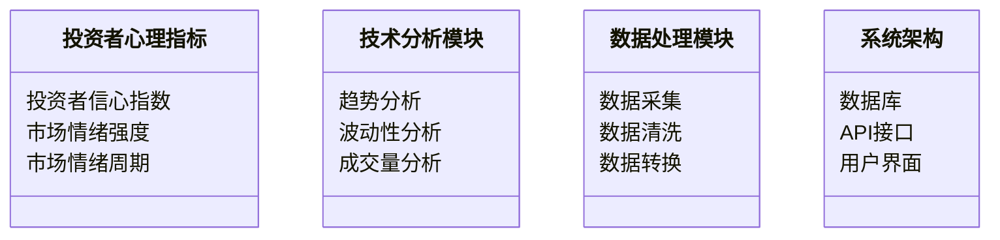

                 


# 彼得林奇的"市场情绪"在技术分析中的应用

> 关键词：市场情绪，彼得林奇，技术分析，投资策略，投资者心理

> 摘要：本文深入探讨了彼得林奇提出的市场情绪理论，并将其与技术分析相结合，揭示了市场情绪在技术分析中的重要性。通过详细分析市场情绪的定义、核心指标及其在技术分析中的应用，本文为投资者提供了一种全新的视角来理解市场波动，并通过数学模型和实际案例展示了如何将市场情绪指标整合到技术分析系统中，以优化投资决策。

---

## 第一部分: 彼得林奇的市场情绪理论概述

### 第1章: 市场情绪的定义与重要性

#### 1.1 市场情绪的定义
市场情绪是指投资者在市场中的心理状态，通常由贪婪、恐惧、乐观或悲观等情绪驱动。这些情绪会影响投资者的决策，从而对市场价格和成交量产生显著影响。

##### 1.1.1 市场情绪的定义
市场情绪是投资者在特定市场环境下的心理状态，通常表现为对市场的乐观或悲观态度。市场情绪可以通过投资者的行为（如买入或卖出行为）和市场数据（如成交量、价格波动）来衡量。

##### 1.1.2 市场情绪的核心特征
市场情绪的核心特征包括：
- **波动性**：市场情绪会随着市场环境的变化而波动。
- **传染性**：市场情绪会在投资者之间传染，形成群体行为。
- **滞后性**：市场情绪通常会滞后于市场实际走势。

##### 1.1.3 市场情绪与投资决策的关系
市场情绪直接影响投资者的决策，从而影响市场的供需关系。当市场情绪乐观时，投资者倾向于买入，推动价格上涨；当市场情绪悲观时，投资者倾向于卖出，导致价格下跌。

#### 1.2 彼得林奇的市场情绪理论
彼得林奇在其投资理论中，强调了市场情绪在预测市场走势中的重要性。他认为，市场情绪是市场波动的核心驱动力。

##### 1.2.1 彼得林奇的市场情绪指标
彼得林奇提出了一个投资者信心指数，用于衡量市场情绪。投资者信心指数反映了投资者对市场的乐观或悲观态度。

##### 1.2.2 市场情绪指标的分类
市场情绪指标可以分为以下几类：
- **投资者信心指数**：反映投资者对市场的整体看法。
- **市场情绪强度**：反映市场情绪的强弱程度。
- **市场情绪周期**：反映市场情绪的周期性变化。

##### 1.2.3 市场情绪指标的计算方法
投资者信心指数的计算公式为：
$$
\text{投资者信心指数} = \frac{\text{买入量} - \text{卖出量}}{\text{总交易量}}
$$

---

### 第2章: 市场情绪与技术分析的结合

#### 2.1 技术分析的定义与作用
技术分析是一种通过分析历史价格和成交量数据来预测未来市场走势的方法。技术分析的核心在于识别市场的趋势和波动模式。

##### 2.1.1 技术分析的核心概念
技术分析的核心概念包括：
- **趋势分析**：识别市场的主趋势方向。
- **波动性分析**：分析市场的波动幅度。
- **成交量分析**：通过成交量数据判断市场的买卖力量。

##### 2.1.2 技术分析在投资中的作用
技术分析可以帮助投资者识别市场的买卖信号，优化投资决策，并降低投资风险。

#### 2.2 市场情绪在技术分析中的应用
市场情绪是技术分析中的一个重要因素。通过结合市场情绪指标，投资者可以更全面地理解市场的波动原因。

##### 2.2.1 市场情绪对趋势分析的影响
市场情绪可以影响市场的趋势方向。当市场情绪乐观时，趋势倾向于上升；当市场情绪悲观时，趋势倾向于下降。

##### 2.2.2 市场情绪对波动性分析的影响
市场情绪的波动性可以影响市场的波动幅度。当市场情绪剧烈波动时，市场的波动幅度通常较大。

##### 2.2.3 市场情绪对成交量分析的影响
市场情绪可以影响市场的成交量。当市场情绪乐观时，成交量通常较高；当市场情绪悲观时，成交量通常较低。

---

### 第3章: 彼得林奇市场情绪指标的数学模型

#### 3.1 市场情绪指标的数学公式
彼得林奇的市场情绪指标可以通过以下公式进行计算：

##### 3.1.1 投资者信心指数的计算公式
$$
\text{投资者信心指数} = \frac{\text{买入量} - \text{卖出量}}{\text{总交易量}}
$$

##### 3.1.2 市场情绪强度的计算公式
$$
\text{市场情绪强度} = \frac{\text{市场情绪指标} \times \text{波动率}}{\text{平均成交量}}
$$

#### 3.2 市场情绪指标的分析与解释
市场情绪指标的分析与解释是理解市场情绪的重要步骤。

##### 3.2.1 市场情绪指标的正负值分析
- 正值：市场情绪乐观，投资者倾向于买入。
- 负值：市场情绪悲观，投资者倾向于卖出。

##### 3.2.2 市场情绪指标的强度分析
- 强度高：市场情绪剧烈波动，市场走势可能出现剧烈波动。
- 强度低：市场情绪相对稳定，市场走势较为平稳。

##### 3.2.3 市场情绪指标的周期性分析
市场情绪指标通常具有周期性。通过分析市场情绪指标的周期性，投资者可以更好地预测市场的未来走势。

---

### 第4章: 市场情绪指标的系统分析与架构设计

#### 4.1 系统分析
##### 4.1.1 问题场景介绍
市场情绪指标的系统分析需要考虑以下问题场景：
- 如何实时获取市场数据？
- 如何计算市场情绪指标？
- 如何将市场情绪指标应用于技术分析？

##### 4.1.2 项目介绍
本项目旨在构建一个基于彼得林奇市场情绪指标的技术分析系统，帮助投资者更好地理解市场波动。

##### 4.1.3 系统功能设计
系统的功能设计包括：
- 数据采集模块：实时采集市场数据。
- 数据处理模块：计算市场情绪指标。
- 技术分析模块：结合市场情绪指标进行技术分析。
- 投资决策模块：基于技术分析结果提供投资建议。

##### 4.1.4 领域模型（Mermaid 类图）



#### 4.2 系统架构设计（Mermaid 架构图）


---

### 第5章: 项目实战

#### 5.1 环境安装
为了运行本项目，需要安装以下工具：
- Python 3.x
- 数据分析库（如Pandas、NumPy）
- 可视化库（如Matplotlib）
- 技术分析库（如TA-Lib）

#### 5.2 系统核心实现源代码
以下是市场情绪指标计算的Python代码示例：

```python
import pandas as pd
import numpy as np

def calculate_investor_confidence_index.buy_volume, sell_volume, total_volume):
    return (buy_volume - sell_volume) / total_volume

# 示例数据
buy_volume = 5000
sell_volume = 3000
total_volume = 8000

# 计算投资者信心指数
confidence_index = calculate_investor_confidence_index(buy_volume, sell_volume, total_volume)
print(f"投资者信心指数: {confidence_index}")
```

#### 5.3 代码应用解读与分析
上述代码展示了如何计算投资者信心指数。通过将买入量和卖出量与总成交量进行比较，可以得出投资者对市场的整体看法。投资者信心指数为正时，市场情绪乐观；为负时，市场情绪悲观。

#### 5.4 实际案例分析
以下是一个实际案例分析：

假设某股票的买入量为5000，卖出量为3000，总成交量为8000。根据计算，投资者信心指数为0.25，表明市场情绪乐观。结合技术分析，如果趋势向上，波动性适中，成交量较高，投资者可以考虑买入。

---

### 第6章: 最佳实践、小结、注意事项和拓展阅读

#### 6.1 最佳实践
- 定期更新市场数据，确保市场情绪指标的准确性。
- 结合多种技术分析方法，全面分析市场走势。
- 注意市场情绪指标的滞后性，避免过度依赖市场情绪指标。

#### 6.2 小结
本文深入探讨了彼得林奇的市场情绪理论，并将其与技术分析相结合，展示了市场情绪在技术分析中的重要性。通过数学模型和实际案例，本文为投资者提供了一种全新的视角来理解市场波动。

#### 6.3 注意事项
- 市场情绪指标仅作为参考，不能完全依赖。
- 投资者应结合市场实际情况，灵活运用市场情绪指标。
- 注意市场情绪指标的周期性，避免误判市场走势。

#### 6.4 拓展阅读
- 彼得林奇的其他投资理论。
- 市场情绪指标的其他应用。
- 其他技术分析方法的结合。

---

## 结语

市场情绪是技术分析中的一个重要因素。通过结合彼得林奇的市场情绪理论，投资者可以更好地理解市场波动，并优化投资决策。希望本文能够为投资者提供新的思路，并在实际投资中取得更好的收益。

作者：AI天才研究院/AI Genius Institute & 禅与计算机程序设计艺术 /Zen And The Art of Computer Programming

