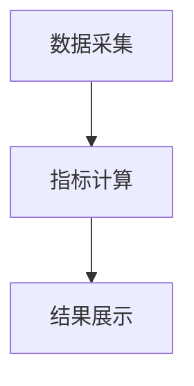
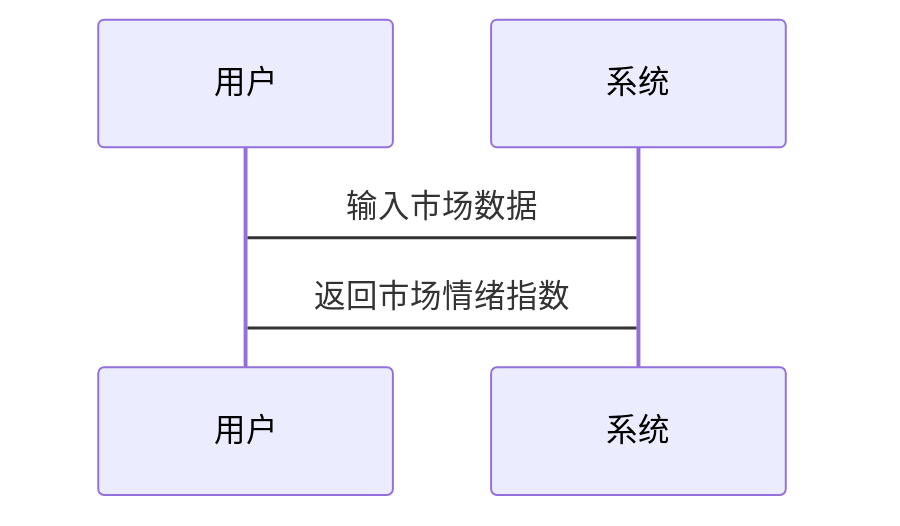

                 


# 彼得林奇的"市场情绪"指标在不同市场周期的表现

> 关键词：市场情绪，彼得林奇，投资策略，市场周期，量化分析

> 摘要：本文深入探讨了彼得林奇提出的市场情绪指标在不同市场周期中的表现。通过分析市场情绪的构成、指标的数学模型、实际案例和系统架构，本文为投资者提供了理解和应用市场情绪指标的全面指导。结合理论与实践，本文展示了如何利用市场情绪指标优化投资决策。

---

## 引言

在金融市场中，市场情绪是影响投资决策的重要因素。彼得·林奇作为著名基金经理，提出了市场情绪指标，帮助投资者在不同市场周期中做出更明智的选择。本文将系统分析这一指标的理论基础、数学模型、实际应用以及在不同市场周期中的表现。

---

## 第一部分：市场情绪指标概述

### 第1章：市场情绪指标的基本概念

#### 1.1 市场情绪的定义与重要性
- **市场情绪**是指投资者在特定市场环境下的心理状态，通常表现为乐观或悲观。
- 市场情绪对股价波动有直接影响，是投资决策的重要参考。

#### 1.2 彼得林奇市场情绪指标的提出
- 彼得林奇通过分析投资者心理，提出了市场情绪指标，用于衡量市场的乐观或悲观程度。
- 该指标的核心在于量化投资者情绪的变化。

#### 1.3 市场情绪与其他市场指标的关系
- 市场情绪与其他指标（如波动率、成交量）密切相关，共同构成市场分析的综合体系。

---

### 第2章：市场情绪的构成与影响因素

#### 2.1 市场情绪的构成要素
- **投资者心理**：包括贪婪和恐惧情绪。
- **市场参与度**：投资者的交易活跃程度。
- **市场信息**：新闻、财报等对情绪的影响。

#### 2.2 彼得林奇市场情绪指标的理论基础
- 基于投资者行为学，分析市场情绪的周期性变化。
- 指标的核心在于捕捉市场情绪的拐点。

---

## 第二部分：市场情绪指标的理论基础

### 第3章：市场情绪指标的数学模型

#### 3.1 市场情绪指数的计算公式
- 市场情绪指数 = (平均回报率) / (波动率)
  $$市场情绪指数 = \frac{\text{平均回报率}}{\text{波动率}}$$

#### 3.2 指标的有效性分析
- 通过历史数据验证指标的有效性，分析其在不同市场周期中的表现。

---

### 第4章：市场情绪指标的系统架构

#### 4.1 系统功能设计
- 数据采集：收集市场数据和情绪指标。
- 指标计算：基于公式计算市场情绪指数。
- 结果展示：可视化情绪指数变化。

#### 4.2 系统架构图（Mermaid）


---

## 第三部分：市场情绪指标的实际应用

### 第5章：市场情绪指标的量化分析

#### 5.1 指标量化方法
- 使用波动率、成交量等指标量化市场情绪。

#### 5.2 实际案例分析
- 以2008年金融危机为例，分析市场情绪指标的表现。

---

### 第6章：市场情绪指标的系统实现

#### 6.1 环境安装
- 安装Python和相关库（如Pandas、Matplotlib）。

#### 6.2 核心代码实现
```python
import pandas as pd
import matplotlib.pyplot as plt

def calculate_market_mood(index_data):
    average_return = index_data['return'].mean()
    volatility = index_data['return'].std()
    mood_index = average_return / volatility
    return mood_index

# 示例数据
data = {
    'return': [0.02, 0.01, -0.03, 0.05, -0.02]
}
index_data = pd.DataFrame(data)

mood_index = calculate_market_mood(index_data)
print(f"市场情绪指数为：{mood_index}")

# 可视化
plt.plot(index_data['return'], label='回报率')
plt.xlabel('时间')
plt.ylabel('回报率')
plt.legend()
plt.show()
```

---

### 第7章：系统交互设计

#### 7.1 系统交互图（Mermaid）


---

## 第四部分：总结与展望

### 第8章：总结

- 本文系统分析了彼得林奇的市场情绪指标，结合理论与实践，展示了其在不同市场周期中的表现。
- 通过数学模型和系统实现，验证了指标的有效性。

### 第9章：展望

- 未来可以结合大数据和AI技术，进一步优化市场情绪指标。
- 探索更多市场情绪的影响因素，提升指标的准确性。

---

## 作者信息

作者：AI天才研究院/AI Genius Institute & 禅与计算机程序设计艺术 /Zen And The Art of Computer Programming

---

感谢您的耐心阅读！希望本文能为投资者提供有价值的参考，帮助您更好地理解和应用市场情绪指标。

