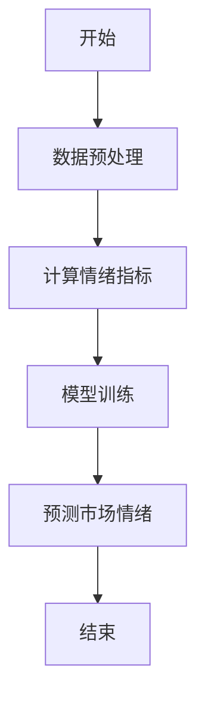

                 

# 彼得林奇的"市场情绪"指标在跨资产类别定价中的应用

**关键词**：彼得·林奇、市场情绪、资产定价、跨资产类别、投资策略

**摘要**：本文探讨彼得·林奇的市场情绪指标在不同资产类别定价中的应用，分析其背后的理论基础和算法原理，结合实际案例和系统设计，提供跨资产定价的最佳实践和深入见解。

---

## 目录大纲

### 第一部分：市场情绪指标的背景与理论基础

#### 第1章：市场情绪指标的背景介绍

##### 1.1 彼得·林奇的市场情绪理论

###### 1.1.1 投资者心理与市场情绪的关系

- 投资者情绪对市场行为的影响
- 市场情绪周期的定义与特征

###### 1.1.2 彼得·林奇市场情绪指标的核心概念

- 情绪指标的定义
- 情绪指标的分类与特点

###### 1.1.3 市场情绪指标在资产定价中的作用

- 情绪指标对资产价格的影响机制
- 情绪指标在不同资产类别中的应用

##### 1.2 跨资产类别定价的背景与挑战

###### 1.2.1 跨资产定价的定义与特点

- 跨资产定价的定义
- 跨资产定价的重要性和复杂性

###### 1.2.2 不同资产类别中的市场情绪差异

- 股票、债券、基金等资产的特点
- 不同资产类别中市场情绪的影响因素

###### 1.2.3 跨资产定价中的常见问题与解决方案

- 跨资产定价的主要挑战
- 解决跨资产定价问题的策略

#### 1.3 本章小结

---

### 第二部分：市场情绪指标的核心概念与联系

#### 第2章：市场情绪指标的核心要素

##### 2.1 市场情绪的构成与属性

###### 2.1.1 投资者情绪的分类与特征

- 情绪的分类：贪婪、恐惧、乐观、悲观等
- 情绪周期的阶段分析

###### 2.1.2 市场情绪的时间序列分析

- 市场情绪的时间变化规律
- 情绪周期对资产价格波动的影响

##### 2.2 市场情绪与其他市场指标的对比

###### 2.2.1 市场情绪与波动率的关系

- 市场情绪如何影响波动率
- 波动率与情绪指标的关联分析

###### 2.2.2 市场情绪与资产回报率的对比分析

- 情绪指标对资产回报率的影响
- 不同资产类别中的情绪-回报关系

##### 2.3 市场情绪的ER实体关系图

###### 2.3.1 实体关系图的构建

- 实体关系图的结构与内容

###### 2.3.2 关系图的分析与解释

- 实体关系图对市场情绪的理解

#### 2.4 本章小结

---

### 第三部分：市场情绪指标的算法原理与数学模型

#### 第3章：市场情绪指标的算法原理

##### 3.1 市场情绪指标的计算方法

###### 3.1.1 基于时间序列的市场情绪计算

- 时间序列分析方法
- 情绪指标的时间序列模型

###### 3.1.2 市场情绪指标的标准化处理

- 数据标准化方法
- 标准化处理对情绪指标的影响

##### 3.2 市场情绪指标的数学模型

###### 3.2.1 市场情绪指数的构建公式

$$E[mood] = \frac{\sum_{i=1}^{n} w_i \cdot m_i}{\sum_{i=1}^{n} w_i}$$

其中，$w_i$ 是第 $i$ 个情绪指标的权重，$m_i$ 是第 $i$ 个情绪指标的值。

###### 3.2.2 算法流程图（使用mermaid）

##### 3.3 本章小结

---

### 第四部分：系统架构与项目实战

#### 第4章：系统架构设计方案

##### 4.1 系统功能设计

###### 4.1.1 数据采集模块

- 数据源的选择与采集方法
- 数据预处理步骤

###### 4.1.2 情绪指标计算

- 计算模块的功能设计
- 计算流程与实现方法

##### 4.2 系统架构设计

###### 4.2.1 系统功能模块化设计

- 模块划分与功能分配

###### 4.2.2 系统架构mermaid图

##### 4.3 本章小结

---

#### 第5章：项目实战与案例分析

##### 5.1 环境安装与配置

- 开发环境的选择与安装
- 必要软件的安装与配置

##### 5.2 系统核心实现源代码

###### 5.2.1 核心代码实现

- 数据采集模块的代码实现
- 情绪指标计算模块的代码实现

##### 5.3 案例分析与解读

###### 5.3.1 实际案例分析

- 案例背景与数据来源
- 情绪指标在案例中的应用

###### 5.3.2 案例结果与分析

- 案例结果展示与解读
- 案例分析的启示与总结

##### 5.4 项目小结

---

### 第五部分：总结与展望

#### 第6章：总结与展望

##### 6.1 本章总结

- 主要内容回顾
- 研究成果与不足

##### 6.2 未来展望

- 研究方向的拓展
- 技术发展的可能性

---

**作者：AI天才研究院/AI Genius Institute & 禅与计算机程序设计艺术 /Zen And The Art of Computer Programming**

