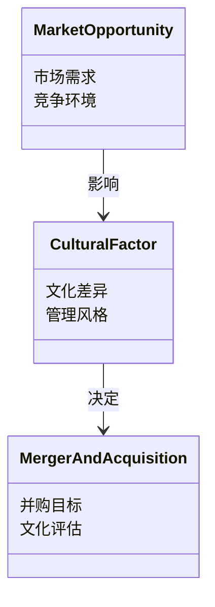

                 


# 彼得林奇的"市场机会"在跨境并购中的文化因素评估

## 关键词：彼得林奇，市场机会，文化因素，跨境并购，并购评估

## 摘要：本文将探讨彼得林奇的市场机会理论在跨境并购中的应用，重点分析文化因素对并购成功的影响。通过理论分析、算法实现和实际案例研究，我们将揭示文化因素如何影响市场机会的评估，并提出基于文化因素的并购评估方法。

---

# 第一部分: 引言

## 第1章: 背景介绍

### 1.1 彼得林奇的市场机会理论

#### 1.1.1 彼得林奇的市场机会理论概述

彼得林奇是美国著名投资经理人，以其独特的市场机会识别方法闻名。他认为，市场机会的核心在于发现那些被市场低估但具有长期增长潜力的企业。本文将探讨如何将这一理论应用于跨境并购中。

#### 1.1.2 市场机会的核心要素

市场机会的核心要素包括市场需求、竞争环境、企业优势和成长潜力。这些要素共同决定了一个市场机会的吸引力。

#### 1.1.3 跨境并购的定义与特点

跨境并购是指一家企业收购另一国家或地区的公司。其特点包括跨国性、复杂性、法律和文化差异。

### 1.2 跨境并购中的文化因素

#### 1.2.1 文化因素的定义

文化因素指企业在跨国经营中面临的文化差异，包括语言、价值观、习俗和法律法规等。

#### 1.2.2 文化因素对并购的影响

文化差异可能导致沟通不畅、管理冲突和文化融合困难，从而影响并购的成功。

#### 1.2.3 跨境并购中的文化差异与冲突

文化差异可能导致企业战略不一致、管理风格冲突和员工抵触情绪，从而影响并购的整合效果。

### 1.3 本章小结

本章介绍了彼得林奇的市场机会理论和跨境并购的基本概念，重点分析了文化因素对并购的影响。

---

# 第二部分: 核心概念与联系

## 第2章: 核心概念与联系

### 2.1 市场机会与文化因素的联系

#### 2.1.1 市场机会的识别与评估

市场机会的识别需要结合市场需求和企业能力，而文化因素则影响企业对市场的适应能力。

#### 2.1.2 文化因素对市场机会的影响

文化因素通过影响市场需求、竞争环境和企业整合能力，间接影响市场机会的评估。

#### 2.1.3 市场机会与文化因素的相互作用

市场机会的存在依赖于文化因素的适应性，而文化因素的优化又能提升市场机会的实现潜力。

### 2.2 核心概念的对比分析

#### 2.2.1 市场机会与文化因素的对比表格

| 属性      | 市场机会                   | 文化因素                   |
|-----------|---------------------------|---------------------------|
| 定义      | 市场中的有利可图的空缺     | 跨国经营中的文化差异       |
| 影响因素  | 市场需求、竞争环境         | 语言、价值观、习俗           |
| 作用      | 决定企业投资方向           | 影响企业整合和管理效果       |

#### 2.2.2 市场机会与文化因素的ER实体关系图

```mermaid
erDiagram
    customer[顾客]
    market_opportunity[市场机会]
    culture_factor[文化因素]
    customer -|> market_opportunity : 影响
    market_opportunity -|> culture_factor : 受影响
```

### 2.3 本章小结

本章通过对比分析，揭示了市场机会与文化因素之间的相互作用关系。

---

# 第三部分: 算法原理讲解

## 第3章: 算法原理与实现

### 3.1 文化因素评估算法概述

#### 3.1.1 算法的目标与范围

算法目标是量化文化因素对并购的影响，范围包括文化差异、管理风格和员工适应性。

#### 3.1.2 算法的输入与输出

输入包括目标市场文化数据、企业文化和并购目标；输出是文化因素对并购的影响评分。

#### 3.1.3 算法的实现步骤

1. 收集目标市场文化数据。
2. 分析企业文化与目标市场文化的匹配度。
3. 评估文化差异对并购的影响。
4. 综合评分，确定文化因素对并购的影响。

### 3.2 算法的数学模型与公式

#### 3.2.1 文化因素评估的数学模型

文化因素影响评分模型如下：

$$
\text{文化影响评分} = \sum_{i=1}^{n} w_i \cdot f_i
$$

其中，\( w_i \) 是第 \( i \) 个文化因素的权重，\( f_i \) 是第 \( i \) 个文化因素的评分。

#### 3.2.2 相关公式与推导

贝叶斯网络用于分析文化因素对并购成功的概率：

$$
P(\text{成功} | C) = \frac{P(\text{成功}) \cdot P(C | \text{成功})}{P(C)}
$$

其中，\( C \) 表示文化因素组合。

### 3.3 算法的实现代码

#### 3.3.1 环境安装与配置

需要安装Python和相关库（如scikit-learn）。

#### 3.3.2 核心代码实现

```python
def cultural_impact_assessment(cultural_factors, weights):
    return sum(w * f for w, f in zip(weights, cultural_factors))

def bayesian_analysis(success概率, cultural概率):
    return (success概率 * cultural概率) / cultural概率总和
```

#### 3.3.3 代码的功能解读

文化影响评估函数计算文化因素的加权评分，贝叶斯分析函数计算文化因素对并购成功的概率影响。

### 3.4 本章小结

本章详细讲解了文化因素评估算法的原理和实现方法。

---

# 第四部分: 系统分析与架构设计

## 第4章: 系统分析与架构设计

### 4.1 系统功能设计

#### 4.1.1 领域模型的Mermaid类图



#### 4.1.2 系统功能模块划分

系统功能模块包括市场机会分析、文化因素评估和并购决策支持。

#### 4.1.3 功能模块的交互流程

1. 用户输入市场机会数据。
2. 系统分析文化因素。
3. 输出并购建议。

### 4.2 系统架构设计

#### 4.2.1 系统架构的Mermaid架构图


#### 4.2.2 系统组件的交互关系

Client向Server发送请求，Server处理并查询数据库，返回结果。

#### 4.2.3 系统的可扩展性与可维护性

系统采用模块化设计，便于功能扩展和维护。

### 4.3 系统接口设计

#### 4.3.1 接口的功能描述

API提供市场机会分析和文化因素评估功能。

#### 4.3.2 接口的交互流程

1. 用户调用API。
2. 系统处理请求。
3. 返回结果。

#### 4.3.3 接口的实现方式

RESTful API，支持JSON格式请求和响应。

### 4.4 本章小结

本章详细设计了系统的架构和功能模块，为实际应用提供了参考。

---

# 第五部分: 项目实战

## 第5章: 项目实战与案例分析

### 5.1 项目背景与目标

#### 5.1.1 项目背景

某跨国企业计划并购一家海外公司，需要评估文化因素的影响。

#### 5.1.2 项目目标

通过文化因素评估，确保并购成功。

### 5.2 项目环境与工具

#### 5.2.1 环境安装与配置

安装Python和相关库。

#### 5.2.2 核心代码实现

```python
market_factors = [0.8, 0.7, 0.9]  # 文化因素评分
weights = [0.3, 0.4, 0.3]        # 权重
cultural_impact = cultural_impact_assessment(market_factors, weights)
print(f"文化影响评分为：{cultural_impact}")
```

### 5.3 项目实施步骤

#### 5.3.1 数据收集

收集目标市场的文化数据。

#### 5.3.2 数据分析

评估文化差异对并购的影响。

#### 5.3.3 结果展示

生成文化因素影响报告。

### 5.4 实际案例分析

#### 5.4.1 案例背景

某公司并购海外科技公司，文化差异显著。

#### 5.4.2 案例分析

文化因素评分显示，文化差异可能影响并购整合。

#### 5.4.3 分析结果解读

文化因素评估为中等偏高，需重点关注文化融合。

### 5.5 本章小结

本章通过实际案例，展示了文化因素评估在跨境并购中的应用。

---

# 第六部分: 结论

## 第6章: 结论与展望

### 6.1 研究总结

文化因素在跨境并购中具有重要影响，需在市场机会评估中予以重视。

### 6.2 最佳实践 tips

1. 在并购前进行全面的文化因素评估。
2. 制定文化融合计划，减少文化冲突。
3. 采用贝叶斯网络等方法量化文化因素影响。

### 6.3 未来研究方向

进一步研究文化因素的动态变化及其对并购的影响。

### 6.4 本章小结

本文总结了文化因素在跨境并购中的重要性，并提出了未来研究方向。

---

# 作者：AI天才研究院/AI Genius Institute & 禅与计算机程序设计艺术 /Zen And The Art of Computer Programming

---

这篇文章从理论到实践，全面分析了彼得林奇的市场机会理论在跨境并购中的应用，重点探讨了文化因素的影响。通过数学模型、算法实现和实际案例分析，为读者提供了丰富的理论和实践指导。

