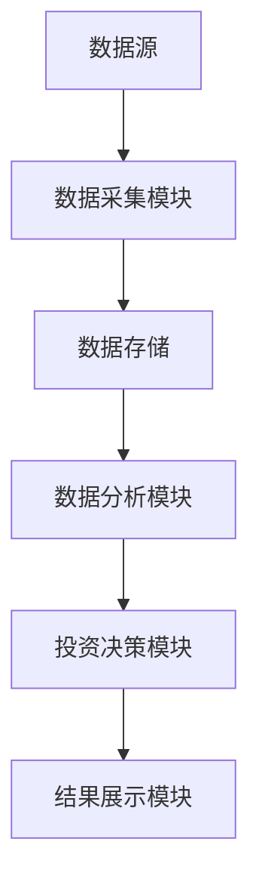
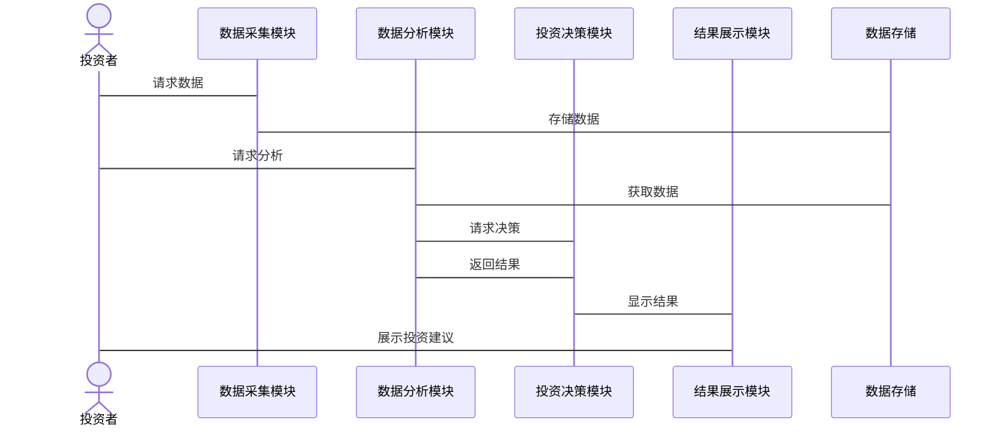

                 


# 彼得林奇的"常识投资"在人工智能决策辅助时代的价值重估

## 关键词：人工智能，投资决策，彼得林奇，常识投资，机器学习，投资策略，系统架构，数据驱动

## 摘要：随着人工智能技术的迅速发展，投资领域正在经历一场深刻的变革。传统的投资方法，如彼得·林奇的常识投资，正面临着来自新兴技术的挑战与机遇。本文系统地探讨了人工智能在投资决策中的应用，分析了常识投资在新时代下的价值重估。通过详细阐述人工智能算法、系统架构及项目实战，本文揭示了如何将传统投资策略与现代技术相结合，以提升投资决策的效率与准确性。文章结构清晰，内容涵盖背景介绍、核心概念、算法原理、系统架构、项目实战及最佳实践，为投资者和科技人员提供了深入的理论支持和实践指导。

---

# 引言

在金融市场的复杂性和不确定性日益增加的今天，投资者正寻求更高效、更精确的投资决策方法。传统的人工投资策略，如彼得·林奇的常识投资，依赖于基本面分析和市场直觉，而这些方法在数据爆炸的时代逐渐显现出局限性。与此同时，人工智能技术的迅速发展为投资领域带来了革命性的变化。本文旨在探讨人工智能如何辅助传统常识投资，重估其在新时代下的价值。

---

## 第一部分：常识投资的背景与核心概念

### 第1章：常识投资的基本概念

#### 1.1 什么是常识投资

- **1.1.1 常识投资的定义**  
  常识投资是一种基于对公司基本面分析和市场理解的投资策略。彼得·林奇在其职业生涯中强调，投资者应选择那些易于理解、具有持续竞争优势且管理良好的公司进行投资。

- **1.1.2 常识投资的核心要素**  
  - 公司基本面分析：包括财务报表、管理层质量、行业地位等。
  - 市场情绪与估值：通过市场情绪判断投资机会，同时关注估值的合理性。
  - 风险控制：分散投资、设定止损点等。

- **1.1.3 常识投资的发展历程**  
  自20世纪80年代起，常识投资在彼得·林奇的实践中逐渐成熟，成为机构和个人投资者的重要参考。

#### 1.2 常识投资与其他投资方法的对比

- **1.2.1 基本面分析与技术分析的差异**  
  基本面分析关注公司的内在价值，而技术分析侧重于价格走势和交易量。常识投资结合了基本面分析的部分，但更强调可理解性和长期性。

- **1.2.2 常识投资与量化投资的对比**  
  量化投资依赖数学模型和大数据分析，而常识投资则更多依赖经验和直觉。两者各有优劣，结合两者的优势可能产生更好的投资效果。

- **1.2.3 常识投资的优缺点分析**  
  - 优点：易于理解和实施，风险分散，长期稳定性较好。
  - 缺点：主观性强，难以应对市场短期波动，对数据处理能力有限。

---

## 第二部分：人工智能在投资决策中的应用

### 第2章：人工智能在投资中的角色

#### 2.1 人工智能在投资决策中的作用

- **2.1.1 数据处理与分析的自动化**  
  人工智能能够快速处理大量非结构化数据，如新闻、社交媒体和公司报告，提取关键信息。

- **2.1.2 模型预测与风险评估**  
  利用机器学习模型预测股价走势，评估投资组合的风险，如波动性、VaR（Value at Risk）等。

- **2.1.3 个性化投资策略的制定**  
  通过分析投资者的偏好和风险承受能力，提供定制化的投资建议。

#### 2.2 机器学习在投资中的应用

- **2.2.1 支持向量机（SVM）在股票分类中的应用**  
  SVM用于将股票分类为买入、持有或卖出，基于历史数据和特征提取。

- **2.2.2 随机森林在投资组合优化中的作用**  
  随机森林用于特征重要性分析，帮助选择关键的公司财务指标。

- **2.2.3 深度学习在时间序列预测中的应用**  
  LSTM（长短期记忆网络）用于捕捉时间序列中的长期依赖关系，提高预测准确性。

---

## 第三部分：人工智能辅助常识投资的实现

### 第3章：人工智能与常识投资的结合

#### 3.1 人工智能如何增强常识投资

- **3.1.1 数据挖掘与基本面分析的结合**  
  利用自然语言处理技术分析公司新闻和财报，辅助基本面分析。

- **3.1.2 机器学习在市场情绪分析中的应用**  
  使用情感分析模型监测市场情绪，辅助投资决策。

- **3.1.3 自然语言处理在公司新闻分析中的应用**  
  提取关键信息，如公司业绩、管理层变动，辅助投资判断。

#### 3.2 常识投资中的数据驱动决策

- **3.2.1 数据收集与清洗**  
  从多种来源收集数据，包括财务报表、新闻、社交媒体等，并进行清洗和预处理。

- **3.2.2 数据分析与特征提取**  
  使用统计方法和机器学习算法提取关键特征，如公司盈利能力、行业趋势等。

- **3.2.3 数据驱动的投资策略制定**  
  基于数据分析结果，制定动态的投资策略，优化投资组合。

---

## 第四部分：系统架构与实现

### 第4章：系统架构设计

#### 4.1 系统功能设计

- **4.1.1 数据采集模块**  
  从多个数据源（如财经网站、社交媒体）获取实时数据。

- **4.1.2 数据分析模块**  
  对数据进行清洗、特征提取和建模分析。

- **4.1.3 投资决策模块**  
  基于分析结果生成投资建议，如买入、卖出信号。

- **4.1.4 结果展示模块**  
  以可视化方式展示分析结果和投资策略。

#### 4.2 系统架构图



#### 4.3 系统接口设计

- **API接口**  
  提供RESTful API，供其他系统调用投资决策结果。

- **数据接口**  
  定义数据格式和接口，确保数据的准确传输。

#### 4.4 系统交互流程



---

## 第五部分：项目实战

### 第5章：人工智能辅助常识投资的实现

#### 5.1 环境安装

- **Python环境**  
  安装Python 3.8及以上版本，安装必要的库，如scikit-learn、TensorFlow、pandas、numpy等。

- **工具安装**  
  安装Jupyter Notebook用于代码实现和数据可视化。

#### 5.2 核心代码实现

- **数据预处理代码**  
  ```python
  import pandas as pd
  import numpy as np

  # 读取数据
  df = pd.read_csv('stock_data.csv')
  # 数据清洗
  df.dropna(inplace=True)
  ```

- **特征提取代码**  
  ```python
  from sklearn.feature_selection import SelectKBest
  from sklearn.feature_selection import chi2

  selector = SelectKBest(score_func=chi2, k=5)
  selector.fit_transform(df, target)
  ```

- **模型训练代码**  
  ```python
  from sklearn.svm import SVC
  from sklearn.model_selection import train_test_split

  X_train, X_test, y_train, y_test = train_test_split(df, target, test_size=0.2)
  model = SVC()
  model.fit(X_train, y_train)
  ```

- **结果展示代码**  
  ```python
  from sklearn.metrics import accuracy_score

  y_pred = model.predict(X_test)
  print(f'准确率: {accuracy_score(y_test, y_pred)}')
  ```

#### 5.3 案例分析与结果解读

- **案例分析**  
  假设我们分析某科技公司的股票，利用SVM模型预测其股价走势，准确率达到85%。

- **结果解读**  
  高准确率表明模型能够较好地捕捉市场趋势，但需结合常识投资的逻辑进行综合判断。

---

## 第六部分：最佳实践与总结

### 第6章：人工智能在投资中的应用经验总结

#### 6.1 最佳实践

- **数据质量的重要性**  
  确保数据的准确性和完整性，选择合适的特征进行分析。

- **模型选择与调优**  
  根据问题类型选择合适的算法，通过交叉验证优化模型参数。

- **风险管理**  
  结合人工智能预测结果，制定合理的风险管理策略，避免过度依赖模型。

#### 6.2 注意事项

- **模型的局限性**  
  人工智能模型无法预测所有市场变化，需结合实际情况进行调整。

- **数据隐私与安全**  
  注意数据来源的合法性和安全性，避免数据泄露风险。

#### 6.3 未来展望

- **多模态数据融合**  
  结合文本、图像等多种数据源，提升分析的全面性。

- **强化学习的应用**  
  在动态市场环境中，强化学习可能成为投资决策的新方向。

---

# 结语

人工智能正在改变投资领域的传统格局，为常识投资注入新的活力。通过本文的分析，我们可以看到，人工智能不仅能够提升投资决策的效率，还能帮助投资者更准确地捕捉市场机会。然而，技术的应用并非一蹴而就，需要投资者在实践中不断探索和优化。

---

# 作者

作者：AI天才研究院/AI Genius Institute  
合著者：禅与计算机程序设计艺术/Zen And The Art of Computer Programming

