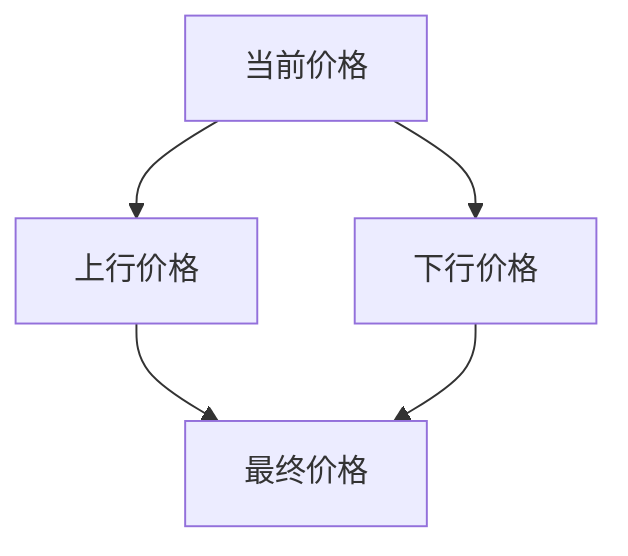
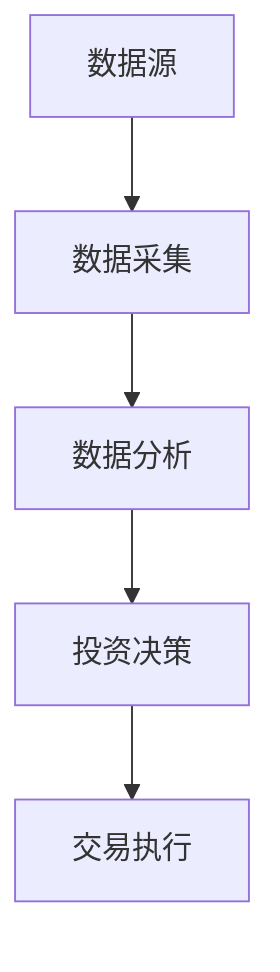

                 


# 彼得林奇的"常识投资"在复杂衍生品市场中的应用

> 关键词：常识投资，衍生品市场，彼得林奇，期权，风险管理，投资策略

> 摘要：本文探讨了彼得林奇的“常识投资”理念在复杂衍生品市场中的应用。通过分析衍生品市场的特点、定价模型以及风险管理策略，本文提出了将常识投资与算法相结合的方法，优化投资决策。文章还提供了实际案例和系统设计，帮助读者更好地理解和应用这些策略。

---

## 第一部分：彼得林奇“常识投资”概述

### 第1章：彼得林奇“常识投资”理论基础

#### 1.1 彼得林奇及其投资理念
- 彼得·林奇是著名的投资专家，强调基本面分析和长期投资。
- “常识投资”主张用常识和基本分析选择优质企业，避免短期波动。

#### 1.2 复杂衍生品市场的特点
- 衍生品市场的高杠杆和波动性，使其风险较高。
- 常识投资在衍生品市场的应用需要结合算法和数学模型。

### 第2章：复杂衍生品市场的分析框架

#### 2.1 衍生品市场的核心概念
- 期权、期货、掉期的基本概念及其风险。
- 衍生品定价的关键因素：波动率、时间 decay 等。

#### 2.2 常识投资与衍生品市场的联系
- 常识投资在衍生品市场中的适用性分析。
- 风险管理在投资策略中的重要性。

---

## 第二部分：衍生品市场的算法原理与数学模型

### 第3章：衍生品定价的数学模型

#### 3.1 Black-Scholes模型
- 公式：$$C = S_0 e^{t \cdot \sigma} N(d_1) - K e^{-rT} N(d_2)$$
- 其中，$d_1 = \frac{\ln(S_0/K) + (r + \sigma^2/2)T}{\sigma \sqrt{T}}$$
- $d_2 = d_1 - \sigma \sqrt{T}$$

#### 3.2 二叉树模型
- 通过构建树状模型模拟价格波动，计算期权的内在价值。
- 使用mermaid图展示模型构建过程：



### 第4章：系统分析与架构设计

#### 4.1 系统架构设计
- 使用分层架构，包括数据采集、分析、决策模块。
- mermaid图展示系统结构：



#### 4.2 接口设计与交互流程
- 数据接口：API 用于获取实时数据。
- 交互流程：用户输入参数，系统输出投资建议。

---

## 第三部分：项目实战与案例分析

### 第5章：项目实战

#### 5.1 环境安装与配置
- 开发环境：Python、Jupyter Notebook。
- 数据源：Yahoo Finance API。

#### 5.2 核心代码实现
```python
import numpy as np
from scipy.stats import norm

def black_scholes(S, K, r, sigma, T):
    d1 = (np.log(S/K) + (r + sigma**2/2)*T) / (sigma*np.sqrt(T))
    d2 = d1 - sigma*np.sqrt(T)
    C = S * norm.cdf(d1) - K * np.exp(-r*T) * norm.cdf(d2)
    return C

# 示例计算
S = 100
K = 105
r = 0.05
sigma = 0.2
T = 1
print(black_scholes(S, K, r, sigma, T))
```

### 第6章：案例分析

#### 6.1 案例分析
- 案例：波动性较大的指数期权。
- 分析过程：使用Black-Scholes模型计算期权价值，结合基本面分析选择标的资产。

---

## 第四部分：总结与展望

### 第7章：总结与展望

#### 7.1 总结
- 常识投资与算法结合，优化投资策略。
- 系统设计提供高效的投资决策支持。

#### 7.2 未来展望
- 探索更多算法优化投资策略。
- 结合人工智能，提升预测准确性。

---

## 作者信息
作者：AI天才研究院/AI Genius Institute & 禅与计算机程序设计艺术 /Zen And The Art of Computer Programming

---

本文通过详细分析彼得林奇的常识投资理念，结合复杂衍生品市场的特点，提出了将常识投资与算法相结合的方法。通过实际案例和系统设计，展示了如何优化投资决策，降低风险。希望本文能为投资者提供有价值的参考和启发。

