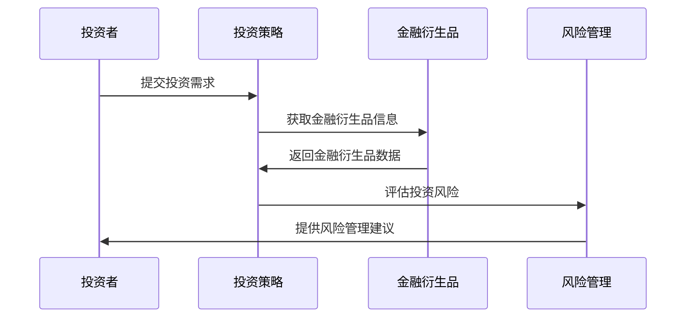

                 


# 彼得林奇的"常识投资"在复杂金融衍生品时代的重要性

## 关键词：常识投资，金融衍生品，彼得·林奇，投资策略，风险管理

## 摘要：本文探讨了彼得·林奇的常识投资策略在复杂金融衍生品环境下的重要性。通过分析传统投资策略的局限性，结合复杂金融环境的特点，本文揭示了常识投资在应对金融衍生品风险中的独特优势。通过数学建模、系统设计和实际案例分析，本文详细阐述了常识投资在金融衍生品投资中的应用，并提出了风险管理的最佳实践建议。

---

## 第一部分: 彼得林奇的"常识投资"概述

### 第1章: 常识投资的基本概念

#### 1.1 常识投资的定义与核心理念

常识投资是一种基于基本面分析的投资策略，强调利用常识和逻辑来评估企业的内在价值，从而做出投资决策。与传统的技术分析或市场情绪分析不同，常识投资更注重企业的财务状况、行业地位和管理团队等因素。

**1.1.1 常识投资的定义**

常识投资（Commonsense Investing）是一种以基本面分析为基础的投资策略，强调对企业的深入了解，包括企业的财务状况、盈利能力、管理团队和行业地位等。投资者通过分析企业的内在价值，判断其是否具有长期投资价值。

**1.1.2 常识投资的核心理念**

1. **价值投资**：寻找那些具有长期增长潜力且市场价格低于内在价值的企业。
2. **风险管理**：避免过度杠杆和集中投资，分散风险。
3. **长期视角**：关注企业的长期发展，而非短期市场波动。

**1.1.3 常识投资与传统投资的区别**

| 特性         | 常识投资                          | 传统技术分析                     |
|--------------|-----------------------------------|----------------------------------|
| 基础         | 基于基本面分析                     | 基于价格走势和技术指标           |
| 投资期限     | 长期投资                          | 短期或中期交易                    |
| 风险管理     | 强调风险管理，避免过度杠杆         | 依赖技术指标进行风险管理          |
| 适用场景     | 适用于复杂金融环境                 | 适用于短期交易市场                 |

#### 1.2 彼得林奇与常识投资

彼得·林奇（Peter Lynch）是常识投资的代表人物之一。他在任职麦哲伦基金期间，通过常识投资策略取得了卓越的投资业绩，为投资者提供了宝贵的经验和方法。

**1.2.1 彼得林奇的生平简介**

彼得·林奇是美国著名投资家，曾担任富达投资的麦哲伦基金经理，管理资产规模超过100亿美元。他以独特的投资风格和卓越的投资业绩闻名，被誉为“股票投资之父”。

**1.2.2 彼得林奇对常识投资的贡献**

1. **提出常识投资理念**：彼得林奇强调投资者应基于对企业基本面的了解进行投资，而非盲目追随市场趋势。
2. **风险管理**：他倡导分散投资，避免过度集中，以降低投资风险。
3. **长期视角**：彼得林奇的投资策略注重长期价值，而非短期市场波动。

**1.2.3 常识投资在彼得林奇投资体系中的地位**

常识投资是彼得林奇投资体系的核心，他通过对企业基本面的深入分析，寻找那些具有长期增长潜力且市场价格低于内在价值的企业。

---

## 第二部分: 复杂金融衍生品时代的投资环境

### 第2章: 金融衍生品的基本概念

#### 2.1 金融衍生品的定义

金融衍生品是一种以金融资产或其价格指数为标的物，通过套期保值或投机交易进行投资和避险的金融工具。常见的金融衍生品包括期货、期权、掉期和互换等。

#### 2.2 金融衍生品的主要类型

1. **期货**：一种标准化的合约，约定在未来某一特定时间以特定价格买入或卖出某种资产。
2. **期权**：一种权利，允许持有人在特定时间内以特定价格买入或卖出某种资产。
3. **掉期**：一种协议，约定在未来某一时间以特定价格交换两种资产。
4. **互换**：一种协议，约定在未来某一时间以特定价格交换现金流。

#### 2.3 金融衍生品市场的现状与发展趋势

随着金融市场的全球化和信息化，金融衍生品的种类和交易规模不断增加。投资者可以通过金融衍生品进行套期保值或投机交易，以应对市场波动和风险。

---

## 第三部分: 常识投资在复杂金融环境中的应用

### 第3章: 常识投资的核心策略

#### 3.1 基于基本面分析的投资策略

**3.1.1 企业基本面分析**

投资者需要对企业进行深入的财务分析，包括盈利能力、财务状况、成长能力和管理团队等方面。

**3.1.2 投资组合优化**

通过分散投资和风险控制，构建一个优化的投资组合，以降低投资风险。

#### 3.2 金融衍生品与常识投资的结合

**3.2.1 金融衍生品在常识投资中的作用**

金融衍生品可以帮助投资者进行套期保值，降低市场波动对投资组合的影响。

**3.2.2 常识投资如何应对复杂金融衍生品的风险**

1. **风险管理**：通过分散投资和严格的风险评估，降低金融衍生品的投资风险。
2. **长期视角**：关注企业的长期价值，而非短期市场波动。

---

## 第四部分: 常识投资的数学模型与算法原理

### 第4章: 常识投资的数学模型

#### 4.1 投资组合优化的数学模型

**4.1.1 投资组合优化的目标**

最大化投资回报，同时最小化投资风险。

**4.1.2 投资组合优化的数学表达**

$$ \text{目标函数：} \quad \max \sum_{i=1}^{n} w_i r_i - \lambda \sum_{i=1}^{n} w_i^2 \sigma_i^2 $$

其中，\( w_i \) 是第i个资产的权重，\( r_i \) 是第i个资产的预期回报率，\( \sigma_i \) 是第i个资产的风险，\( \lambda \) 是风险厌恶系数。

#### 4.2 常识投资的算法实现

**4.2.1 数据处理与特征提取**

通过收集和整理企业的财务数据，提取关键的财务指标，如净利润、营业收入、资产负债率等。

**4.2.2 投资组合优化的算法流程**

1. 数据收集与预处理
2. 构建投资组合模型
3. 计算各资产的预期回报和风险
4. 优化投资组合，找到最优权重
5. 风险评估与调整

---

## 第五部分: 系统分析与架构设计方案

### 第5章: 系统功能设计

#### 5.1 问题场景介绍

在复杂金融环境中，投资者需要一个高效的投资决策支持系统，帮助他们进行金融衍生品的投资和风险管理。

#### 5.2 系统功能设计

**5.2.1 领域模型设计**


#### 5.3 系统架构设计


#### 5.4 系统接口设计

- 投资者输入：资金规模、风险承受能力、投资目标
- 投资策略模块：根据输入生成投资策略
- 金融衍生品模块：提供各种金融衍生品的信息和价格数据
- 风险管理模块：评估投资组合的风险并提出调整建议

#### 5.5 系统交互设计



---

## 第六部分: 项目实战

### 第6章: 项目实战

#### 6.1 环境安装

安装必要的金融数据分析工具和编程环境，如Python、Pandas、NumPy等。

#### 6.2 核心实现源代码

```python
import pandas as pd
import numpy as np

def calculate_return(prices):
    returns = []
    for i in range(1, len(prices)):
        returns.append((prices[i] - prices[i-1])/prices[i-1])
    return pd.DataFrame(returns)
```

#### 6.3 代码应用解读与分析

通过上述代码，我们可以计算金融资产的收益率，为投资组合优化提供数据支持。

#### 6.4 实际案例分析

以某指数期权为例，分析如何利用常识投资策略进行投资决策。

#### 6.5 项目小结

通过实际案例分析，我们可以看到常识投资在复杂金融环境中的实际应用价值。

---

## 第七部分: 最佳实践

### 第7章: 最佳实践

#### 7.1 投资要点

1. 选择具有长期增长潜力的企业。
2. 避免过度杠杆和集中投资。
3. 关注企业的财务状况和管理团队。

#### 7.2 风险管理

1. 分散投资，降低投资风险。
2. 定期评估投资组合的风险。
3. 严格遵守投资纪律。

#### 7.3 拓展阅读

推荐阅读彼得·林奇的《投资最重要的事情》和《巴菲特的选股智慧》等书籍，以深入理解常识投资的精髓。

---

## 作者信息

作者：AI天才研究院/AI Genius Institute & 禅与计算机程序设计艺术/Zen And The Art of Computer Programming

---

通过以上结构，我们可以全面、系统地分析彼得·林奇的常识投资在复杂金融衍生品环境中的重要性，并为投资者提供实际的操作指南和风险管理建议。

