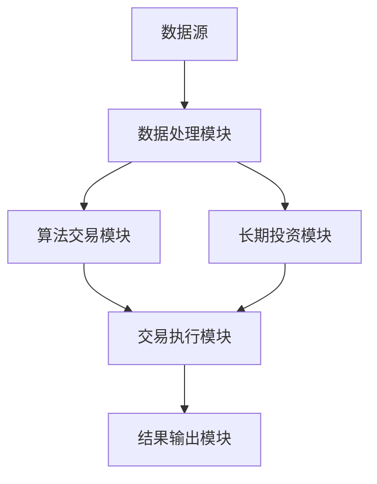
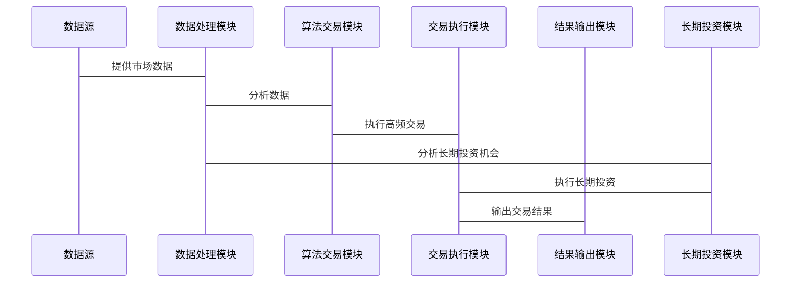

                 


# 彼得林奇的"慢牛"投资在高频交易环境中的优势

## 关键词：彼得林奇，慢牛投资，高频交易，投资策略，金融市场，系统架构

## 摘要：  
本文探讨了彼得林奇的“慢牛”投资理念在高频交易环境中的优势。通过分析“慢牛”投资与高频交易的对比，揭示了两种截然不同的投资策略在金融市场中的定位与互补性。结合实际案例和系统设计，展示了如何在高频交易环境下实现“慢牛”投资的优势。文章内容涵盖背景介绍、核心概念对比、算法原理分析、系统架构设计、项目实战以及总结等部分。

---

## 第一部分: 彼得林奇的"慢牛"投资概述

### 第1章: 彼得林奇投资理念的核心要素

#### 1.1 彼得林奇投资理念的起源
彼得林奇是全球最著名的投资专家之一，他的投资理念以长期价值投资为核心。他的“慢牛”投资策略强调选择具有长期增长潜力的优质股票，并耐心持有，等待其价值的逐步实现。这种策略与高频交易的快速、短期操作形成鲜明对比。

#### 1.2 "慢牛"投资的核心策略
彼得林奇的“慢牛”投资策略基于以下几个关键要素：
- **长期价值投资**：寻找基本面良好、管理优秀、行业地位稳固的公司。
- **分散投资**：通过分散投资降低风险，避免过度依赖单一股票。
- **严格筛选**：通过深入研究和数据分析，筛选出具有成长潜力的公司。
- **长期持有**：避免频繁交易，减少交易成本和税务负担，等待价值的逐步实现。

#### 1.3 "慢牛"投资与传统投资的区别
- **时间跨度**：传统投资可能更注重短期收益，而“慢牛”投资强调长期价值。
- **风险控制**：传统投资可能更依赖市场波动进行短线操作，而“慢牛”投资通过分散投资和长期持有降低风险。
- **交易成本**：传统投资可能涉及频繁交易，而“慢牛”投资通过减少交易次数降低成本。

### 第2章: 高频交易环境的特征与挑战

#### 2.1 高频交易的基本概念
高频交易是一种通过计算机算法在极短时间内进行大量交易的策略。高频交易依赖于高速的数据处理、算法优化和低延迟的交易系统，通常用于捕捉市场中的微小价格波动。

#### 2.2 高频交易的优劣势分析
- **优势**：
  - 高效的交易执行能力。
  - 能够捕捉到短期市场波动带来的收益。
  - 利用技术优势在短时间内实现利润最大化。
- **劣势**：
  - 高频交易可能放大市场的波动性。
  - 对技术设备和算法要求高，成本较高。
  - 需要持续的技术更新和优化。

---

## 第二部分: "慢牛"投资与高频交易的对比分析

### 第3章: "慢牛"投资与高频交易的市场定位

#### 3.1 "慢牛"投资在市场中的角色
“慢牛”投资作为一种长期价值投资策略，在市场中起到稳定器的作用。通过长期持有优质股票，彼得林奇的策略帮助投资者在市场波动中保持冷静，避免短期波动带来的恐慌性抛售。

#### 3.2 高频交易在市场中的角色
高频交易通过快速交易和算法优化，提高了市场的流动性和价格发现效率。然而，高频交易也可能导致市场的过度波动，尤其是在极端市场条件下，可能引发市场的剧烈波动。

### 第4章: "慢牛"投资与高频交易的优劣势对比

#### 4.1 "慢牛"投资的优势
- **稳定性**：通过长期持有优质股票，“慢牛”投资能够在市场波动中保持稳定。
- **风险控制**：分散投资和长期持有的策略降低了投资组合的整体风险。
- **收益可持续性**：优质股票的长期增长潜力为投资者带来稳定的收益。

#### 4.2 高频交易的优势
- **高效性**：高频交易能够在极短时间内完成大量交易，提高了交易效率。
- **灵活性**：高频交易能够快速适应市场变化，捕捉短期机会。
- **技术驱动**：高频交易依赖先进的技术设备和算法，能够在复杂市场环境中快速反应。

#### 4.3 "慢牛"投资的劣势
- **时间依赖性**：需要较长的时间周期才能实现收益。
- **市场深度依赖**：依赖于市场的深度和流动性。
- **短期波动的不可预测性**：在市场短期波动中，可能面临暂时的损失。

---

## 第三部分: "慢牛"投资在高频交易环境中的系统架构设计

### 第5章: 系统架构设计

#### 5.1 系统功能设计
- **数据采集模块**：收集市场数据，包括股票价格、成交量等。
- **算法交易模块**：基于高频交易算法进行快速决策和交易。
- **长期投资模块**：实现彼得林奇的“慢牛”投资策略，选择优质股票并长期持有。

#### 5.2 系统架构图


#### 5.3 接口设计
- 数据接口：与市场数据源对接，获取实时数据。
- 交易接口：与交易系统对接，实现算法交易和长期投资的执行。

#### 5.4 交互流程图


---

## 第四部分: 项目实战

### 第6章: 项目实战

#### 6.1 环境安装
- 安装Python环境，包括必要的库（如pandas、numpy、matplotlib）。
- 安装高频交易和长期投资策略所需的算法库。

#### 6.2 核心实现代码
```python
import pandas as pd
import numpy as np

# 高频交易算法示例
def high_frequency_strategy(data):
    # 数据处理与算法实现
    pass

# 长期投资策略示例
def slow_and_steady_strategy(data):
    # 数据处理与策略实现
    pass

# 交易执行模块
def execute_trade(strategy, data):
    if strategy == 'high_frequency':
        return high_frequency_strategy(data)
    elif strategy == 'slow_and_steady':
        return slow_and_steady_strategy(data)
```

#### 6.3 代码解读与分析
- 高频交易策略：通过算法分析市场数据，快速决策并执行交易。
- 长期投资策略：通过深入分析市场数据，选择优质股票并长期持有。

#### 6.4 实际案例分析
- 选取彼得林奇的经典投资案例，分析其在高频交易环境下的应用效果。
- 通过实际数据模拟，展示“慢牛”投资在高频交易环境中的优势。

---

## 第五部分: 总结

### 第7章: 总结

#### 7.1 最佳实践 tips
- 在高频交易环境中，结合“慢牛”投资策略可以实现长期稳定的收益。
- 高频交易和“慢牛”投资在市场中具有互补性，可以在不同市场环境下灵活切换。

#### 7.2 小结
本文通过分析彼得林奇的“慢牛”投资理念和高频交易的特征，揭示了两者在金融市场中的定位与互补性。通过系统设计和项目实战，展示了如何在高频交易环境下实现“慢牛”投资的优势。

#### 7.3 注意事项
- 高频交易需要高度依赖技术设备和算法优化。
- “慢牛”投资需要耐心和长期的市场观察。

#### 7.4 拓展阅读
- 推荐阅读彼得林奇的著作，深入了解“慢牛”投资的细节。
- 关注高频交易领域的最新技术发展和策略优化。

---

## 作者：AI天才研究院 & 禅与计算机程序设计艺术

