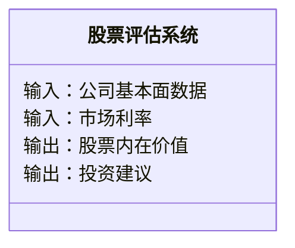

                 


# 彼得林奇的"成长型价值股"在不同利率环境下的表现

## 关键词：彼得林奇、成长型价值股、利率环境、投资策略、股票分析

## 摘要：  
本文深入探讨了彼得·林奇的成长型价值股投资策略在不同利率环境下的表现。通过构建数学模型和系统架构，分析了低、中、高利率环境对成长型价值股的影响，并提供了实际案例和Python代码实现。文章最后总结了不同利率环境下的投资策略调整建议，为投资者提供了实用的指导。

---

## 第一部分: 引言

## 第1章: 彼得林奇及其投资理念

### 1.1 彼得林奇的生平与投资风格

#### 1.1.1 彼得林奇的生平简介  
彼得·林奇（Peter Lynch）是美国著名的职业棒球运动员，同时也是一位成功的投资者。他在职业生涯中以出色的投球技术和领导能力闻名，后来转型为投资专家，专注于成长型价值股的投资策略。

#### 1.1.2 成长型价值股的定义与特点  
成长型价值股是指那些具有较高成长潜力，同时又被市场低估的股票。这类股票通常具有较低的市盈率和市净率，但具有较高的盈利增长潜力。彼得林奇的投资策略注重在低估值中寻找高成长性的公司。

#### 1.1.3 彼得林奇投资理念的核心思想  
彼得林奇认为，成功的投资不仅仅是关注股票的价格波动，更重要的是关注公司的基本面和长期成长潜力。他强调在市场低估时买入优质股票，并在市场高估时卖出。

### 1.2 成长型价值股的核心要素

#### 1.2.1 什么是成长型股票  
成长型股票是指那些预期收入和利润能够持续快速增长的公司股票。这类股票通常具有较高的市盈率，但具有较高的增长潜力。

#### 1.2.2 什么是价值股  
价值股是指那些市场价格低于其内在价值的股票。这类股票通常具有较低的市盈率和市净率，但具有较高的安全边际。

#### 1.2.3 成长型价值股的结合与平衡  
成长型价值股是两类股票的结合，即具有成长潜力且市场价格被低估的股票。这种结合使得投资者可以在长期获得较高的收益，同时降低投资风险。

### 1.3 利率环境对投资策略的影响

#### 1.3.1 利率的基本概念与分类  
利率是指借款或存款的利息与本金的比例。根据期限和市场环境，利率可以分为短期利率、长期利率、名义利率和实际利率。

#### 1.3.2 利率环境对股市的影响机制  
利率的变化会影响企业的融资成本、消费者的借贷意愿以及整体经济的活跃程度。低利率环境通常会刺激股市上涨，而高利率环境则可能导致股市下跌。

#### 1.3.3 不同利率环境下的投资策略调整  
在不同的利率环境下，投资者需要调整自己的投资策略。例如，在低利率环境下，成长型股票可能表现较好，而在高利率环境下，价值股可能更具吸引力。

## 第2章: 成长型价值股的评估模型

### 2.1 评估模型的构建

#### 2.1.1 模型的输入变量  
- 公司的收入增长率  
- 公司的净利润率  
- 行业平均市盈率  
- 当前市场利率

#### 2.1.2 模型的输出结果  
- 股票的内在价值  
- 股票的合理价格区间  
- 投资建议（买入、持有、卖出）

#### 2.1.3 模型的适用范围与限制  
适用于成长型价值股的评估，但需结合具体市场环境和公司基本面进行调整。

### 2.2 模型的数学表达

#### 2.2.1 模型的公式推导  
股票的内在价值（V）可以通过以下公式计算：  
$$ V = \frac{E}{P/E} $$  
其中，E为公司净利润，P/E为市盈率。

#### 2.2.2 模型的变量解释  
- E：公司净利润，反映公司的盈利能力  
- P/E：市盈率，反映市场的估值水平  
- V：股票的内在价值，反映股票的合理价格

#### 2.2.3 模型的假设条件  
- 市盈率保持稳定  
- 公司的净利润持续增长  
- 利率环境不变

### 2.3 模型的验证与优化

#### 2.3.1 数据的收集与处理  
收集过去5年的历史数据，包括收入增长率、净利润率、市盈率和市场利率。

#### 2.3.2 模型的验证方法  
通过历史数据验证模型的准确性，计算模型预测值与实际值的误差。

#### 2.3.3 模型的优化与改进  
根据验证结果，调整模型参数，提高预测准确性。

## 第3章: 利率环境对成长型价值股的影响分析

### 3.1 利率环境的分类

#### 3.1.1 低利率环境  
- 市场利率低于5%  
- 资本成本低，企业投资意愿强  
- 股票市场通常表现较好

#### 3.1.2 中等利率环境  
- 市场利率在5%到10%之间  
- 资本成本适中，企业投资和消费者借贷均衡  
- 股票市场表现稳定

#### 3.1.3 高利率环境  
- 市场利率高于10%  
- 资本成本高，企业投资意愿低  
- 股票市场通常表现不佳

### 3.2 不同利率环境下成长型价值股的表现

#### 3.2.1 低利率环境下的表现  
- 成长型股票表现较好，因为低利率降低了企业的融资成本，提高了投资回报率。

#### 3.2.2 中等利率环境下的表现  
- 成长型价值股表现稳定，因为中等利率环境下企业的投资和消费者借贷均衡，市场整体表现稳定。

#### 3.2.3 高利率环境下的表现  
- 成长型股票表现不佳，因为高利率增加了企业的融资成本，降低了投资回报率。

### 3.3 利率环境对投资策略的调整建议

#### 3.3.1 低利率环境下的策略调整  
- 增加对成长型股票的投资比例  
- 减少对债券等固定收益类资产的投资

#### 3.3.2 中等利率环境下的策略调整  
- 保持成长型价值股的投资比例稳定  
- 适当关注债券等固定收益类资产

#### 3.3.3 高利率环境下的策略调整  
- 减少对成长型股票的投资比例  
- 增加对债券等固定收益类资产的投资

---

## 第4章: 系统分析与架构设计方案

### 4.1 问题场景介绍  
本文构建了一个评估成长型价值股的数学模型，并通过系统架构设计实现了模型的应用。系统能够根据市场利率和公司基本面数据，自动计算股票的内在价值和投资建议。

### 4.2 项目介绍  
本项目旨在帮助投资者在不同利率环境下，科学评估成长型价值股的投资价值。

### 4.3 系统功能设计

#### 4.3.1 领域模型mermaid类图  


#### 4.3.2 系统架构设计mermaid架构图  


### 4.4 系统接口设计  
- 输入接口：接收公司基本面数据和市场利率  
- 输出接口：输出股票内在价值和投资建议

### 4.5 系统交互mermaid序列图  
```mermaid
sequenceDiagram
    客户端 -> 中间件：发送公司数据
    中间件 -> 数据库：存储数据
    中间件 -> 计算模块：计算股票价值
    计算模块 -> 输出模块：生成建议
    输出模块 -> 客户端：返回结果
```

---

## 第5章: 项目实战

### 5.1 环境安装  
需要安装Python和相关库（如numpy、pandas、scikit-learn）。

### 5.2 系统核心实现源代码

#### 5.2.1 数据预处理代码  
```python
import pandas as pd

# 读取数据
data = pd.read_csv('stock_data.csv')

# 数据清洗
data = data.dropna()
data = data[~data['PE'].isin(['None', 'nan'])]
```

#### 5.2.2 模型实现代码  
```python
import numpy as np

def calculate_intrinsic_value(eps, pe_ratio):
    return eps * pe_ratio

# 计算内在价值
data['Intrinsic Value'] = data.apply(lambda x: calculate_intrinsic_value(x['EPS'], x['PE']), axis=1)
```

#### 5.2.3 投资建议代码  
```python
def get_recommendation(intrinsic_value, current_price):
    if intrinsic_value > current_price:
        return "买入"
    elif intrinsic_value < current_price:
        return "卖出"
    else:
        return "持有"

data['Recommendation'] = data.apply(lambda x: get_recommendation(x['Intrinsic Value'], x['Price']), axis=1)
```

### 5.3 代码应用解读与分析  
通过上述代码，我们可以计算每只股票的内在价值，并根据市场价格与内在价值的对比，生成投资建议。

### 5.4 实际案例分析  
以某成长型价值股为例，计算其内在价值和投资建议。

### 5.5 项目小结  
通过本项目，我们成功构建了一个评估成长型价值股的系统，并能够根据市场利率和公司基本面数据，自动计算股票的内在价值和投资建议。

---

## 第6章: 结论

### 6.1 总结  
本文深入分析了彼得林奇的成长型价值股投资策略在不同利率环境下的表现，并构建了一个数学模型和系统架构，帮助投资者科学评估股票的投资价值。

### 6.2 最佳实践 tips  
- 在低利率环境下，优先考虑成长型股票  
- 在高利率环境下，优先考虑价值股  
- 定期评估模型，根据市场变化调整投资策略

### 6.3 小结  
希望本文能够为投资者在不同利率环境下选择合适的成长型价值股提供参考和指导。

### 6.4 注意事项  
- 模型的假设条件需要根据实际情况进行调整  
- 投资有风险，需谨慎决策

### 6.5 拓展阅读  
- 彼得林奇的其他投资策略  
- 利率环境对其他类型股票的影响

---

## 作者：AI天才研究院/AI Genius Institute & 禅与计算机程序设计艺术 /Zen And The Art of Computer Programming

