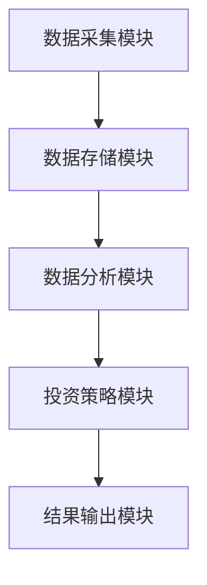
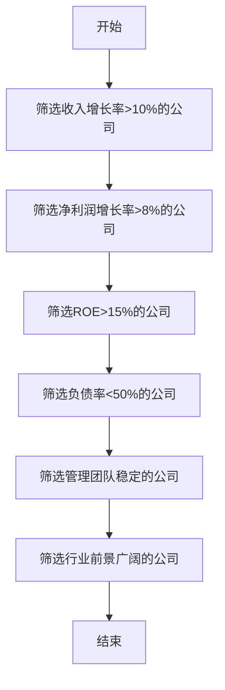
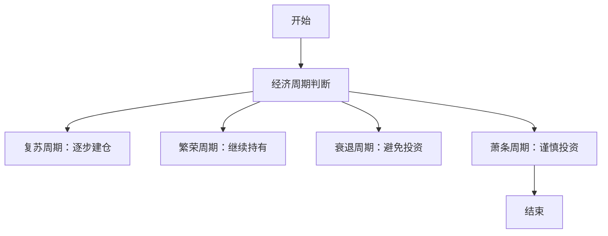

                 


# 彼得林奇的"成长股"在不同经济周期的表现

## 关键词：彼得·林奇，成长股，经济周期，投资策略，风险管理

## 摘要：  
彼得·林奇是全球著名投资专家，其成长股投资理念强调长期持有的优质股票。本文系统分析成长股在不同经济周期（复苏、繁荣、衰退、萧条）的表现，探讨其在市场波动中的机会与挑战，并结合实际案例和数学模型，阐述如何通过长期持有优质成长股实现财富增值。文章还提供系统架构和代码实现，帮助读者建立成长股投资组合。

---

## 第1章：成长股与经济周期概述

### 1.1 成长股的定义与特点

#### 1.1.1 成长股的定义
成长股是指收入和利润增长超过市场平均水平的公司股票，具有高成长性和潜在增值空间。  
- **高成长性**：收入和利润持续增长，ROE（净资产收益率）高于行业平均水平。  
- **市盈率较高**：通常市盈率高于市场平均水平，反映市场对其未来增长的预期。  
- **波动性较大**：在市场波动中，成长股价格波动幅度较大，但长期趋势向上。  

#### 1.1.2 成长股的核心特征
| 特征 | 描述 |
|------|------|
| 高收入增长率 | 收入年增长率>10%，且持续增长。 |
| 高净利润增长率 | 净利润年增长率>8%，且持续增长。 |
| 高ROE | ROE>15%，表明公司盈利能力强。 |
| 高研发投入 | 研发投入占收入比例>5%，支撑技术创新。 |

#### 1.1.3 成长股与价值股的区别
| 项目 | 成长股 | 价值股 |
|------|------|------|
| 估值标准 | 市盈率高，预期未来增长 | 市盈率低，当前价值被低估 |
| 投资逻辑 | 未来增长潜力 | 当前估值合理 |
| 适合阶段 | 经济复苏期 | 经济衰退期 |

### 1.2 彼得·林奇的成长股投资理念

#### 1.2.1 彼得·林奇的投资风格
彼得·林奇以“成长股价值投资”闻名，强调选择具有持续增长潜力的公司，并长期持有。其投资理念包括：
- **长期持有**：避免频繁交易，减少交易成本。
- **分散投资**：通过投资多个成长股分散风险。
- **基本面分析**：注重公司财务状况、盈利能力和发展前景。

#### 1.2.2 成长股在彼得·林奇投资组合中的地位
在彼得·林奇的投资组合中，成长股占比约60%，其余为红利股和平衡型股票。  
- 成长股：提供高增长和资本增值。  
- 红利股：提供稳定的现金流和股息收入。  
- 平衡型股票：在成长和价值之间取得平衡。  

#### 1.2.3 彼得·林奇对成长股的筛选标准
彼得·林奇的筛选标准包括：
1. **收入和利润持续增长**：过去5年收入和利润年增长率>10%。  
2. **高ROE**：ROE>15%，表明公司盈利能力强。  
3. **低债务**：公司负债率<50%，避免过高财务风险。  
4. **管理团队稳定**：管理层经验丰富且稳定。  
5. **行业前景广阔**：行业具有增长潜力，如科技、医疗等。  

### 1.3 经济周期对投资的影响

#### 1.3.1 经济周期的定义与分类
经济周期分为四个阶段：
1. **复苏**：经济从衰退中逐步恢复，企业利润回升。  
2. **繁荣**：经济高速增长，企业利润创新高。  
3. **衰退**：经济增速放缓，企业利润下降。  
4. **萧条**：经济严重低迷，企业利润大幅下滑。  

#### 1.3.2 不同经济周期对股市的影响
- **复苏期**：市场情绪逐渐回暖，成长股表现较好。  
- **繁荣期**：市场情绪高涨，成长股估值上升。  
- **衰退期**：市场情绪低迷，成长股估值承压。  
- **萧条期**：市场情绪极度悲观，成长股价格大幅波动。  

#### 1.3.3 成长股在不同经济周期的表现特点
| 经济周期 | 成长股表现 | 风险 |
|----------|------------|------|
| 复苏     | 估值上升，股价上涨 | 市场波动大 |
| 繁荣     | 估值继续上升，股价创新高 | 市场泡沫风险 |
| 衰退     | 估值下降，股价承压 | 业绩下滑风险 |
| 萧条     | 估值触底，股价波动大 | 系统性风险 |

---

## 第2章：成长股的筛选与分析方法

### 2.1 成长股的筛选指标

#### 2.1.1 收入增长率
收入增长率是衡量公司成长性的核心指标。  
$$收入增长率 = \frac{\text{当年收入} - \text{上年收入}}{\text{上年收入}} \times 100\%$$  
例如：某公司2022年收入为100亿元，2023年收入为110亿元，则收入增长率为10%。

#### 2.1.2 净利润增长率
净利润增长率反映公司盈利能力的提升。  
$$净利润增长率 = \frac{\text{当年净利润} - \text{上年净利润}}{\text{上年净利润}} \times 100\%$$  
例如：某公司2022年净利润为20亿元，2023年净利润为22亿元，则净利润增长率为10%。

#### 2.1.3 营业利润率
营业利润率衡量公司运营效率。  
$$营业利润率 = \frac{\text{营业收入}}{\text{营业收入 + 营业成本}} \times 100\%$$  
例如：某公司营业收入为100亿元，营业成本为60亿元，则营业利润率为40%。

#### 2.1.4 市盈率与市净率
市盈率（P/E）和市净率（P/B）是衡量股票估值的重要指标。  
$$\text{市盈率} = \frac{\text{股价}}{\text{每股净利润}}$$  
$$\text{市净率} = \frac{\text{股价}}{\text{每股净资产}}$$  

#### 2.1.5 市售率
市售率（P/S）衡量公司收入与股价的关系。  
$$\text{市售率} = \frac{\text{股价}}{\text{每股收入}}$$  

---

### 2.2 成长股的财务分析

#### 2.2.1 利润表分析
利润表分析重点关注收入和利润的增长情况。  
- 收入增长率>10%：表明公司收入增长强劲。  
- 净利润增长率>8%：表明公司盈利能力提升。  

#### 2.2.2 资产负债表分析
资产负债表分析重点关注公司的财务健康状况。  
- 负债率<50%：表明公司财务风险较低。  
- 存货周转率>2：表明公司运营效率较高。  

#### 2.2.3 现金流量表分析
现金流量表分析重点关注公司现金流情况。  
- 经营活动现金流为正：表明公司盈利能力强。  
- 投资活动现金流为负：表明公司加大投资力度。  

---

### 2.3 成长股的投资策略

#### 2.3.1 长期持有策略
长期持有是彼得·林奇的核心投资策略。通过长期持有优质成长股，投资者可以分享公司成长的收益。  
- **优点**：避免短期市场波动影响，降低交易成本。  
- **缺点**：需要承担短期波动风险。  

#### 2.3.2 分批建仓策略
分批建仓可以降低市场波动风险。  
- **策略**：将资金分批投入，逐步建仓，降低单笔投资风险。  
- **优点**：分散风险，避免一次性投资损失过大。  

#### 2.3.3 行业选择与分散投资
选择具有增长潜力的行业，如科技、医疗、消费等，并分散投资以降低风险。  
- **行业选择**：关注行业前景广阔的公司。  
- **分散投资**：避免过度集中于某一行业或公司。  

---

## 第3章：不同经济周期下成长股的表现

### 3.1 经济复苏周期中的成长股

#### 3.1.1 经济复苏周期的特点
- 经济逐渐恢复，企业利润回升。  
- 市场情绪逐渐回暖，投资者信心恢复。  

#### 3.1.2 成长股在复苏周期的表现
- **表现**：成长股估值上升，股价上涨。  
- **风险**：市场波动较大，成长股价格波动剧烈。  

#### 3.1.3 投资策略
- **策略**：逐步建仓，选择基本面良好、估值合理的成长股。  
- **风险控制**：设置止损点，避免大幅亏损。  

### 3.2 经济繁荣周期中的成长股

#### 3.2.1 经济繁荣周期的特点
- 经济高速增长，企业利润创新高。  
- 市场情绪高涨，投资者乐观。  

#### 3.2.2 成长股在繁荣周期的表现
- **表现**：成长股估值继续上升，股价创新高。  
- **风险**：市场可能出现泡沫，股价可能出现回调。  

#### 3.2.3 投资策略
- **策略**：继续持有优质成长股，享受股价上涨带来的收益。  
- **风险控制**：警惕市场泡沫，逐步降低仓位。  

### 3.3 经济衰退周期中的成长股

#### 3.3.1 经济衰退周期的特点
- 经济增速放缓，企业利润下降。  
- 市场情绪低迷，投资者信心不足。  

#### 3.3.2 成长股在衰退周期的表现
- **表现**：成长股估值下降，股价承压。  
- **风险**：公司业绩可能大幅下滑，股价波动剧烈。  

#### 3.3.3 投资策略
- **策略**：避免投资成长股，选择红利股或平衡型股票。  
- **风险控制**：及时止损，避免进一步亏损。  

### 3.4 经济萧条周期中的成长股

#### 3.4.1 经济萧条周期的特点
- 经济严重低迷，企业利润大幅下滑。  
- 市场情绪极度悲观，投资者信心丧失。  

#### 3.4.2 成长股在萧条周期的表现
- **表现**：成长股估值触底，股价波动大。  
- **风险**：系统性风险较高，成长股可能大幅下跌。  

#### 3.4.3 投资策略
- **策略**：谨慎投资成长股，选择具有强大竞争优势的公司。  
- **风险控制**：分散投资，避免过度集中。  

---

## 第4章：基于彼得·林奇理念的系统架构与算法实现

### 4.1 系统架构设计

#### 4.1.1 系统功能设计
系统功能包括：
- 数据采集：获取成长股的财务数据。  
- 数据分析：计算成长股的估值指标。  
- 投资策略制定：基于彼得·林奇理念制定投资策略。  

#### 4.1.2 系统架构图
以下是系统架构图：



#### 4.1.3 数据流分析
- 数据采集模块：从数据库或API获取成长股的财务数据。  
- 数据存储模块：将数据存储在数据库中，供后续分析使用。  
- 数据分析模块：计算成长股的估值指标，如市盈率、ROE等。  
- 投资策略模块：基于彼得·林奇理念制定投资策略。  
- 结果输出模块：输出投资建议和报告。  

---

### 4.2 算法原理与实现

#### 4.2.1 成长股筛选算法
以下是成长股筛选算法的流程图：



#### 4.2.2 成长股投资策略算法
以下是成长股投资策略算法的流程图：



---

## 第5章：项目实战与代码实现

### 5.1 环境配置

#### 5.1.1 Python环境安装
安装Python和必要的库：
- NumPy：用于数值计算。  
- Pandas：用于数据处理。  
- Matplotlib：用于数据可视化。  
- Scikit-learn：用于机器学习算法。  

#### 5.1.2 数据获取工具安装
安装数据获取工具，如：
- Pandas DataReader：用于从Yahoo Finance获取数据。  
- AlphaVantage：用于获取实时数据。  

---

### 5.2 核心代码实现

#### 5.2.1 数据获取
以下是数据获取的代码示例：

```python
import pandas as pd
from pandas_datareader import DataReader

# 获取苹果公司（AAPL）的财务数据
data = DataReader('AAPL', 'yahoo', start='2020-01-01', end='2023-12-31')
data.to_csv('apple_data.csv')
```

#### 5.2.2 成长股筛选
以下是成长股筛选的代码示例：

```python
import pandas as pd

# 读取数据
data = pd.read_csv('apple_data.csv')

# 计算收入增长率
revenue_growth = (data['Revenue'] - data['Revenue'].shift(1)) / data['Revenue'].shift(1) * 100

# 计算净利润增长率
net_income_growth = (data['NetIncome'] - data['NetIncome'].shift(1)) / data['NetIncome'].shift(1) * 100

# 计算ROE
roe = data['NetIncome'] / data['EarningsPerShare']
```

#### 5.2.3 投资策略制定
以下是投资策略制定的代码示例：

```python
import pandas as pd

# 读取数据
data = pd.read_csv('apple_data.csv')

# 判断经济周期
if data['GDP_growth'] > 2:
    print("经济处于繁荣周期，建议继续持有成长股。")
elif data['GDP_growth'] > 0:
    print("经济处于复苏周期，建议逐步建仓。")
else:
    print("经济处于衰退或萧条周期，建议谨慎投资。")
```

---

## 第6章：结论与展望

### 6.1 总结
彼得·林奇的成长股投资理念强调长期持有优质股票，注重基本面分析和风险管理。在不同经济周期下，成长股的表现各异，投资者需根据市场环境调整投资策略。

### 6.2 最佳实践
- **长期投资**：避免频繁交易，减少交易成本。  
- **分散投资**：避免过度集中，降低风险。  
- **风险管理**：设置止损点，及时止损。  

### 6.3 展望
未来，随着人工智能和大数据技术的发展，成长股投资将更加精准和高效。投资者可通过技术手段进一步优化投资策略，提升投资收益。

---

## 作者：AI天才研究院/AI Genius Institute & 禅与计算机程序设计艺术/Zen And The Art of Computer Programming

