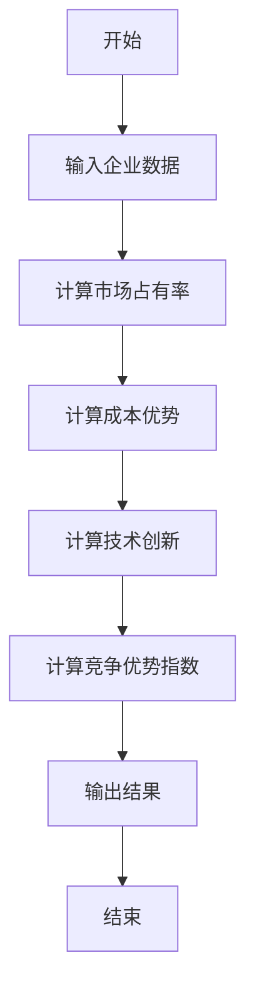
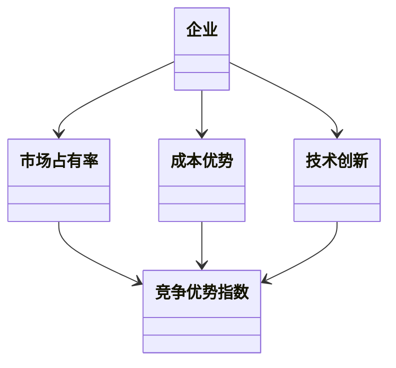

                 


# 彼得林奇的"竞争优势"评估体系

## 关键词：竞争优势、彼得林奇、投资评估、数学模型、算法实现

## 摘要：本文系统介绍了彼得林奇的"竞争优势"评估体系，详细阐述了竞争优势的核心概念、识别方法、评估指标以及持续性与可扩展性。通过构建数学模型和算法实现，结合实际案例分析，提供了完整的竞争优势评估解决方案，并给出了最佳实践建议。

---

## 第一部分: 竞争优势的核心概念

### 第1章: 竞争优势的定义与重要性

#### 1.1 什么是竞争优势
竞争优势是指企业在市场中相对于竞争对手的独特优势，这些优势可以是成本、技术、品牌、资源等。竞争优势是企业在市场中生存和发展的关键，也是投资者评估企业价值的重要依据。

#### 1.2 竞争优势在投资中的作用
竞争优势是投资者判断企业长期盈利能力的核心指标。具有强大竞争优势的企业能够在行业中占据领先地位，并为股东创造超额收益。

#### 1.3 竞争优势的分类与层次
竞争优势可以分为短期竞争优势和长期竞争优势。短期竞争优势包括成本优势和市场占有率，而长期竞争优势则包括技术创新和品牌影响力。

---

### 第2章: 彼得林奇的竞争优势理论

#### 2.1 彼得林奇的背景与投资理念
彼得·林奇是美国著名投资经理人，他强调通过深入研究企业基本面来寻找具有竞争优势的企业进行投资。

#### 2.2 竞争优势的核心要素
彼得林奇认为，竞争优势的核心要素包括市场占有率、成本优势、技术创新和品牌影响力。

#### 2.3 竞争优势与企业价值的关系
竞争优势是企业价值的核心驱动力。具有强大竞争优势的企业能够实现持续的盈利增长，从而为股东创造更大的价值。

---

## 第二部分: 竞争优势的识别与评估

### 第3章: 竞争优势的识别方法

#### 3.1 行业分析法
通过分析行业趋势和竞争格局，识别具有竞争优势的企业。

#### 3.2 企业分析法
通过对企业的财务状况、管理团队和商业模式进行分析，评估企业的竞争优势。

#### 3.3 市场分析法
通过分析市场需求和消费者偏好，识别具有市场优势的企业。

---

### 第4章: 竞争优势的评估指标

#### 4.1 市场占有率
市场占有率是衡量企业竞争优势的重要指标。高市场占有率表明企业在行业中具有较强的竞争力。

#### 4.2 成本优势
成本优势是指企业在生产或运营过程中能够以更低的成本提供产品或服务，从而获得更高的利润率。

#### 4.3 技术创新
技术创新是企业在技术领域保持竞争优势的关键因素。具有创新能力的企业能够不断推出新产品，满足市场需求。

#### 4.4 品牌影响力
强大的品牌影响力可以提升企业的市场地位和消费者的忠诚度，从而为企业创造持续的竞争优势。

---

## 第三部分: 竞争优势的持续性与可扩展性

### 第5章: 竞争优势的持续性分析

#### 5.1 市场需求的稳定性
市场需求的稳定性是竞争优势持续性的基础。稳定的市场需求能够为企业提供持续的收入来源。

#### 5.2 企业的创新能力
企业的创新能力是竞争优势持续性的关键。只有不断创新，企业才能在竞争激烈的市场中保持领先地位。

#### 5.3 行业竞争格局的变化
行业竞争格局的变化会影响竞争优势的持续性。企业需要不断适应行业变化，调整战略，以维持竞争优势。

---

### 第6章: 竞争优势的可扩展性

#### 6.1 产品线扩展的可能性
产品线的扩展能力是竞争优势可扩展性的体现。企业可以通过扩展产品线，满足更多消费者的需求，从而扩大市场份额。

#### 6.2 市场区域的扩展
市场区域的扩展能力是竞争优势可扩展性的另一个重要方面。企业可以通过开拓新市场，进一步扩大业务规模。

#### 6.3 技术的可扩展性
技术的可扩展性是指企业技术的应用范围和应用领域。具有强大技术优势的企业可以通过技术的扩展，实现业务的多元化发展。

---

## 第四部分: 竞争优势评估的数学模型与算法

### 第7章: 竞争优势评估的数学模型

#### 7.1 竞争优势评分模型
竞争优势评分模型是一种通过量化指标来评估企业竞争优势的工具。模型的构建需要考虑多个因素，包括市场占有率、成本优势、技术创新和品牌影响力等。

#### 7.2 竞争优势指数计算公式
竞争优势指数可以通过以下公式计算：
$$ 竞争优势指数 = \frac{市场占有率 \times 成本优势 \times 技术创新}{行业平均值} $$

---

### 第8章: 竞争优势评估的算法实现

#### 8.1 竞争优势评估算法流程图


#### 8.2 竞争优势评估的Python实现
```python
def calculate_competitive_edge(market_share, cost_advantage, technological_innovation, industry_average):
    competitive_edge = (market_share * cost_advantage * technological_innovation) / industry_average
    return competitive_edge

# 示例数据
market_share = 0.3
cost_advantage = 0.8
technological_innovation = 0.6
industry_average = 0.5

result = calculate_competitive_edge(market_share, cost_advantage, technological_innovation, industry_average)
print("竞争优势指数:", result)
```

---

## 第五部分: 竞争优势评估系统分析与架构设计

### 第9章: 问题场景介绍

#### 9.1 问题背景
竞争优势评估系统旨在帮助企业识别和评估其竞争优势，从而制定有效的投资和战略决策。

#### 9.2 项目介绍
本项目旨在构建一个基于彼得林奇竞争优势理论的评估系统，为企业提供全面的竞争优势分析。

---

### 第10章: 系统功能设计

#### 10.1 领域模型mermaid类图


---

### 第11章: 系统架构设计

#### 11.1 系统架构mermaid架构图


---

## 第六部分: 项目实战

### 第12章: 环境安装

#### 12.1 环境要求
- Python 3.6或更高版本
- Mermaid图表支持工具
- 数据分析库（如Pandas、NumPy）

#### 12.2 安装步骤
1. 安装Python
2. 安装所需的Python库
3. 安装Mermaid图表工具

---

### 第13章: 系统核心实现源代码

#### 13.1 核心代码实现
```python
import pandas as pd

def calculate_competitive_edge(market_share, cost_advantage, technological_innovation, industry_average):
    competitive_edge = (market_share * cost_advantage * technological_innovation) / industry_average
    return competitive_edge

# 示例数据
data = {
    '企业': ['企业A', '企业B', '企业C'],
    '市场占有率': [0.3, 0.25, 0.4],
    '成本优势': [0.8, 0.6, 0.7],
    '技术创新': [0.6, 0.5, 0.7],
    '行业平均值': [0.5, 0.5, 0.5]
}

df = pd.DataFrame(data)
df['竞争优势指数'] = df.apply(lambda x: calculate_competitive_edge(x['市场占有率'], x['成本优势'], x['技术创新'], x['行业平均值']), axis=1)

print(df)
```

---

### 第14章: 实际案例分析

#### 14.1 案例介绍
以科技行业为例，分析三家企业在市场中的竞争优势。

#### 14.2 案例分析
通过对市场占有率、成本优势、技术创新等指标的分析，计算每家企业的竞争优势指数，并评估其竞争优势。

---

## 第七部分: 最佳实践

### 第15章: 小结

#### 15.1 总结
本文系统介绍了彼得林奇的"竞争优势"评估体系，详细阐述了竞争优势的核心概念、识别方法、评估指标以及持续性与可扩展性。通过构建数学模型和算法实现，结合实际案例分析，提供了完整的竞争优势评估解决方案。

---

### 第16章: 注意事项

#### 16.1 注意事项
- 竞争优势评估需要结合企业的实际情况进行分析。
- 竞争优势是动态变化的，企业需要不断调整战略以维持竞争优势。
- 在实际应用中，需要综合考虑多种因素，避免单一指标的误导。

---

### 第17章: 拓展阅读

#### 17.1 推荐书籍
- 《彼得·林奇的成功投资》
- 《竞争优势：企业战略的核心》

#### 17.2 推荐文章
- 竞争优势评估方法的研究与应用
- 基于彼得林奇理论的投资策略

---

## 作者：AI天才研究院/AI Genius Institute & 禅与计算机程序设计艺术 /Zen And The Art of Computer Programming

---

**全文完**

