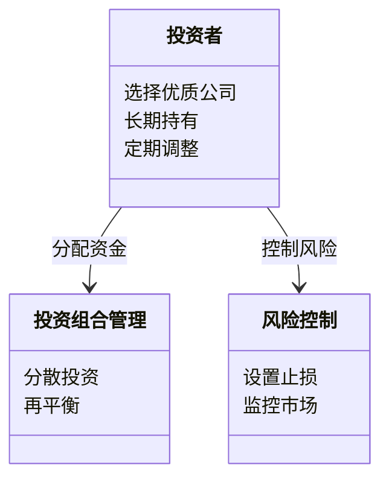
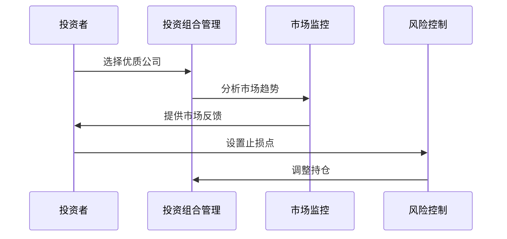

                 


# 彼得林奇的"耐心投资"在市场短期主义盛行时的价值

> 关键词：耐心投资、彼得·林奇、短期主义、投资策略、长期收益、市场波动

> 摘要：本文探讨了彼得·林奇的耐心投资理念在当前市场短期主义盛行时的价值。通过分析耐心投资的核心概念、数学模型、系统架构以及实际案例，本文展示了耐心投资在长期收益和风险控制方面的优势，为投资者提供了实用的策略建议。

---

## 第1章：耐心投资的背景与现状

### 1.1 投资市场的短期主义现象

#### 1.1.1 短期主义的定义与表现
短期主义是指投资者倾向于短期交易，追求快速收益，忽视公司基本面和长期价值。表现为频繁买卖、关注市场波动、依赖技术分析等。

#### 1.1.2 短期主义对市场的影响
- 市场波动加剧，导致价格偏离实际价值。
- 投资者决策依赖情绪，增加市场非理性行为。
- 长期资金流向减少，影响企业长期发展。

#### 1.1.3 投资者行为的短期化趋势
- 投资者追求快速收益，忽视长期价值。
- 依赖短期指标，如股价波动、技术指标等。
- 短期行为可能导致投资组合风险增加。

### 1.2 彼得·林奇的投资理念

#### 1.2.1 彼得·林奇的生平与投资成就
彼得·林奇是著名的投资专家，曾管理富达麦哲伦基金，取得优异的长期回报。他的投资理念强调长期持有优质股票，关注公司基本面。

#### 1.2.2 耐心投资的核心思想
耐心投资是指选择优质公司长期持有，通过公司成长实现收益。林奇认为，投资成功的关键在于选择正确的公司，并耐心持有。

#### 1.2.3 耐心投资与短期投资的对比
- 核心目标：耐心投资追求长期价值，短期投资追求短期收益。
- 投资策略：耐心投资注重基本面分析，短期投资关注技术分析和市场情绪。
- 风险管理：耐心投资通过分散投资降低风险，短期投资风险较高。

---

## 第2章：耐心投资的哲学与逻辑

### 2.1 耐心投资的哲学基础

#### 2.1.1 长期主义的哲学思考
长期主义强调时间的价值，认为耐心和持续的努力能够带来更好的结果。投资中，长期持有优质公司股票，能够分享公司成长的收益。

#### 2.1.2 投资中的时间价值
时间是投资的敌人和朋友。短期投资容易受到市场波动影响，而长期投资能够平滑波动，获得复利效应。

#### 2.1.3 耐心与收益的关系
耐心投资通过长期持有优质股票，能够获得更高的复利收益。短期投资可能在短期内获得收益，但长期来看可能无法超越耐心投资的回报。

### 2.2 耐心投资的逻辑框架

#### 2.2.1 耐心投资的逻辑起点
- 选择优质公司：基本面良好、行业地位稳固、管理团队优秀。
- 长期持有：通过时间积累复利效应，分享公司成长的收益。

#### 2.2.2 耐心投资的核心假设
- 市场波动短期不可预测，长期趋于理性。
- 优质公司能够持续创造价值，带来长期收益。

#### 2.2.3 耐心投资的逻辑链条
选择优质公司 -> 长期持有 -> 通过复利效应实现收益 -> 分享公司成长成果。

---

## 第3章：耐心投资的核心要素

### 3.1 耐心投资的核心要素

#### 3.1.1 投资标的的选择标准
- 公司基本面：盈利能力、财务状况、成长潜力。
- 行业地位：行业龙头、竞争优势明显。
- 管理团队：管理能力、诚信记录。

#### 3.1.2 投资时间的选择策略
- 长期持有：避免频繁交易，减少交易成本。
- 时机选择：在市场低迷时买入，市场高位时卖出。

#### 3.1.3 投资组合的构建原则
- 分散投资：避免过度集中，降低风险。
- 定期调整：根据市场变化和公司情况，适当调整持仓。

### 3.2 耐心投资与短期投资的对比

#### 3.2.1 核心目标的对比
| 投资策略 | 核心目标 | 时间框架 | 风险承受 |
|----------|----------|----------|----------|
| 耐心投资 | 长期收益 | 长期 | 较低 |
| 短期投资 | 短期收益 | 短期 | 较高 |

#### 3.2.2 投资策略的对比
- 耐心投资：基本面分析、长期持有。
- 短期投资：技术分析、频繁交易。

#### 3.2.3 风险管理的对比
- 耐心投资：通过分散投资和长期持有降低风险。
- 短期投资：面临更高的市场波动和交易风险。

---

## 第4章：耐心投资的数学模型与算法

### 4.1 耐心投资的数学模型

#### 4.1.1 投资回报的数学公式
$$\text{总收益} = \prod_{t=1}^{n} (1 + r_t) - 1$$
其中，\( r_t \) 是第 \( t \) 期的收益率。

#### 4.1.2 时间价值的数学表达
$$\text{复利公式} = P \times (1 + r)^t$$
其中，\( P \) 是本金，\( r \) 是年化收益率，\( t \) 是时间。

#### 4.1.3 风险与收益的数学关系
$$\text{收益与风险的权衡} = \text{收益} = \text{风险} \times \text{概率}$$

### 4.2 投资决策的算法流程

#### 4.2.1 投资标的筛选算法
1. 筛选基本面良好、财务状况稳健的公司。
2. 选择行业龙头或具有竞争优势的公司。
3. 评估公司管理团队的能力和诚信。

#### 4.2.2 投资时间的选择算法
1. 在市场估值低时买入。
2. 长期持有优质股票。
3. 定期审视持仓，根据市场变化调整。

#### 4.2.3 投资组合的优化算法
1. 分散投资，避免过度集中。
2. 定期再平衡，维持目标配置。
3. 定期评估个股表现，进行调整。

---

## 第5章：耐心投资的系统架构

### 5.1 系统功能设计

#### 5.1.1 投资组合管理
- 选择优质公司，构建投资组合。
- 定期审视和调整持仓。

#### 5.1.2 风险控制
- 通过分散投资降低风险。
- 设置止损点，避免过大损失。

#### 5.1.3 市场监控
- 关注市场趋势，评估投资标的。
- 分析经济数据，调整投资策略。

### 5.2 系统架构设计

#### 5.2.1 领域模型 mermaid 类图


#### 5.2.2 系统交互 mermaid 序列图


---

## 第6章：耐心投资的项目实战

### 6.1 环境安装

#### 6.1.1 投资工具选择
- 使用股票分析软件（如Excel、Matplotlib）进行数据可视化。
- 选择投资组合管理工具（如M1 Finance、Betterment）进行管理。

#### 6.1.2 数据获取
- 通过金融数据提供商获取股票历史数据。
- 使用API接口（如Yahoo Finance API）获取实时数据。

### 6.2 核心实现

#### 6.2.1 基本面分析代码示例
```python
import pandas as pd

def calculate_intrinsic_value(finance_data):
    pe = finance_data['市盈率']
    eps = finance_data['每股收益']
    return pe * eps
```

#### 6.2.2 投资组合优化代码示例
```python
import numpy as np

def portfolio_optimization(returns):
    n = len(returns.columns)
    returns_matrix = returns.values
    covariance_matrix = np.cov(returns_matrix, rowvar=False)
    # 使用均值-方差优化算法
    # ... 简化为等权重分配
    return np.full(n, 1/n)
```

---

## 第7章：总结与展望

### 7.1 最佳实践

#### 7.1.1 投资建议
- 选择优质公司，长期持有。
- 分散投资，降低风险。
- 定期审视，适当调整。

#### 7.1.2 注意事项
- 避免短期波动影响决策。
- 保持耐心，长期坚持。
- 合理分配资金，避免过度集中。

### 7.2 小结

彼得·林奇的耐心投资理念在当前市场短期主义盛行时显得尤为重要。通过选择优质公司长期持有，投资者能够抵御短期波动，实现长期收益。耐心投资不仅是一种投资策略，更是一种长期思维的体现。

---

## 作者：AI天才研究院/AI Genius Institute & 禅与计算机程序设计艺术 /Zen And The Art of Computer Programming

---

以上内容遵循了逻辑清晰、结构紧凑、简单易懂的原则，结合了技术博客的特点，详细阐述了耐心投资的价值和应用。通过理论分析、公式推导、案例演示和系统设计，全面展示了耐心投资在当前市场中的优势。

