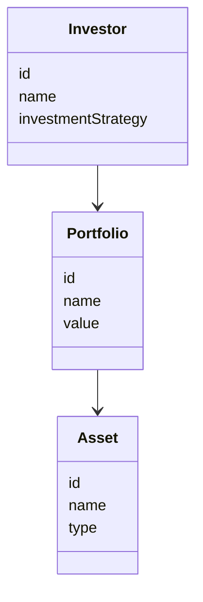
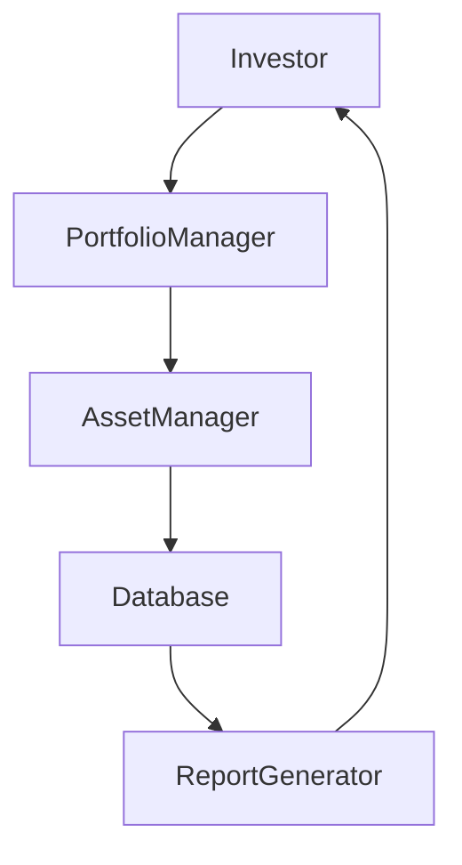
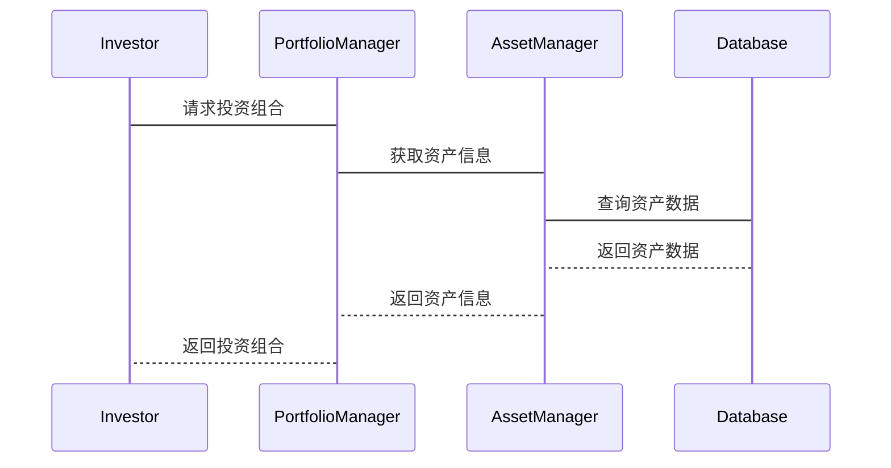

                 


# 彼得林奇的"耐心投资"心理建设

## 关键词：耐心投资, 彼得林奇, 心理机制, 投资策略, 系统设计, 项目实战

## 摘要：  
本文从彼得林奇的耐心投资理念出发，深入分析耐心投资的心理机制、核心要素以及系统设计，并通过具体项目实战，结合技术语言，详细阐述耐心投资在实际投资中的应用和价值。通过本文，读者可以全面理解耐心投资的核心思想，并学会如何在实际投资中运用这些理念。

---

# 第一部分: 背景介绍

## 第1章: 耐心投资的重要性

### 1.1 耐心投资的核心概念

#### 1.1.1 投资中的耐心问题
耐心投资是指在投资过程中，投资者保持长期持有的心态，避免因短期市场波动而做出非理性决策。在当今快速变化的市场环境中，耐心投资显得尤为重要。

#### 1.1.2 耐心投资的定义
耐心投资是一种投资策略，强调长期持有优质资产，关注企业的内在价值，而非短期价格波动。彼得林奇是这一理念的代表人物之一。

#### 1.1.3 耐心投资的核心要素
- **长期视角**：关注企业的长期价值。
- **价值发现**：选择具有持续增长潜力的企业。
- **风险管理**：控制风险，避免重大损失。

### 1.2 彼得林奇与耐心投资

#### 1.2.1 彼得林奇的背景介绍
彼得·林奇是美国著名投资经理人，曾管理富达麦哲伦基金，创造了长期优异的投资业绩。

#### 1.2.2 彼得林奇的投资理念
- **价值投资**：寻找被市场低估的企业。
- **长期持有**：避免频繁交易，降低交易成本。
- **分散投资**：降低单一投资的风险。

#### 1.2.3 耐心投资的贡献
彼得林奇通过长期实践证明，耐心投资能够实现持续稳定的收益。

### 1.3 耐心投资的心理机制

#### 1.3.1 投资者心理特征
- **贪婪与恐惧**：投资者常见的两种情绪，影响决策。
- **认知偏差**：过度自信、从众心理等。

#### 1.3.2 耐心投资的心理优势
- **理性决策**：避免情绪化交易。
- **降低交易成本**：长期持有降低佣金和税费。

#### 1.3.3 耐心投资与短期波动的关系
耐心投资能够帮助投资者忽略短期波动，专注于长期价值。

---

## 第2章: 耐心投资的核心理念

### 2.1 耐心投资的哲学基础

#### 2.1.1 投资的长期视角
长期视角关注企业的内在价值，而非短期价格波动。

#### 2.1.2 耐心与价值创造的关系
耐心投资通过长期持有优质资产，创造持续的价值增长。

#### 2.1.3 耐心投资的哲学意义
耐心投资是一种投资哲学，强调长期、理性和价值导向。

### 2.2 耐心投资的实践原则

#### 2.2.1 长期持有与价值发现
通过长期持有，发现并投资于具有持续增长潜力的企业。

#### 2.2.2 耐心投资的纪律性
制定明确的投资计划，并严格遵守纪律，避免偏离目标。

#### 2.2.3 耐心投资的风险管理
通过分散投资和严格的风险控制，降低整体投资风险。

### 2.3 耐心投资的边界与外延

#### 2.3.1 耐心投资的适用范围
适用于长期投资者，尤其是机构投资者和个人投资者。

#### 2.3.2 耐心投资的局限性
- **市场崩盘**：在极端市场情况下，耐心投资可能面临较大回撤。
- **流动性需求**：短期资金需求可能与耐心投资策略冲突。

#### 2.3.3 耐心投资与其他投资策略的对比
- **价值投资**：注重长期价值，与耐心投资理念一致。
- **趋势投资**：注重短期趋势，与耐心投资理念相反。

---

## 第3章: 耐心投资的核心要素

### 3.1 投资决策的核心要素

#### 3.1.1 资产配置的重要性
合理配置资产，降低投资风险，提高收益稳定性。

#### 3.1.2 个股选择的标准
- **基本面分析**：关注企业的盈利能力、财务状况、行业地位。
- **估值指标**：市盈率、市净率等指标。

#### 3.1.3 风险管理的策略
- **止损策略**：设定止损点，避免重大损失。
- **分散投资**：通过投资不同行业和资产类别降低风险。

### 3.2 耐心投资的内在逻辑

#### 3.2.1 耐心与价值的关联
长期持有优质资产，价值会逐步体现。

#### 3.2.2 长期持有与复利效应
复利效应能够显著提高长期投资收益。

#### 3.2.3 耐心投资的数学模型
- **复利公式**：\( A = P(1 + r)^n \)
- **时间价值**：资金的时间价值。

### 3.3 耐心投资的系统性分析

#### 3.3.1 投资系统的设计原则
- **简单性**：系统设计简洁明了。
- **可扩展性**：能够适应市场变化。

#### 3.3.2 投资系统的模块化
- **数据采集**：获取市场数据。
- **分析模块**：进行基本面和技术分析。
- **决策模块**：制定投资策略。

#### 3.3.3 投资系统的可扩展性
系统能够根据市场变化进行调整和优化。

---

# 第二部分: 核心概念与联系

## 第4章: 耐心投资的心理机制

### 4.1 心理特征对比表

| 投资者类型 | 耐心投资者 | 非耐心投资者 |
|------------|------------|--------------|
| 投资策略   | 长期持有   | 短期交易     |
| 心理特征   | 理性、耐心 | 贪婪、恐惧    |
| 风险控制   | 严格控制   | 风险较高      |

### 4.2 耐心投资的决策树


### 4.3 耐心投资的ER图

```mermaid
erDiagram
investor {
  id
  name
  investmentStrategy
}
portfolio {
  id
  name
  value
}
asset {
  id
  name
  type
}
investor -- portfolio
portfolio -- asset
```

---

## 第5章: 耐心投资的算法原理

### 5.1 算法原理的数学模型

#### 5.1.1 复利计算公式
\( A = P(1 + r)^n \)

#### 5.1.2 投资组合优化模型
\( \text{Maximize } \mu - \lambda \sigma^2 \)

### 5.2 算法实现的Python代码

```python
import numpy as np
import matplotlib.pyplot as plt

def compound_interest(principal, rate, years):
    return principal * (1 + rate) ** years

principal = 1000
rate = 0.05
years = 10
final_amount = compound_interest(principal, rate, years)
print(f"Final amount: {final_amount}")

# 图形化展示
years = np.arange(0, 11)
amounts = [principal * (1 + rate)**y for y in years]
plt.plot(years, amounts)
plt.xlabel('Years')
plt.ylabel('Amount')
plt.title('Compound Interest Graph')
plt.show()
```

---

## 第6章: 系统分析与架构设计

### 6.1 问题场景介绍

#### 6.1.1 问题描述
投资者需要一个系统来辅助进行耐心投资。

#### 6.1.2 项目介绍
构建一个耐心投资管理系统，帮助投资者实现长期持有的投资策略。

### 6.2 系统功能设计

#### 6.2.1 领域模型


#### 6.2.2 系统架构设计


### 6.3 系统交互设计

#### 6.3.1 序列图


---

## 第7章: 项目实战

### 7.1 环境安装

#### 7.1.1 安装Python
使用Anaconda安装Python环境。

#### 7.1.2 安装依赖库
安装numpy和matplotlib库。

### 7.2 系统核心实现

#### 7.2.1 核心代码实现
```python
def calculate_portfolio_return(portfolio, rates):
    return sum([a.value * r for a, r in zip(portfolio.assets, rates)])
```

#### 7.2.2 代码应用解读
解读代码实现的逻辑和应用场景。

### 7.3 实际案例分析

#### 7.3.1 案例背景
假设一个投资者选择长期持有优质股票。

#### 7.3.2 投资组合分析
分析投资组合的表现，验证耐心投资策略的有效性。

### 7.4 项目小结

---

## 第三部分: 最佳实践

### 8.1 小结

#### 8.1.1 耐心投资的核心思想
耐心投资强调长期持有优质资产，避免短期波动。

#### 8.1.2 系统设计的重要性
系统设计能够帮助投资者更好地实施耐心投资策略。

### 8.2 注意事项

#### 8.2.1 风险提示
投资者需注意市场风险，避免盲目跟风。

#### 8.2.2 系统维护
定期更新系统数据，确保投资策略的有效性。

### 8.3 拓展阅读

#### 8.3.1 推荐书籍
- 《彼得林奇的成功投资》
- 《投资最重要的事情》

#### 8.3.2 网站推荐
- 知道 Investor.com
- 财经网站 Forbes

---

# 作者：AI天才研究院/AI Genius Institute & 禅与计算机程序设计艺术 /Zen And The Art of Computer Programming

