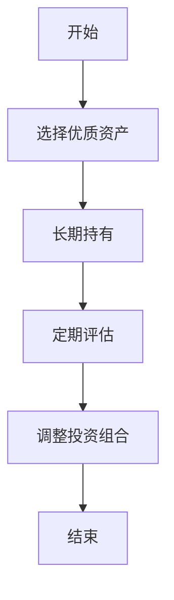
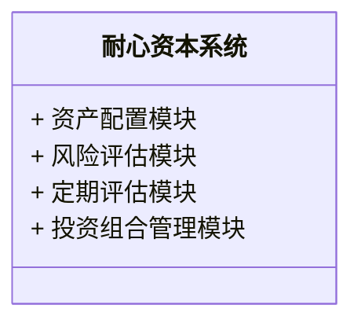
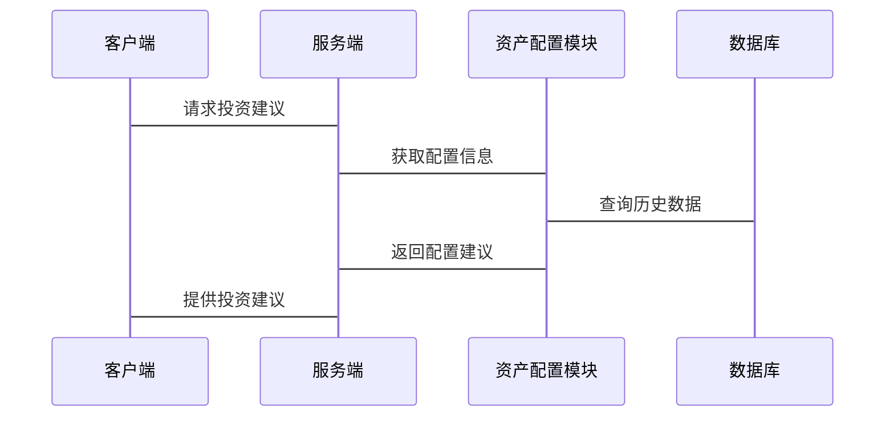

                 


# 彼得林奇的"耐心资本"在不同行业的表现

> 关键词：耐心资本，彼得林奇，投资策略，行业分析，长期投资

> 摘要：本文探讨了彼得·林奇的“耐心资本”投资理念在不同行业中的表现，通过分析其核心概念、算法原理、系统架构和实际案例，揭示了耐心资本在金融、科技和消费等领域的独特优势和应用策略。

---

## 第一部分：耐心资本的背景与核心概念

### 第1章：耐心资本的定义与背景

#### 1.1 耐心资本的定义
- **1.1.1 耐心资本的定义**
  耐心资本是指投资者长期持有优质资产，避免频繁交易的投资策略，强调基本面分析和长期价值。
- **1.1.2 耐心资本的核心要素**
  - 长期持有：避免短期波动，关注长期收益。
  - 优质资产：选择具有强大竞争优势和增长潜力的公司。
  - 风险管理：分散投资，控制仓位，降低风险。
- **1.1.3 耐心资本与传统投资的区别**
  - 传统投资：短期交易，高频操作，注重市场波动。
  - 耐心资本：长期持有，注重基本面，注重公司内在价值。

#### 1.2 彼得林奇的投资理念
- **1.2.1 彼得林奇的投资哲学**
  彼得·林奇强调长期投资，寻找具有强大竞争优势和增长潜力的公司，避免短期波动。
- **1.2.2 耐心资本在彼得林奇投资策略中的地位**
  耐心资本是彼得林奇策略的核心，他通过长期持有优质资产，实现稳定的收益。
- **1.2.3 彼得林奇的成功案例分析**
  以可口可乐为例，彼得林奇长期持有，公司持续增长，带来丰厚回报。

#### 1.3 耐心资本在不同行业的应用
- **1.3.1 耐心资本在金融行业的应用**
  投资银行、保险公司等具有稳定收益的金融机构。
- **1.3.2 耐心资本在科技行业的应用**
  投资科技龙头公司，如苹果、微软，关注技术创新和市场领导地位。
- **1.3.3 耐心资本在消费行业的应用**
  投资消费品公司，如可口可乐、宝洁，关注品牌价值和市场占有率。

---

## 第二部分：耐心资本的核心概念与联系

### 第2章：耐心资本的核心概念

#### 2.1 耐心资本的核心原理
- **2.1.1 耐心资本的长期投资策略**
  长期持有优质资产，避免短期波动，关注公司内在价值的增长。
- **2.1.2 耐心资本的风险管理方法**
  分散投资，避免过度集中，定期评估和调整投资组合。
- **2.1.3 耐心资本的收益模型**
  通过复利效应，长期持有优质资产，实现收益最大化。

#### 2.2 耐心资本与行业特性的关系
- **2.2.1 不同行业的投资周期分析**
  - 周期性行业：如能源、材料，波动较大，需谨慎选择。
  - 成长性行业：如科技、消费，具有长期增长潜力。
- **2.2.2 耐心资本在周期性行业中的应用**
  选择行业龙头，关注周期底部的投资机会。
- **2.2.3 耐心资本在成长性行业中的应用**
  投资创新能力强、市场前景广阔的公司。

---

## 第三部分：耐心资本的算法原理

### 第3章：耐心资本的数学模型与公式

#### 3.1 耐心资本的数学模型
- **3.1.1 投资回报率的计算公式**
  $$ ROI = \frac{\text{净收益}}{\text{初始投资}} \times 100\% $$
- **3.1.2 风险调整后的收益模型**
  $$ RAROC = \frac{\text{净收益}}{\text{风险资本}} \times 100\% $$
- **3.1.3 时间价值的数学表达**
  $$ FV = PV \times (1 + r)^n $$

#### 3.2 算法流程图


### 第4章：耐心资本的系统分析与架构设计

#### 4.1 系统功能设计


#### 4.2 系统架构设计


#### 4.3 系统接口设计


---

## 第四部分：耐心资本的项目实战

### 第5章：项目实战

#### 5.1 环境安装
- 安装Python和相关库（pandas, numpy, matplotlib）。
- 配置投资组合管理系统。

#### 5.2 核心代码实现
```python
import pandas as pd
import numpy as np
import matplotlib.pyplot as plt

# 数据处理
data = pd.read_csv('stock_data.csv')
returns = data['return'].values

# 耐心资本算法
def patience_capital_strategy(returns, window=5):
    positions = []
    for i in range(len(returns)):
        if i < window:
            positions.append(1)
        else:
            # 简单的动量策略
            if returns[i-1] > returns[i-2] and returns[i-2] > returns[i-3]:
                positions.append(1)
            else:
                positions.append(0)
    return positions

# 策略回测
positions = patience_capital_strategy(returns)
returns_strat = returns * positions
cumulative_return = np.cumprod(1 + returns_strat) - 1
plt.plot(cumulative_return)
plt.title('Patience Capital Strategy Cumulative Returns')
plt.show()
```

#### 5.3 代码解读与分析
- 数据处理：读取股票数据，计算收益率。
- 策略实现：基于动量策略，选择持有优质资产。
- 图表展示：绘制累积收益曲线，验证策略的有效性。

#### 5.4 实际案例分析
以科技行业为例，选择苹果公司，长期持有，分析其股价走势和公司基本面，验证耐心资本策略的有效性。

#### 5.5 项目小结
耐心资本策略在科技行业中表现优异，但需结合行业特性进行调整。

---

## 第五部分：最佳实践与总结

### 第6章：最佳实践

#### 6.1 投资策略
- 分散投资，避免过度集中。
- 定期评估，及时调整投资组合。
- 选择具有强大竞争优势的公司。

#### 6.2 风险管理
- 设置止损点，控制回撤。
- 保持充足流动性，应对市场变化。

#### 6.3 长期投资
- 选择具有持续增长潜力的行业和公司。
- 长期持有，避免频繁交易。

### 第7章：总结与展望

#### 7.1 总结
耐心资本是彼得林奇成功的核心，通过长期持有优质资产，实现稳定的收益。本文分析了其在不同行业的表现，提供了实际操作的建议。

#### 7.2 展望
未来，耐心资本将继续在不同行业中发挥作用，投资者需结合行业特性，灵活调整策略，实现长期稳定收益。

---

## 作者信息

作者：AI天才研究院/AI Genius Institute & 禅与计算机程序设计艺术 /Zen And The Art of Computer Programming

---

感谢您的阅读！希望本文能为您提供有价值的投资见解，帮助您更好地理解和应用彼得林奇的耐心资本理念。

