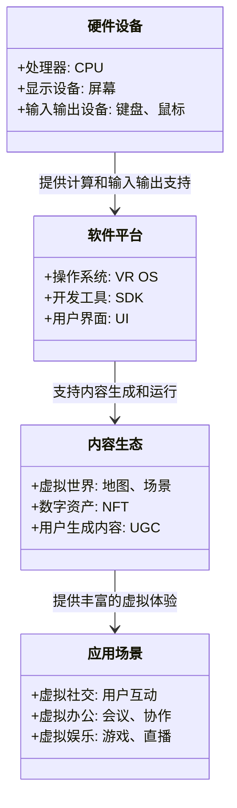
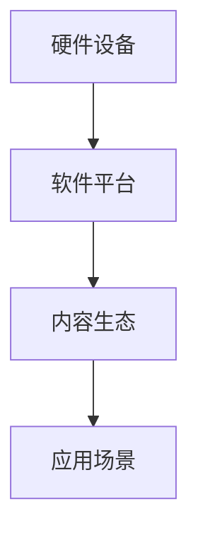

                 


# 彼得林奇的"行业分析"在元宇宙相关产业链中的框架创新

> 关键词：彼得林奇，行业分析，元宇宙，产业链，框架创新

> 摘要：本文通过分析彼得林奇的行业分析方法，结合元宇宙相关产业链的特点，提出了一种创新的分析框架。该框架不仅继承了彼得林奇分析方法的核心理念，还针对元宇宙产业链的独特性进行了优化和扩展。通过系统化的分析和案例研究，本文展示了如何将传统行业分析方法应用到新兴的元宇宙领域，为投资者和研究者提供了新的视角和工具。

---

## 第1章: 引言

### 1.1 元宇宙的基本概念
#### 1.1.1 元宇宙的定义与特点
元宇宙（Metaverse）是一个虚拟的三维空间，通过虚拟现实（VR）、增强现实（AR）和区块链等技术构建，允许用户以数字化身份进行社交、娱乐、工作和交易。元宇宙的核心特征包括：沉浸性、实时性、去中心化和开放性。

#### 1.1.2 元宇宙产业链的构成
元宇宙产业链包括硬件设备（如VR头显、AR眼镜）、软件平台（如虚拟操作系统、内容创作工具）、内容生态（如虚拟世界、数字资产）和应用场景（如虚拟社交、虚拟办公）。

#### 1.1.3 彼得林奇行业分析方法的背景
彼得林奇是著名投资经理，其行业分析方法强调基本面分析、竞争优势评估和长期趋势判断。这些方法在传统投资领域已被证明有效，但在新兴领域如元宇宙的应用仍有待探索。

### 1.2 彼得林奇行业分析的核心理念
#### 1.2.1 彼得林奇投资方法的简介
彼得林奇的投资策略注重长期增长，强调对公司基本面的深入分析，包括行业地位、财务状况和竞争优势。

#### 1.2.2 行业分析在投资中的重要性
行业分析是投资决策的基础，帮助投资者识别行业趋势、竞争优势和潜在风险。

#### 1.2.3 元宇宙产业链中的应用潜力
元宇宙的产业链复杂且多样化，彼得林奇的行业分析方法可以为投资者提供系统化的分析工具。

---

## 第2章: 彼得林奇行业分析框架

### 2.1 行业分析的基本框架
#### 2.1.1 行业生命周期分析
行业生命周期分为导入期、成长期、成熟期和衰退期。彼得林奇方法强调在成长期和成熟期寻找具有持续增长潜力的行业。

#### 2.1.2 行业竞争结构分析
包括行业集中度、竞争壁垒和市场进入障碍。彼得林奇认为，具有高壁垒和高集中度的行业更具投资价值。

#### 2.1.3 行业财务指标分析
通过分析行业收入增长率、利润率和资产负债率等指标，评估行业的健康状况和盈利能力。

### 2.2 彼得林奇分析方法的创新点
#### 2.2.1 基于基本面的行业分析
彼得林奇强调对企业基本面的深入研究，包括财务数据、管理团队和行业趋势。

#### 2.2.2 行业竞争优势分析
通过分析企业的核心竞争力，如技术优势、成本优势和市场地位，识别行业中的领导者。

#### 2.2.3 行业风险评估与投资机会识别
通过分析行业风险因素，如政策风险、技术风险和市场需求变化，识别潜在的投资机会。

### 2.3 本章小结
彼得林奇的行业分析方法为元宇宙产业链的分析提供了坚实的基础，但需要结合元宇宙的独特性进行调整和优化。

---

## 第3章: 元宇宙产业链的行业分析

### 3.1 元宇宙产业链的构成
#### 3.1.1 硬件设备层
包括VR头显、AR眼镜和智能终端设备。硬件设备是元宇宙的入口，决定了用户体验的优劣。

#### 3.1.2 软件平台层
包括操作系统、内容创作工具和虚拟空间构建平台。软件平台是元宇宙的核心，支持内容的生成和运行。

#### 3.1.3 内容生态层
包括虚拟世界、数字资产和虚拟社交。内容生态是元宇宙的吸引力所在，决定了用户粘性和平台生命力。

#### 3.1.4 应用场景层
包括虚拟办公、虚拟教育、虚拟娱乐和虚拟社交。应用场景是元宇宙的实际应用，推动其商业化进程。

### 3.2 各环节的行业分析
#### 3.2.1 硬件设备的竞争格局
分析主要硬件厂商（如Meta、苹果和索尼）的市场地位、技术优势和成本结构。

#### 3.2.2 软件平台的技术壁垒
分析主要平台（如Decentraland和The Sandbox）的技术架构、用户基础和生态系统。

#### 3.2.3 内容生态的多样性
分析数字资产（如NFT）和虚拟内容的创作工具，评估其对用户参与度的影响。

#### 3.2.4 应用场景的商业化潜力
评估虚拟办公和虚拟社交的市场需求和商业可行性，识别潜在的高增长领域。

### 3.3 本章小结
元宇宙产业链的各个环节具有不同的特点和发展潜力，彼得林奇的行业分析方法可以为每个环节提供独特的分析视角。

---

## 第4章: 元宇宙产业链的系统分析

### 4.1 系统分析的基本方法
#### 4.1.1 系统分析的定义与特点
系统分析是一种通过分解问题、分析各部分之间的关系，寻找最优解决方案的方法。

#### 4.1.2 系统分析在行业的应用
通过系统分析，可以识别行业的关键问题和优化方向，为投资决策提供支持。

### 4.2 元宇宙产业链的系统架构设计
#### 4.2.1 系统功能设计
基于领域模型的mermaid类图，展示硬件设备、软件平台、内容生态和应用场景之间的关系。



#### 4.2.2 系统架构设计
基于mermaid架构图，展示元宇宙产业链的整体架构。



---

## 第5章: 元宇宙产业链的框架创新

### 5.1 框架创新的核心思想
#### 5.1.1 元宇宙产业链的独特性
元宇宙产业链的复杂性和多样性要求分析框架具有灵活性和适应性。

#### 5.1.2 传统行业分析方法的局限性
传统行业分析方法在面对新兴领域时可能不够全面，需要结合新技术和新趋势进行调整。

#### 5.1.3 创新框架的设计原则
创新框架应具备模块化、可扩展和动态适应的特点，能够适应元宇宙产业链的变化。

### 5.2 创新框架的具体实现
#### 5.2.1 模块化设计
将元宇宙产业链分为硬件、软件、内容和应用四个模块，分别进行分析。

#### 5.2.2 动态调整机制
根据市场变化和技术进步，动态调整各模块的权重和分析重点。

#### 5.2.3 数据驱动的分析方法
利用大数据和人工智能技术，对元宇宙产业链进行实时监控和预测。

### 5.3 本章小结
通过模块化设计和动态调整机制，创新的分析框架能够更好地适应元宇宙产业链的复杂性和多样性。

---

## 第6章: 项目实战

### 6.1 环境搭建
#### 6.1.1 技术环境
安装必要的开发工具和库，如Python、Pandas、Matplotlib和Scikit-learn。

#### 6.1.2 数据获取
收集元宇宙产业链的相关数据，包括硬件设备的市场占有率、软件平台的用户活跃度和内容生态的用户生成量。

### 6.2 核心实现
#### 6.2.1 数据分析
使用Python对收集的数据进行清洗、处理和可视化。

```python
import pandas as pd
import matplotlib.pyplot as plt

# 数据清洗
data = pd.read_csv('metaverse_data.csv')
data.dropna(inplace=True)
data['增长率'] = data['收入'].pct_change()

# 可视化
plt.figure(figsize=(10,6))
plt.plot(data['时间'], data['增长率'])
plt.title('元宇宙产业链增长率')
plt.xlabel('时间')
plt.ylabel('增长率')
plt.show()
```

#### 6.2.2 模型构建
基于机器学习算法，构建行业预测模型，评估各环节的投资潜力。

### 6.3 案例分析
#### 6.3.1 案例选择
选择元宇宙产业链中的典型企业，如Meta的Oculus头显和Decentraland的虚拟平台。

#### 6.3.2 分析过程
通过彼得林奇的行业分析方法，分析企业的竞争优势和市场地位。

#### 6.3.3 结果解读
根据分析结果，评估企业的投资价值，并提出相应的投资建议。

### 6.4 本章小结
通过实战案例，验证了创新分析框架的有效性和实用性，为投资者提供了可操作的指导。

---

## 第7章: 总结与展望

### 7.1 总结
本文通过分析彼得林奇的行业分析方法，提出了适用于元宇宙产业链的创新框架。该框架结合了传统行业分析的核心理念和元宇宙产业链的独特性，为投资者提供了新的视角和工具。

### 7.2 未来展望
未来的研究可以进一步优化创新框架，结合更多新兴技术，如人工智能和区块链，提升分析的准确性和实时性。

---

## 附录

### 附录A: 元宇宙产业链相关工具
- 数据分析工具：Python、R
- 可视化工具：Matplotlib、Tableau
- 区块链开发工具：Solidity、Web3.js

### 附录B: 元宇宙产业链相关数据源
- 数据集：Kaggle、GitHub
- 行业报告：Gartner、Forrester
- 市场分析：Meta、苹果

### 附录C: 进一步阅读的推荐书目
- 《彼得林奇的股票投资之道》
- 《元宇宙：从虚实结合到数字文明》
- 《区块链与数字资产》

---

## 作者：AI天才研究院/AI Genius Institute & 禅与计算机程序设计艺术/Zen And The Art of Computer Programming

---

本文通过系统化的分析和案例研究，展示了如何将彼得林奇的行业分析方法创新性地应用于元宇宙产业链。这一创新框架不仅继承了传统方法的核心理念，还结合了新兴领域的特点，为投资者和研究者提供了新的视角和工具。希望本文能够为元宇宙产业链的研究和投资决策提供有价值的参考。

