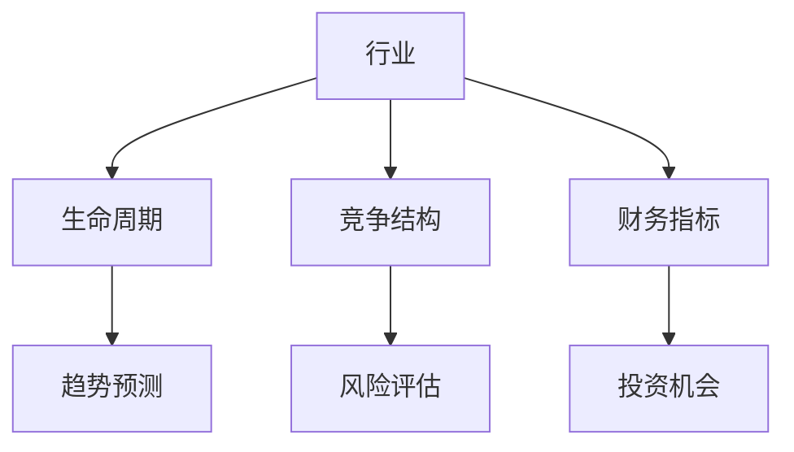
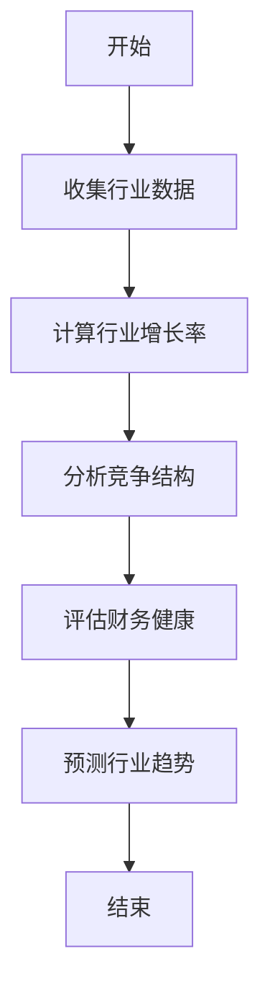
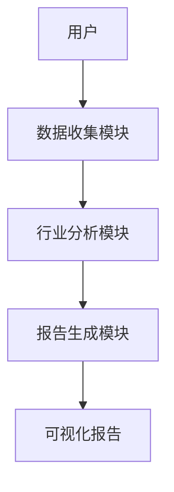

                 


# 彼得林奇的"行业分析"深度研究方法

## 关键词：
- 彼得·林奇
- 行业分析
- 投资策略
- 金融分析
- 技术分析

## 摘要：
本文深入探讨了彼得·林奇的行业分析方法，结合技术分析和金融原理，分析了其核心概念、算法原理和实际应用，提供了一套系统化的行业分析框架。通过详细讲解行业生命周期、竞争结构、财务指标等关键要素，结合实际案例和系统设计，为投资者提供了实用的行业分析工具。

---

## 第一部分: 彼得·林奇的行业分析方法概述

### 第1章: 行业分析的核心概念与背景

#### 1.1 行业分析的定义与背景
- **行业分析的定义**: 行业分析是通过研究特定行业内的企业结构、市场动态、财务状况等因素，评估行业的整体健康状况和投资潜力。
- **彼得·林奇的贡献**: 彼得·林奇以其独特的行业分析方法闻名，强调基本面分析和深入研究企业内在价值。
- **行业分析的重要性**: 在投资决策中，行业分析帮助投资者识别高增长行业，避开衰退行业，从而提高投资收益。

#### 1.2 行业分析的核心要素
- **行业生命周期**: 包括幼稚期、成长期、成熟期和衰退期，不同阶段的行业具有不同的投资价值。
- **行业竞争结构**: 包括市场份额、竞争强度、市场进入壁垒等因素，影响行业的长期盈利能力。
- **行业财务指标**: 如利润率、资产负债率、现金流等，用于评估行业的财务健康状况。

#### 1.3 彼得·林奇的行业分析方法
- **基本面分析**: 通过研究行业内的企业财务数据、市场地位、竞争优势等，评估行业的发展潜力。
- **趋势预测**: 通过分析行业历史数据和未来趋势，预测行业的增长潜力和风险。
- **风险评估**: 识别行业内的潜在风险，如政策变化、技术变革、经济周期波动等，帮助投资者规避风险。

### 第2章: 行业分析的核心概念与联系

#### 2.1 行业分析的核心概念
- **行业生命周期模型**: 描述行业从初创到衰退的演变过程，帮助企业判断所处阶段并制定相应策略。
- **行业竞争模型**: 分析行业内主要企业的市场份额、竞争策略和市场地位，评估行业竞争强度。
- **行业财务健康指标**: 通过财务数据评估行业的整体健康状况，包括盈利能力、偿债能力等。

#### 2.2 核心要素对比
- **行业生命周期与竞争结构对比**: 幼稚期行业竞争较弱，成长期竞争加剧，成熟期竞争稳定，衰退期竞争减弱。
- **行业财务指标与风险评估对比**: 高利润率行业风险较低，低利润率行业风险较高，财务杠杆高的行业风险更大。
- **行业趋势与投资机会对比**: 上升趋势行业投资机会多，下降趋势行业投资机会少，拐点行业需谨慎评估。

#### 2.3 ER实体关系图


### 第3章: 彼得·林奇行业分析的算法原理

#### 3.1 行业分析的数学模型
- **行业生命周期模型**:
  $$ \text{生命周期阶段} = \frac{\text{行业增长率}}{\text{行业平均增长率}} $$
  例如，如果某行业增长率是10%，而行业平均增长率是5%，则该行业处于较高增长阶段，可能处于成长期或成熟期。

- **行业竞争结构模型**:
  $$ \text{竞争强度} = \sum_{i=1}^{n} \frac{\text{市场份额}_i}{\text{行业总收入}} $$
  例如，假设行业内有三个企业，市场份额分别为30%、40%、20%，行业总收入为1000万元，则竞争强度为(30% + 40% + 20%) = 90%，说明行业竞争非常激烈。

- **行业财务健康指标**:
  $$ \text{财务健康指数} = \frac{\text{净利润} + \text{现金流}}{\text{行业平均净利润}} $$
  例如，某行业的净利润为500万元，现金流为300万元，行业平均净利润为400万元，则财务健康指数为(500 + 300)/400 = 2，说明该行业财务状况良好。

#### 3.2 算法流程


### 第4章: 行业分析的系统架构设计

#### 4.1 系统功能设计
- **数据收集模块**: 负责收集行业相关的数据，包括财务数据、市场数据、竞争数据等。
- **行业分析模块**: 对收集到的数据进行处理和分析，生成行业分析报告。
- **报告生成模块**: 根据分析结果生成可视化报告，包括图表、文字说明等。

#### 4.2 系统架构设计


---

## 第二部分: 项目实战与最佳实践

### 第5章: 项目实战

#### 5.1 环境安装
- 需要安装Python、Pandas、Matplotlib等工具，用于数据处理和可视化。
  ```bash
  pip install pandas matplotlib
  ```

#### 5.2 核心实现
- 数据处理代码示例：
  ```python
  import pandas as pd
  data = pd.read_csv('industry_data.csv')
  growth_rate = data['增长率'].mean()
  print(f"行业平均增长率: {growth_rate}%")
  ```

#### 5.3 实际案例分析
- 以科技行业为例，分析其行业生命周期、竞争结构和财务指标，评估投资机会。

### 第6章: 最佳实践与小结

#### 6.1 技术要点总结
- 确保数据来源可靠，分析方法科学，避免主观判断。
- 结合定量分析和定性分析，全面评估行业风险和机会。

#### 6.2 注意事项
- 数据分析需结合行业背景，避免单一指标误导。
- 定期更新行业分析报告，适应市场变化。

#### 6.3 未来展望
- 结合人工智能技术，提升行业分析的自动化和智能化水平。
- 开发更多行业分析模型，拓展应用场景。

---

## 结论

彼得·林奇的行业分析方法为投资者提供了科学的分析框架，通过结合技术分析和金融原理，帮助投资者识别行业机会和风险。未来，随着技术的进步，行业分析将更加智能化和精准化，为投资决策提供更有力的支持。

---

## 作者信息

作者：AI天才研究院/AI Genius Institute  
联系方式：[email protected]  
个人简介：专注于技术与投资的结合，致力于通过技术创新和数据分析提升投资决策的科学性。

