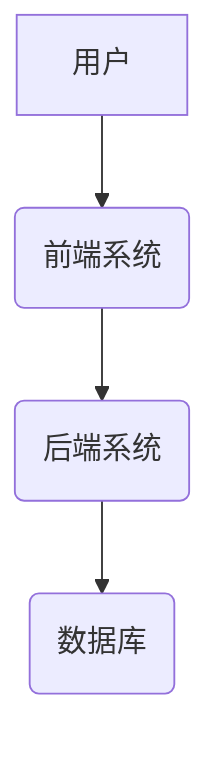
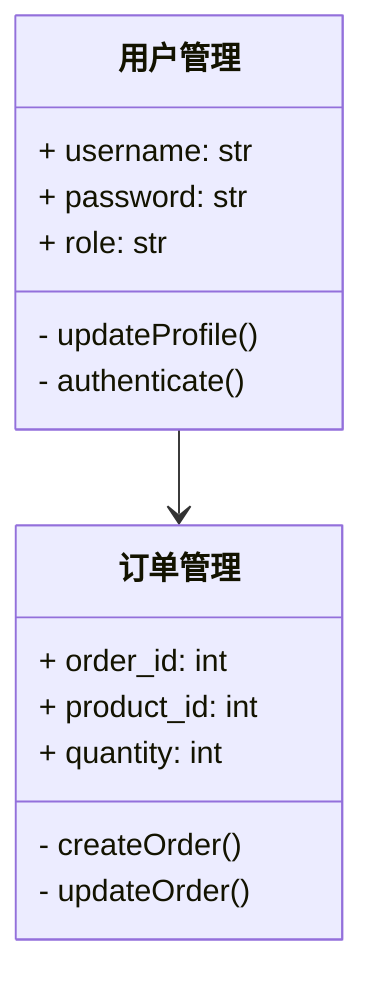
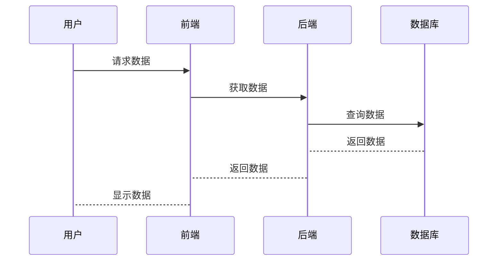

                 


# 彼得林奇的"行业整合者"在数字化浪潮中的特征

## 关键词：彼得林奇，行业整合者，数字化浪潮，特征分析，投资策略，技术应用

## 摘要：  
本文深入分析彼得林奇的“行业整合者”在数字化浪潮中的特征，探讨其在技术驱动的市场环境中的适应与创新。通过结合行业整合者的定义、核心能力、数字化能力以及实际案例，本文揭示了这些企业在数字化转型中的优势与挑战，并提供了相应的技术实现和系统设计方法，为投资策略和技术应用提供了新的视角。

---

## 第一章: 行业整合者的定义与背景

### 1.1 行业整合者的定义  
行业整合者是指在特定行业中，通过整合资源、优化流程、提升效率，从而在市场中占据领先地位的企业。这些企业通常具有强大的战略规划能力和资源整合能力，能够在复杂的市场环境中找到突破口。

### 1.2 数字化浪潮的背景  
数字化浪潮是当前全球经济和技术发展的核心趋势。随着大数据、人工智能、云计算等技术的普及，企业必须拥抱数字化转型，才能在竞争中立于不败之地。

### 1.3 行业整合者在数字化浪潮中的角色  
行业整合者在数字化浪潮中扮演着关键角色。他们不仅整合行业资源，还通过数字化技术提升企业的竞争力，推动行业的整体进步。

---

## 第二章: 行业整合者的核心能力

### 2.1 战略定位与资源整合能力  
行业整合者的核心能力包括战略定位和资源整合能力。他们能够准确识别市场机会，并通过整合上下游资源，构建竞争优势。

### 2.2 数字化能力的提升  
数字化能力是行业整合者在现代市场中的制胜法宝。通过引入数字化技术，整合者能够实现业务流程的优化，提升运营效率。

---

## 第三章: 数字化浪潮中的行业整合者特征

### 3.1 数字化能力对整合者的影响  
数字化能力对行业整合者的影响体现在多个方面，包括数据驱动的决策、智能化的运营和个性化的客户体验。

### 3.2 数字化转型中的挑战与应对  
行业整合者在数字化转型中面临技术、管理和组织等多重挑战。如何有效应对这些挑战，是整合者成功的关键。

---

## 第四章: 行业整合者在数字化浪潮中的成功案例

### 4.1 案例分析：亚马逊的整合实践  
亚马逊作为行业整合者的典范，通过数字化技术实现了全球范围内的业务整合，构建了强大的生态系统。

### 4.2 案例分析：阿里巴巴的整合实践  
阿里巴巴通过数字化技术整合了零售、金融、物流等多个领域，成为全球领先的行业整合者。

---

## 第五章: 数字化能力的算法实现

### 5.1 机器学习在行业整合中的应用  
机器学习算法可以帮助行业整合者预测市场趋势、优化资源配置，从而提升整体效率。

### 5.2 算法实现的代码示例  
```python
import pandas as pd
from sklearn.linear_model import LinearRegression

# 加载数据
data = pd.read_csv('market_data.csv')

# 训练模型
model = LinearRegression()
model.fit(data[['feature1', 'feature2']], data['target'])

# 预测结果
predictions = model.predict(new_data)
```

### 5.3 算法的数学模型  
$$ y = \beta_0 + \beta_1x_1 + \beta_2x_2 + \epsilon $$  
其中，$y$ 是目标变量，$x_1$ 和 $x_2$ 是特征变量，$\beta$ 是回归系数。

---

## 第六章: 数字化平台的系统设计

### 6.1 系统架构设计  
使用mermaid架构图展示系统的整体架构：



### 6.2 功能模块设计  
使用mermaid类图展示系统功能模块：



### 6.3 接口设计与交互流程  
使用mermaid序列图展示系统交互流程：



---

## 第七章: 项目实战与最佳实践

### 7.1 环境配置与代码实现  
#### 环境安装  
```bash
pip install numpy pandas scikit-learn
```

#### 核心代码实现  
```python
from sklearn import metrics

# 计算模型准确率
print(f"Accuracy: {metrics.accuracy_score(y_test, y_pred)}")
```

### 7.2 案例分析与解读  
通过具体案例分析，展示行业整合者在数字化转型中的实际应用和效果。

### 7.3 最佳实践与小结  
总结行业整合者在数字化浪潮中的成功经验，提出未来发展的关键策略。

---

## 第八章: 注意事项与拓展阅读

### 8.1 注意事项  
在数字化转型过程中，企业需要注意数据安全、技术选型和团队协作等问题。

### 8.2 拓展阅读  
推荐相关书籍和文章，帮助读者深入了解行业整合者和数字化转型的最新动态。

---

## 作者：AI天才研究院/AI Genius Institute & 禅与计算机程序设计艺术 /Zen And The Art of Computer Programming  

--- 

通过以上章节的详细分析与技术实现，本文全面探讨了彼得林奇的“行业整合者”在数字化浪潮中的特征，为投资者和技术从业者提供了深刻的洞察与实践指导。

