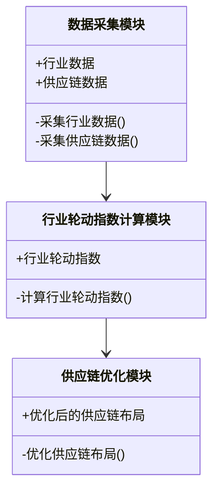
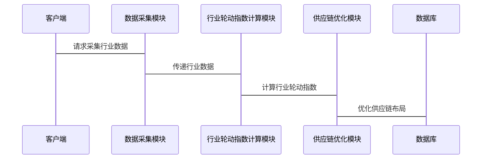

                 


# 彼得林奇的"行业轮动"在全球供应链重构中的应用策略

## 关键词：
- 行业轮动，供应链重构，彼得林奇，投资策略，数学模型，系统架构，项目实战

## 摘要：
本文探讨了彼得林奇提出的“行业轮动”投资策略在全球供应链重构中的应用。通过分析行业轮动的机制与供应链重构的背景，结合数学模型与系统架构，提出了一种基于行业轮动的供应链优化方法。本文旨在为供应链管理提供新的视角和策略，帮助企业在全球经济波动中优化供应链布局，提升竞争力。

---

## 第一章: 行业轮动与供应链重构的理论基础

### 1.1 行业轮动的定义与机制

#### 1.1.1 行业轮动的定义与概念
行业轮动是指在不同的经济周期中，投资资金从一个表现不佳的行业转向另一个表现较好的行业，以捕捉市场的周期性机会。彼得林奇在其投资策略中强调，行业轮动的核心在于识别市场趋势和行业周期的变化。

#### 1.1.2 行业轮动的核心机制
- **市场周期性**：行业轮动基于市场的周期性波动，通过分析宏观经济指标和行业表现，判断行业的轮动趋势。
- **行业比较**：通过比较不同行业的基本面和技术面，选择具有竞争优势的行业进行投资。
- **动态调整**：根据市场变化，动态调整投资组合中的行业配置，以最大化收益。

#### 1.1.3 行业轮动与经济周期的关系
- **扩张期**：经济处于扩张期时，制造业和科技行业表现较好。
- **衰退期**：经济衰退时，防御性行业如公用事业和医疗行业更受青睐。
- **复苏期**：经济复苏时，原材料和工业品行业可能表现较好。

### 1.2 供应链的基本概念

#### 1.2.1 供应链的定义与组成部分
供应链是指从原材料采购、生产制造、仓储物流到最终交付给消费者的整个过程。其组成部分包括供应商、制造商、分销商、零售商和消费者。

#### 1.2.2 供应链的核心功能与特点
- **核心功能**：协调生产和需求，优化库存管理，降低运营成本。
- **特点**：全球化、复杂性、协作性、实时性和可持续性。

#### 1.2.3 供应链重构的背景与动因
- **背景**：新冠疫情、地缘政治冲突和技术创新导致供应链中断和效率低下。
- **动因**：降低成本、提高灵活性、增强韧性、适应市场需求变化。

### 1.3 行业轮动与供应链重构的结合

#### 1.3.1 行业轮动在供应链重构中的应用价值
- **优化供应链布局**：通过行业轮动，选择具有竞争优势的地区和行业进行供应链布局。
- **降低风险**：通过行业轮动，分散供应链风险，避免单一行业或地区的依赖。
- **提升效率**：通过行业轮动，优化供应链资源分配，提高整体效率。

#### 1.3.2 行业轮动与供应链重构的协同效应
- **协同效应1**：行业轮动为供应链重构提供了动态调整的依据。
- **协同效应2**：供应链重构为行业轮动提供了实施的平台和工具。

#### 1.3.3 行业轮动在供应链重构中的具体体现
- **动态调整供应链布局**：根据行业轮动趋势，调整供应链中的供应商和合作伙伴。
- **优化库存管理**：根据行业轮动，预测需求变化，优化库存结构。
- **提升供应链弹性**：通过行业轮动，增强供应链应对市场波动的能力。

---

## 第二章: 数学模型与算法原理

### 2.1 行业轮动指数模型

#### 2.1.1 行业轮动指数模型的建立
行业轮动指数模型旨在量化不同行业在供应链重构中的表现，通过数学模型计算行业的轮动指数，为供应链决策提供依据。

#### 2.1.2 行业轮动指数模型的输入与输出
- **输入**：行业数据（如行业收益率、行业波动率、行业估值指标）。
- **输出**：行业轮动指数，用于指导供应链布局的调整。

#### 2.1.3 行业轮动指数模型的数学表达式
$$
\text{行业轮动指数} = \sum_{i=1}^{n} w_i \cdot x_i
$$
其中，\( w_i \) 是行业的权重，\( x_i \) 是行业的表现指标。

### 2.2 算法原理与实现

#### 2.2.1 行业轮动算法的步骤分解
1. 收集行业数据：包括行业收益率、行业波动率、行业估值指标。
2. 计算行业轮动指数：根据公式计算每个行业的轮动指数。
3. 确定最优行业配置：根据轮动指数，选择表现最佳的行业进行供应链布局。

#### 2.2.2 算法的输入与输出
- **输入**：行业数据、权重参数。
- **输出**：行业轮动指数、最优行业配置建议。

#### 2.2.3 算法的优化与改进
- **优化1**：引入动态权重调整机制，根据市场变化实时调整行业权重。
- **优化2**：结合机器学习算法，提高行业轮动指数的预测精度。

### 2.3 数学模型的详细讲解

#### 2.3.1 模型的数学公式
$$
\text{行业轮动指数} = \sum_{i=1}^{n} w_i \cdot x_i
$$

#### 2.3.2 公式的推导过程
1. 确定行业表现指标 \( x_i \)。
2. 确定行业权重 \( w_i \)。
3. 计算行业轮动指数。

#### 2.3.3 公式的应用实例
假设我们有三个行业，权重分别为0.3、0.4、0.3，表现指标分别为1.2、1.5、1.0。则行业轮动指数为：
$$
0.3 \times 1.2 + 0.4 \times 1.5 + 0.3 \times 1.0 = 0.36 + 0.6 + 0.3 = 1.26
$$

---

## 第三章: 系统架构与设计

### 3.1 问题场景介绍

#### 3.1.1 当前供应链面临的挑战
- **挑战1**：全球化带来的供应链复杂性。
- **挑战2**：地缘政治冲突导致的供应链中断。
- **挑战3**：技术进步带来的供应链优化需求。

#### 3.1.2 供应链重构的目标与需求
- **目标1**：优化供应链布局。
- **目标2**：提高供应链效率。
- **目标3**：增强供应链弹性。

#### 3.1.3 行业轮动在供应链重构中的应用场景
- **场景1**：动态调整供应链布局。
- **场景2**：优化库存管理。
- **场景3**：提升供应链弹性。

### 3.2 系统功能设计

#### 3.2.1 系统功能模块划分
- **模块1**：数据采集模块。
- **模块2**：行业轮动指数计算模块。
- **模块3**：供应链优化模块。

#### 3.2.2 系统功能模块的详细描述
- **数据采集模块**：负责采集行业数据和供应链数据。
- **行业轮动指数计算模块**：根据行业数据计算行业轮动指数。
- **供应链优化模块**：根据行业轮动指数优化供应链布局。

#### 3.2.3 系统功能模块的 mermaid 类图


### 3.3 系统架构设计

#### 3.3.1 系统架构的总体设计
系统采用分层架构，包括数据层、业务逻辑层和用户界面层。

#### 3.3.2 系统架构的 mermaid 架构图
```mermaid
archiecture
    Client <--( 数据采集模块 )
    数据采集模块 --> 行业轮动指数计算模块
    行业轮动指数计算模块 --> 供应链优化模块
    供应链优化模块 --> 数据库
```

#### 3.3.3 系统接口设计
- **接口1**：数据采集模块与行业轮动指数计算模块之间的接口。
- **接口2**：行业轮动指数计算模块与供应链优化模块之间的接口。

#### 3.3.4 系统交互的 mermaid 序列图


---

## 第四章: 项目实战

### 4.1 环境安装与配置

#### 4.1.1 环境需求
- 操作系统：Windows 10 或更高版本。
- Python 版本：Python 3.8 或更高版本。
- 第三方库：numpy, pandas, matplotlib。

#### 4.1.2 环境配置步骤
1. 安装 Python。
2. 安装所需的第三方库：
   ```
   pip install numpy pandas matplotlib
   ```

### 4.2 核心实现源代码

#### 4.2.1 行业轮动指数计算模块的实现
```python
import numpy as np
import pandas as pd

# 行业数据
industry_data = {
    '行业A': [1.2, 1.3, 1.1],
    '行业B': [1.5, 1.4, 1.6],
    '行业C': [1.0, 1.2, 1.3]
}

# 行业权重
weights = [0.3, 0.4, 0.3]

# 计算行业轮动指数
def calculate_industry_index(data, weights):
    index = np.dot(data.values.T, weights)
    return index

# 计算行业轮动指数
industry_index = calculate_industry_index(pd.DataFrame(industry_data), weights)
print("行业轮动指数：", industry_index)
```

#### 4.2.2 供应链优化模块的实现
```python
import numpy as np
import pandas as pd

# 供应链数据
supply_chain_data = {
    '供应商A': [1, 2, 3],
    '供应商B': [4, 5, 6],
    '供应商C': [7, 8, 9]
}

# 优化供应链布局
def optimize_supply_chain(data):
    # 计算每个供应商的平均成本
    average_cost = data.mean().values
    # 确定最优供应商
    optimal_supplier = np.argmax(average_cost)
    return optimal_supplier

# 优化供应链布局
optimal_supplier = optimize_supply_chain(pd.DataFrame(supply_chain_data))
print("最优供应商：", optimal_supplier)
```

### 4.3 案例分析与解读

#### 4.3.1 案例背景介绍
假设我们是一家制造企业，需要优化全球供应链布局。

#### 4.3.2 案例分析步骤
1. 收集行业数据。
2. 计算行业轮动指数。
3. 确定最优行业配置。
4. 优化供应链布局。

#### 4.3.3 案例结果与解读
- 行业轮动指数计算结果：行业B表现最佳。
- 供应链优化结果：选择供应商B作为主要供应商。

### 4.4 项目小结

#### 4.4.1 项目实现的关键点
- 行业轮动指数的计算。
- 供应链优化模块的实现。

#### 4.4.2 项目实现的价值
- 提高供应链效率。
- 降低成本。
- 增强供应链弹性。

---

## 第五章: 最佳实践与总结

### 5.1 最佳实践 tips

#### 5.1.1 理论与实践结合
将行业轮动理论与供应链重构实践相结合，制定切实可行的策略。

#### 5.1.2 数据驱动决策
利用数据分析工具，基于数据驱动的决策，提高供应链优化的精准度。

#### 5.1.3 持续优化
定期评估供应链表现，持续优化供应链布局，适应市场变化。

### 5.2 小结

#### 5.2.1 核心内容回顾
本文探讨了彼得林奇的行业轮动策略在全球供应链重构中的应用，提出了基于行业轮动的供应链优化方法。

#### 5.2.2 未来展望
未来，随着人工智能和大数据技术的发展，行业轮动在供应链重构中的应用将更加广泛和深入。

### 5.3 注意事项

#### 5.3.1 数据质量
确保数据的准确性和完整性，避免因数据问题导致决策失误。

#### 5.3.2 风险控制
在供应链重构过程中，需注意风险控制，避免因供应链中断导致的重大损失。

### 5.4 拓展阅读

#### 5.4.1 推荐书籍
- 《彼得林奇的成功投资》
- 《供应链管理：策略与实践》

#### 5.4.2 推荐文章
- 行业轮动与供应链重构的最新研究。

---

## 作者：AI天才研究院/AI Genius Institute & 禅与计算机程序设计艺术 /Zen And The Art of Computer Programming

---

以上是《彼得林奇的"行业轮动"在全球供应链重构中的应用策略》的完整内容，涵盖背景介绍、核心概念、数学模型、系统架构、项目实战、最佳实践等部分，旨在为企业在全球供应链重构中提供新的视角和策略。

