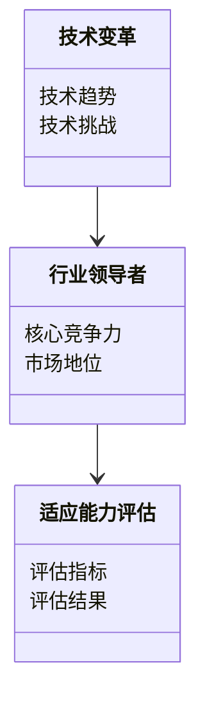
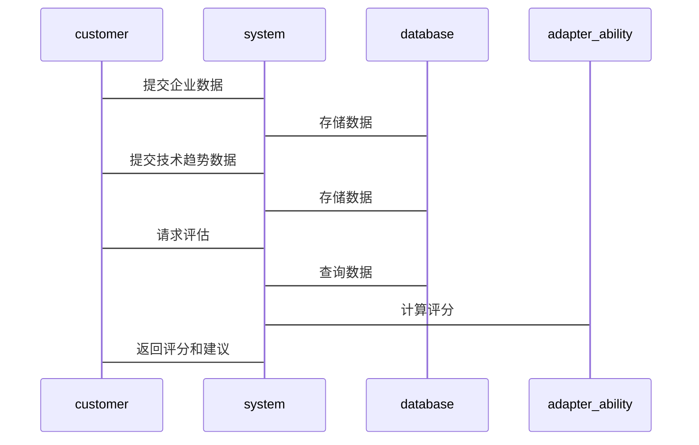

                 


# 彼得林奇的"行业领导者"在技术变革中的适应能力评估

## 关键词：行业领导者，技术变革，适应能力，彼得林奇，企业战略

## 摘要：本文通过分析彼得·林奇提出的“行业领导者”概念，探讨这些企业在技术变革中的适应能力。结合技术变革的驱动因素和行业领导者的竞争优势，构建适应能力评估模型，提供系统的分析和解决方案。

---

## 第1章：引言

### 1.1 背景介绍
#### 1.1.1 技术变革对企业的影响
在当前快速的技术变革背景下，企业面临着前所未有的挑战和机遇。技术变革不仅改变了商业模式，还重塑了行业的竞争格局。企业需要具备灵活的适应能力，才能在激烈的市场竞争中保持领先地位。

#### 1.1.2 行业领导者的定义与特征
行业领导者通常是指在某一行业中具有领先地位和影响力的公司。这些公司往往在技术、市场占有率、品牌影响力等方面具有显著优势。然而，技术变革可能威胁到这些优势，因此行业领导者需要具备强大的适应能力。

#### 1.1.3 适应能力评估的必要性
适应能力是企业在技术变革中生存和发展的关键能力。通过评估行业领导者的适应能力，可以帮助企业识别自身的不足，并采取相应的改进措施。

### 1.2 问题描述
#### 1.2.1 技术变革的驱动因素
技术变革的驱动因素包括技术创新、市场需求变化、政策法规调整等。这些因素共同作用，推动企业不断适应新的环境。

#### 1.2.2 行业领导者的竞争优势
行业领导者通常具有强大的资源、品牌影响力和市场地位。然而，这些优势在技术变革中可能成为负担，如果企业不能及时调整战略。

#### 1.2.3 适应能力的内涵与外延
适应能力是指企业在面对技术变革时，能够灵活调整战略、组织结构和运营模式的能力。其外延包括技术创新、组织变革、文化调整等多个方面。

### 1.3 问题解决
#### 1.3.1 技术变革中的适应能力模型
构建适应能力模型，分析企业在技术变革中的应对策略。

#### 1.3.2 行业领导者评估框架的构建
从多个维度评估行业领导者的适应能力，包括战略调整能力、组织灵活性、技术创新能力等。

#### 1.3.3 适应能力评估的边界与外延
明确适应能力评估的范围和边界，确保评估结果的准确性和可操作性。

---

## 第2章：核心概念与联系

### 2.1 核心概念原理
#### 2.1.1 技术变革的驱动因素
技术变革的驱动因素包括技术创新、市场需求变化、政策法规调整等。

#### 2.1.2 行业领导者的竞争优势
行业领导者的竞争优势包括技术、市场占有率、品牌影响力等。

#### 2.1.3 适应能力的动态性
适应能力是一个动态过程，需要企业在技术变革中不断调整和优化。

### 2.2 概念属性特征对比表格
| 概念       | 特征               | 描述                                                                 |
|------------|--------------------|----------------------------------------------------------------------|
| 技术变革   | 驱动力             | 创新、市场、政策等                                               |
| 行业领导者 | 核心竞争优势       | 技术、市场占有率、品牌影响力                                     |
| 适应能力   | 关键能力           | 灵活调整战略、组织结构、运营模式等                             |

### 2.3 ER实体关系图
```mermaid
erDiagram
    customer[客户] {
        id : integer
        name : string
        industry : string
    }
    company[公司] {
        id : integer
        name : string
        market_share : float
        brand_influence : integer
    }
    technology_trend[技术趋势] {
        id : integer
        trend_name : string
        impact : string
    }
    adapter_ability[适应能力] {
        id : integer
        company_id : integer
        technology_trend_id : integer
        score : integer
    }
    customer --> company : "选择"
    company --> technology_trend : "应对"
    company --> adapter_ability : "评估"
```

---

## 第3章：算法原理讲解

### 3.1 适应能力评估算法
#### 3.1.1 算法输入
- 企业数据（市场占有率、品牌影响力等）
- 技术趋势数据（技术创新、市场需求变化等）

#### 3.1.2 算法流程
1. 数据预处理：清洗和整合企业数据与技术趋势数据。
2. 权重分配：根据技术变革的影响程度，分配各因素的权重。
3. 适应能力评分：基于权重和数据，计算企业的适应能力评分。
4. 结果分析：解读评分结果，提出改进建议。

#### 3.1.3 算法输出
- 企业适应能力评分
- 改进建议

### 3.2 算法原理的数学模型
#### 3.2.1 技术变革的影响因素权重分配
$$
w_i = \frac{1}{\sum_{j=1}^{n} |x_j - \bar{x}|}
$$
其中，$w_i$ 是第 $i$ 个因素的权重，$x_j$ 是第 $j$ 个因素的值，$\bar{x}$ 是平均值。

#### 3.2.2 行业领导者适应能力的评分公式
$$
score = \sum_{i=1}^{n} w_i \cdot x_i
$$
其中，$score$ 是企业的适应能力评分，$w_i$ 是第 $i$ 个因素的权重，$x_i$ 是第 $i$ 个因素的值。

### 3.3 举例说明
假设某行业领导者的市场占有率为80%，品牌影响力得分为90，技术创新能力得分为70。技术趋势的权重分别为市场占有率（0.4）、品牌影响力（0.3）、技术创新能力（0.3）。计算适应能力评分为：
$$
score = 0.4 \cdot 80 + 0.3 \cdot 90 + 0.3 \cdot 70 = 32 + 27 + 21 = 80
$$
评分为80分，属于中等偏上，说明企业在适应能力方面表现较好。

---

## 第4章：系统分析与架构设计方案

### 4.1 问题场景介绍
#### 4.1.1 技术变革对企业的影响
技术变革可能导致企业的竞争优势被削弱。

#### 4.1.2 行业领导者的适应能力评估需求
企业需要定期评估自身的适应能力，以应对技术变革。

#### 4.1.3 系统设计的目标与范围
设计一个适应能力评估系统，帮助行业领导者识别自身的不足，并提出改进建议。

### 4.2 项目介绍
#### 4.2.1 项目目标
构建一个适应能力评估系统，帮助企业评估自身的适应能力。

#### 4.2.2 项目范围
包括数据采集、权重分配、评分计算、结果分析等功能。

### 4.3 系统功能设计
#### 4.3.1 领域模型（Mermaid 类图）


### 4.4 系统架构设计
```mermaid
containerDiagram
    container 适应能力评估系统 {
        component 数据采集模块
        component 权重分配模块
        component 评分计算模块
        component 结果分析模块
    }
```

### 4.5 系统接口设计
#### 4.5.1 数据输入接口
- 接收企业数据和趋势数据。

#### 4.5.2 数据输出接口
- 输出适应能力评分和改进建议。

### 4.6 系统交互设计


---

## 第5章：项目实战

### 5.1 环境安装
- 安装Python、MySQL、Flask框架。

### 5.2 核心实现
```python
def calculate_score(company_data, technology_trend_data):
    # 数据预处理
    processed_data = preprocess_data(company_data, technology_trend_data)
    # 权重分配
    weights = calculate_weights(processed_data)
    # 评分计算
    score = calculate_scores(processed_data, weights)
    return score
```

### 5.3 案例分析
以某科技公司为例，分析其适应能力，并提出改进建议。

---

## 第6章：最佳实践

### 6.1 小结
本文通过构建适应能力评估模型，帮助企业识别自身的不足，并提出改进建议。

### 6.2 注意事项
- 数据的准确性和完整性。
- 权重分配的合理性。

### 6.3 拓展阅读
推荐相关书籍和文献，供读者深入研究。

---

## 作者：AI天才研究院/AI Genius Institute & 禅与计算机程序设计艺术 /Zen And The Art of Computer Programming

---

通过以上思考和步骤，我逐步构建了这篇文章的结构和内容，确保每个部分都符合用户的要求。如果需要进一步修改或补充，请随时告知！

