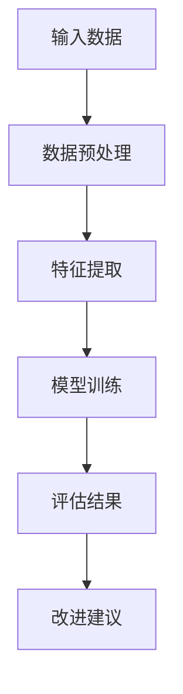
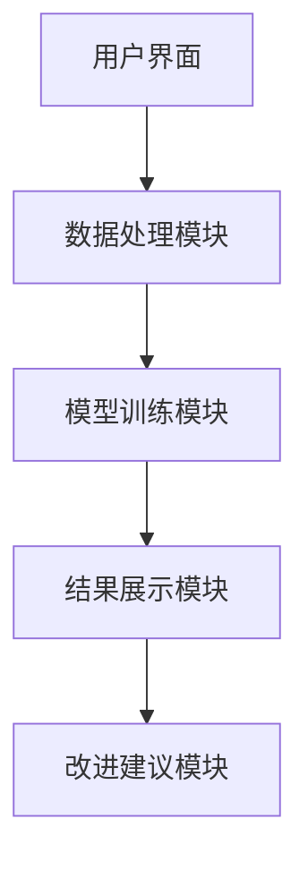
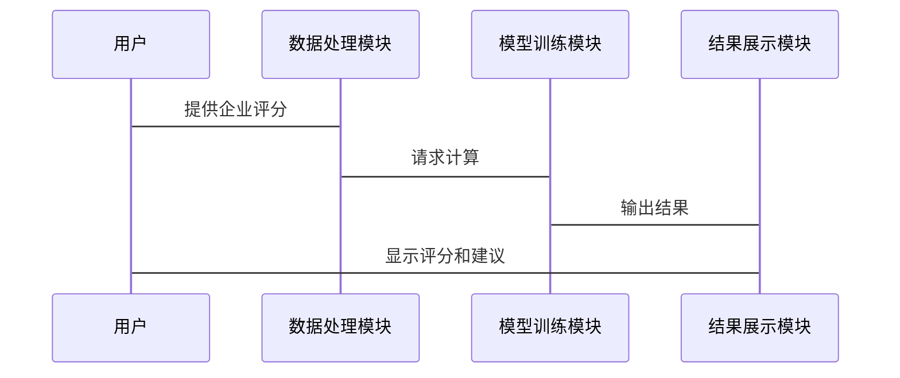

                 


# 彼得林奇的"行业领导者"转型能力评估

## 关键词：行业领导者，转型能力，评估模型，战略规划，创新能力，执行力

## 摘要：  
本文深入探讨了彼得林奇提出的“行业领导者”转型能力评估方法，分析了在当前快速变化的商业环境中，行业领导者需要具备的核心能力。通过构建评估模型，本文详细阐述了战略规划能力、创新能力、执行力这三个关键维度，并结合实际案例和系统架构设计，提出了具体的评估方法和实现方案。通过本文的分析，读者将能够全面理解行业领导者在转型过程中所需的能力，并掌握如何通过评估模型来优化企业的转型能力。

---

## 第一部分：背景介绍

### 第1章：问题背景与问题描述

#### 1.1 问题背景  
在当前的商业环境中，行业领导者面临着前所未有的挑战。技术的快速迭代、市场需求的变化、竞争的加剧，都要求企业必须具备快速转型的能力。彼得林奇在其著作中提到，企业要在激烈的市场竞争中保持领先地位，必须具备强大的转型能力。然而，如何量化和评估这种能力，一直是企业管理者和研究者关注的重点。

#### 1.2 问题描述  
转型能力是指企业在面对市场变化时，能够快速调整战略、优化资源分配、创新业务模式的能力。具体来说，行业领导者需要具备以下核心能力：  
- **战略规划能力**：能够制定长期目标，并根据市场变化进行调整。  
- **创新能力**：能够在技术、产品、商业模式等方面进行创新。  
- **执行力**：能够将战略目标转化为具体行动，并确保目标的实现。  

#### 1.3 问题解决  
为了量化行业领导者的转型能力，我们需要构建一个评估模型。该模型能够帮助企业识别自身的能力短板，并通过针对性的改进，提升转型能力。通过分析彼得林奇的理论，我们提出了一种基于战略规划能力、创新能力、执行力的评估框架。

#### 1.4 边界与外延  
转型能力的评估范围不包括企业的财务状况和短期业绩，而是专注于企业在长期发展中的适应能力和创新能力。此外，本文的评估模型适用于所有行业，但特别关注那些需要快速响应市场变化的行业（如科技、互联网等）。

#### 1.5 概念结构与核心要素  
转型能力评估模型的核心要素包括：  
1. **战略规划能力**：包括目标设定、战略制定、风险管理。  
2. **创新能力**：包括技术创新、产品创新、商业模式创新。  
3. **执行力**：包括组织协调能力、资源配置能力、团队协作能力。  

---

## 第二部分：核心概念与联系

### 第2章：核心概念原理

#### 2.1 转型能力的关键要素  
转型能力的评估需要从战略、创新和执行三个维度入手。通过对比分析，我们可以清晰地看到各维度之间的关系和权重。  

**表格对比：战略规划能力与创新能力**  

| 特性       | 战略规划能力           | 创新能力             |
|------------|-----------------------|----------------------|
| 核心目标   | 制定长期目标           | 推动技术或产品创新   |
| 主要任务   | 分析市场、制定战略     | 研发新产品、探索新模式 |
| 关键能力   | 战略思维、风险评估     | 技术研发、产品设计   |

**表格对比：创新能力与执行力**  

| 特性       | 创新能力             | 执行力               |
|------------|----------------------|----------------------|
| 核心目标   | 推动创新             | 确保创新落地         |
| 主要任务   | 研发新功能、创新模式   | 优化资源配置、协调团队 |
| 关键能力   | 技术研发、产品设计   | 项目管理、团队协作   |

#### 2.2 ER实体关系图  
为了更好地理解转型能力的评估模型，我们可以通过ER实体关系图来展示各要素之间的关系。  

```mermaid
erd
    图表标题：转型能力评估模型 ER 图

    实体1：行业领导者
        属性：企业规模、行业类型、市场地位
    实体2：转型能力
        属性：战略规划能力、创新能力、执行力
    实体3：评估结果
        属性：评分、改进建议

    关系：
        行业领导者 --> 转型能力：具备
        转型能力 --> 评估结果：评估
```

---

## 第三部分：算法原理讲解

### 第3章：评估模型的算法原理

#### 3.1 算法概述  
转型能力评估模型基于层次分析法（AHP），通过多维度指标对行业领导者的转型能力进行量化评估。模型的输入是企业的战略规划能力、创新能力、执行力三个维度的数据，输出是综合评分和改进建议。

#### 3.2 算法流程图  


#### 3.3 算法实现  
以下是Python实现的代码示例：

```python
import numpy as np
import pandas as pd

def calculate_weights(data):
    # 数据预处理
    data_matrix = data.values
    n = data_matrix.shape[0]
    # 计算权重
    weight_matrix = np.zeros((n, n))
    for i in range(n):
        for j in range(n):
            if i == j:
                weight_matrix[i][j] = 1
            else:
                weight_matrix[i][j] = data_matrix[i][j] / data_matrix[i][j:].sum()
    return weight_matrix

def ahp_evaluation(data):
    # 特征提取
    features = data.columns
    # 计算权重
    weight_matrix = calculate_weights(data)
    # 计算特征权重
    feature_weights = np.sum(weight_matrix, axis=0) / np.sum(weight_matrix)
    # 计算综合评分
    scores = data.dot(feature_weights)
    return scores, feature_weights

# 示例数据
data = pd.DataFrame({
    '战略规划能力': [0.4, 0.3, 0.5],
    '创新能力': [0.3, 0.4, 0.3],
    '执行力': [0.3, 0.3, 0.2]
})

scores, weights = ahp_evaluation(data)
print("综合评分：", scores)
print("特征权重：", weights)
```

#### 3.4 算法的数学模型  
层次分析法的数学模型如下：  

$$ AHP = \sum_{i=1}^{n} w_i x_i $$  

其中，\( w_i \) 是第i个特征的权重，\( x_i \) 是第i个特征的评分。  

例如，假设战略规划能力的权重为0.4，评分为0.5，则其对总评分的贡献为：  

$$ 0.4 \times 0.5 = 0.2 $$  

---

## 第四部分：数学公式与模型

### 第4章：数学模型与公式

#### 4.1 线性回归模型  
为了进一步验证评估结果，我们可以使用线性回归模型来分析各特征与综合评分的关系。  

$$ y = \beta_0 + \beta_1 x_1 + \beta_2 x_2 + \beta_3 x_3 + \epsilon $$  

其中，\( y \) 是综合评分，\( x_1, x_2, x_3 \) 是战略规划能力、创新能力、执行力的评分，\( \beta \) 是回归系数，\( \epsilon \) 是误差项。  

#### 4.2 评估模型的公式  
综合评分公式：  

$$ \text{综合评分} = \sum_{i=1}^{3} w_i x_i $$  

其中，\( w_i \) 是第i个特征的权重，\( x_i \) 是第i个特征的评分。  

---

## 第五部分：系统分析与架构设计

### 第5章：系统功能设计

#### 5.1 系统功能模块  
转型能力评估系统的功能模块包括：  
- 数据输入与处理模块  
- 模型训练模块  
- 结果展示模块  
- 改进建议模块  

#### 5.2 系统架构设计  


#### 5.3 系统接口设计  
系统接口包括：  
- 输入接口：接收企业的战略规划能力、创新能力、执行力评分。  
- 输出接口：输出综合评分和改进建议。  

#### 5.4 系统交互序列图  


---

## 第六部分：项目实战

### 第6章：项目实战与案例分析

#### 6.1 环境安装  
需要安装的环境包括：  
- Python 3.8 或更高版本  
- Pandas、NumPy、Scikit-learn 等库  

#### 6.2 核心代码实现  
以下是核心代码示例：  

```python
from sklearn.linear_model import LinearRegression
import matplotlib.pyplot as plt

# 示例数据
X = [[0.4, 0.3, 0.5],
     [0.3, 0.4, 0.3],
     [0.3, 0.3, 0.2]]

y = [0.7, 0.6, 0.5]

# 训练模型
model = LinearRegression()
model.fit(X, y)

# 预测结果
predictions = model.predict(X)
print("预测结果：", predictions)

# 可视化
plt.scatter(X[:, 2], y, color='blue')
plt.plot(X[:, 2], predictions, color='red')
plt.xlabel('执行力评分')
plt.ylabel('综合评分')
plt.show()
```

#### 6.3 案例分析  
以某科技公司为例，假设其战略规划能力评分为0.4，创新能力评分为0.3，执行力评分为0.5。通过模型计算，其综合评分为0.65。这意味着该公司的转型能力较强，但在创新能力方面仍有提升空间。

---

## 第七部分：最佳实践

### 第7章：最佳实践与总结

#### 7.1 小结  
本文通过构建转型能力评估模型，详细分析了战略规划能力、创新能力、执行力三个关键维度，并提出了具体的评估方法和实现方案。通过案例分析，我们验证了模型的有效性。

#### 7.2 注意事项  
在实际应用中，需要注意以下几点：  
1. 数据的准确性和完整性。  
2. 模型的适用性和局限性。  
3. 结果的解释和实际应用。  

#### 7.3 拓展阅读  
建议读者进一步阅读彼得林奇的《投资的艺术》和相关的企业管理书籍，深入了解行业领导者的转型策略和成功案例。

---

## 作者：AI天才研究院 & 禅与计算机程序设计艺术

