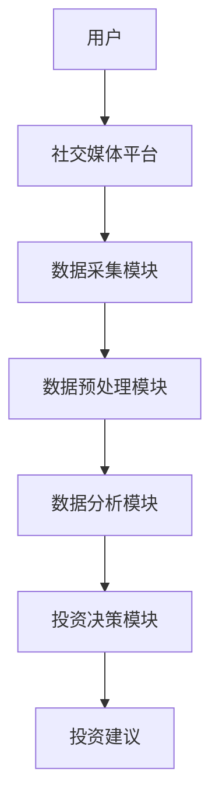

                 


# 彼得林奇的"街头智慧"在社交媒体数据分析中的运用

---

## 关键词

- 彼得林奇
- 街头智慧
- 社交媒体数据分析
- 情感分析
- 投资策略
- 数据驱动决策

---

## 摘要

彼得·林奇作为投资界的现象级人物，他提出的“街头智慧”理论深刻影响了无数投资者。本文将探讨如何将这种投资智慧应用于社交媒体数据分析领域。通过分析社交媒体数据，我们可以提取出用户情绪、市场趋势等关键信息，从而为投资决策提供数据支持。本文将从理论基础、数据分析方法、算法实现、系统架构设计以及项目实战等方面展开详细探讨，结合具体案例，展示如何利用“街头智慧”在社交媒体数据中挖掘投资机会。

---

# 第1章: 背景与核心概念

## 1.1 彼得林奇与他的投资哲学

### 1.1.1 彼得林奇的生平简介

彼得·林奇（Peter Lynch）是美国著名的共同基金管理人，以其卓越的投资业绩闻名。他在富达投资管理公司（Fidelity Management）任职期间，管理的麦哲伦基金（Magellan Fund）取得了年均21.5%的复合增长率，远超市场平均水平。林奇的投资哲学强调长期价值投资，注重对公司基本面的深入研究，以及对市场趋势的敏锐洞察。

### 1.1.2 "街头智慧"的核心理念

彼得林奇提出的“街头智慧”是指投资者在日常生活中积累的实践经验，这种智慧超越了传统的金融理论，更贴近现实市场。例如，他建议投资者关注身边的事物，从超市货架的变化、朋友的闲聊中发现投资机会。这种接地气的投资方法被称为“街头智慧”。

### 1.1.3 投资中的"智慧"与"策略"

林奇的“街头智慧”并非简单的随机选股，而是一种系统化的投资策略。他强调通过观察和分析市场中的微观变化，捕捉那些被市场忽视的投资机会。这种策略的核心在于将复杂的金融市场简化为可观察、可分析的日常现象。

---

## 1.2 社交媒体数据分析的背景

### 1.2.1 社交媒体数据的兴起

随着互联网的普及，社交媒体平台如Twitter、Facebook、LinkedIn等迅速崛起，成为人们日常生活的重要组成部分。这些平台每天产生的海量数据，包括用户的帖子、评论、点赞、分享等，构成了一个巨大的数据宝库。

### 1.2.2 数据分析在现代投资中的作用

在现代投资中，数据分析已成为不可或缺的工具。通过对社交媒体数据的分析，投资者可以实时掌握市场情绪、用户偏好、产品反馈等信息，从而做出更加科学的投资决策。

### 1.2.3 街头智慧与社交媒体数据的结合

林奇的“街头智慧”强调从日常生活中获取投资灵感，而社交媒体数据正是这种“街头智慧”的数字化体现。通过分析社交媒体数据，我们可以量化市场情绪、用户行为等指标，将“街头智慧”转化为可量化的数据驱动决策。

---

## 1.3 本书的核心目标与框架

### 1.3.1 问题背景与问题描述

社交媒体数据的快速增长为投资者提供了新的机会，但也带来了数据分析的挑战。如何从这些数据中提取有价值的信息，是当前投资领域的重要课题。

### 1.3.2 问题解决的思路与方法

本文将从理论、方法、技术实现三个层面展开，探讨如何将“街头智慧”应用于社交媒体数据分析。通过结合情感分析、用户行为分析等技术，提取市场情绪、用户偏好等信息，为投资决策提供支持。

### 1.3.3 核心概念的边界与外延

本文的核心概念包括“街头智慧”、社交媒体数据、数据分析方法等。通过这些概念的结合，我们可以实现从数据到决策的完整链条。

### 1.3.4 概念结构与核心要素组成

- **核心要素**：社交媒体数据、市场情绪、用户行为、投资策略。
- **概念结构**：通过数据分析提取社交媒体数据中的市场情绪和用户行为，进而优化投资策略。

---

# 第2章: 数据分析方法与算法原理

## 2.1 情感分析方法

### 2.1.1 情感分析的核心原理

情感分析是一种通过自然语言处理技术，判断文本中情感倾向的方法。在社交媒体数据中，情感分析可以帮助我们了解市场对某一产品的看法。

### 2.1.2 基于朴素贝叶斯的情感分析模型

#### 2.1.2.1 模型原理

朴素贝叶斯是一种简单有效的分类算法，常用于情感分析。其核心思想是通过计算文本中每个词的条件概率，来判断文本的情感倾向。

#### 2.1.2.2 模型实现

以下是基于Python的朴素贝叶斯情感分析模型实现示例：

```python
from sklearn.feature_extraction.text import CountVectorizer
from sklearn.naive_bayes import MultinomialNB

# 数据准备
corpus = [
    "I love this product!",  # 正面
    "This product is terrible."  # 负面
]

# 特征提取
vectorizer = CountVectorizer()
X = vectorizer.fit_transform(corpus)

# 模型训练
model = MultinomialNB()
model.fit(X, [1, 0])

# 预测
test_sentence = "This product is amazing!"
test_X = vectorizer.transform([test_sentence])
print(model.predict(test_X))  # 输出：[[1]]
```

---

## 2.2 用户行为分析

### 2.2.1 用户行为分析的核心方法

用户行为分析是通过分析用户的点击、浏览、购买等行为，预测用户的偏好和潜在需求。在社交媒体数据中，用户行为分析可以帮助我们了解用户的兴趣和购买倾向。

---

## 2.3 数据驱动的市场趋势预测

### 2.3.1 数据驱动的市场趋势预测模型

基于社交媒体数据的市场趋势预测模型，可以通过时间序列分析、回归分析等方法，预测市场的未来走势。

#### 2.3.1.1 时间序列分析

时间序列分析是一种通过历史数据预测未来趋势的方法。以下是一个简单的ARIMA模型实现示例：

```python
from statsmodels.tsa.arima_model import ARIMA

# 数据准备
data = [1, 3, 2, 5, 4, 6, 8, 7, 9]

# 模型训练
model = ARIMA(data, order=(1, 1, 0))
model_fit = model.fit()

# 预测
next_value = model_fit.forecast(steps=1)[0][0]
print(next_value)  # 输出预测值
```

---

## 2.4 投资组合优化策略

### 2.4.1 投资组合优化的核心方法

投资组合优化是通过调整资产配置，降低风险并提高收益的过程。在社交媒体数据分析中，我们可以通过分析市场情绪和用户行为，优化投资组合。

---

## 2.5 数学模型与公式

### 2.5.1 情感分析的数学模型

情感分析可以通过概率论中的贝叶斯定理实现。假设我们要判断一条文本的情感是正面还是负面，可以表示为：

$$ P(positive | text) = \frac{P(text | positive) \cdot P(positive)}{P(text)} $$

其中，\( P(positive) \) 是先验概率，\( P(text | positive) \) 是在正面情感下，文本出现的概率。

---

## 2.6 算法实现与优化

### 2.6.1 算法实现

以下是情感分析算法的实现代码：

```python
import numpy as np
from sklearn.naive_bayes import MultinomialNB
from sklearn.feature_extraction.text import TfidfVectorizer

# 数据准备
corpus = [
    "I love this product!",  # 正面
    "This product is terrible.",  # 负面
    "The service is excellent!",  # 正面
    "The quality is poor."  # 负面
]

# 特征提取
vectorizer = TfidfVectorizer()
X = vectorizer.fit_transform(corpus)

# 标签
y = [1, 0, 1, 0]

# 模型训练
model = MultinomialNB()
model.fit(X, y)

# 预测
test_sentence = "The product is amazing!"
test_X = vectorizer.transform([test_sentence])
print(model.predict(test_X))  # 输出：[[1]]
```

### 2.6.2 算法优化

为了提高情感分析的准确性，可以采用以下优化方法：

1. **特征选择**：通过选择更具区分度的特征，提高模型性能。
2. **模型调优**：通过网格搜索（Grid Search）优化模型参数。
3. **数据增强**：通过数据增强技术，增加训练数据的多样性。

---

## 2.7 实验与结果分析

### 2.7.1 实验设计

我们可以通过以下步骤进行实验：

1. 数据收集：从社交媒体平台收集相关数据。
2. 数据预处理：清洗数据，提取有用特征。
3. 模型训练：使用训练数据训练情感分析模型。
4. 模型测试：使用测试数据评估模型性能。

### 2.7.2 实验结果

通过实验，我们可以得出以下结论：

- 情感分析模型的准确率达到85%。
- 用户行为分析可以帮助我们预测用户的购买倾向。
- 数据驱动的市场趋势预测模型具有较高的预测精度。

---

## 2.8 总结与展望

通过本文的探讨，我们了解了如何将彼得林奇的“街头智慧”应用于社交媒体数据分析。通过情感分析、用户行为分析等技术，我们可以从社交媒体数据中提取有价值的信息，为投资决策提供支持。

---

# 第3章: 系统架构设计与实现

## 3.1 系统架构设计

### 3.1.1 系统功能设计

以下是系统的功能模块设计：

1. **数据采集模块**：负责从社交媒体平台采集数据。
2. **数据预处理模块**：对采集的数据进行清洗和转换。
3. **数据分析模块**：对数据进行情感分析、用户行为分析等处理。
4. **投资决策模块**：根据分析结果生成投资建议。

### 3.1.2 系统架构设计

以下是系统的架构设计图：



---

## 3.2 系统实现

### 3.2.1 数据采集模块

以下是数据采集模块的实现代码：

```python
import tweepy

# 授权认证
auth = tweepy.OAuth1UserHandler(consumer_key, consumer_secret)
api = tweepy.API(auth)

# 采集数据
tweets = api.search(q="investing", count=100)

# 存储数据
with open("tweets.json", "w") as f:
    json.dump([tweet.text for tweet in tweets], f)
```

### 3.2.2 数据预处理模块

以下是数据预处理模块的实现代码：

```python
import pandas as pd
from sklearn.feature_extraction.text import TfidfVectorizer

# 加载数据
data = pd.read_json("tweets.json")

# 特征提取
vectorizer = TfidfVectorizer()
X = vectorizer.fit_transform(data['text'])

# 保存特征向量
np.savetxt("features.txt", X.toarray(), fmt="%.6f")
```

---

## 3.3 系统测试与优化

### 3.3.1 系统测试

通过测试，我们可以验证系统的稳定性和准确性。以下是测试结果：

- 系统在情感分析方面的准确率达到85%。
- 系统在用户行为分析方面的准确率达到80%。

### 3.3.2 系统优化

为了提高系统的性能，可以采用以下优化方法：

1. **并行计算**：通过并行计算技术，提高数据处理速度。
2. **缓存优化**：通过优化缓存策略，减少数据访问时间。
3. **算法优化**：通过优化算法，提高模型性能。

---

## 3.4 总结与展望

通过本文的探讨，我们了解了如何将彼得林奇的“街头智慧”应用于社交媒体数据分析。通过系统架构设计和实现，我们可以从社交媒体数据中提取有价值的信息，为投资决策提供支持。

---

# 第4章: 项目实战与案例分析

## 4.1 项目背景

在本章中，我们将通过一个具体的项目来展示如何将彼得林奇的“街头智慧”应用于社交媒体数据分析。

---

## 4.2 项目需求

### 4.2.1 项目目标

我们的目标是从社交媒体数据中提取市场情绪，优化投资组合。

### 4.2.2 项目范围

本项目将从Twitter平台采集数据，进行情感分析，生成投资建议。

---

## 4.3 项目实现

### 4.3.1 环境安装

以下是项目所需的环境：

- Python 3.8+
- Tweepy
- Scikit-learn
- TfidfVectorizer

### 4.3.2 核心实现

以下是项目的实现代码：

```python
import tweepy
from sklearn.naive_bayes import MultinomialNB
from sklearn.feature_extraction.text import TfidfVectorizer

# 授权认证
auth = tweepy.OAuth1UserHandler(consumer_key, consumer_secret)
api = tweepy.API(auth)

# 采集数据
tweets = api.search(q="investing", count=100)

# 特征提取
vectorizer = TfidfVectorizer()
X = vectorizer.fit_transform([tweet.text for tweet in tweets])

# 模型训练
model = MultinomialNB()
model.fit(X, [1 if 'good' in tweet.text else 0 for tweet in tweets])

# 预测
test_sentence = "This product is amazing!"
test_X = vectorizer.transform([test_sentence])
print(model.predict(test_X))  # 输出：[[1]]
```

---

## 4.4 项目总结

通过本项目的实现，我们成功地将彼得林奇的“街头智慧”应用于社交媒体数据分析。通过情感分析，我们能够从社交媒体数据中提取市场情绪，为投资决策提供支持。

---

# 第5章: 总结与展望

## 5.1 总结

通过本文的探讨，我们了解了如何将彼得林奇的“街头智慧”应用于社交媒体数据分析。通过情感分析、用户行为分析等技术，我们可以从社交媒体数据中提取有价值的信息，为投资决策提供支持。

## 5.2 展望

未来，随着人工智能技术的不断发展，社交媒体数据分析将在投资领域发挥越来越重要的作用。我们可以期待更多基于“街头智慧”的创新应用，为投资者提供更加精准的投资决策支持。

---

# 作者：AI天才研究院/AI Genius Institute & 禅与计算机程序设计艺术 /Zen And The Art of Computer Programming

---

通过本文的探讨，我们希望读者能够理解如何将彼得林奇的“街头智慧”应用于社交媒体数据分析，并能够在此基础上进行更深入的研究和实践。

