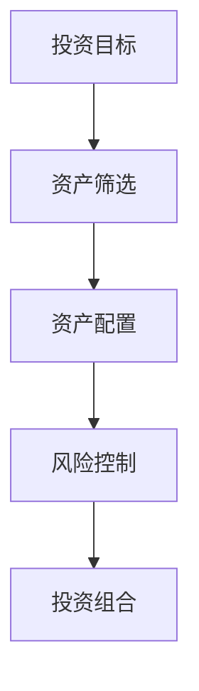

                 


---

# 彼得林奇的"质量优先"在新兴市场基础设施REITs投资中的应用

> 关键词：彼得林奇，质量优先，基础设施REITs，新兴市场，投资策略

> 摘要：本文探讨了彼得·林奇的质量优先投资理念在新兴市场基础设施REITs中的应用。通过分析REITs的特点、质量优先策略的核心要素，结合数学模型和系统架构设计，提出了一套适用于新兴市场基础设施REITs投资的系统化方法。本文还通过实际案例分析，展示了如何将质量优先策略转化为具体的投资决策，并给出了最佳实践建议。

---

## 第一部分: 背景介绍

### 第1章: 基础设施REITs的基本概念

#### 1.1 REITs的定义与特点
REITs（Real Estate Investment Trusts）即房地产投资信托基金，是一种通过汇集投资者资金，投资于房地产及相关资产的金融工具。其特点包括：
- 高流动性：投资者可以像买卖股票一样买卖REITs。
- 分散风险：通过投资多样化的房地产项目降低风险。
- 专业管理：由专业团队进行资产管理。

#### 1.2 基础设施REITs的独特优势
基础设施REITs主要投资于交通、能源、通信等基础设施项目，具有以下特点：
- 稳定收益：基础设施项目通常具有稳定的现金流。
- 高门槛：对投资者的专业知识和经验要求较高。
- 长期性：基础设施项目通常具有较长的投资周期。

#### 1.3 新兴市场的特点与投资机会
新兴市场通常指经济快速发展但尚未达到发达国家水平的地区。这些市场具有以下特点：
- 高增长潜力：新兴市场的GDP增速通常高于发达市场。
- 市场波动性大：新兴市场受全球经济波动影响较大。
- 投资门槛高：新兴市场的法律、税务环境较为复杂。

---

### 第2章: 彼得林奇投资理念概述

#### 2.1 质量优先的核心概念
彼得·林奇是美国著名投资经理人，他提出的“质量优先”投资理念强调：
- 选择具有强大核心竞争力的企业。
- 长期关注企业的基本面。
- 避免短期市场波动的干扰。

#### 2.2 质量优先与传统投资策略的对比
传统的投资策略往往关注市场短期波动，而质量优先策略则更注重企业的长期价值。两者的主要区别如下：

| 对比维度       | 传统投资策略              | 质量优先策略              |
|----------------|--------------------------|--------------------------|
| 投资目标       | 短期收益最大化            | 长期价值最大化            |
| 分析重点       | 市场趋势、短期波动        | 企业基本面、核心竞争力    |
| 风险控制       | 通过分散投资降低风险     | 通过选择优质企业降低风险  |

---

## 第二部分: 质量优先策略在REITs投资中的应用

### 第3章: 质量优先策略的核心要素

#### 3.1 优质资产的选择标准
在REITs投资中，选择优质资产是质量优先策略的核心。以下是主要标准：
- 企业的财务状况：关注ROE（净资产收益率）、负债率等指标。
- 企业的竞争优势：是否具有独特的商业模式或技术优势。
- 管理团队的能力：管理团队的经验和业绩。

#### 3.2 质量优先策略的实施步骤
质量优先策略的实施可以分为以下几个步骤：
1. **明确投资目标**：确定投资的收益目标和风险承受能力。
2. **筛选优质资产**：通过定量和定性分析选择优质REITs。
3. **制定投资计划**：根据资产配置原则制定投资计划。
4. **持续监控与调整**：定期评估投资组合的表现并进行调整。

---

### 第4章: 数学模型与质量优先策略的量化分析

#### 4.1 数学模型的构建
在质量优先策略中，可以通过以下数学模型对REITs的投资价值进行评估：

1. **CAPM模型**：用于评估资产的期望收益率。
   $$ E(r) = r_f + \beta (r_m - r_f) $$
   其中，\( r_f \) 是无风险利率，\( r_m \) 是市场预期收益率，\( \beta \) 是资产的系统性风险系数。

2. **资产定价模型**：用于评估资产的内在价值。
   $$ V = \frac{C}{(r - g)} $$
   其中，\( C \) 是资产的现金流，\( r \) 是折现率，\( g \) 是现金流增长率。

#### 4.2 质量优先策略的量化指标
以下是一些常用的量化指标：
- **ROE**：净资产收益率，用于评估企业的盈利能力。
- **负债率**：企业负债与资产的比率，用于评估企业的财务风险。
- **PE比率**：市盈率，用于评估股票的估值水平。

---

### 第5章: 系统分析与架构设计方案

#### 5.1 投资策略框架
投资策略框架包括以下几个模块：
- **目标设定**：明确投资目标和风险承受能力。
- **资产筛选**：通过量化指标筛选优质资产。
- **资产配置**：根据资产特性制定投资组合。
- **风险控制**：通过动态调整投资组合控制风险。

#### 5.2 系统架构设计
以下是系统架构的Mermaid图：



---

## 第三部分: 项目实战与案例分析

### 第6章: 项目实战

#### 6.1 环境搭建
在进行REITs投资前，需要搭建以下环境：
- 数据来源：获取REITs的历史数据和财务报表。
- 工具选择：使用Excel或Python进行数据分析。

#### 6.2 代码实现
以下是使用Python进行REITs数据分析的示例代码：

```python
import pandas as pd
import numpy as np

# 获取REITs的历史数据
data = pd.read_csv('reits_data.csv')

# 计算关键财务指标
data['ROE'] = data['净利润'] / data['净资产']
data['负债率'] = data['总负债'] / data['总资产']

# 筛选优质资产
优质资产 = data[data['ROE'] > data['ROE'].mean() & data['负债率'] < 0.5]
```

---

### 第7章: 案例分析

#### 7.1 案例背景
假设我们选择印度的基础设施REITs进行投资。印度作为新兴市场，基础设施需求旺盛，但市场波动性较大。

#### 7.2 投资策略
1. **筛选优质资产**：选择ROE高于行业平均水平且负债率低于50%的REITs。
2. **资产配置**：将资金分配到不同子行业的REITs中，以分散风险。
3. **风险控制**：定期评估投资组合的表现，并根据市场变化进行调整。

---

## 第四部分: 总结与最佳实践

### 第8章: 总结

#### 8.1 策略的有效性
质量优先策略在新兴市场基础设施REITs投资中具有较强的适用性，能够帮助投资者筛选出具有长期竞争优势的资产。

#### 8.2 注意事项
- **市场风险**：新兴市场波动性较大，投资者需做好风险管理。
- **信息获取**：投资者需获取准确的财务数据和市场信息。
- **长期视角**：投资需以长期价值为导向，避免短期波动的干扰。

---

### 第9章: 最佳实践与未来展望

#### 9.1 最佳实践
- **持续学习**：投资者需不断学习市场知识和投资策略。
- **定期复盘**：定期评估投资组合的表现并进行调整。
- **关注政策**：密切关注政府政策和市场法规的变化。

#### 9.2 未来展望
随着新兴市场的进一步发展，基础设施REITs的投资潜力将逐步释放。未来，投资者可以通过大数据和人工智能技术进一步优化投资决策。

---

## 作者信息

作者：AI天才研究院/AI Genius Institute & 禅与计算机程序设计艺术 /Zen And The Art of Computer Programming

---

通过以上内容，我们详细探讨了彼得林奇的“质量优先”投资理念在新兴市场基础设施REITs中的应用，并通过数学模型和实际案例分析，为投资者提供了系统的投资方法和实践建议。

