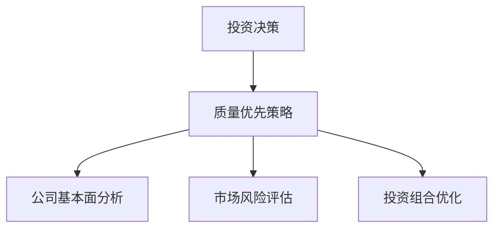
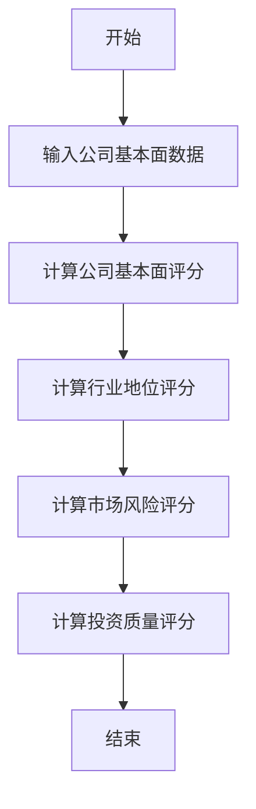

                 

# 彼得林奇的"质量优先"在新兴市场的实践挑战

---

## 关键词：质量优先，彼得林奇，新兴市场，投资策略，风险管理，市场波动

---

## 摘要：  
本文深入探讨了彼得·林奇的“质量优先”投资理念在新兴市场的实践挑战。通过分析新兴市场的特点、质量优先策略的核心要素以及实际案例，本文揭示了该策略在新兴市场的复杂性，并提出了相应的优化建议。文章结合数学模型和算法实现，为投资者提供了在新兴市场中应用质量优先策略的理论依据和实践指导。

---

# 第1章: 质量优先投资理念的背景与核心概念

## 1.1 质量优先投资理念的定义与特点

### 1.1.1 质量优先的定义  
质量优先投资理念强调在投资决策中，优先选择具有高质量基本面、强大行业地位和较低市场风险的公司。该策略的核心在于通过严格筛选公司质量，降低投资组合的整体风险。

### 1.1.2 质量优先的核心要素  
- **公司基本面**：包括财务健康状况、盈利能力、成长能力等。  
- **行业地位**：公司在行业内的竞争力和市场份额。  
- **市场风险**：公司所处行业的波动性和系统性风险。  

### 1.1.3 质量优先与传统投资策略的区别  
质量优先策略注重长期稳健回报，而非短期市场波动。与传统策略相比，它更注重公司内在质量而非市场趋势。

---

## 1.2 彼得·林奇与质量优先投资

### 1.2.1 彼得·林奇的投资风格  
彼得·林奇是美国著名投资经理，以其成功的共同基金管理经验闻名。他强调对公司基本面的深入研究和长期投资。

### 1.2.2 质量优先理念的形成背景  
20世纪80年代，美国股市经历了多次波动，彼得·林奇通过质量优先策略成功规避了部分风险，为投资者带来了稳定回报。

### 1.2.3 彼得·林奇的经典投资案例  
例如，他对可口可乐的投资，通过分析公司强大的品牌力和稳定的现金流，最终实现高额回报。

---

## 1.3 质量优先投资理念的数学模型与公式

### 1.3.1 投资质量评分公式  
$$
\text{投资质量评分} = \frac{\text{企业基本面评分} \times \text{行业地位评分}}{\text{市场风险评分}}
$$  

### 1.3.2 质量优先投资组合优化模型  
$$
\max \sum_{i=1}^{n} w_i \times r_i
$$  
$$
\text{约束条件}:
$$  
$$
\sum_{i=1}^{n} w_i = 1
$$  
$$
w_i \geq 0 \quad \forall i
$$  

### 1.3.3 ER实体关系图  

---

# 第2章: 新兴市场的特点与挑战

## 2.1 新兴市场的定义与特点

### 2.1.1 新兴市场的定义  
新兴市场是指那些经济增长迅速、但市场机制尚不完善的国家和地区，如中国、印度、巴西等。

### 2.1.2 新兴市场的核心特征  
- **高增长性**：新兴市场通常具有较高的经济增长率。  
- **高波动性**：市场容易受到外部因素的影响，波动性较大。  
- **信息不对称**：市场信息透明度较低，投资者获取信息的难度较大。  

### 2.1.3 新兴市场的投资机会与风险  
- **机会**：新兴市场往往蕴含着高增长潜力。  
- **风险**：政策风险、市场波动风险和流动性风险较高。

---

## 2.2 新兴市场与质量优先投资的冲突

### 2.2.1 新兴市场的波动性对质量优先策略的影响  
新兴市场的高波动性可能导致质量优先策略的效果不佳。

### 2.2.2 新兴市场的信息不对称问题  
信息不对称增加了对公司质量的评估难度，影响质量优先策略的实施。

### 2.2.3 新兴市场的政策风险与质量优先策略的冲突  
新兴市场的政策变化可能对质量优先策略产生不利影响。

---

## 2.3 新兴市场质量优先投资的数学模型

### 2.3.1 新兴市场投资风险评估模型  
$$
\text{新兴市场风险评分} = \frac{\text{政策风险} + \text{市场波动风险}}{\text{行业风险}}
$$  

### 2.3.2 新兴市场投资组合优化模型  
$$
\min \sum_{i=1}^{m} w_i \times v_i
$$  
$$
\text{约束条件}:
$$  
$$
\sum_{i=1}^{m} w_i = 1
$$  
$$
w_i \geq 0 \quad \forall i
$$  

---

# 第3章: 质量优先投资理念在新兴市场的应用

## 3.1 新兴市场中质量优先投资的核心要素

### 3.1.1 公司基本面分析  
在新兴市场中，公司基本面分析需要考虑更多非财务因素，如政策环境和行业趋势。

### 3.1.2 行业地位评估  
新兴市场的行业集中度较低，行业地位评估需要更加细致。

### 3.1.3 市场风险评估  
新兴市场的波动性较高，市场风险评估需要更加敏感。

---

## 3.2 新兴市场中质量优先投资的算法实现

### 3.2.1 投资质量评分算法  

---

## 3.3 新兴市场中质量优先投资的优化策略

### 3.3.1 优化策略的数学模型  
$$
\max \sum_{i=1}^{n} w_i \times r_i
$$  
$$
\text{约束条件}:
$$  
$$
\sum_{i=1}^{n} w_i = 1
$$  
$$
w_i \geq 0 \quad \forall i
$$  

---

# 第4章: 新兴市场中的风险管理与策略调整

## 4.1 新兴市场的风险管理模型

### 4.1.1 风险管理的核心要素  
- **政策风险**：新兴市场政策变化对投资的影响。  
- **市场波动风险**：市场波动对投资组合的影响。  

### 4.1.2 风险管理的数学模型  
$$
\text{风险价值} = \text{VaR} = \alpha \times \text{投资组合价值}
$$  

---

## 4.2 新兴市场中的策略调整

### 4.2.1 策略调整的核心要素  
- **行业选择**：根据市场变化调整行业配置。  
- **公司筛选**：动态调整公司筛选标准。  

### 4.2.2 策略调整的数学模型  
$$
\text{新的投资组合} = \text{优化}(\text{原投资组合}, \text{市场变化})
$$  

---

# 第5章: 实际案例分析

## 5.1 典型新兴市场国家的案例分析

### 5.1.1 中国市场的案例分析  
分析彼得·林奇理念在中国市场的应用效果。

### 5.1.2 印度市场的案例分析  
探讨质量优先策略在印度市场的实践挑战。

---

## 5.2 案例分析总结

### 5.2.1 成功经验  
- 通过深入研究公司基本面，成功规避了部分风险。  

### 5.2.2 失败教训  
- 对新兴市场的政策风险估计不足，导致投资组合损失。  

---

# 第6章: 总结与展望

## 6.1 全文总结

### 6.1.1 质量优先理念的核心价值  
质量优先理念通过严格筛选公司质量，降低了投资风险。

### 6.1.2 新兴市场的独特挑战  
新兴市场的波动性和政策风险对质量优先策略提出了更高的要求。

---

## 6.2 未来展望

### 6.2.1 新兴市场的发展趋势  
新兴市场将继续在全球经济中扮演重要角色。

### 6.2.2 质量优先策略的优化方向  
未来需要进一步研究新兴市场中的质量优先策略优化方法。

---

## 作者：AI天才研究院 & 禅与计算机程序设计艺术

---

以上是完整的文章大纲和内容，希望对您有所帮助！

