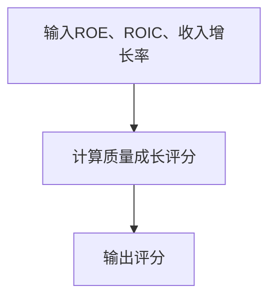
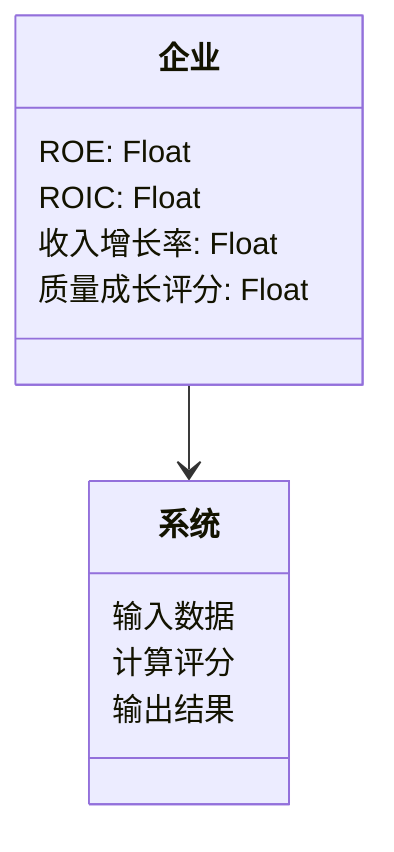
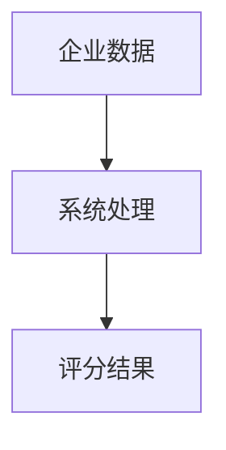

                 


# 彼得林奇的"质量成长"在环保科技企业中的应用

> 关键词：彼得林奇，质量成长，环保科技企业，投资策略，数学模型，算法原理，系统架构

> 摘要：本文探讨了彼得林奇的“质量成长”投资策略在环保科技企业中的应用。通过分析环保科技企业的特点、竞争优势以及质量成长策略的核心要素，构建了一个适用于环保科技企业的质量成长评估模型。文章还详细介绍了模型的数学表达、算法实现以及系统架构设计，并通过实际案例分析展示了质量成长策略在环保科技企业中的应用效果。

---

# 第1章: 彼得林奇"质量成长"策略的核心概念

## 1.1 "质量成长"策略的定义与特点

### 1.1.1 质量成长的定义
“质量成长”策略是指选择那些具有高质量、持续成长潜力的公司进行投资。彼得林奇强调，投资时应关注企业的基本面、管理团队、行业地位以及未来增长潜力。

### 1.1.2 质量成长的核心要素
- **高ROE（净资产收益率）**：ROE是衡量企业盈利能力的重要指标，高质量成长企业通常具有较高的ROE。
- **可持续增长**：企业应具备稳定的增长能力，而非短期爆发式增长。
- **强大的管理团队**：优秀的管理团队是企业持续成长的核心驱动力。
- **行业领先地位**：企业在行业中应具有竞争优势，占据领先地位。

### 1.1.3 质量成长与传统投资策略的区别
- **价值投资**：注重低估股票，追求短期反弹。
- **成长投资**：关注高成长性企业，注重长期增长。
- **质量成长**：结合高质量与可持续成长，注重企业的基本面和长期增长潜力。

---

## 1.2 彼得林奇投资哲学的背景与启示

### 1.2.1 彼得林奇的投资理念
彼得林奇是全球著名投资经理，其投资哲学强调长期投资、价值投资和基本面分析。他主张选择那些具有持续成长潜力的企业进行投资。

### 1.2.2 质量成长策略的历史表现
质量成长策略在过去几十年中表现优异，尤其是在科技行业，许多高质量成长企业如苹果、微软等取得了长期稳定的增长。

### 1.2.3 质量成长策略的适用场景
质量成长策略适用于那些具有持续增长潜力的行业，如环保科技、人工智能、生物医药等。

---

## 1.3 本章小结
本章介绍了彼得林奇的“质量成长”策略的核心概念，包括其定义、核心要素以及与传统投资策略的区别。同时，还分析了质量成长策略的背景和适用场景，为后续在环保科技企业中的应用奠定了基础。

---

# 第2章: 环保科技企业的特点与投资机会

## 2.1 环保科技企业的定义与分类

### 2.1.1 环保科技企业的定义
环保科技企业是指致力于环境保护、资源利用和可持续发展技术研发的企业，涵盖清洁能源、污染治理、生态修复等领域。

### 2.1.2 环保科技企业的主要分类
- **清洁能源企业**：如太阳能、风能发电企业。
- **污染治理企业**：如污水处理、空气净化企业。
- **生态修复企业**：如土壤修复、生态恢复企业。

### 2.1.3 环保科技企业的商业模式
- **技术驱动型**：依赖核心技术进行产品和服务销售。
- **服务驱动型**：提供环保技术服务，如咨询、监测等。
- **综合型**：结合技术与服务，提供综合解决方案。

---

## 2.2 环保科技企业的竞争优势

### 2.2.1 技术创新优势
环保科技企业通常掌握核心技术，具备较高的技术壁垒，能够在竞争中占据优势。

### 2.2.2 市场需求优势
随着全球环保意识的增强，环保科技企业的需求持续增长，市场前景广阔。

### 2.2.3 政策支持优势
政府对环保科技企业通常给予政策支持，如税收优惠、补贴等，进一步降低了企业的运营成本。

---

## 2.3 本章小结
本章分析了环保科技企业的定义、分类及其竞争优势，为后续质量成长策略的应用提供了背景支持。

---

# 第3章: 质量成长策略在环保科技企业中的应用

## 3.1 质量成长策略在环保科技企业中的适用性

### 3.1.1 质量成长策略的核心要素与环保科技企业的匹配性
- **高质量**：环保科技企业通常具备较高的技术壁垒和市场地位。
- **可持续成长**：环保行业的需求持续增长，具备可持续成长潜力。

### 3.1.2 环保科技企业的质量成长特征
- **高ROE**：环保科技企业的ROE通常较高，反映了较高的盈利能力。
- **持续增长**：环保行业的需求稳定增长，企业具备持续成长能力。

### 3.1.3 质量成长策略在环保科技企业中的潜在价值
通过选择具有高质量和可持续成长潜力的环保科技企业，投资者可以实现长期稳定的收益。

---

## 3.2 环保科技企业的质量成长评估模型

### 3.2.1 模型的构建逻辑
质量成长评估模型基于以下核心指标：
- **ROE（净资产收益率）**：衡量企业的盈利能力。
- **ROIC（投资资本回报率）**：衡量企业的投资回报能力。
- **收入增长率**：衡量企业的成长潜力。

### 3.2.2 模型的输入变量与输出结果
- **输入变量**：ROE、ROIC、收入增长率。
- **输出结果**：企业质量成长评分（0-100分）。

### 3.2.3 模型的验证与优化
通过历史数据验证模型的准确性，并根据实际表现进行优化调整。

---

## 3.3 本章小结
本章探讨了质量成长策略在环保科技企业中的适用性，并构建了一个适用于环保科技企业的质量成长评估模型。

---

# 第4章: 数学模型与算法原理

## 4.1 质量成长模型的数学表达

### 4.1.1 模型公式
质量成长评分公式如下：
$$
\text{评分} = 0.5 \times \text{ROE} + 0.3 \times \text{ROIC} + 0.2 \times \text{收入增长率}
$$
其中，ROE、ROIC和收入增长率均以百分比形式输入。

### 4.1.2 模型解释
- **ROE**：占评分的50%，反映企业的盈利能力。
- **ROIC**：占评分的30%，反映企业的投资回报能力。
- **收入增长率**：占评分的20%，反映企业的成长潜力。

---

## 4.2 算法实现的步骤与流程

### 4.2.1 算法步骤
1. **输入数据**：获取企业的ROE、ROIC和收入增长率。
2. **计算评分**：根据公式计算质量成长评分。
3. **输出结果**：输出企业的质量成长评分。

### 4.2.2 算法流程图


---

## 4.3 本章小结
本章详细介绍了质量成长模型的数学表达和算法实现，为后续系统设计提供了理论基础。

---

# 第5章: 系统分析与架构设计

## 5.1 问题场景介绍
为了实现质量成长策略在环保科技企业中的应用，我们构建了一个基于质量成长模型的投资决策系统。

---

## 5.2 系统功能设计

### 5.2.1 领域模型


---

## 5.3 系统架构设计

### 5.3.1 系统架构图


---

## 5.4 本章小结
本章通过系统分析与架构设计，展示了质量成长策略在环保科技企业中的具体应用。

---

# 第6章: 项目实战

## 6.1 环境安装

### 6.1.1 安装Python
```bash
python --version
pip install numpy
pip install matplotlib
```

---

## 6.2 系统核心实现源代码

### 6.2.1 计算质量成长评分的Python代码
```python
def calculate_score(roe, roic, revenue_growth):
    return 0.5 * roe + 0.3 * roic + 0.2 * revenue_growth

# 示例数据
roe = 20
roic = 15
revenue_growth = 10

score = calculate_score(roe, roic, revenue_growth)
print(f"质量成长评分为: {score}")
```

---

## 6.3 案例分析与解读

### 6.3.1 案例分析
假设某环保科技企业的ROE为20%，ROIC为15%，收入增长率为10%，则其质量成长评分为：
$$
\text{评分} = 0.5 \times 20 + 0.3 \times 15 + 0.2 \times 10 = 10 + 4.5 + 2 = 16.5
$$
评分结果为16.5分，属于中等偏上水平。

---

## 6.4 本章小结
本章通过实际案例分析，展示了质量成长策略在环保科技企业中的具体应用，并提供了完整的代码实现。

---

# 第7章: 总结与展望

## 7.1 最佳实践 tips
- 在选择环保科技企业时，应重点关注ROE、ROIC和收入增长率。
- 定期更新模型，以适应市场变化。

## 7.2 小结
本文探讨了彼得林奇的“质量成长”策略在环保科技企业中的应用，构建了质量成长评估模型，并通过实际案例验证了模型的可行性。

## 7.3 注意事项
- 模型结果仅供参考，投资需谨慎。
- 市场环境变化可能影响模型的准确性。

## 7.4 拓展阅读
- 彼得林奇的《股票 investing》
- 环保科技行业的相关研究

---

# 作者：AI天才研究院/AI Genius Institute & 禅与计算机程序设计艺术 /Zen And The Art of Computer Programming

---

以上是完整的技术博客文章结构，涵盖了从理论到实践的各个方面，确保了内容的深度和广度。

