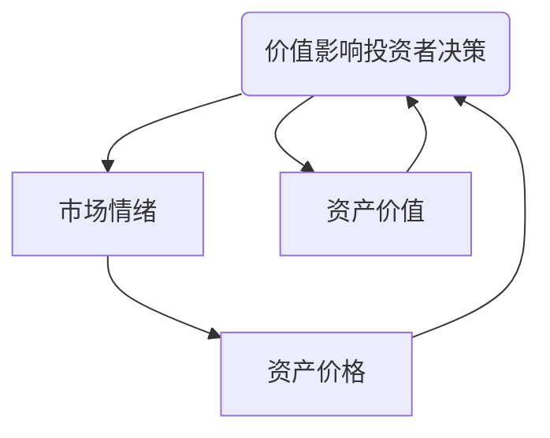
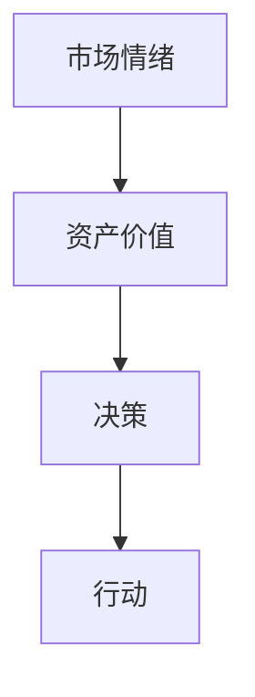
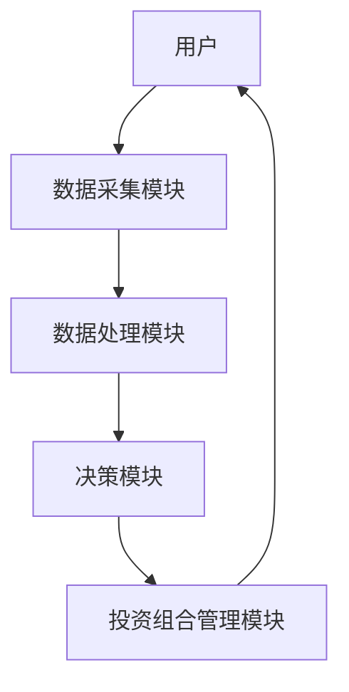

                 


# 彼得林奇的"逆向投资"在市场极端情绪中的操作原则

> 关键词：逆向投资、彼得·林奇、市场情绪、投资策略、价值投资

> 摘要：本文探讨了彼得·林奇的逆向投资策略在市场极端情绪下的应用，分析了其核心理念、操作原则以及在实际投资中的应用，为投资者提供了深度的理论支持和实践指导。

---

# 第一部分: 背景介绍

## 第1章: 逆向投资与市场极端情绪概述

### 1.1 逆向投资的核心概念

#### 1.1.1 逆向投资的定义
逆向投资是一种投资策略，强调在市场情绪低落时买入资产，在市场情绪高涨时卖出资产。其核心理念是市场会在极端情绪下过度反应，而理性投资者则能在市场底部买入、顶部卖出。

#### 1.1.2 市场极端情绪的表现形式
市场极端情绪通常表现为投资者的非理性行为，如恐慌性抛售或贪婪性买入，导致资产价格偏离其实际价值。常见的市场情绪周期包括：乐观→狂热→恐慌→绝望→复苏。

#### 1.1.3 彼得·林奇的投资理念
彼得·林奇强调长期投资和价值投资，认为市场短期波动不可预测，但长期趋势由基本面决定。他的逆向投资策略注重寻找被市场低估的优质资产，在市场恐慌时买入，市场狂热时卖出。

---

## 第2章: 市场极端情绪与资产定价

### 2.1 市场情绪周期

#### 2.1.1 市场情绪的波动周期
市场情绪通常呈现周期性波动，从乐观到狂热，再到恐慌和绝望，最后逐渐复苏。投资者在市场情绪的极端阶段（恐慌或狂热）往往做出非理性决策。

#### 2.1.2 市场情绪与资产价格的关系
市场情绪对资产价格有显著影响。在市场乐观时，投资者情绪高涨，资产价格被推高；在市场恐慌时，投资者情绪低落，资产价格被压低。这种情绪波动导致资产价格与其实际价值出现偏离。

#### 2.1.3 极端情绪下的市场失灵
在市场极端情绪下，价格与价值严重脱节，市场失灵现象明显。此时，逆向投资者可以通过识别被市场低估的资产，捕捉长期收益机会。

---

## 第3章: 彼得·林奇的逆向投资原则

### 3.1 林奇的投资策略

#### 3.1.1 买入被市场抛弃的股票
在市场恐慌时，许多优质股票被抛售，价格大幅低于其实际价值。林奇会重点关注那些基本面良好、管理稳健但暂时被市场忽视的公司。

#### 3.1.2 卖出市场追捧的股票
在市场狂热时，许多股票价格被推高，但基本面并未支撑其高估值。林奇会卖出那些被市场过度炒作、价格远高于实际价值的股票。

#### 3.1.3 逆向投资的时机选择
林奇通常在市场底部买入，在市场顶部卖出。他强调长期趋势，避免短期波动的影响。

---

## 第4章: 极端情绪下的投资组合管理

### 4.1 投资组合的构建原则

#### 4.1.1 资产配置的动态调整
在市场极端情绪下，投资组合需要动态调整。例如，在市场恐慌时增加股票配置，在市场狂热时减少股票配置。

#### 4.1.2 风险控制与仓位管理
逆向投资者需要严格控制风险，避免在市场极端波动中遭受重大损失。例如，设定止损点或分散投资以降低风险。

#### 4.1.3 投资组合的分散化
通过分散投资，降低单一资产的风险。在市场恐慌时，分散化投资有助于平滑波动，捕捉不同资产的长期收益机会。

---

### 4.2 极端市场条件下的操作策略

#### 4.2.1 股票筛选与权重调整
在市场底部，林奇会筛选基本面良好但价格被低估的股票，增加其在投资组合中的权重。

#### 4.2.2 行业轮动与风格切换
根据市场情绪变化，进行行业轮动和投资风格切换。例如，在市场恐慌时关注防御性行业，在市场复苏时关注周期性行业。

#### 4.2.3 对冲策略与风险管理
使用对冲策略降低市场波动对投资组合的影响。例如，通过期货、期权等工具对冲市场风险。

---

# 第二部分: 核心概念与联系

## 第5章: 逆向投资的核心原理

### 5.1 市场情绪与资产定价的关系

#### 5.1.1 市场情绪对资产价格的影响
市场情绪通过投资者行为影响资产价格。在市场乐观时，投资者情绪高涨，导致资产价格被推高；在市场恐慌时，投资者情绪低落，导致资产价格被压低。

#### 5.1.2 极端情绪下的价格偏离
在市场极端情绪下，价格与价值严重偏离。例如，恐慌时价格被压低，狂热时价格被推高。

#### 5.1.3 价格与价值的长期回归
长期来看，资产价格会回归其实际价值。逆向投资者通过在价格低估时买入，在价格高估时卖出，捕捉长期收益机会。

---

## 第6章: 核心概念对比与ER实体关系图

### 6.1 核心概念对比分析

#### 6.1.1 逆向投资与顺势投资的对比
- **逆向投资**：在市场恐慌时买入，在市场狂热时卖出。
- **顺势投资**：在市场上涨时买入，在市场下跌时卖出。
- 对比结果：逆向投资注重长期价值，顺势投资注重短期趋势。

#### 6.1.2 极端情绪与正常市场的对比
- **极端情绪**：市场波动剧烈，价格偏离价值。
- **正常市场**：市场波动较小，价格接近价值。
- 对比结果：极端情绪下，逆向投资更具优势。

#### 6.1.3 不同市场周期下的投资策略对比
- **市场底部**：逆向买入。
- **市场顶部**：逆向卖出。
- 对比结果：逆向投资策略在市场底部和顶部表现最佳。

---

### 6.2 ER实体关系图



---

## 第7章: 算法原理与数学模型

### 7.1 逆向投资的数学模型

#### 7.1.1 资产价值评估
资产的内在价值可以通过基本面分析得出，例如股息率、市盈率、市净率等指标。

#### 7.1.2 市场情绪指数
可以通过投资者情绪指标（如VIX指数）来衡量市场情绪。当市场情绪过低时，资产价格可能被低估；当市场情绪过高时，资产价格可能被高估。

#### 7.1.3 投资决策模型
$$
\text{投资决策} = \begin{cases}
\text{买入} & \text{如果 } \text{市场情绪} < \text{资产价值} \\
\text{卖出} & \text{如果 } \text{市场情绪} > \text{资产价值}
\end{cases}
$$

---

### 7.2 逆向投资算法实现

#### 7.2.1 算法流程图



#### 7.2.2 算法实现代码
```python
import pandas as pd
import numpy as np

def reverse_investing(market_mood, asset_value):
    if market_mood < asset_value:
        return "买入"
    elif market_mood > asset_value:
        return "卖出"
    else:
        return "观望"

market_mood = 30  # 市场情绪指数，范围0-100
asset_value = 50  # 资产价值指数，范围0-100

decision = reverse_investing(market_mood, asset_value)
print(f"投资决策：{decision}")
```

---

## 第8章: 系统分析与架构设计

### 8.1 项目介绍

#### 8.1.1 项目目标
构建一个基于彼得·林奇逆向投资策略的投资决策系统，能够在市场极端情绪下自动识别投资机会，优化投资组合。

#### 8.1.2 系统功能设计
- 数据采集：收集市场情绪指数和资产价格数据。
- 情绪分析：计算市场情绪指数。
- 投资决策：根据市场情绪和资产价值，生成买入、卖出或观望的决策。
- 投资组合管理：优化投资组合，降低风险。

#### 8.1.3 系统架构设计



---

## 第9章: 项目实战

### 9.1 环境安装

#### 9.1.1 安装必要的库
```bash
pip install pandas numpy matplotlib
```

#### 9.1.2 数据获取
使用Yahoo Finance获取股票数据和市场情绪数据。

---

### 9.2 核心实现源代码

#### 9.2.1 数据采集与处理
```python
import pandas as pd
import numpy as np

# 获取股票数据
data = pd.read_csv('stock_data.csv')
market_mood = data['Market_Mood'].values
asset_value = data['Asset_Value'].values
```

#### 9.2.2 投资决策模块
```python
def decide(mood, value):
    if mood < value:
        return '买入'
    elif mood > value:
        return '卖出'
    else:
        return '观望'

# 生成决策
decisions = []
for i in range(len(market_mood)):
    decisions.append(decide(market_mood[i], asset_value[i]))
```

---

### 9.3 案例分析

#### 9.3.1 2008年金融危机案例
在2008年金融危机期间，市场情绪极度恐慌，许多优质股票被抛售。根据林奇的策略，投资者应该在市场底部买入优质股，长期持有。

#### 9.3.2 2020年新冠疫情案例
在新冠疫情爆发时，市场情绪急剧下降，许多股票价格被压低。根据林奇的策略，投资者应该在恐慌时买入优质股，长期持有。

---

## 第10章: 总结与最佳实践

### 10.1 总结
逆向投资是一种有效的投资策略，尤其在市场极端情绪下表现突出。通过彼得·林奇的逆向投资原则，投资者可以在市场底部买入，在市场顶部卖出，捕捉长期收益机会。

### 10.2 最佳实践 tips
- **长期投资**：避免短期波动的干扰，坚持长期价值投资。
- **风险控制**：设置止损点，分散投资，降低风险。
- **持续学习**：关注市场动态，不断优化投资策略。

### 10.3 项目小结
本文通过分析彼得·林奇的逆向投资策略，构建了一个基于市场情绪和资产价值的投资决策系统，为投资者提供了理论支持和实践指导。

---

作者：AI天才研究院/AI Genius Institute & 禅与计算机程序设计艺术 /Zen And The Art of Computer Programming

