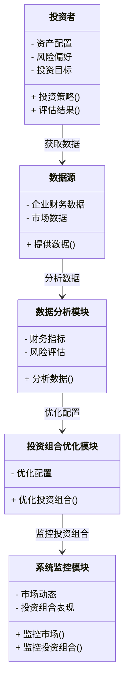
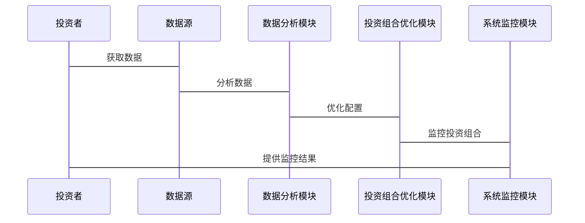

                 


# 彼得林奇的"长期价值"在不同地域市场的体现

> 关键词：长期价值投资、彼得林奇、投资策略、市场分析、风险管理

> 摘要：本文深入探讨了彼得林奇的长期价值投资理念，并分析了这一理念在不同地域市场的具体体现。通过对比分析美国、欧洲和亚洲市场的特点，本文揭示了长期价值投资在不同环境下的策略差异与实际应用。此外，文章还结合数学模型和算法，详细阐述了长期价值投资的风险评估与收益预测方法，并通过实际案例分析，为投资者提供了实用的指导。

---

## 第一部分：彼得林奇的长期价值投资理念概述

### 第1章：长期价值投资的核心概念

#### 1.1 长期价值投资的定义与特点

##### 1.1.1 长期价值投资的定义
长期价值投资是一种以企业基本面分析为基础的投资策略，强调以低于内在价值的价格买入并长期持有优质股票，以实现资本的长期增值。这一策略的核心在于关注企业的内在价值，而非短期市场波动。

##### 1.1.2 长期价值投资的核心特点
- **注重企业基本面**：分析企业的盈利能力、成长性、财务状况等。
- **长期持有**：避免频繁交易，减少交易成本和税务负担。
- **价值导向**：寻找市场价格低于内在价值的股票。

##### 1.1.3 彼得林奇对长期价值投资的贡献
彼得林奇作为长期价值投资的代表人物，提出了许多经典的投资理念，如“买入并持有”、“寻找具有持续竞争优势的企业”等，深刻影响了现代投资理论。

#### 1.2 彼得林奇的投资哲学

##### 1.2.1 彼得林奇的投资理念
彼得林奇强调，投资的本质是选择优秀的公司，而不是追求数字游戏。他主张通过深入研究企业，寻找那些具有持续增长潜力和竞争优势的企业进行投资。

##### 1.2.2 长期价值投资的三大原则
1. **价值导向**：买入价格低于内在价值的股票。
2. **长期持有**：避免频繁交易，降低交易成本。
3. **选择优秀企业**：投资具有持续竞争优势和增长潜力的企业。

##### 1.2.3 投资中的风险与收益平衡
彼得林奇认为，投资中的风险主要来自于市场的波动和企业的基本面变化。通过选择优质企业，投资者可以在长期实现收益与风险的平衡。

#### 1.3 长期价值投资的背景与意义

##### 1.3.1 长期价值投资的起源
长期价值投资的理念起源于本杰明·格雷厄姆的价值投资理论，彼得林奇在此基础上进行了进一步的实践和总结。

##### 1.3.2 长期价值投资在现代投资中的地位
长期价值投资是现代投资理论的重要组成部分，尤其在机构投资和个人投资中占据重要地位。它强调基本面分析和长期持有，与短期交易策略形成鲜明对比。

##### 1.3.3 长期价值投资对投资者的启示
长期价值投资强调的是耐心、研究和对企业的深刻理解。投资者应注重企业内在价值，而非短期市场波动。

---

### 第2章：彼得林奇投资策略的核心要素

#### 2.1 投资策略的核心要素

##### 2.1.1 企业基本面分析
- **盈利能力**：分析企业的净利润率、ROE等指标。
- **成长性**：评估企业的收入和利润增长率。
- **财务健康状况**：分析企业的资产负债表，关注债务水平和现金流。

##### 2.1.2 财务指标评估
- **市盈率（P/E）**：衡量股价与企业盈利能力的关系。
- **市净率（P/B）**：衡量股价与企业净资产的关系。
- **股息率**：衡量企业分红能力。

##### 2.1.3 行业分析与竞争地位
- **行业前景**：分析行业的发展趋势和竞争格局。
- **竞争优势**：评估企业在行业中的竞争优势，如成本优势、品牌优势等。

#### 2.2 彼得林奇的选股标准

##### 2.2.1 企业盈利能力分析
彼得林奇认为，企业的盈利能力是投资的核心指标之一。他倾向于选择那些具有稳定且持续增长的盈利能力的企业。

##### 2.2.2 企业的成长性评估
彼得林奇强调，企业应具备持续的成长潜力。他通过分析企业的收入和利润增长率，评估企业的成长性。

##### 2.2.3 企业的财务健康状况
彼得林奇关注企业的财务健康状况，特别是企业的债务水平和现金流情况。他认为，健康的财务状况是企业长期发展的基础。

#### 2.3 彼得林奇的长期价值投资模型

##### 2.3.1 模型的核心框架
彼得林奇的投资模型基于对企业基本面的深入分析，包括盈利能力、成长性、财务状况等多个维度。

##### 2.3.2 模型的输入变量与输出结果
- **输入变量**：企业的财务数据（收入、利润、债务等）、行业分析、竞争优势等。
- **输出结果**：企业的内在价值、投资评级（买入、持有、卖出）。

##### 2.3.3 模型的适用场景与限制
该模型适用于长期价值投资，特别适合分析具有稳定增长潜力的优秀企业。其限制在于对短期市场波动的敏感性较低，可能不适合短期交易策略。

---

### 第3章：长期价值投资在不同市场的适应性

#### 3.1 不同市场的特点与投资环境

##### 3.1.1 美国市场
美国市场是全球最大的股票市场之一，具有成熟的投资环境和完善的法律法规。彼得林奇的投资策略在美国市场表现尤为突出，尤其是在科技和金融行业。

##### 3.1.2 欧洲市场
欧洲市场具有较强的行业分散性和多样化，但同时也面临一定的政治和经济不确定性。彼得林奇的投资策略在欧洲市场需要结合区域经济特点进行调整。

##### 3.1.3 亚洲市场
亚洲市场以新兴市场为主，具有较高的增长潜力，但也伴随着较大的波动性和风险。彼得林奇的投资策略在亚洲市场需要更加注重企业的成长性和财务稳定性。

#### 3.2 各个市场的长期价值投资策略

##### 3.2.1 美国市场的长期价值投资策略
- **行业选择**：科技、金融、消费等行业具有较高的成长潜力。
- **选股标准**：选择具有稳定盈利能力和竞争优势的企业。

##### 3.2.2 欧洲市场的长期价值投资策略
- **行业选择**：注重行业分散性，如制造业、消费品等。
- **选股标准**：关注企业的财务健康和区域竞争优势。

##### 3.2.3 亚洲市场的长期价值投资策略
- **行业选择**：科技、互联网、消费等行业具有较高的增长潜力。
- **选股标准**：注重企业的成长性和财务稳定性，同时关注区域经济环境的影响。

#### 3.3 各个市场的比较与借鉴

##### 3.3.1 不同市场的投资环境对比
- **美国市场**：成熟、流动性强、法律法规完善。
- **欧洲市场**：行业分散、经济多样性，但政治风险较高。
- **亚洲市场**：增长潜力大，但波动性和风险较高。

##### 3.3.2 各自市场的长期价值投资策略的异同
- **相同点**：注重企业基本面分析，选择具有持续竞争优势的企业。
- **不同点**：根据不同市场的特点，调整行业选择和选股标准。

##### 3.3.3 各个市场的最佳实践与启示
- **美国市场**：注重行业龙头和技术创新。
- **欧洲市场**：关注企业财务健康和区域竞争优势。
- **亚洲市场**：注重企业的成长性和区域经济环境。

---

### 第4章：彼得林奇长期价值投资的数学模型与算法原理

#### 4.1 投资组合优化的数学模型

##### 4.1.1 投资组合优化的定义与目标
投资组合优化是指通过优化资产配置，使投资组合的风险和收益达到最佳平衡。

##### 4.1.2 投资组合优化的数学公式
$$ \text{最大化 } \mu^T w + \lambda w^T \Sigma w $$
其中：
- $\mu$ 是资产的期望收益向量。
- $w$ 是投资权重向量。
- $\Sigma$ 是资产收益的协方差矩阵。
- $\lambda$ 是风险厌恶系数。

##### 4.1.3 投资组合优化的约束条件
$$ \sum_{i=1}^n w_i = 1 $$
$$ w_i \geq 0 \quad \text{对于所有 } i $$

#### 4.2 长期价值投资的风险评估与收益预测

##### 4.2.1 风险评估的数学模型
$$ \text{风险 } = \sqrt{w^T \Sigma w} $$

##### 4.2.2 收益预测的数学模型
$$ \text{收益 } = \mu^T w $$

#### 4.3 彼得林奇投资策略的算法实现

##### 4.3.1 数据预处理与特征提取
- 数据清洗：处理缺失值、异常值等。
- 特征提取：提取企业的财务指标、行业信息等。

##### 4.3.2 投资组合优化算法的实现
- 输入：企业的财务数据、行业信息等。
- 输出：投资组合的优化配置。

##### 4.3.3 算法的代码实现
```python
import numpy as np
from scipy.optimize import minimize

def portfolio_optimization(mu, Sigma, w0=None):
    n = len(mu)
    if w0 is None:
        w0 = np.ones(n) / n
    
    def objective(w):
        return - (mu.T @ w + 0.5 * w.T @ Sigma @ w)
    
    constraints = [
        {'type': 'eq', 'fun': lambda w: np.sum(w) - 1},
        {'type': 'ineq', 'fun': lambda w: w}
    ]
    
    result = minimize(objective, w0, constraints=constraints, bounds=[(0,1)]*n)
    return result.x

mu = np.array([0.1, 0.15, 0.08])
Sigma = np.array([[0.02, 0.01, 0.01],
                  [0.01, 0.03, 0.02],
                  [0.01, 0.02, 0.03]])
w_opt = portfolio_optimization(mu, Sigma)
print(w_opt)
```

##### 4.3.4 算法的解释与实际应用
该算法通过优化投资组合，使风险和收益达到最佳平衡。在实际应用中，投资者可以根据企业的财务数据和市场环境，调整投资组合的配置。

---

## 第二部分：系统分析与架构设计方案

### 第5章：长期价值投资的系统架构设计

#### 5.1 问题场景介绍
- 投资者需要根据市场环境和企业基本面，制定长期价值投资策略。
- 系统需要提供数据收集、分析、优化和监控功能。

#### 5.2 系统功能设计
- 数据收集模块：收集企业的财务数据、市场数据等。
- 数据分析模块：进行企业基本面分析、风险评估等。
- 投资组合优化模块：基于数学模型，优化投资组合。
- 系统监控模块：实时监控市场动态和投资组合表现。

#### 5.3 系统架构设计

##### 5.3.1 领域模型（Mermaid 类图）


##### 5.3.2 系统架构（Mermaid 架构图）


##### 5.3.3 系统接口设计
- 数据接口：提供企业财务数据和市场数据的接口。
- 分析接口：提供数据分析模块的接口，供投资者进行基本面分析。
- 优化接口：提供投资组合优化模块的接口，供投资者进行资产配置。

##### 5.3.4 系统交互（Mermaid 序列图）


---

## 第三部分：项目实战

### 第6章：长期价值投资的实战指导

#### 6.1 环境安装与配置
- 安装Python和必要的库（如numpy、pandas、scipy等）。
- 数据源的获取：可以从公开的金融数据平台获取企业的财务数据和市场数据。

#### 6.2 系统核心实现源代码

##### 6.2.1 数据预处理代码
```python
import pandas as pd

# 读取数据
data = pd.read_csv('financial_data.csv')

# 数据清洗
data.dropna(inplace=True)
data = data[~data['revenue'].isnull()]
```

##### 6.2.2 投资组合优化代码
```python
import numpy as np
from scipy.optimize import minimize

def portfolio_optimization(mu, Sigma, w0=None):
    n = len(mu)
    if w0 is None:
        w0 = np.ones(n) / n
    
    def objective(w):
        return - (mu.T @ w + 0.5 * w.T @ Sigma @ w)
    
    constraints = [
        {'type': 'eq', 'fun': lambda w: np.sum(w) - 1},
        {'type': 'ineq', 'fun': lambda w: w}
    ]
    
    result = minimize(objective, w0, constraints=constraints, bounds=[(0,1)]*n)
    return result.x

# 示例
mu = np.array([0.1, 0.15, 0.08])
Sigma = np.array([[0.02, 0.01, 0.01],
                  [0.01, 0.03, 0.02],
                  [0.01, 0.02, 0.03]])
w_opt = portfolio_optimization(mu, Sigma)
print(w_opt)
```

##### 6.2.3 系统交互代码
```python
import requests

# 获取市场数据
response = requests.get('https://api.marketdata.com/stock_prices')
data = response.json()

# 分析数据并优化投资组合
mu = data['mean_return']
Sigma = data['covariance_matrix']
w_opt = portfolio_optimization(mu, Sigma)

# 监控投资组合
response_monitor = requests.post('https://api.monitor.com/update_portfolio', json={'weights': w_opt.tolist()})
print(response_monitor.status_code)
```

#### 6.3 代码应用解读与分析
- **数据预处理**：清洗数据，确保数据的完整性和准确性。
- **投资组合优化**：基于数学模型，优化投资组合，使风险和收益达到最佳平衡。
- **系统交互**：实时获取市场数据，优化投资组合，并监控投资组合的表现。

#### 6.4 实际案例分析与详细讲解
以某科技公司为例，分析其财务数据，评估其内在价值，并制定长期价值投资策略。通过代码实现投资组合优化，并监控投资组合的表现。

#### 6.5 项目小结
通过实际案例分析，验证了长期价值投资策略的有效性，并展示了如何通过系统架构和代码实现投资策略。

---

## 第四部分：总结与展望

### 第7章：长期价值投资的总结与展望

#### 7.1 总结
- 彼得林奇的长期价值投资理念强调企业基本面分析和长期持有。
- 不同市场的特点需要投资者根据环境调整策略。
- 数学模型和算法在投资决策中发挥重要作用。

#### 7.2 展望
- 结合人工智能技术，进一步优化投资模型。
- 拓展更多市场的分析，寻找具有增长潜力的投资机会。
- 提高投资组合的风险管理能力，应对复杂的市场环境。

---

## 作者信息

作者：AI天才研究院/AI Genius Institute & 禅与计算机程序设计艺术 /Zen And The Art of Computer Programming

