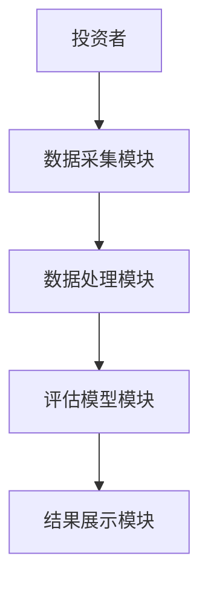

                 

# 彼得林奇的"长期价值"在社会影响力投资中的新定义

> 关键词：彼得林奇、长期价值、社会影响力投资、投资策略、价值评估、影响力评分模型

> 摘要：本文探讨彼得林奇的长期价值投资理念在社会影响力投资中的新定义，分析其在现代社会中的应用与演变。通过理论分析、模型构建和实际案例，阐述如何在影响力投资中实现长期价值，为投资者提供新的视角和策略。

---

## 目录

1. **引言**  
   - 1.1 长期价值投资的背景  
   - 1.2 社会影响力投资的定义  
   - 1.3 本文的目的与结构  

2. **彼得林奇的长期价值投资理论**  
   - 2.1 长期价值的定义  
   - 2.2 彼得林奇的投资哲学  
   - 2.3 成功案例分析  

3. **社会影响力投资的发展**  
   - 3.1 影响力投资的起源  
   - 3.2 与传统投资的区别  
   - 3.3 当前发展趋势  

4. **影响力投资的评估框架**  
   - 4.1 财务指标分析  
   - 4.2 社会影响力的评估方法  
   - 4.3 综合评估模型  

5. **长期价值策略在影响力投资中的应用**  
   - 5.1 策略选择  
   - 5.2 风险管理  
   - 5.3 案例分析  

6. **项目实战：影响力投资的案例分析**  
   - 6.1 案例背景介绍  
   - 6.2 数据收集与处理  
   - 6.3 分析过程与结果  

7. **系统设计与架构**  
   - 7.1 系统架构图  
   - 7.2 数据流分析  
   - 7.3 接口设计  

8. **结论与展望**  
   - 8.1 全书总结  
   - 8.2 未来发展方向  

---

## 1. 引言

### 1.1 长期价值投资的背景

长期价值投资是一种以长期持有优质资产为基础的投资策略，强调通过深入研究企业基本面，选择那些具有持续增长潜力的公司。彼得林奇作为该领域的权威，提出了一系列经典理论，为投资者提供了丰富的实践经验。

### 1.2 社会影响力投资的定义

社会影响力投资是指在追求财务回报的同时，注重对社会、环境和治理（ESG）因素的投资。这种投资方式不仅关注经济利益，还关注其对社会的积极影响，成为可持续发展的关键推动因素。

### 1.3 本文的目的与结构

本文旨在探讨彼得林奇的长期价值理念在社会影响力投资中的新定义，通过理论分析、模型构建和实际案例，为投资者提供新的视角和策略。文章结构清晰，涵盖背景介绍、理论分析、系统设计和项目实战等部分。

---

## 2. 彼得林奇的长期价值投资理论

### 2.1 长期价值的定义

长期价值是指企业在未来较长一段时间内的盈利能力和发展潜力。彼得林奇认为，选择具有持续增长潜力的企业是实现长期价值的关键。

### 2.2 彼得林奇的投资哲学

彼得林奇强调深入研究企业的基本面，选择那些具有竞争优势、良好管理和持续增长潜力的企业。他反对短期投机，提倡长期持有优质资产。

### 2.3 成功案例分析

彼得林奇管理的麦哲伦基金通过长期持有优质企业，取得了显著的超额收益。例如，他投资的喜诗糖果公司，通过持续创新和市场拓展，实现了长期稳定的增长。

---

## 3. 社会影响力投资的发展

### 3.1 影响力投资的起源

社会影响力投资起源于20世纪60年代，随着环保运动和人权意识的增强，投资者开始关注企业的社会影响。

### 3.2 与传统投资的区别

传统投资主要关注财务回报，而影响力投资注重财务回报与社会价值的结合。影响力投资强调企业在环境、社会和治理方面的表现。

### 3.3 当前发展趋势

随着全球对可持续发展的重视，影响力投资迅速增长。越来越多的投资者意识到，社会影响力不仅是道德责任，也是长期投资回报的关键因素。

---

## 4. 影响力投资的评估框架

### 4.1 财务指标分析

财务指标是评估企业盈利能力的重要工具，包括净利润率、ROE、增长率等。这些指标能够反映企业的财务健康状况。

### 4.2 社会影响力的评估方法

社会影响力的评估包括环境影响、社会责任和公司治理等方面。常用指标包括碳排放、员工福利和董事会多样性。

### 4.3 综合评估模型

综合评估模型结合财务和影响力指标，提供全面的企业评估。模型通过加权计算，得出企业的综合评分。

---

## 5. 长期价值策略在影响力投资中的应用

### 5.1 策略选择

投资者应选择那些在财务和影响力方面都表现优异的企业。长期持有这些企业，能够实现财务回报与社会价值的双赢。

### 5.2 风险管理

影响力投资面临市场风险和社会风险。投资者应通过多元化投资和风险分散，降低整体风险。

### 5.3 案例分析

通过分析某企业的影响力投资案例，展示如何在实践中应用长期价值策略。例如，投资于一家环保科技公司，不仅带来财务回报，还促进了环境保护。

---

## 6. 项目实战：影响力投资的案例分析

### 6.1 案例背景介绍

选择一家具有影响力的投资项目，分析其背景、目标和市场定位。

### 6.2 数据收集与处理

收集企业的财务数据、ESG评分和社会影响力数据，进行清洗和整理。

### 6.3 分析过程与结果

通过分析模型，评估企业的综合价值，得出投资建议。

---

## 7. 系统设计与架构

### 7.1 系统架构图

使用Mermaid绘制系统架构图，展示系统模块划分和数据流。

### 7.2 数据流分析

展示数据在系统中的流动过程，包括数据采集、处理和评估。

### 7.3 接口设计

定义系统接口，包括输入、输出和交互流程。

---

## 8. 结论与展望

### 8.1 全书总结

本文探讨了彼得林奇的长期价值理念在社会影响力投资中的应用，分析了其在现代社会中的重要性。

### 8.2 未来发展方向

未来，影响力投资将更加注重技术驱动和数据支持，投资者需要结合新的技术和方法，进一步提升投资效果。

---

## 作者信息

作者：AI天才研究院/AI Genius Institute & 禅与计算机程序设计艺术 /Zen And The Art of Computer Programming

---

以上是文章的详细大纲，接下来将按照上述结构撰写完整文章。

