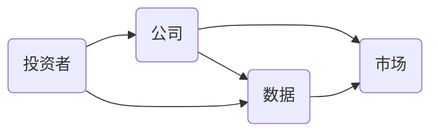
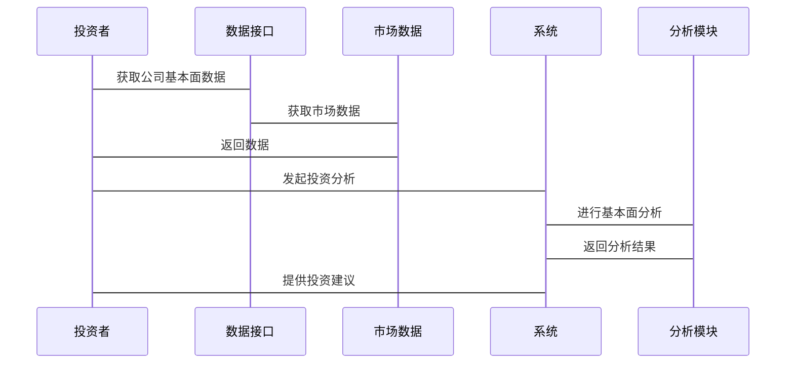

                 


# 彼得林奇的"长期价值"投资哲学

## 关键词：彼得·林奇，长期价值投资，投资哲学，投资策略，投资组合优化，价值投资，投资分析

## 摘要：彼得·林奇是全球著名的价值投资者，其长期价值投资哲学强调对公司基本面的深入研究和长期持有优质股票。本文从投资哲学的背景与演变、长期价值投资的核心概念、算法原理、系统架构、项目实战等角度，全面剖析了彼得·林奇的长期价值投资哲学，结合Mermaid图和Python代码示例，详细讲解了投资决策的逻辑架构和数学模型，帮助读者更好地理解和应用这一投资策略。

---

# 第一部分: 投资哲学的背景与演变

## 第1章: 投资哲学的背景与演变

### 1.1 投资哲学的定义与核心概念

#### 1.1.1 投资哲学的定义
投资哲学是指投资者在进行投资决策时所遵循的基本思想、原则和方法。它是投资者对市场、资产和风险的认知体系，是投资策略和决策的指导思想。

#### 1.1.2 长期价值投资的核心概念
长期价值投资是一种以长期持有优质资产为核心的投资策略，强调对公司基本面的深入研究和对市场估值的准确判断。其核心概念包括：

1. **公司基本面分析**：研究公司的财务状况、行业地位、竞争优势和管理团队。
2. **市场估值**：通过市盈率、市净率等指标判断资产的合理价值。
3. **长期持有**：避免频繁交易，降低交易成本，捕捉公司长期增长的价值。

#### 1.1.3 投资哲学的背景与演变
投资哲学的演变经历了从早期的“技术分析”到“基本面分析”，再到“价值投资”的发展历程。彼得·林奇作为价值投资的代表人物，提出了“长期价值投资”理念，强调以合理价格买入优质公司并长期持有。

---

## 第2章: 彼得·林奇的背景与投资理念

### 2.1 彼得·林奇的背景
彼得·林奇是美国著名的职业基金经理人，曾管理富达麦哲伦基金，创造了长期优异的投资业绩。他的投资理念以“长期价值投资”为核心，注重对公司基本面的研究和长期持有。

### 2.2 长期价值投资的核心思想
彼得·林奇认为，投资的核心是找到那些具有强大竞争优势、良好财务状况和优秀管理团队的公司，并以合理的价格买入，长期持有，等待其内在价值的实现。

---

## 第3章: 长期价值投资的核心要素

### 3.1 核心要素：公司基本面分析
长期价值投资的关键在于对公司基本面的深入研究。基本面分析包括以下几个方面：

1. **财务状况**：分析公司的收入、利润、资产负债表和现金流。
2. **行业地位**：研究公司在行业中的竞争地位和市场份额。
3. **竞争优势**：评估公司的核心竞争力，如技术优势、成本优势等。
4. **管理团队**：考察公司的管理团队能力和战略规划。

### 3.2 市场估值与安全边际
长期价值投资强调以合理的价格买入资产。市场估值是判断资产是否被低估的重要指标，常用市盈率（P/E）和市净率（P/B）等指标衡量。安全边际是指买入价格低于资产的内在价值，以降低投资风险。

### 3.3 长期持有与分散投资
彼得·林奇主张长期持有优质资产，并通过分散投资降低风险。分散投资可以通过投资不同行业、不同规模的公司来实现。

---

## 第4章: 长期价值投资与其他投资策略的对比

### 4.1 价值投资与成长投资的对比
- **价值投资**：以低于内在价值的价格买入优质资产，注重安全边际。
- **成长投资**：投资于具有高成长潜力的公司，注重未来收益的增长。

### 4.2 长期投资与短期交易的对比
- **长期投资**：注重资产的长期价值，减少交易频率。
- **短期交易**：频繁买卖资产，利用短期价格波动获利。

### 4.3 长期价值投资的优缺点
#### 优点：
1. 长期持有降低交易成本和税务负担。
2. 避免短期市场波动的干扰。
3. 有机会捕捉公司长期增长的价值。

#### 缺点：
1. 需要较长的时间周期才能实现收益。
2. 对公司基本面的分析要求较高。

---

## 第5章: 长期价值投资的数学模型与算法

### 5.1 投资组合优化的数学模型
长期价值投资可以通过数学模型优化投资组合。现代投资组合理论（MPT）是投资组合优化的基础。

#### 5.1.1 均值-方差优化模型
$$\text{Minimize } \sigma^2 \text{ subject to } \mu \geq \text{目标收益}$$

其中，$\sigma^2$表示投资组合的方差，$\mu$表示投资组合的预期收益。

#### 5.1.2 马科维茨模型
$$\text{Minimize } \sum_{i=1}^n w_i^2 \sigma_i^2 - 2 \sum_{i=1}^n \sum_{j=1}^n w_i w_j \sigma_{ij} \text{ subject to } \sum_{i=1}^n w_i = 1$$

其中，$w_i$表示资产$i$的权重，$\sigma_i^2$表示资产$i$的方差，$\sigma_{ij}$表示资产$i$和$j$的协方差。

### 5.2 投资组合优化的Python实现

```python
import numpy as np
from scipy.optimize import minimize

def portfolio_optimization(returns, covariance):
    n = len(returns)
    # 定义目标函数
    def objective(weights):
        return (weights.T @ covariance @ weights).item()
    # 约束条件：权重之和为1
    constraints = [{'type': 'eq', 'fun': lambda w: sum(w) - 1}]
    # 初始权重（等权重）
    initial_weights = np.array([1/n] * n)
    # 使用最小二乘法优化
    result = minimize(objective, initial_weights, constraints=constraints)
    return result.x
```

---

## 第6章: 系统分析与架构设计

### 6.1 系统功能设计
长期价值投资系统的功能设计包括以下几个方面：

1. **数据采集**：获取公司基本面数据和市场数据。
2. **基本面分析**：对公司进行财务分析和竞争优势评估。
3. **市场估值**：计算市场估值指标，如市盈率、市净率等。
4. **投资决策**：根据分析结果，生成投资组合优化建议。
5. **风险控制**：监控投资组合的风险，及时调整。

### 6.2 系统架构设计



### 6.3 系统接口设计
系统接口设计包括数据接口和用户接口。数据接口用于获取公司基本面数据和市场数据，用户接口用于展示分析结果和投资建议。

### 6.4 系统交互序列图



---

## 第7章: 项目实战

### 7.1 环境安装
安装必要的Python库，如NumPy、Pandas、Matplotlib等。

### 7.2 核心代码实现
以下是长期价值投资系统的Python代码示例：

```python
import pandas as pd
import numpy as np
from scipy.optimize import minimize

# 示例数据：公司基本面数据
companies = ['Apple', 'Microsoft', 'Google']
returns = [0.1, 0.15, 0.08]
covariance = np.array([[0.02, 0.01, 0.01],
                       [0.01, 0.03, 0.01],
                       [0.01, 0.01, 0.02]])

# 定义目标函数
def objective(weights):
    return (weights.T @ covariance @ weights).item()

# 约束条件：权重之和为1
constraints = [{'type': 'eq', 'fun': lambda w: sum(w) - 1}]

# 初始权重（等权重）
initial_weights = np.array([1/3] * 3)

# 使用最小二乘法优化
result = minimize(objective, initial_weights, constraints=constraints)

# 输出最优权重
print("最优权重:", result.x)
```

### 7.3 案例分析
以苹果公司为例，分析其基本面数据和市场估值，评估其是否符合长期价值投资的条件。

---

## 第8章: 最佳实践与注意事项

### 8.1 小结
长期价值投资是一种以公司基本面分析为核心的投资策略，强调长期持有优质资产。通过深入研究公司财务状况、竞争优势和市场估值，投资者可以在长期内实现稳定的收益。

### 8.2 注意事项
1. **风险控制**：避免过度集中投资，分散投资以降低风险。
2. **持续学习**：市场环境不断变化，投资者需要持续学习和调整投资策略。
3. **耐心与纪律**：长期投资需要耐心和纪律，避免被短期市场波动干扰。

### 8.3 拓展阅读
1. 彼得·林奇的《投资的真相》
2. 《证券分析》——本杰明·格雷厄姆

---

## 作者：AI天才研究院 & 禅与计算机程序设计艺术

---

希望这篇文章能够帮助读者更好地理解彼得·林奇的长期价值投资哲学，并将其应用于实际投资中。

