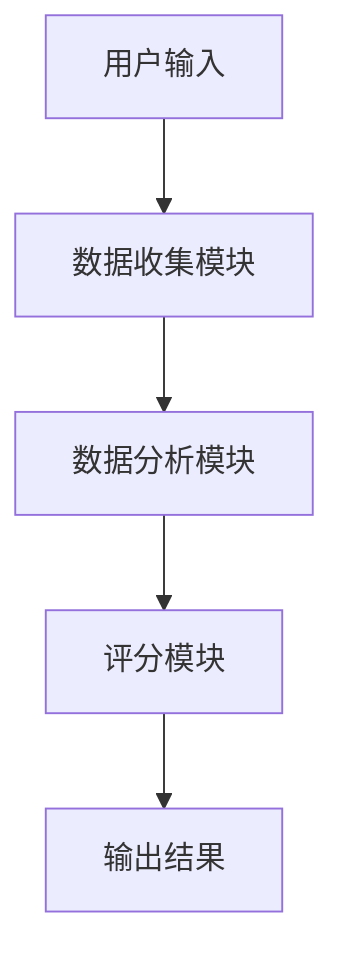
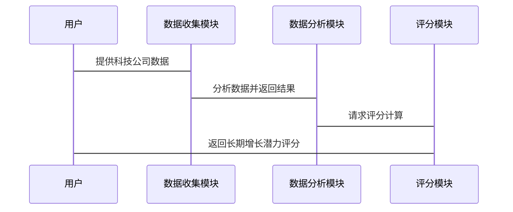

                 


# 彼得林奇的"长期增长"潜力在新兴科技领域的识别方法

> 关键词：彼得·林奇，长期增长，新兴科技，投资模型，潜力识别

> 摘要：本文系统地介绍了彼得·林奇的长期增长投资理念，并将其应用于新兴科技领域。通过构建长期增长潜力评估模型，结合算法、数学模型和系统架构设计，帮助投资者识别具有长期增长潜力的科技公司。文章详细讲解了模型的核心概念、算法原理、系统设计和实际案例，并提供了最佳实践建议。

## 第一章: 长期增长投资的背景与核心概念

### 1.1 长期增长投资的定义与特征
- 长期增长投资的定义
- 投资的三要素：价值、成长与风险
- 长期增长投资的核心特征

### 1.2 新兴科技领域的特点与潜力
- 新兴科技领域的定义与范围
- 科技公司的核心竞争力
- 新兴科技领域的投资机会

### 1.3 长期增长投资与新兴科技的结合
- 长期增长投资在科技领域的应用
- 科技公司长期增长的驱动因素
- 彼得·林奇投资理念在科技领域的适用性

## 第二章: 长期增长潜力评估的核心概念

### 2.1 长期增长潜力的定义与特征
- 长期增长潜力的定义
- 长期增长潜力的特征

### 2.2 新兴科技公司长期增长潜力的核心评估指标
- 财务健康状况
- 市场地位与竞争优势
- 研发投入与创新性

### 2.3 长期增长潜力评估模型的构建
- 模型的构建原理
- 评估指标的权重分配
- 模型的优缺点分析

## 第三章: 长期增长潜力评估算法与数学模型

### 3.1 算法原理与流程
- 算法的输入与输出
- 算法的核心步骤
- 算法的实现流程

### 3.2 数学模型与公式
- 长期增长潜力评分公式
- $$总评分 = \sum (权重_i \times 评分_i)$$
- 案例分析与公式应用

### 3.3 算法实现与代码解读
- 环境安装与依赖项
- 核心代码实现
- 代码解读与分析

## 第四章: 系统架构设计与实现

### 4.1 系统功能设计
- 数据收集模块
- 数据分析模块
- 评分模块

### 4.2 系统架构设计
- 数据流图展示
- 系统组件的交互设计

### 4.3 系统接口与交互流程
- 接口设计
- 交互流程图展示

## 第五章: 项目实战与案例分析

### 5.1 项目环境与数据准备
- 环境安装
- 数据来源与预处理

### 5.2 核心代码实现
- 代码实现与解读
- 算法与模型的应用

### 5.3 案例分析与解读
- 实际案例分析
- 模型结果解读与投资建议

### 5.4 项目小结
- 项目总结
- 成果与经验分享

## 第六章: 最佳实践与注意事项

### 6.1 投资策略与风险管理
- 风险管理策略
- 投资组合优化

### 6.2 长期增长潜力评估的注意事项
- 模型的局限性
- 数据来源的可靠性

### 6.3 小结与展望
- 小结
- 未来研究方向

## 参考文献

## 作者简介

## 附录

---

作者：AI天才研究院 & 禅与计算机程序设计艺术

---

### 详细章节内容：

#### 第二章: 长期增长潜力评估的核心概念

##### 2.2 新兴科技公司长期增长潜力的核心评估指标

###### 2.2.1 财务健康状况
- 收入增长与利润水平
- 财务杠杆与偿债能力
- 现金流状况

###### 2.2.2 市场地位与竞争优势
- 市场占有率
- 核心竞争力
- 产品差异化

###### 2.2.3 研发投入与创新性
- 研发投入比例
- 创新能力
- 技术领先性

##### 2.3 长期增长潜力评估模型的构建

###### 2.3.1 模型的构建原理
- 综合考虑多个因素
- 量化每个因素的重要性
- 计算总评分

###### 2.3.2 评估指标的权重分配
- 指标权重的确定方法
- 示例：假设财务健康占40%，市场地位占30%，研发投入占30%

###### 2.3.3 模型的优缺点分析
- 优点：全面考虑了多个因素
- 缺点：依赖于数据质量和权重设定

---

#### 第三章: 长期增长潜力评估算法与数学模型

##### 3.2 数学模型与公式

###### 长期增长潜力评分公式
$$总评分 = 0.4 \times 财务评分 + 0.3 \times 市场评分 + 0.3 \times 研发评分$$

其中：
- 财务评分范围：1-5分
- 市场评分范围：1-5分
- 研发评分范围：1-5分

##### 3.3 算法实现与代码解读

###### 核心代码实现
```python
def calculate_potential(financial_score, market_score, r_d_score):
    weight_financial = 0.4
    weight_market = 0.3
    weight_r_d = 0.3
    total_score = weight_financial * financial_score + weight_market * market_score + weight_r_d * r_d_score
    return total_score

# 示例数据
financial_score = 4
market_score = 3
r_d_score = 4

potential = calculate_potential(financial_score, market_score, r_d_score)
print(f"长期增长潜力评分：{potential}")
```

###### 代码解读与分析
- 函数 `calculate_potential` 接收三个评分参数
- 计算总评分，权重分别为0.4、0.3、0.3
- 示例计算得出潜力评分为3.4

---

#### 第四章: 系统架构设计与实现

##### 4.2 系统架构设计

###### 数据流图展示


##### 4.3 系统接口与交互流程

###### 交互流程图展示


---

#### 第五章: 项目实战与案例分析

##### 5.2 核心代码实现

###### 案例分析与解读
- 公司A：财务评分4，市场评分3，研发评分4，潜力评分3.4
- 公司B：财务评分3，市场评分4，研发评分3，潜力评分3.2
- 结论：公司A的长期增长潜力更高

##### 5.4 项目小结
- 项目成果：构建了长期增长潜力评估模型，并成功应用于实际案例
- 经验分享：数据质量对模型准确性至关重要

---

#### 第六章: 最佳实践与注意事项

##### 6.1 风险管理策略
- 分散投资以降低风险
- 定期复评公司潜力
- 设置止损点

##### 6.2 模型的局限性
- 数据滞后性
- 权重设定的主观性
- 忽略外部不可预见因素

##### 6.3 小结与展望
- 总结：本文构建了长期增长潜力评估模型，并在新兴科技领域进行了应用
- 展望：未来可以结合更多因素，如ESG指标，进一步优化模型

---

作者：AI天才研究院 & 禅与计算机程序设计艺术

--- 

希望这个大纲能为您提供清晰的结构和详细的指导，帮助您撰写一篇关于彼得·林奇的长期增长潜力在新兴科技领域识别方法的高质量技术博客文章。

