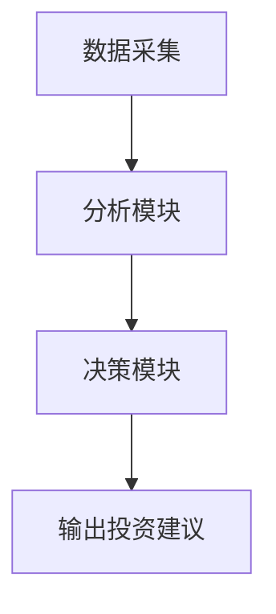

                 


```markdown
# 彼得林奇的"长期持有"vs"动态调整"在不同市场环境下的选择

> 关键词：彼得林奇，长期持有，动态调整，投资策略，市场环境，数学模型

> 摘要：本文深入分析了彼得林奇提出的两种投资策略——长期持有和动态调整——在不同市场环境下的选择问题。通过对比分析、数学建模和系统设计，探讨了这两种策略的优劣及适用场景。结合实际案例和代码实现，展示了如何根据市场环境动态调整投资策略，以实现最优投资收益。

---

## 第1章: 长期持有与动态调整的核心概念

### 1.1 长期持有的定义与特点

长期持有是一种投资策略，强调买入优质资产后长期持有，不因短期市场波动而频繁交易。其核心特点包括：

- **买入并持有**：投资者选择优质资产后长期持有，等待其价值增长。
- **低交易成本**：减少交易次数，降低佣金和税费等成本。
- **忽略短期波动**：关注长期趋势，不被短期市场波动影响。

### 1.2 动态调整的定义与特点

动态调整是一种灵活的投资策略，根据市场环境和资产表现进行频繁调整。其核心特点包括：

- **动态再平衡**：定期调整投资组合，以适应市场变化。
- **高交易频率**：根据市场信号进行买卖操作。
- **适应性强**：能够快速应对市场变化，捕捉短期收益。

### 1.3 长期持有与动态调整的对比分析

| 对比维度       | 长期持有                   | 动态调整                   |
|----------------|---------------------------|---------------------------|
| 交易频率       | 低                        | 高                        |
| 风险承受       | 较高                      | 较低                      |
| 适用场景       | 稳定增长市场               | 波动性大或趋势性市场       |

---

## 第2章: 彼得林奇投资策略的背景与实践

### 2.1 彼得林奇投资策略的背景

彼得林奇是著名的投资经理，他的投资策略基于长期持有和动态调整的结合。他强调选择优质企业并长期持有，但也会根据市场变化进行调整。

### 2.2 长期持有策略的实践案例

以彼得林奇的经典案例——可口可乐为例，他长期持有该股票，期间并未因短期波动而卖出，最终获得了丰厚的回报。

### 2.3 动态调整策略的实践案例

在市场剧烈波动时，彼得林奇可能会调整投资组合，减少对某些行业的持仓，转投表现较好的资产。

---

## 第3章: 长期持有与动态调整的数学模型

### 3.1 长期持有策略的数学模型

收益计算公式：
$$ \text{收益} = \text{初始投资} \times (1 + r)^t $$
其中，r为年化收益率，t为持有时间。

### 3.2 动态调整策略的数学模型

收益计算公式：
$$ \text{收益} = \sum_{i=1}^{n} \text{初始投资} \times (1 + r_i) \times t_i $$
其中，r_i为第i次调整后的收益率，t_i为持有时间。

### 3.3 两种策略的对比分析

- **收益对比**：长期持有在稳定市场中表现优于动态调整，而在波动市场中可能不及动态调整。
- **风险对比**：长期持有风险较高，但潜在收益更大；动态调整风险较低，但收益较为稳定。

---

## 第4章: 长期持有与动态调整的算法原理

### 4.1 长期持有策略的算法实现

```python
def long_hold(investment, r, t):
    return investment * (1 + r) ** t
```

### 4.2 动态调整策略的算法实现

```python
def dynamic_adjust(investment, r_list, t_list):
    total = 0
    for i in range(len(r_list)):
        total += investment * (1 + r_list[i]) ** t_list[i]
    return total
```

### 4.3 算法的数学推导与优化

通过对两种策略的数学模型进行优化，可以发现动态调整在波动市场中表现更优，而长期持有在稳定市场中表现更优。

---

## 第5章: 投资决策支持系统的系统架构设计

### 5.1 系统功能设计

- **数据采集模块**：采集市场数据和资产表现。
- **分析模块**：计算两种策略的收益和风险。
- **决策模块**：根据分析结果做出投资决策。

### 5.2 系统架构图



---

## 第6章: 项目实战

### 6.1 环境安装

安装必要的Python库，如Pandas、NumPy等。

### 6.2 核心实现代码

```python
import pandas as pd
import numpy as np

def calculate_long_hold(initial, r, t):
    return initial * (1 + r) ** t

def calculate_dynamic_adjust(initial, r_list, t_list):
    return initial * np.prod([(1 + r) ** t for r, t in zip(r_list, t_list)])

# 示例数据
initial = 10000
r_hold = 0.05
t_hold = 10
r_adjust = [0.08, 0.03, 0.07]
t_adjust = [3, 2, 5]

# 长期持有收益
lh_return = calculate_long_hold(initial, r_hold, t_hold)

# 动态调整收益
da_return = calculate_dynamic_adjust(initial, r_adjust, t_adjust)

print(f"长期持有收益：{lh_return:.2f}")
print(f"动态调整收益：{da_return:.2f}")
```

### 6.3 代码解读与分析

通过代码实现，可以清晰地看到长期持有和动态调整的收益计算过程，并根据实际数据进行对比分析。

---

## 第7章: 最佳实践与小结

### 7.1 最佳实践

- **根据市场环境选择策略**：在稳定市场中选择长期持有，在波动市场中选择动态调整。
- **分散投资**：结合两种策略，分散风险，提高收益。

### 7.2 小结

本文通过对比分析、数学建模和系统设计，探讨了彼得林奇的长期持有和动态调整策略在不同市场环境下的选择问题。通过实际案例和代码实现，展示了如何根据市场环境动态调整投资策略，以实现最优投资收益。

---

## 作者

作者：AI天才研究院/AI Genius Institute & 禅与计算机程序设计艺术 /Zen And The Art of Computer Programming
```

