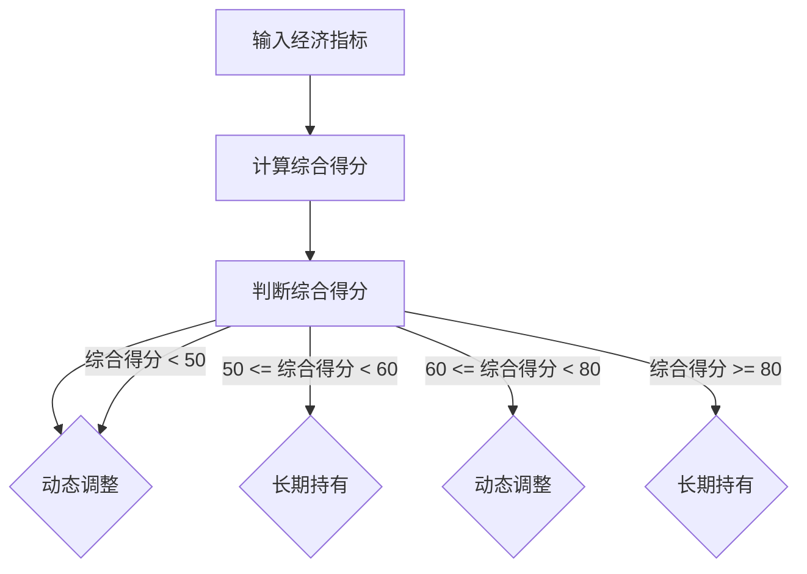
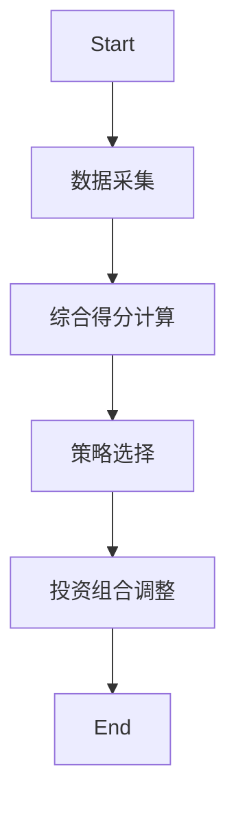

                 


# 彼得林奇的"长期持有"vs"动态调整"在不同经济周期的选择

---

## 关键词：彼得林奇，长期持有，动态调整，经济周期，投资策略，决策模型

---

## 摘要：  
本文通过分析彼得林奇的“长期持有”和“动态调整”两种投资策略，在不同经济周期下的表现和适用性，探讨如何根据市场环境选择最优策略。文章结合经济周期理论，构建了一个基于经济指标的决策模型，并通过实例分析和数学公式，帮助投资者在实际操作中做出更明智的选择。

---

## # 引言

投资市场的波动性使得投资者在选择策略时面临巨大的挑战。彼得林奇作为投资领域的传奇人物，提出了“长期持有”和“动态调整”两种截然不同的投资策略。这两种策略在不同的经济周期下表现各异，本文将深入分析它们的核心原理、优缺点，并结合经济周期理论，为投资者提供一个选择策略的决策框架。

---

## # 第1章：彼得林奇投资策略的核心概念

### ## 1.1 长期持有与动态调整的定义

#### ### 1.1.1 长期持有的概念与特点

长期持有策略是指投资者在选定优质资产后，长期持有，不因短期市场波动而频繁调整投资组合。其核心理念是通过时间的积累，获得复利效应，实现财富的稳步增长。

- **特点**：  
  - 长期持有策略注重资产的内在价值，而非短期价格波动。  
  - 投资者需要具备较高的选股能力，选择那些具有持续增长潜力的企业。  
  - 适用于市场波动较小、经济增长稳定的周期。

#### ### 1.1.2 动态调整的定义与特点

动态调整策略是指投资者根据市场环境的变化，频繁调整投资组合，以捕捉短期收益。其核心理念是通过灵活的操作，最大化投资回报。

- **特点**：  
  - 动态调整策略注重市场趋势和短期机会，需要投资者对市场变化有敏锐的洞察力。  
  - 适用于市场波动较大、经济增长不稳定或快速变化的周期。  
  - 需要较高的交易频率和对市场的实时监控。

#### ### 1.1.3 两种策略的核心区别与联系

| 对比维度 | 长期持有 | 动态调整 |
|----------|----------|----------|
| 操作频率 | 低       | 高       |
| 风险偏好 | 低       | 中高     |
| 适用场景 | 稳定期   | 波动期   |

---

### ## 1.2 投资策略的背景与目标

#### ### 1.2.1 投资市场的基本特性

- **市场波动性**：股票市场的波动性使得投资者需要在不同周期下灵活调整策略。  
- **经济周期**：经济周期的波动（衰退、复苏、过热、滞胀）对投资策略的选择有重要影响。  
- **投资者行为**：投资者的风险偏好和资金需求也会影响策略的选择。

#### ### 1.2.2 投资者的目标与风险偏好

- **目标**：  
  - 长期持有策略适用于追求长期稳定收益的投资者。  
  - 动态调整策略适用于追求短期收益的投资者。  
- **风险偏好**：  
  - 长期持有策略适合风险厌恶型投资者。  
  - 动态调整策略适合风险偏好较高的投资者。

#### ### 1.2.3 彼得林奇策略的适用场景

- **长期持有**：适用于市场环境稳定、经济增长持续的周期。  
- **动态调整**：适用于市场波动剧烈、经济周期变化快的周期。

---

### ## 1.3 本章小结

本章介绍了彼得林奇的两种投资策略——长期持有和动态调整，并分析了它们的核心概念、特点和适用场景。投资者需要根据自身的风险偏好和市场环境选择适合的策略。

---

## # 第2章：经济周期对投资策略的影响

### ## 2.1 经济周期的定义与分类

#### ### 2.1.1 经济周期的四个阶段

- **衰退阶段**：经济增长放缓，企业盈利下降，市场波动性增加。  
- **复苏阶段**：经济逐渐恢复，企业盈利回升，市场开始反弹。  
- **过热阶段**：经济快速增长，企业盈利创新高，市场可能出现泡沫。  
- **滞胀阶段**：经济增长停滞，通货膨胀率高企，市场表现不佳。

#### ### 2.1.2 不同阶段的市场表现特征

| 经济阶段 | 市场表现 | 策略选择 |
|----------|----------|----------|
| 衰退     | 下跌     | 动态调整 |
| 复苏     | 上涨     | 长期持有 |
| 过热     | 泡沫     | 动态调整 |
| 滞胀     | 稳定     | 长期持有 |

---

### ## 2.2 经济周期对长期持有策略的影响

#### ### 2.2.1 长期持有在经济衰退中的表现

- **表现**：长期持有策略在衰退阶段可能面临较大亏损，但长期来看，优质资产会逐步恢复。  
- **案例分析**：2008年金融危机期间，长期持有优质股票的投资者在随后几年逐渐恢复并实现收益。

#### ### 2.2.2 长期持有在经济过热中的表现

- **表现**：在过热阶段，长期持有策略可能会错过市场调整的机会，但优质资产长期表现依然稳定。  
- **案例分析**：互联网泡沫时期的科技股，长期持有优质科技股（如苹果）的投资者最终实现收益。

---

### ## 2.3 经济周期对动态调整策略的影响

#### ### 2.3.1 动态调整在经济衰退中的表现

- **表现**：动态调整策略在衰退阶段可能通过提前卖出规避部分损失，但需要精准的市场判断。  
- **案例分析**：2020年新冠疫情初期，动态调整策略通过快速卖出规避了市场崩盘。

#### ### 2.3.2 动态调整在经济过热中的表现

- **表现**：在过热阶段，动态调整策略可能通过频繁交易捕捉短期收益，但也可能因误判市场而亏损。  
- **案例分析**：2021年加密货币市场的暴涨暴跌，动态调整策略可能通过高频交易获利，但也可能因错误判断而亏损。

---

### ## 2.4 本章小结

经济周期的变化对长期持有和动态调整策略的影响显著。投资者需要根据经济周期的阶段选择合适的策略，以最大化投资收益并降低风险。

---

## # 第3章：长期持有与动态调整的优缺点对比

### ## 3.1 长期持有策略的优缺点

#### ### 3.1.1 优点：简单、省时、降低交易成本

- **简单**：长期持有策略操作简单，无需频繁监控市场。  
- **省时**：投资者可以将时间用于其他领域，而非盯盘交易。  
- **降低交易成本**：长期持有减少了交易次数，从而降低了佣金和买卖价差。

#### ### 3.1.2 缺点：灵活性不足，可能错过短期收益

- **灵活性不足**：在市场快速变化时，长期持有策略可能无法及时调整。  
- **可能错过短期收益**：在某些周期中，动态调整可能带来更高的收益。

---

### ## 3.2 动态调整策略的优缺点

#### ### 3.2.1 优点：灵活性高，捕捉短期收益

- **灵活性高**：动态调整策略可以根据市场变化快速调整投资组合。  
- **捕捉短期收益**：在市场波动较大的阶段，动态调整策略可能带来更高的短期收益。

#### ### 3.2.2 缺点：交易成本高，容易犯错

- **交易成本高**：频繁交易可能导致佣金和买卖价差的增加。  
- **容易犯错**：动态调整策略需要精准的市场判断，容易因误判而亏损。

---

### ## 3.3 两种策略的适用场景对比

| 情况 | 长期持有适用 | 动态调整适用 |
|------|--------------|--------------|
| 市场波动 | 低           | 高           |
| 经济周期 | 稳定         | 波动         |
| 投资目标 | 长期收益     | 短期收益     |

---

### ## 3.4 本章小结

长期持有和动态调整策略各有优缺点，投资者需要根据市场环境和自身目标选择适合的策略。

---

## # 第4章：如何根据经济周期选择投资策略

### ## 4.1 经济周期的识别与预测

#### ### 4.1.1 经济周期的指标分析

- **GDP增长率**：经济增长率的变化可以反映经济周期。  
- **通货膨胀率**：通货膨胀率的上升可能预示着经济过热或滞胀。  
- **失业率**：失业率的变化可以反映经济的健康状况。

#### ### 4.1.2 市场情绪的判断方法

- **市场情绪指标**：通过市场情绪指标（如恐慌指数）判断市场的风险偏好。  
- **资金流向**：通过资金流向判断市场的热度。

---

### ## 4.2 不同经济周期下的策略选择

#### ### 4.2.1 经济衰退阶段的策略选择

- **策略选择**：动态调整策略，通过卖出规避风险。  
- **理由**：衰退阶段市场波动较大，长期持有可能面临较大亏损。

#### ### 4.2.2 经济复苏阶段的策略选择

- **策略选择**：长期持有策略，通过买入优质资产抓住市场反弹机会。  
- **理由**：复苏阶段市场逐渐稳定，长期持有可以带来复利效应。

#### ### 4.2.3 经济过热阶段的策略选择

- **策略选择**：动态调整策略，通过频繁交易捕捉短期收益。  
- **理由**：过热阶段市场波动剧烈，动态调整可以捕捉短期机会。

#### ### 4.2.4 经济滞胀阶段的策略选择

- **策略选择**：长期持有策略，通过持有优质资产应对通货膨胀。  
- **理由**：滞胀阶段市场表现稳定，长期持有可以抵御通货膨胀的影响。

---

### ## 4.3 本章小结

投资者需要根据经济周期的阶段选择适合的策略。衰退和过热阶段适合动态调整，复苏和滞胀阶段适合长期持有。

---

## # 第5章：彼得林奇策略的数学模型与算法实现

### ## 5.1 策略选择的数学模型

#### ### 5.1.1 经济周期的指标权重

| 指标 | GDP增长率 | 通货膨胀率 | 失业率 | 市场情绪 |
|------|-----------|------------|--------|----------|
| 权重 | 0.4       | 0.3        | 0.2    | 0.1      |

#### ### 5.1.2 经济周期的综合得分公式

$$ 综合得分 = 0.4 \times GDP + 0.3 \times Inflation + 0.2 \times Unemployment + 0.1 \times MarketSentiment $$

#### ### 5.1.3 策略选择的决策规则

- **综合得分 < 50**：经济衰退，选择动态调整策略。  
- **50 \leq 综合得分 < 60**：经济复苏，选择长期持有策略。  
- **60 \leq 综合得分 < 80**：经济过热，选择动态调整策略。  
- **综合得分 \geq 80**：经济滞胀，选择长期持有策略。

---

### ## 5.2 算法实现

#### ### 5.2.1 Python代码实现

```python
import numpy as np

# 定义经济指标
gdp = 1.5  # GDP增长率，单位：%
inflation = 2.5  # 通货膨胀率，单位：%
unemployment = 6.0  # 失业率，单位：%
market_sentiment = 50  # 市场情绪，范围：0-100

# 计算综合得分
score = 0.4 * gdp + 0.3 * inflation + 0.2 * unemployment + 0.1 * market_sentiment

# 策略选择
if score < 50:
    strategy = "动态调整"
elif 50 <= score < 60:
    strategy = "长期持有"
elif 60 <= score < 80:
    strategy = "动态调整"
else:
    strategy = "长期持有"

print(f"综合得分为 {score:.2f}，选择的策略是：{strategy}")
```

#### ### 5.2.2 算法流程图



---

### ## 5.3 本章小结

通过数学模型和算法实现，投资者可以根据经济指标的变化自动选择适合的策略，提高决策的科学性和效率。

---

## # 第6章：系统架构设计与项目实战

### ## 6.1 系统功能设计

#### ### 6.1.1 系统功能模块

| 模块 | 功能描述 |
|------|----------|
| 数据采集 | 采集经济指标数据（GDP、通胀率、失业率、市场情绪） |
| 综合得分计算 | 根据经济指标计算综合得分 |
| 策略选择 | 根据综合得分选择适合的策略 |
| 投资组合调整 | 根据选择的策略调整投资组合 |

#### ### 6.1.2 系统功能流程



---

### ## 6.2 项目实战

#### ### 6.2.1 数据采集与处理

```python
import pandas as pd

# 采集经济指标数据
data = {
    '季度': ['Q1', 'Q2', 'Q3', 'Q4'],
    'GDP增长率': [2.3, 2.5, 2.2, 2.4],
    '通货膨胀率': [1.8, 2.0, 2.1, 1.9],
    '失业率': [5.5, 5.7, 5.6, 5.4],
    '市场情绪': [60, 65, 70, 75]
}

df = pd.DataFrame(data)
print(df)
```

#### ### 6.2.2 策略选择与投资组合调整

```python
# 示例策略选择
gdp = 2.4
inflation = 2.0
unemployment = 5.4
market_sentiment = 70

score = 0.4 * gdp + 0.3 * inflation + 0.2 * unemployment + 0.1 * market_sentiment

if score < 50:
    strategy = "动态调整"
elif 50 <= score < 60:
    strategy = "长期持有"
elif 60 <= score < 80:
    strategy = "动态调整"
else:
    strategy = "长期持有"

print(f"综合得分为 {score:.2f}，选择的策略是：{strategy}")
```

---

### ## 6.3 本章小结

通过系统架构设计和项目实战，投资者可以自动化地根据经济指标选择适合的投资策略，并调整投资组合，提高投资效率和收益。

---

## # 第7章：总结与展望

### ## 7.1 本章小结

本文深入分析了彼得林奇的“长期持有”和“动态调整”两种投资策略，在不同经济周期下的表现和适用性。通过构建数学模型和算法，投资者可以根据经济指标的变化选择适合的策略，提高投资收益并降低风险。

---

### ## 7.2 对未来研究的展望

未来的研究可以进一步优化策略选择的数学模型，引入更多的经济指标和市场数据，提高决策的准确性和科学性。此外，还可以研究策略在不同市场环境下的组合优化问题，为投资者提供更全面的投资解决方案。

---

## # 作者

作者：AI天才研究院/AI Genius Institute & 禅与计算机程序设计艺术 /Zen And The Art of Computer Programming

