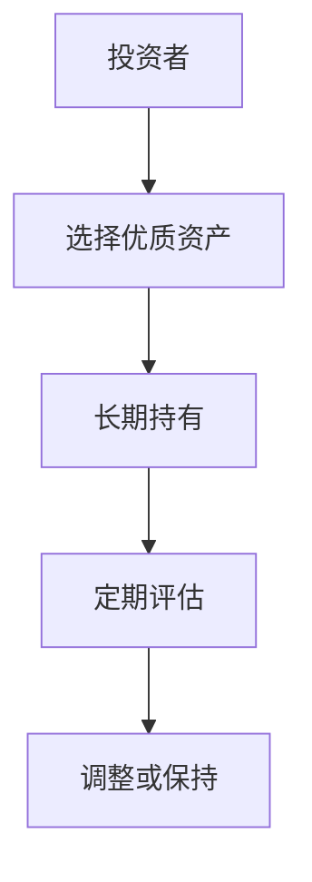
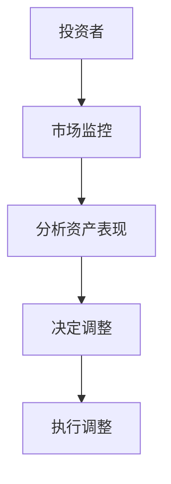
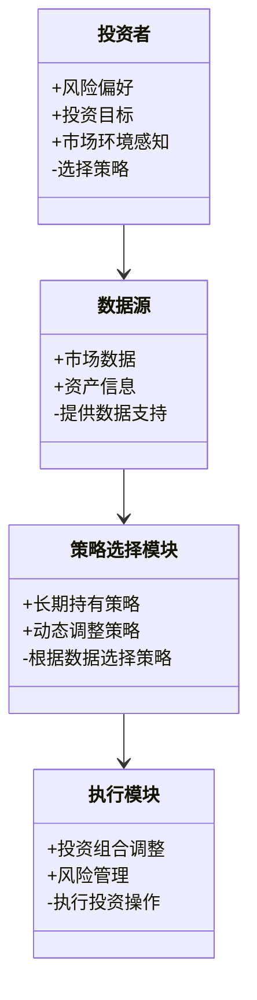
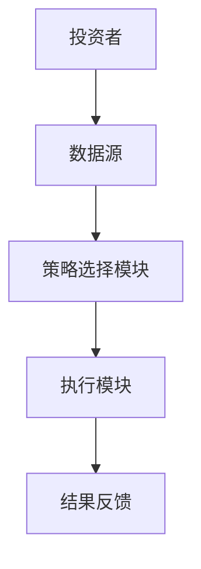

                 


# 彼得林奇的"长期持有"vs"动态调整"的决策框架

## 关键词：投资策略，彼得·林奇，长期持有，动态调整，投资决策，风险管理

## 摘要：  
彼得·林奇是美国著名投资专家，以其独特的投资理念闻名。他的“长期持有”和“动态调整”策略在投资领域具有重要地位。本文通过分析这两种策略的核心概念、决策框架、算法原理、系统设计以及实际案例，探讨它们的优缺点及适用场景，为投资者提供深度的决策参考。

---

## 第一章：彼得·林奇投资理念概述

### 1.1 长期持有与动态调整的定义  
长期持有策略是指投资者买入优质资产后，长期持有，不因短期市场波动而改变投资行为。动态调整策略则强调根据市场变化和个人目标，及时调整投资组合。

### 1.2 彼得·林奇投资理念的背景  
彼得·林奇在长期的投资实践中，总结出长期持有和动态调整的策略，适用于不同市场环境和个人风险偏好。本文将对比分析这两种策略的核心概念和决策框架。

---

## 第二章：长期持有与动态调整的核心概念

### 2.1 长期持有策略的特征  
- **时间跨度**：长期持有通常指持有期限超过5年，注重资产的长期增值。  
- **适用场景**：市场稳定、优质资产、低交易成本时。  
- **风险与收益**：风险较低，收益稳定，适合风险承受能力较低的投资者。

### 2.2 动态调整策略的特征  
- **调整频率**：根据市场变化，可能每月、季度或半年调整一次。  
- **触发条件**：市场波动、个人财务变化或投资目标调整时。  
- **风险与收益**：风险较高，收益可能更高，适合风险承受能力强的投资者。

### 2.3 两种策略的对比分析  
| 对比维度       | 长期持有               | 动态调整               |
|----------------|------------------------|------------------------|
| 时间跨度       | 长期（5年以上）         | 短期至中期（1-3年）     |
| 风险承受       | 低风险                 | 高风险                 |
| 适用场景       | 市场稳定               | 市场波动较大           |
| 收益预期       | 稳定收益               | 可能更高收益           |

---

## 第三章：长期持有与动态调整的决策框架

### 3.1 长期持有策略的决策流程  
- **选股标准**：选择基本面良好、具有长期增长潜力的资产。  
- **投资组合构建**：分散投资，降低风险。  
- **风险管理**：定期评估资产质量，避免重大风险。

### 3.2 动态调整策略的决策流程  
- **市场监控**：密切关注市场变化，分析资产表现。  
- **调整时机**：根据市场波动和个人目标变化，决定调整时间。  
- **调整幅度**：根据市场环境和个人风险偏好，调整投资比例。

### 3.3 两种策略的综合运用  
- **组合配置**：根据市场环境和个人风险偏好，动态调整长期持有的比例。  
- **灵活切换**：在市场剧烈波动时，可以临时采用动态调整策略，降低风险。

---

## 第四章：长期持有与动态调整的算法原理

### 4.1 长期持有策略的算法框架  


### 4.2 动态调整策略的算法框架  


---

## 第五章：系统分析与架构设计

### 5.1 投资决策系统功能设计  


### 5.2 系统架构设计  


---

## 第六章：项目实战——模拟投资组合

### 6.1 环境安装  
- 数据源：选择历史市场数据和资产表现数据。  
- 工具：使用Python和相关库（如Pandas、Matplotlib）进行数据分析和可视化。

### 6.2 核心代码实现  
```python
# 长期持有的收益计算
def calculate_long_term_return(prices, start, end):
    return prices[end] / prices[start] - 1

# 动态调整的收益计算
def calculate_dynamic_adjustment(prices, thresholds):
    returns = []
    for i in range(1, len(prices)):
        if prices[i] > thresholds[i]:
            returns.append((prices[i] / prices[i-1] - 1) * 100)
        else:
            returns.append(0)
    return returns

# 示例数据
prices = [100, 110, 105, 120, 130]
thresholds = [105, 110, 115, 120, 125]

# 计算收益
long_term_return = calculate_long_term_return(prices, 0, 4)
dynamic_returns = calculate_dynamic_adjustment(prices, thresholds)
print("长期持有收益：", long_term_return)
print("动态调整收益：", dynamic_returns)
```

---

## 第七章：最佳实践与总结

### 7.1 最佳实践  
- **风险管理**：无论选择哪种策略，都需要定期评估和调整风险管理措施。  
- **市场环境**：根据市场环境和个人风险偏好，灵活选择策略。  
- **持续学习**：保持对市场变化和策略优化的关注，提升投资效果。

### 7.2 小结  
长期持有和动态调整各有优缺点，适用于不同的市场环境和个人风险偏好。投资者应根据自身情况，合理配置策略，以实现长期稳健的投资收益。

---

## 作者：AI天才研究院/AI Genius Institute & 禅与计算机程序设计艺术 /Zen And The Art of Computer Programming

