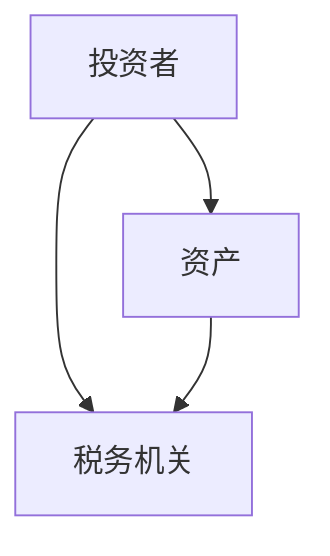
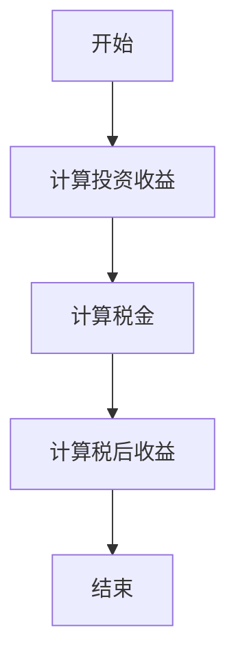
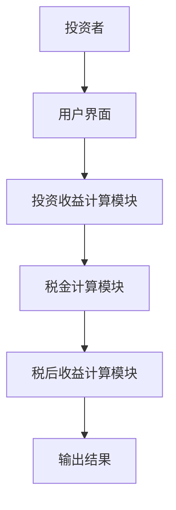

                 


# 彼得林奇的"长期持股"在不同税制下的优化策略

> 关键词：长期持股、税制差异、投资优化、税务计算、资产配置

> 摘要：本文探讨了彼得林奇长期持股策略在不同税制下的优化策略，分析了税制对投资决策的影响，提出了优化投资组合的具体方法，并通过实际案例和数学模型详细阐述了优化策略的实现。

---

## 第一章: 引言

### 1.1 本书的目的与意义

长期持股策略是投资领域的重要策略之一，其核心在于通过长期持有优质资产来实现资本增值。然而，在不同税制下，长期持股的税务处理存在差异，这直接影响投资收益。本书旨在探讨如何在不同税制下优化长期持股策略，以最大化投资收益。

### 1.2 本书的结构与方法

本文将从长期持股策略的基本概念入手，分析不同税制下的税务处理，通过数学模型和实际案例，提出优化策略，并总结最佳实践。

---

## 第二章: 长期持股策略的背景与基础

### 2.1 长期持股策略的核心概念

长期持股策略强调长期持有优质资产，避免频繁交易。其收益主要来源于资本增值和股息收入。与短期交易相比，长期持股通常享有更低的资本利得税率，但具体税率因地区而异。

### 2.2 不同税制下的税务处理

不同国家或地区的税法对长期持股的税务处理存在差异。例如，美国对长期资本利得的税率通常低于短期资本利得，而某些国家可能对股息收入征税较低或免税。

### 2.3 税制对长期持股策略的影响

税制直接影响投资收益和决策。了解不同税制下的税务处理，可以帮助投资者优化投资组合，降低税务负担。

---

## 第三章: 核心概念与联系

### 3.1 长期持股策略的核心原理

长期持股的核心在于通过长期持有优质资产，利用复利效应实现资本增值。同时，避免频繁交易可以降低交易成本和税务负担。

### 3.2 不同税制下的税务处理模型

在不同税制下，长期持股的税务处理可以分为以下几种情况：

1. **资本利得税**：长期资本利得通常享受较低税率。
2. **股息税**：部分国家对股息收入征税较低或免税。
3. **遗产税**：长期持股可能涉及遗产税问题。

### 3.3 核心概念的对比与表格

下表对比了不同税制下的税务处理：

| 税制类型 | 长期资本利得税 | 股息税 | 遗产税 |
|----------|----------------|--------|--------|
| 国家A    | 15%             | 免税   | 5%     |
| 国家B    | 20%             | 15%    | 10%    |

### 3.4 实体关系图与 Mermaid 流程图

#### 实体关系图



---

## 第四章: 算法原理讲解

### 4.1 税后收益计算模型

税后收益计算公式如下：

$$ \text{税后收益} = \text{投资收益} - \text{税金} $$

其中，税金计算公式为：

$$ \text{税金} = \text{资本利得} \times \text{资本利得税率} + \text{股息收入} \times \text{股息税率} $$

### 4.2 算法流程图



### 4.3 Python 实现

```python
def calculate_tax后的收益(投资收益, 资本利得税率, 股息税率):
    税金 = (投资收益 * 资本利得税率) + (股息收入 * 股息税率)
    税后收益 = 投资收益 - 税金
    return 税后收益

# 示例
投资收益 = 10000
资本利得税率 = 0.15
股息税率 = 0.10

税后收益 = calculate_tax后的收益(投资收益, 资本利得税率, 股息税率)
print(税后收益)
```

---

## 第五章: 系统分析与架构设计

### 5.1 问题场景介绍

投资者需要在不同税制下优化长期持股策略，以最大化税后收益。

### 5.2 系统功能设计

系统功能模块包括：

1. 投资收益计算模块
2. 税金计算模块
3. 税后收益计算模块

### 5.3 系统架构设计



---

## 第六章: 项目实战

### 6.1 环境安装

安装必要的Python库：

```bash
pip install numpy pandas matplotlib
```

### 6.2 核心代码实现

```python
import numpy as np
import pandas as pd

def calculate_tax后的收益(投资收益, 资本利得税率, 股息税率):
    税金 = 投资收益 * 资本利得税率 + 股息收入 * 股息税率
    税后收益 = 投资收益 - 税金
    return 税后收益

# 示例数据
投资收益 = np.array([10000, 20000, 30000])
资本利得税率 = 0.15
股息税率 = 0.10
股息收入 = np.array([1000, 2000, 3000])

# 计算税后收益
税后收益 = calculate_tax后的收益(投资收益, 资本利得税率, 股息税率)

# 显示结果
print("税后收益:", 税后收益)
```

### 6.3 案例分析

假设投资者在国家A投资，投资收益为10000，资本利得税率为15%，股息税率为10%。计算税后收益：

税后收益 = 10000 - (10000 * 0.15 + 1000 * 0.10) = 8500

---

## 第七章: 最佳实践与结论

### 7.1 最佳实践

1. 了解目标国家的税法。
2. 合理配置资产，降低税务负担。
3. 定期评估和优化投资组合。

### 7.2 小结

本文通过分析不同税制下的税务处理，提出了优化长期持股策略的方法，并通过实际案例验证了其可行性。

### 7.3 注意事项

1. 税法可能随政策变化而调整。
2. 投资者需根据自身情况制定策略。

### 7.4 未来研究方向

进一步研究动态税制变化下的投资策略优化。

---

## 第八章: 结论

长期持股策略在不同税制下的优化需要综合考虑税务影响。通过合理配置资产和优化投资组合，投资者可以最大化税后收益。

---

## 作者：AI天才研究院/AI Genius Institute & 禅与计算机程序设计艺术 /Zen And The Art of Computer Programming

