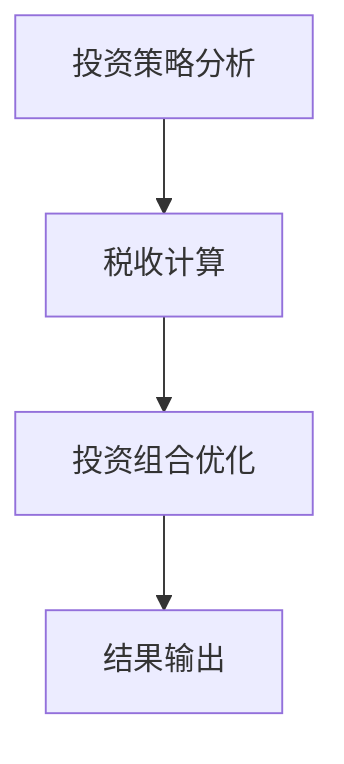

                 


# 彼得林奇的"长期持股"在不同税收环境下的策略

## 关键词
- 彼得林奇
- 长期持股
- 税收环境
- 投资策略
- 资本利得税
- 股息税

## 摘要
本文系统地探讨了彼得林奇的长期持股策略在不同税收环境下的应用和调整。通过分析不同国家和地区的税收政策，结合数学模型和实际案例，详细阐述了税收对投资决策的影响，提出了在不同税收环境下优化长期持股策略的方法。文章结构清晰，内容丰富，涵盖背景介绍、核心概念、系统分析、项目实战等多个方面，为投资者提供了实用的指导和参考。

---

# 目录

## 第一部分：彼得林奇的长期持股策略概述

### 第1章：彼得林奇的长期持股策略背景

#### 1.1 长期持股策略的定义与核心理念

- 1.1.1 长期持股的定义  
- 1.1.2 彼得林奇长期持股策略的核心理念  
- 1.1.3 长期持股与短期交易的对比分析  

#### 1.2 税收环境对投资策略的影响

- 1.2.1 税收在投资中的重要性  
- 1.2.2 不同税收环境下的投资策略差异  
- 1.2.3 税收政策对企业投资决策的影响  

### 第2章：彼得林奇长期持股策略的核心概念

#### 2.1 长期持股策略的数学模型

- 2.1.1 投资回报率的计算公式  
$$ ROI = \frac{（最终价值 - 初始价值）}{初始价值} \times 100\% $$  
- 2.1.2 税后收益的计算公式  
$$ 税后收益 = 收益 \times （1 - 税率） $$  

#### 2.2 税收环境下的投资策略分析

- 2.2.1 不同税率对投资回报的影响  
- 2.2.2 税收优惠政策对长期持股的影响  
- 2.2.3 税收环境变化对投资策略的调整  

---

## 第二部分：不同税收环境下的长期持股策略

### 第3章：美国税收环境下的长期持股策略

#### 3.1 美国税法对长期持股的优惠政策

- 3.1.1 长期资本利得税的定义与税率  
- 3.1.2 美国税法中对股息税的优惠政策  
- 3.1.3 美国市场长期持股的经典案例分析  

#### 3.2 美国不同税率下的投资策略调整

- 3.2.1 高税率环境下的资产配置优化  
- 3.2.2 低税率环境下的投资机会挖掘  
- 3.2.3 税收政策变化对投资组合的影响  

### 第4章：其他主要国家的税收环境与长期持股策略

#### 4.1 欧洲国家的税收政策与投资策略

- 4.1.1 欧洲主要国家的资本利得税政策  
- 4.1.2 欧洲国家的股息税政策及其影响  
- 4.1.3 欧洲市场长期持股策略的优化  

#### 4.2 亚洲国家的税收政策与投资策略

- 4.2.1 亚洲主要国家的资本利得税政策  
- 4.2.2 亚洲国家的股息税政策及其影响  
- 4.2.3 亚洲市场长期持股策略的优化  

#### 4.3 其他地区税收政策对长期持股的影响

- 4.3.1 澳大利亚、加拿大等其他地区的税收政策分析  
- 4.3.2 不同税收政策下的投资策略调整  
- 4.3.3 地区间税收差异对全球投资策略的影响  

---

## 第三部分：税收环境下的投资组合优化

### 第5章：投资组合优化的数学模型

#### 5.1 投资组合优化的数学模型

- 5.1.1 投资组合的收益-风险权衡  
$$ E(R_i) = \beta_i \times E(R_m) + \alpha_i $$  
- 5.1.2 税收对投资组合收益的影响  
$$ 税后收益 = 收益 \times （1 - 税率） $$  

#### 5.2 不同税收环境下的投资组合调整策略

- 5.2.1 根据税率调整资产配置  
- 5.2.2 税收优惠政策下的资产优化配置  
- 5.2.3 税收环境变化下的动态调整策略  

### 第6章：系统架构与实现

#### 6.1 系统功能设计

- 6.1.1 投资策略分析模块  
- 6.1.2 税收计算模块  
- 6.1.3 投资组合优化模块  

#### 6.2 系统架构设计

- 6.2.1 系统架构图（使用mermaid）  


#### 6.3 系统接口设计

- 6.3.1 投资数据接口  
- 6.3.2 税收数据接口  
- 6.3.3 结果输出接口  

#### 6.4 系统交互设计

- 6.4.1 用户输入投资目标  
- 6.4.2 系统计算最优投资组合  
- 6.4.3 输出结果并提出建议  

---

## 第四部分：项目实战

### 第7章：项目实战：环境安装与核心实现

#### 7.1 环境安装

- 7.1.1 安装Python环境  
- 7.1.2 安装必要的库（如numpy、pandas、matplotlib）  

#### 7.2 核心实现

- 7.2.1 投资回报率计算函数  
```python
def calculate_roi(initial_value, final_value):
    return (final_value - initial_value) / initial_value * 100
```
- 7.2.2 税后收益计算函数  
```python
def calculate_tax_free_return(taxable_income, tax_rate):
    return taxable_income * (1 - tax_rate)
```

### 第8章：实际案例分析与解读

#### 8.1 案例分析：美国市场中的长期持股策略

- 8.1.1 案例背景  
- 8.1.2 投资组合构建  
- 8.1.3 税收影响分析  
- 8.1.4 结果分析与优化  

#### 8.2 案例分析：欧洲市场的长期持股策略

- 8.2.1 案例背景  
- 8.2.2 投资组合构建  
- 8.2.3 税收影响分析  
- 8.2.4 结果分析与优化  

---

## 第五部分：总结与展望

### 第9章：总结与展望

#### 9.1 小结

- 9.1.1 核心内容回顾  
- 9.1.2 关键发现与启示  

#### 9.2 展望

- 9.2.1 未来研究方向  
- 9.2.2 投资策略的进一步优化  
- 9.2.3 税收政策变化的应对策略  

---

## 附录

### 附录A：常用公式汇总

### 附录B：系统架构图详细说明

### 附录C：项目源代码

---

## 作者信息

作者：AI天才研究院/AI Genius Institute  
联系邮箱：contact@ai-genius.org  

---

通过以上目录结构，我们可以清晰地看到文章的逻辑框架和主要内容，确保每个部分都得到充分的展开和详细说明。

