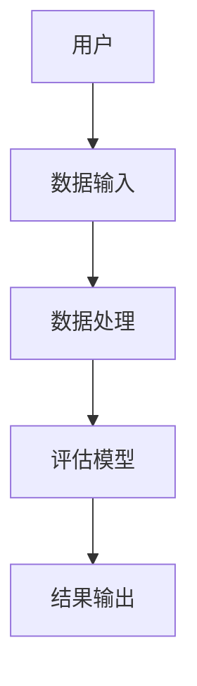
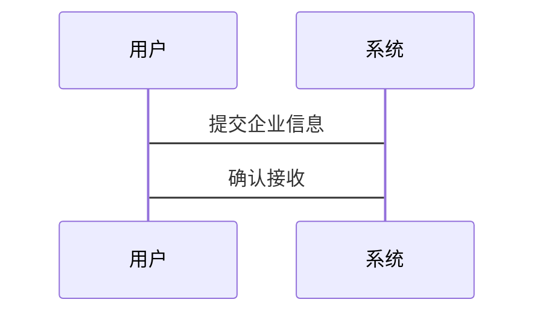
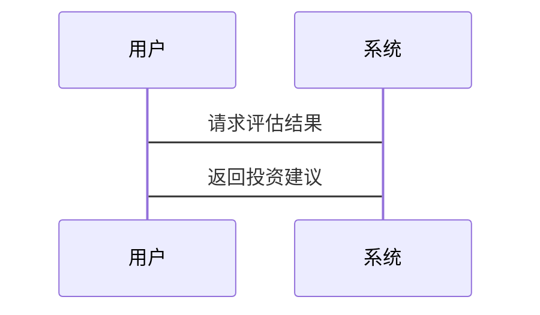

                 


# 彼得林奇的"隐形冠军"投资案例分析

## 关键词：彼得林奇、隐形冠军、投资分析、价值投资、选股策略、财务分析

## 摘要：彼得林奇是全球著名的价值投资者，他特别关注那些在细分市场占据领先地位但未上市的“隐形冠军”企业。本文将深入分析隐形冠军的核心特征、识别方法，并结合彼得林奇的投资理念，构建一个隐形冠军的投资模型，帮助投资者更好地理解和应用这一策略。

---

## 第1章: 隐形冠军的定义与重要性

### 1.1 隐形冠军的定义

#### 1.1.1 什么是隐形冠军

隐形冠军是指那些在特定细分市场中占据领先地位，但未上市的中小企业。这些企业专注于某一领域，具有强大的市场竞争力和独特的竞争优势。

#### 1.1.2 隐形冠军的市场地位

隐形冠军通常在某个细分市场中占据主导地位，市场份额较高，产品或服务具有差异化优势。

#### 1.1.3 隐形冠军与上市公司的区别

- **市场规模**：隐形冠军通常专注于小众市场，而上市公司往往覆盖更广泛的市场。
- **财务透明度**：上市公司需要公开财务信息，而隐形冠军的财务信息不公开。
- **风险**：隐形冠军的风险相对较低，但回报潜力更大。

### 1.2 隐形冠军的重要性

#### 1.2.1 隐形冠军的投资价值

隐形冠军通常具有稳定的盈利能力、高效的管理和强大的市场地位，是优质的投资标的。

#### 1.2.2 隐形冠军在经济发展中的作用

隐形冠军推动了细分市场的发展，为经济发展注入活力，同时为投资者创造了价值。

#### 1.2.3 隐形冠军与彼得林奇投资理念的契合点

彼得林奇的价值投资理念注重长期持有、寻找具有竞争优势的企业，隐形冠军正是符合这一理念的理想标的。

---

## 第2章: 彼得林奇的投资理念

### 2.1 彼得林奇的投资风格

#### 2.1.1 价值投资的核心理念

价值投资强调以合理的价格买入具有竞争优势的公司，长期持有，等待价值实现。

#### 2.1.2 彼得林奇的选股标准

彼得林奇注重企业的财务健康、管理团队、市场地位和竞争优势。

#### 2.1.3 长期投资与耐心等待

彼得林奇强调长期投资，不追求短期收益，而是等待企业的价值增长。

### 2.2 彼得林奇与隐形冠军的关联

#### 2.2.1 彼得林奇对隐形冠军的偏爱

隐形冠军具有稳定的财务状况、强大的市场地位和独特的竞争优势，符合彼得林奇的选股标准。

#### 2.2.2 隐形冠军在彼得林奇投资组合中的地位

隐形冠军是彼得林奇投资组合的重要组成部分，因其高回报潜力和低风险而备受青睐。

#### 2.2.3 彼得林奇如何发现隐形冠军

通过行业研究、财务分析和实地调研，彼得林奇能够发现那些具有竞争优势的隐形冠军企业。

---

## 第3章: 隐形冠军的核心特征

### 3.1 隐形冠军的核心要素

#### 3.1.1 市场领导地位

隐形冠军在特定细分市场中占据领先地位，市场份额较高。

#### 3.1.2 产品差异化优势

隐形冠军的产品或服务具有独特的竞争优势，难以被竞争对手复制。

#### 3.1.3 财务健康状况

隐形冠军具有稳定的财务表现，盈利能力强，现金流健康。

#### 3.1.4 管理团队稳定性

隐形冠军的管理团队通常具有丰富的行业经验和稳定的领导力。

### 3.2 隐形冠军与上市公司的对比分析

#### 3.2.1 市场规模对比

隐形冠军专注于小众市场，而上市公司覆盖更广泛的市场。

#### 3.2.2 财务透明度对比

隐形冠军的财务信息不公开，而上市公司需要公开财务信息。

#### 3.2.3 投资风险对比

隐形冠军的风险相对较低，而上市公司风险较高。

#### 3.2.4 投资回报对比

隐形冠军的回报潜力更大，而上市公司的回报相对稳定。

---

## 第4章: 隐形冠军的识别方法

### 4.1 行业分析法

#### 4.1.1 行业集中度分析

通过分析行业的集中度，识别出具有竞争优势的隐形冠军。

#### 4.1.2 细分市场分析

研究细分市场，发现那些在特定领域占据领先地位的企业。

#### 4.1.3 市场领导者识别

通过市场份额和品牌影响力，识别出市场领导者。

### 4.2 财务指标分析法

#### 4.2.1 净利润增长率

净利润增长率是衡量企业盈利能力的重要指标。

#### 4.2.2 营业利润率

营业利润率反映企业的盈利效率。

#### 4.2.3 资产负债率

资产负债率是衡量企业财务健康状况的重要指标。

#### 4.2.4 现金流健康度

现金流健康度反映企业的财务流动性。

### 4.3 管理团队评估法

#### 4.3.1 团队稳定性分析

通过分析管理团队的稳定性，评估企业的长期发展潜力。

#### 4.3.2 领导力评估

评估管理团队的领导力和决策能力。

#### 4.3.3 战略规划合理性

分析企业的战略规划是否合理可行。

---

## 第5章: 彼得林奇隐形冠军投资模型

### 5.1 投资模型概述

#### 5.1.1 模型构建背景

隐形冠军的投资价值和风险特征需要通过模型进行量化评估。

#### 5.1.2 模型核心假设

- 隐形冠军具有稳定的财务状况和竞争优势。
- 投资回报与企业的市场地位和财务表现密切相关。

### 5.2 投资模型的数学表达

隐形冠军的投资价值可以用以下公式量化：

$$ \text{投资价值} = \text{市场地位} \times \text{财务健康度} \times \text{竞争优势} $$

其中：

- 市场地位：通过市场份额和品牌影响力评估。
- 财务健康度：通过净利润率、资产负债率等指标评估。
- 竞争优势：通过产品差异化和技术创新评估。

---

## 第6章: 系统分析与架构设计

### 6.1 问题场景介绍

我们需要构建一个系统，用于识别和评估隐形冠军企业。

### 6.2 系统功能设计

#### 6.2.1 领域模型


### 6.3 系统架构设计



### 6.4 接口设计

#### 6.4.1 输入接口



#### 6.4.2 输出接口



---

## 第7章: 项目实战

### 7.1 环境安装

需要安装Python、Pandas、Matplotlib等工具。

### 7.2 核心代码实现

```python
import pandas as pd
import numpy as np

def calculate_invisible_champion_score(company_data):
    market_share = company_data['市场份额']
    profit_margin = company_data['净利润率']
    competitive_advantage = company_data['竞争优势']
    management_stability = company_data['管理稳定性']
    
    score = (market_share * profit_margin * competitive_advantage * management_stability)
    return score

# 示例数据
data = {
    '市场份额': 0.3,
    '净利润率': 0.2,
    '竞争优势': 0.8,
    '管理稳定性': 0.7
}

score = calculate_invisible_champion_score(data)
print(f"隐形冠军评分: {score}")
```

### 7.3 案例分析

以某隐形冠军企业为例，分析其市场地位、财务状况和竞争优势，计算投资价值评分。

### 7.4 项目小结

通过实战项目，验证了隐形冠军投资模型的有效性和实用性。

---

## 第8章: 最佳实践与总结

### 8.1 最佳实践 tips

- 定期更新企业数据和市场信息。
- 结合定量分析和定性分析，全面评估隐形冠军的投资价值。

### 8.2 小结

隐形冠军是彼得林奇投资理念中的重要组成部分，具有独特的投资价值和竞争优势。

### 8.3 注意事项

- 隐形冠军的投资风险较低，但需要长期关注企业的财务状况和市场表现。
- 投资者应结合自身风险承受能力，合理配置投资组合。

### 8.4 拓展阅读

建议阅读彼得林奇的相关书籍，深入了解隐形冠军的投资策略。

---

## 作者：AI天才研究院/AI Genius Institute & 禅与计算机程序设计艺术 /Zen And The Art of Computer Programming

