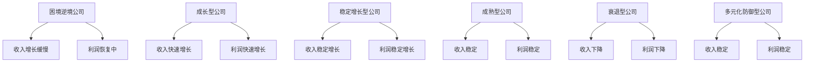

                 

好的，我们严格按照您的要求来完成内容创作，我们已经思考好了如何一步一步展开撰写，现在开始正式输出内容：

# 彼得林奇眼中的六类公司类型

> 关键词：彼得林奇，公司类型分析，投资策略，困境逆境公司，成长型公司，稳定增长型公司，成熟型公司，衰退型公司，多元化防御型公司

> 摘要：本文深入分析了彼得林奇在其投资生涯中总结的六类公司类型，包括困境逆境公司、成长型公司、稳定增长型公司、成熟型公司、衰退型公司和多元化防御型公司。文章详细探讨了每种公司的定义、特点、投资策略、案例分析以及优缺点，结合实际投资案例，帮助读者更好地理解如何根据公司类型制定投资策略。文章结构清晰，逻辑严密，内容详实，适合投资领域的专业人士和爱好者阅读。

---

## 第一部分: 彼得林奇投资理念与公司类型分析背景

### 第1章: 彼得林奇投资理念概述

#### 1.1 彼得林奇的背景与投资风格
彼得·林奇（Peter Lynch）是美国著名的投资经理人，以其在富达投资管理公司的长期任职期间，创造了卓越的投资业绩。他强调对公司基本面的深入研究，认为市场波动为投资者提供了廉价买入优质资产的机会。林奇的投资理念注重长期增长，而非短期市场波动，他主张投资者关注公司的财务状况、行业地位和竞争优势。

#### 1.2 为什么研究六类公司类型重要
林奇在其职业生涯中总结出六类公司类型，每种类型都有其独特的特点和投资价值。通过分类分析，投资者可以更好地识别不同公司的潜在风险和机会，制定相应的投资策略。这种分类方法不仅帮助投资者理解公司的基本面，还能帮助他们在市场波动中做出更明智的投资决策。

#### 1.3 公司类型分析的边界与外延
六类公司类型并非孤立存在，它们之间存在一定的重叠和联系。例如，一家成长型公司可能在某个阶段转变为稳定增长型公司。因此，投资者在分析公司类型时，需要考虑其动态变化，并结合市场环境和公司自身的经营状况进行综合判断。

---

### 第2章: 六类公司类型的核心概念

#### 2.1 核心概念的结构与组成
六类公司类型包括：
1. **困境逆境公司**：公司面临短期财务困难，但具有长期增长潜力。
2. **成长型公司**：公司处于高速成长阶段，收入和利润持续增长。
3. **稳定增长型公司**：公司收入和利润稳步增长，但增速放缓。
4. **成熟型公司**：公司处于成熟阶段，收入和利润趋于稳定。
5. **衰退型公司**：公司收入和利润持续下降，面临行业衰退或管理问题。
6. **多元化防御型公司**：公司通过多元化经营降低风险，具有较强的抗周期性。

#### 2.2 公司类型对比特征表格

| 公司类型                | 收入增长 | 利润增长 | 市场地位 | 估值 | 风险 |
|-------------------------|----------|----------|----------|------|------|
| 困境逆境公司            | 缓慢     | 恢复中    | 较弱     | 低   | 高   |
| 成长型公司              | 快速     | 快速     | 中等     | 高   | 中等 |
| 稳定增长型公司          | 稳定     | 稳定     | 较强     | 中等 | 低   |
| 成熟型公司              | 稳定     | 稳定     | 强        | 低   | 低   |
| 衰退型公司              | 下降     | 下降     | 较弱     | 低   | 高   |
| 多元化防御型公司        | 稳定     | 稳定     | 强        | 中等 | 低   |

#### 2.3 公司类型ER实体关系图（Mermaid流程图）

---

## 第二部分: 六类公司类型分析

### 第3章: 困境逆境公司分析

#### 3.1 困境逆境公司的定义与特点
**定义**：困境逆境公司是指那些因行业周期、管理问题或财务困境而暂时陷入低谷的公司。

**特点**：
- 收入增长缓慢或下降。
- 利润处于恢复期，可能为负。
- 市场地位较弱，竞争力不足。
- 估值通常较低，可能存在被低估的机会。

#### 3.2 困境逆境公司的投资策略
**识别方法**：
- 关注财务指标，如ROE（净资产收益率）、毛利率下降。
- 分析公司管理层的稳定性。
- 考虑行业周期，判断公司是否处于复苏阶段。

**估值模型**：
困境逆境公司的估值通常较低，可以采用市净率（P/B）或EV/EBITDA进行评估。

**案例分析**：
以某制造公司为例，该公司因行业不景气导致收入下降，但通过成本控制和产品创新逐步恢复。

#### 3.3 困境逆境公司的优缺点
**优点**：
- 存在被低估的机会，潜在回报高。
- 管理改善后可能迎来业绩反转。

**缺点**：
- 风险较高，公司可能无法复苏。
- 股价波动较大，投资者需要耐心。

---

### 第4章: 成长型公司分析

#### 4.1 成长型公司的定义与特点
**定义**：成长型公司是指那些收入和利润持续快速增长的公司。

**特点**：
- 收入增长迅速，年增长率超过行业平均水平。
- 利润增长快，可能尚未盈利。
- 市场地位中等，具备较强的竞争优势。
- 估值较高，可能市盈率（P/E）或市销率（P/S）较高。

#### 4.2 成长型公司的投资策略
**识别方法**：
- 关注收入和利润的快速增长。
- 分析行业前景，判断公司是否处于高增长行业。
- 考虑公司的财务健康状况，如现金流是否为正。

**估值模型**：
成长型公司通常采用市盈率（P/E）或市销率（P/S）进行估值，但需注意高估值可能隐含较高的风险。

**案例分析**：
以某科技公司为例，该公司在人工智能领域快速增长，收入和利润均呈现高增长。

#### 4.3 成长型公司的优缺点
**优点**：
- 长期增长潜力大，回报高。
- 适合风险承受能力强的投资者。

**缺点**：
- 估值可能过高，存在泡沫风险。
- 市场波动较大，股价可能剧烈波动。

---

### 第5章: 稳定增长型公司分析

#### 5.1 稳定增长型公司的定义与特点
**定义**：稳定增长型公司是指收入和利润稳步增长的公司。

**特点**：
- 收入增长稳定，年增长率在5%-10%之间。
- 利润稳步增长，通常高于行业平均水平。
- 市场地位较强，具备一定的竞争优势。
- 估值中等，市盈率和市净率均在合理范围内。

#### 5.2 稳定增长型公司的投资策略
**识别方法**：
- 关注收入和利润的稳步增长。
- 分析行业前景，判断公司是否处于稳定增长的行业。
- 考虑公司的财务健康状况，如现金流是否为正。

**估值模型**：
稳定增长型公司通常采用市盈率（P/E）或市净率（P/B）进行估值，需关注估值是否合理。

**案例分析**：
以某消费品公司为例，该公司在稳定增长的行业（如食品行业）中稳步扩展市场份额。

#### 5.3 稳定增长型公司的优缺点
**优点**：
- 风险较低，适合保守型投资者。
- 股票价格波动较小，回报稳定。

**缺点**：
- 增长潜力有限，回报可能不如成长型公司。
- 需要长期持有，耐心等待增长兑现。

---

### 第6章: 成熟型公司分析

#### 6.1 成熟型公司的定义与特点
**定义**：成熟型公司是指收入和利润趋于稳定的公司。

**特点**：
- 收入增长缓慢，年增长率低于行业平均水平。
- 利润稳定，可能处于行业领先地位。
- 市场地位强，具备较高的品牌价值。
- 估值较低，通常市盈率和市净率均较低。

#### 6.2 成熟型公司的投资策略
**识别方法**：
- 关注收入和利润的稳定性。
- 分析行业前景，判断公司是否处于成熟行业。
- 考虑公司的财务健康状况，如现金流是否为正。

**估值模型**：
成熟型公司通常采用股息率（Dividend Yield）或市盈率（P/E）进行估值，需关注股息支付能力和估值是否合理。

**案例分析**：
以某公用事业公司为例，该公司在成熟行业（如电力行业）中具备稳定的收入和利润。

#### 6.3 成熟型公司的优缺点
**优点**：
- 风险较低，适合保守型投资者。
- 股息回报稳定，适合追求稳定收益的投资者。

**缺点**：
- 增长潜力有限，回报可能不如其他类型公司。
- 需要长期持有，耐心等待股息回报。

---

### 第7章: 衰退型公司分析

#### 7.1 衰退型公司的定义与特点
**定义**：衰退型公司是指收入和利润持续下降的公司。

**特点**：
- 收入增长缓慢或下降，年增长率低于行业平均水平。
- 利润持续下降，可能为负。
- 市场地位较弱，竞争力不足。
- 估值较低，可能存在退市风险。

#### 7.2 衰退型公司的投资策略
**识别方法**：
- 关注收入和利润的持续下降。
- 分析行业前景，判断公司是否处于衰退行业。
- 考虑公司的财务健康状况，如现金流是否为负。

**估值模型**：
衰退型公司通常采用市净率（P/B）或EV/EBITDA进行估值，需关注是否存在退市风险。

**案例分析**：
以某传统制造公司为例，该公司因行业衰退和管理问题导致收入和利润持续下降。

#### 7.3 衰退型公司的优缺点
**优点**：
- 存在扭亏为盈的机会，潜在回报高。
- 估值极低，可能被市场忽视。

**缺点**：
- 风险极高，公司可能无法扭亏为盈。
- 股价波动较大，投资者需要承担较高的风险。

---

### 第8章: 多元化防御型公司分析

#### 8.1 多元化防御型公司的定义与特点
**定义**：多元化防御型公司是指通过多元化经营降低风险的公司。

**特点**：
- 收入和利润稳定，具备较强的抗周期性。
- 市场地位强，具备较高的品牌价值。
- 估值中等，市盈率和市净率均在合理范围内。

#### 8.2 多元化防御型公司的投资策略
**识别方法**：
- 关注公司业务多元化程度。
- 分析公司的财务状况，如现金流是否为正。
- 考虑行业前景，判断公司是否具备较强的抗周期性。

**估值模型**：
多元化防御型公司通常采用市盈率（P/E）或市净率（P/B）进行估值，需关注估值是否合理。

**案例分析**：
以某多元化跨国公司为例，该公司通过多元化业务在不同行业中分散风险，具备较强的抗周期性。

#### 8.3 多元化防御型公司的优缺点
**优点**：
- 风险较低，具备较强的抗周期性。
- 股票价格波动较小，回报稳定。

**缺点**：
- 增长潜力有限，回报可能不如成长型公司。
- 需要长期持有，耐心等待增长兑现。

---

## 第三部分: 总结与建议

### 第9章: 总结
通过分析六类公司类型，投资者可以更好地理解不同公司的特点和投资价值。每种公司类型都有其独特的风险和机会，投资者需要根据自身的风险承受能力和投资目标选择合适的投资策略。

### 第10章: 投资建议
1. **困境逆境公司**：适合风险承受能力强的投资者，但需谨慎选择，避免陷入无法复苏的公司。
2. **成长型公司**：适合长期投资者，但需注意估值过高和市场波动风险。
3. **稳定增长型公司**：适合保守型投资者，回报稳定，风险较低。
4. **成熟型公司**：适合追求稳定收益的投资者，股息回报稳定。
5. **衰退型公司**：风险极高，适合风险承受能力极强的投资者，需谨慎选择。
6. **多元化防御型公司**：适合长期投资者，具备较强的抗周期性，回报稳定。

---

## 作者：AI天才研究院/AI Genius Institute & 禅与计算机程序设计艺术 /Zen And The Art of Computer Programming

