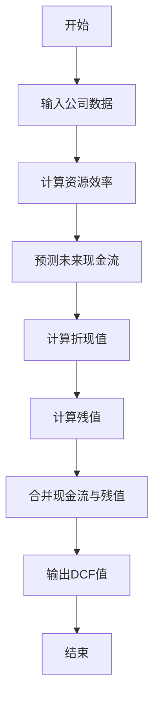
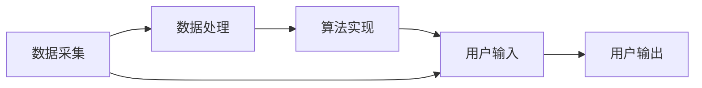

                 


# 循环经济模式下的公司估值方法

## 关键词
循环经济、公司估值、DCF模型、资源效率、可持续发展

## 摘要
在循环经济模式下，公司估值方法需要考虑资源的循环利用和可持续发展。本文详细探讨了循环经济的基本概念、传统估值方法的局限性，并提出了改进的估值模型，结合实际案例进行分析，为循环经济下的公司估值提供新的思路。

---

# 第1章：循环经济模式概述

## 1.1 循环经济的基本概念

### 1.1.1 循环经济的定义与特征
循环经济是一种以资源高效利用和循环再生为核心的发展模式，强调减少资源消耗和废弃物产生，通过闭环系统实现可持续发展。其主要特征包括：
- 资源节约：最大限度地减少资源输入和废弃物输出。
- 循环利用：废弃物转化为资源，重新进入生产或消费环节。
- 生态友好：减少对环境的负担，促进生态系统的健康。

### 1.1.2 循环经济与传统经济的区别
循环经济与传统经济的主要区别在于资源利用方式和价值创造模式。传统经济遵循“资源-产品-废弃物”的线性模式，而循环经济则通过“资源-产品-再利用”形成闭环，强调资源的多次利用和废弃物的再生。

### 1.1.3 循环经济的核心原则
循环经济的核心原则包括减量化（Reduce）、再利用（Reuse）和再循环（Recycle），即“3R”原则。这些原则指导企业在生产过程中减少资源消耗，延长产品生命周期，并促进废弃物的再生利用。

## 1.2 公司估值的基本概念

### 1.2.1 传统公司估值方法概述
传统的公司估值方法主要包括：
- **现金流折现法（DCF模型）**：通过预测未来现金流并将其折现为现值，评估公司整体价值。
- **相对估值法**：通过比较公司与可比公司的市盈率、市净率等指标，估算公司价值。
- **资产基础法**：基于公司资产负债表，评估其资产净值。

### 1.2.2 循环经济模式下的公司估值特点
在循环经济模式下，公司估值需要考虑以下特点：
- **资源效率**：企业通过高效利用资源和循环利用废弃物创造价值。
- **收入来源多样化**：企业可能从废弃物回收、资源再生等领域获得额外收入。
- **长期可持续性**：循环经济模式强调企业的长期可持续发展，而非短期收益。

### 1.2.3 问题背景与问题描述
随着环保压力的增加，企业需要通过循环经济模式实现可持续发展。然而，传统的估值方法难以准确反映循环经济模式下的价值创造过程，导致企业价值被低估或高估。因此，如何调整传统估值方法，使其适用于循环经济模式下的企业，成为一个亟待解决的问题。

---

# 第2章：循环经济模式下的公司估值核心概念

## 2.1 核心概念原理

### 2.1.1 循环经济中的资源效率
资源效率是指单位资源投入所能创造的经济价值。在循环经济模式下，企业通过提高资源利用率，降低废弃物产生，从而提高资源效率。例如，一家制造企业通过回收生产过程中的废弃物，将其转化为原材料，从而降低材料成本，提高资源效率。

### 2.1.2 循环经济中的收入来源
循环经济模式下，企业的收入来源可能包括：
- **产品销售**：通过设计可回收或可再利用的产品，延长产品生命周期，增加销售收入。
- **废弃物回收**：将生产过程中产生的废弃物进行分类回收，出售给相关企业，获得额外收入。
- **服务收入**：提供废弃物管理、资源再生等服务，增加收入来源。

### 2.1.3 循环经济中的成本结构
循环经济模式下的成本结构可能与传统模式不同。企业可能需要投入更多的资源用于废弃物回收和资源再生，但长期来看，这将降低企业的原材料成本和废弃物处理成本。因此，企业在初始阶段可能面临较高的成本，但长期来看，成本结构将更加优化。

## 2.2 概念属性特征对比表格

| **属性**          | **循环经济模式**                          | **传统经济模式**                          |
|--------------------|------------------------------------------|------------------------------------------|
| 资源利用          | 高效利用，强调循环再生                  | 单一利用，资源消耗                      |
| 收入来源          | 多样化，包括产品销售、废弃物回收等       | 单一，主要依赖产品销售                  |
| 成本结构          | 长期优化，资源再生成本较高              | 短期较高，废弃物处理成本较低            |
| 可持续性          | 强调长期可持续发展                      | 可能导致资源枯竭和环境污染              |

## 2.3 ER实体关系图

```mermaid
erd
title 循环经济模式下的公司估值ER图

Company
公司信息包括公司名称、行业、成立时间等。

Resource
资源信息包括原材料、能源等。

Reuse
再利用信息包括废弃物再利用的方式、合作伙伴等。

RevenueSource
收入来源包括产品销售收入、废弃物回收收入等。

CostStructure
成本结构包括原材料成本、废弃物处理成本等。

Sustainability
可持续性指标包括碳排放量、资源利用率等。
```

---

# 第3章：循环经济模式下的公司估值算法原理

## 3.1 算法原理概述

### 3.1.1 循环经济下的现金流折现模型
在循环经济模式下，现金流折现模型需要考虑资源的循环利用和废弃物的再利用带来的额外现金流。公式如下：

$$DCF = \sum_{t=1}^{n} \frac{CF_t}{(1 + r)^t} + \frac{残值}{(1 + r)^n}$$

其中，$CF_t$ 表示第t年的现金流，$r$ 表示折现率，$n$ 表示预测期数，残值表示资源再利用带来的残值收入。

### 3.1.2 资源效率的数学模型
资源效率可以通过以下公式进行衡量：

$$资源效率 = \frac{产出}{资源消耗}$$

产出包括产品的销售收入和废弃物回收收入，资源消耗包括原材料和能源的使用量。

## 3.2 算法流程图



---

# 第4章：系统分析与架构设计方案

## 4.1 问题场景介绍
以一家制造企业为例，该公司希望通过循环经济模式优化资源利用，降低生产成本，并提高企业价值。为了实现这一目标，企业需要构建一个支持循环经济估值的系统。

## 4.2 系统功能设计

### 4.2.1 数据采集模块
- 收集企业的资源消耗数据、废弃物产生数据、产品销售收入和废弃物回收收入等。

### 4.2.2 数据处理模块
- 分析资源效率，计算资源再利用带来的额外收益。

### 4.2.3 算法实现模块
- 应用改进的DCF模型，计算企业价值。

### 4.2.4 结果展示模块
- 以可视化的方式展示企业价值评估结果，包括DCF值、资源效率和可持续性指标。

## 4.3 系统架构设计



## 4.4 系统接口设计
- 数据接口：与企业的ERP系统对接，获取资源消耗和销售收入数据。
- 结果接口：将评估结果输出为报告或可视化图表，供管理层决策。

---

# 第5章：项目实战

## 5.1 环境安装
- 安装Python、数据分析库（如Pandas、NumPy）和可视化工具（如Matplotlib）。

## 5.2 核心实现源代码

```python
import pandas as pd
import numpy as np

def calculate_dcf(cash_flows, discount_rate, salvage_value):
    n = len(cash_flows)
    dcf = sum(cash_flows[t] / (1 + discount_rate)**t for t in range(n))
    dcf += salvage_value / (1 + discount_rate)**n
    return dcf

# 示例数据
cash_flows = [100, 200, 300, 400, 500]
discount_rate = 0.1
salvage_value = 1000

# 计算DCF
dcf_value = calculate_dcf(cash_flows, discount_rate, salvage_value)
print(f"DCF Value: {dcf_value}")
```

---

# 第6章：总结与建议

## 6.1 最佳实践 tips
- 在进行循环经济模式下的公司估值时，应考虑资源效率和废弃物再利用带来的额外收益。
- 使用改进的DCF模型，将循环经济因素纳入估值过程。

## 6.2 小结
本文详细探讨了循环经济模式下的公司估值方法，提出了改进的DCF模型，并通过实际案例进行了分析。循环经济模式下的公司估值需要综合考虑资源效率、收入来源和成本结构，以准确反映企业的价值。

## 6.3 注意事项
- 数据的准确性和完整性对估值结果至关重要。
- 模型的应用需要结合企业的实际情况进行调整。

## 6.4 拓展阅读
- 推荐阅读《循环经济与企业战略》和《可持续发展与公司估值》等书籍，深入理解循环经济对企业价值的影响。

---

# 作者
作者：AI天才研究院 & 禅与计算机程序设计艺术

