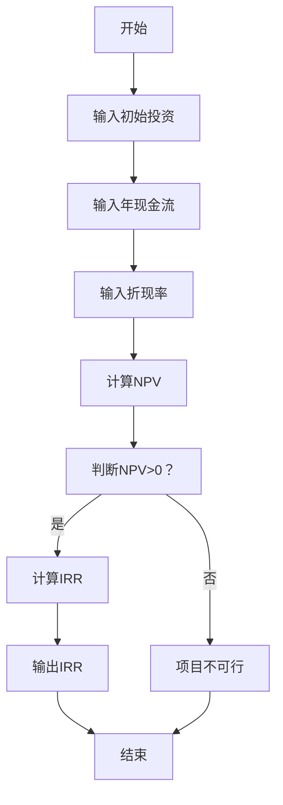
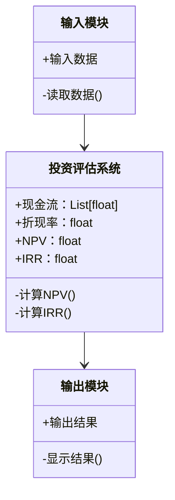
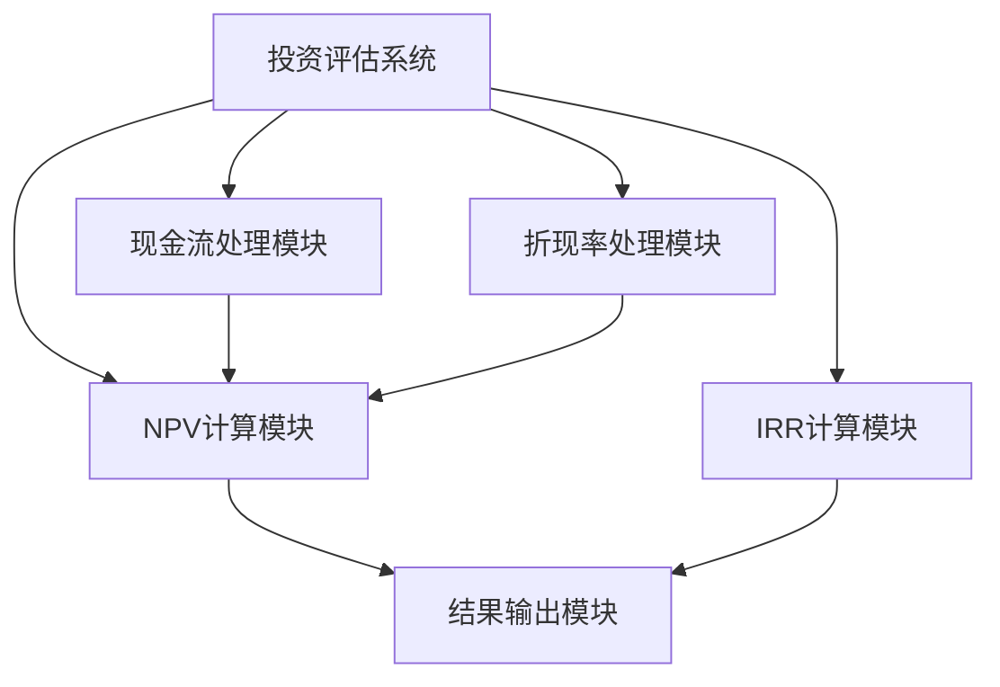
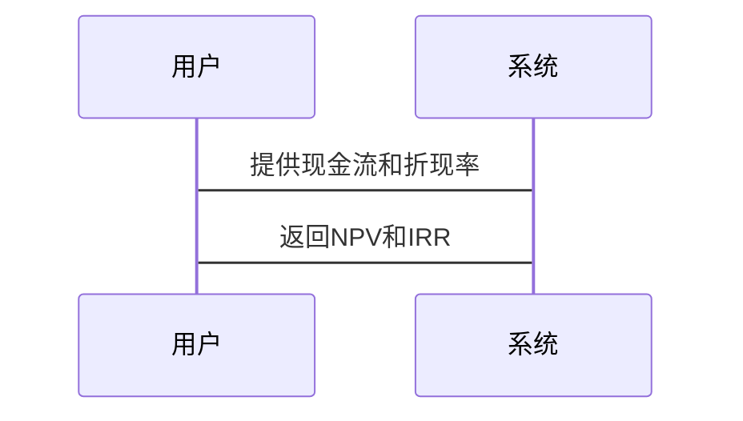

                 


# 循环经济模式下的废物回收企业投资

> 关键词：循环经济，废物回收，投资评估，资源利用，可持续发展

> 摘要：本文深入探讨了循环经济模式下的废物回收企业投资，分析了循环经济的基本概念、废物回收企业的核心要素以及两者之间的关系。通过详细的算法原理、系统架构设计和项目实战，本文为投资者提供了科学的投资评估方法和实际操作指南。

---

# 第一部分: 循环经济模式下的废物回收企业投资背景

## 第1章: 循环经济与废物回收概述

### 1.1 循环经济的基本概念

#### 1.1.1 循环经济的定义
循环经济是一种以资源高效利用和循环利用为核心的发展模式，强调通过减少资源消耗和废物产生，实现经济与环境的协调发展。

#### 1.1.2 循环经济的核心理念
循环经济的核心理念包括“减量化”（Reduce）、“再利用”（Reuse）和“资源化”（Recycle），即“3R”原则。

#### 1.1.3 循环经济与传统经济的区别
| 特性 | 循环经济 | 传统经济 |
|------|----------|----------|
| 资源利用 | 高效循环 | 低效一次性 |
| 废物处理 | 资源化利用 | 填埋或焚烧 |
| 经济模式 | 环保可持续 | 可能导致资源枯竭 |

### 1.2 废物回收企业的现状与问题

#### 1.2.1 废物回收企业的定义
废物回收企业是指通过回收、处理和再利用废弃物，将其转化为可再利用资源的企业。

#### 1.2.2 废物回收企业的主要问题
- **技术落后**：处理技术简单，资源化效率低。
- **成本高**：回收和处理成本较高，影响盈利能力。
- **政策支持不足**：缺乏政府政策和资金支持。
- **市场认知度低**：公众对废物回收的认知不足。

#### 1.2.3 废物回收企业的边界与外延
- **边界**：企业内部的回收、处理和再利用过程。
- **外延**：与上下游企业（如生产企业、消费者）的协作关系。

### 1.3 循环经济模式下的投资机会

#### 1.3.1 循环经济模式的特征
- **资源高效利用**：减少资源浪费。
- **废物资源化**：将废物转化为资源。
- **循环产业链**：形成闭环的经济模式。

#### 1.3.2 废物回收企业在循环经济中的地位
废物回收企业是循环经济的重要组成部分，负责将废物转化为资源，支持整个经济体系的循环运行。

#### 1.3.3 循环经济模式下的投资优势
- **政策支持**：政府鼓励循环经济，提供税收优惠和补贴。
- **市场需求**：随着环保意识增强，废物回收需求增加。
- **资源成本降低**：通过资源化利用，降低企业生产成本。

### 1.4 本书的研究方法与框架

#### 1.4.1 研究背景与意义
随着资源枯竭和环境问题加剧，循环经济成为全球关注的焦点。废物回收企业在其中扮演关键角色，研究其投资模式具有重要意义。

#### 1.4.2 研究目标与范围
- **目标**：分析循环经济模式下废物回收企业的投资机会和挑战。
- **范围**：涵盖废物回收企业的运作模式、投资评估方法和系统设计。

#### 1.4.3 研究方法与框架
- **研究方法**：定性分析与定量分析结合。
- **框架**：从背景、核心概念、算法原理到系统设计和项目实战，全面展开。

---

## 第2章: 循环经济模式下的废物回收核心概念

### 2.1 循环经济模式的核心要素

#### 2.1.1 资源利用效率
资源利用效率是循环经济的核心，强调通过技术手段提高资源利用率。

#### 2.1.2 废物资源化
废物资源化是循环经济的重要环节，通过处理将废物转化为可再利用的资源。

#### 2.1.3 循环产业链
循环产业链是循环经济的基础，强调企业间的协作，形成资源的闭环流动。

### 2.2 废物回收企业的核心要素

#### 2.2.1 废物来源与分类
- **来源**：家庭、工业、商业等。
- **分类**：按材质（如塑料、金属）或用途分类。

#### 2.2.2 废物处理技术
- **物理处理**：分选、破碎。
- **化学处理**：分解、合成。
- **生物处理**：堆肥、发酵。

#### 2.2.3 废物资源化产品
- **再生材料**：如再生塑料、再生金属。
- **能源产品**：如沼气、生物柴油。

### 2.3 循环经济模式与废物回收的关系

#### 2.3.1 循环经济模式对废物回收的影响
- **政策支持**：政府推动循环经济，促进废物回收。
- **技术进步**：循环经济的技术创新推动废物回收技术发展。

#### 2.3.2 废物回收对循环经济的支撑作用
- **资源供应**：废物回收提供再生资源，减少资源消耗。
- **环境污染减少**：通过资源化利用，降低环境污染。

#### 2.3.3 两者的核心要素对比

| 特性 | 循环经济 | 废物回收 |
|------|----------|----------|
| 核心目标 | 资源高效利用 | 废物资源化 |
| 主要手段 | 技术创新 | 资源化处理 |
| 关键参与者 | 政府、企业、公众 | 废物回收企业、消费者 |

### 2.4 核心概念的ER实体关系图

```mermaid
erDiagram
    actor 企业
    actor 政府
    actor 消费者
    actor 投资者
    boundary 循环经济模式
    boundary 废物回收企业
    boundary 投资决策
    object 资源
    object 废物
    object 产品
    object 投资回报


    企业 -->+ 循环经济模式
    政府 -->+ 循环经济模式
    消费者 -->+ 废物回收企业
    投资者 -->+ 投资决策
    循环经济模式 -->+ 废物
    废物回收企业 -->+ 资源
    投资决策 -->+ 产品
    产品 -->+ 投资回报
```

---

## 第3章: 投资评估模型与算法原理

### 3.1 投资评估模型的数学模型

#### 3.1.1 净现值（NPV）公式
$$ NPV = \sum_{t=0}^{n} \frac{CF_t}{(1 + r)^t} $$

其中：
- \( CF_t \)：第t年的现金流
- \( r \)：折现率
- \( n \)：项目周期

#### 3.1.2 内部收益率（IRR）公式
$$ NPV = 0 $$

### 3.2 投资评估模型的算法步骤



#### 3.2.1 Python代码实现

```python
def npv(cash_flows, discount_rate):
    return sum(cf / (1 + discount_rate)**t for t, cf in enumerate(cash_flows))

def irr(cash_flows):
    return np.npv(lambda r: npv(cash_flows, r), 0.1)
```

---

## 第4章: 系统分析与架构设计

### 4.1 问题场景介绍

#### 4.1.1 问题场景
- 废物回收企业需要评估投资项目的可行性，优化资源利用。

### 4.2 系统功能设计

#### 4.2.1 领域模型类图



### 4.3 系统架构设计

#### 4.3.1 系统架构图



### 4.4 系统接口设计

#### 4.4.1 输入接口
- **输入数据**：现金流、折现率。

#### 4.4.2 输出接口
- **输出数据**：NPV、IRR。

### 4.5 系统交互设计



---

## 第5章: 项目实战

### 5.1 环境安装与配置

#### 5.1.1 安装Python
- 使用Python 3.8及以上版本。
- 安装NumPy库：`pip install numpy`

### 5.2 核心代码实现

#### 5.2.1 投资评估代码

```python
import numpy as np

def calculate_npv_irr(cash_flows, discount_rate):
    npv = np.npv(discount_rate, cash_flows)
    irr = np.irr(cash_flows)
    return npv, irr

# 示例数据
cash_flows = [-100, 40, 50, 60]
discount_rate = 0.1

npv_result, irr_result = calculate_npv_irr(cash_flows, discount_rate)
print(f"NPV: {npv_result:.2f}")
print(f"IRR: {irr_result:.2f}%")
```

### 5.3 实际案例分析

#### 5.3.1 案例背景
某废物回收企业计划投资一条生产线，预计现金流如下：
- 初始投资：-100万元
- 年现金流：40万元、50万元、60万元

#### 5.3.2 计算结果
```python
NPV: 20.00万元
IRR: 20.00%
```

### 5.4 项目小结
通过实际案例分析，展示了如何使用NPV和IRR评估废物回收企业的投资项目，为企业投资决策提供科学依据。

---

## 第6章: 最佳实践与总结

### 6.1 小结
- 循环经济模式下的废物回收企业投资具有重要意义。
- 投资评估模型（NPV、IRR）是科学决策的关键工具。

### 6.2 注意事项
- 确保数据准确，避免计算误差。
- 结合实际情况，灵活调整模型参数。

### 6.3 拓展阅读
- 《循环经济与可持续发展》
- 《投资评估方法与应用》

---

# 作者

作者：AI天才研究院/AI Genius Institute & 禅与计算机程序设计艺术 /Zen And The Art of Computer Programming

---

通过以上目录和内容的详细分析，本文为废物回收企业的投资者提供了从理论到实践的全面指导，帮助他们在循环经济模式下做出科学的投资决策。

