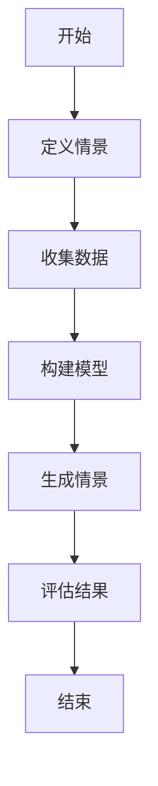
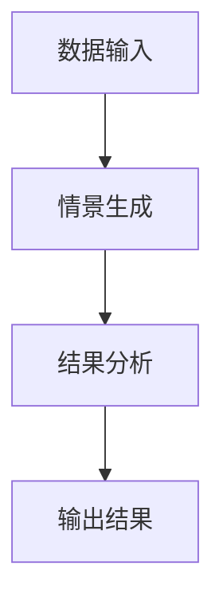

                 


# 情景分析：评估不同市场环境下的组合表现

> 关键词：情景分析，投资组合，市场环境，风险管理，资产配置，组合表现，数学模型

> 摘要：情景分析是一种重要的方法，用于评估投资组合在不同市场环境下的表现。本文将从情景分析的背景和概念入手，详细探讨其核心原理、算法设计、数学模型、系统架构、项目实战以及最佳实践，帮助读者全面理解并掌握情景分析的应用。

---

## 第一部分: 情景分析概述

### 第1章: 情景分析的背景与概念

#### 1.1 问题背景
- 1.1.1 投资组合风险管理的重要性
- 1.1.2 市场环境变化对企业决策的影响
- 1.1.3 情景分析的定义与目标

#### 1.2 问题描述
- 1.2.1 投资组合在不同市场环境下的表现差异
- 1.2.2 市场环境的不确定性对企业决策的影响
- 1.2.3 情景分析在投资决策中的作用

#### 1.3 问题解决
- 1.3.1 情景分析的基本方法
- 1.3.2 情景分析的核心步骤
- 1.3.3 情景分析的实际应用案例

#### 1.4 边界与外延
- 1.4.1 情景分析的适用范围
- 1.4.2 情景分析的局限性
- 1.4.3 情景分析与其他风险评估方法的区别

#### 1.5 概念结构与核心要素
- 1.5.1 情景分析的框架
- 1.5.2 核心要素的定义与关系
- 1.5.3 情景分析的流程图

### 第2章: 情景分析的核心概念与联系

#### 2.1 核心概念原理
- 2.1.1 情景分析的基本原理
- 2.1.2 情景分析的关键要素
- 2.1.3 情景分析的数学模型

#### 2.2 情景分析属性特征对比
- 2.2.1 不同情景分析方法的对比
- 2.2.2 情景分析的关键指标
- 2.2.3 情景分析的优缺点

#### 2.3 ER实体关系图架构
- 2.3.1 实体关系图的定义
- 2.3.2 实体关系图的绘制
- 2.3.3 实体关系图的分析

### 第3章: 情景分析的算法原理

#### 3.1 算法原理概述
- 3.1.1 情景分析的基本算法
- 3.1.2 情景分析的数学模型
- 3.1.3 情景分析的实现步骤

#### 3.2 算法流程图


#### 3.3 算法实现代码
```python
import numpy as np

def generate情景(assets, scenarios):
    returns = np.random.randn(len(assets), scenarios)  # 生成随机回报
    return returns

assets = 5
scenarios = 3
returns = generate情景(assets, scenarios)
print(returns)
```

---

## 第二部分: 情景分析的数学模型

### 第4章: 数学模型构建

#### 4.1 资产回报的计算
$$
R_i = \mu_i + \epsilon_i
$$
其中，$R_i$ 是资产 $i$ 的回报，$\mu_i$ 是均值，$\epsilon_i$ 是误差项。

#### 4.2 协方差矩阵的构建
$$
\text{协方差矩阵} = \frac{1}{n-1} \sum_{i=1}^{n} (x_i - \bar{x})(y_i - \bar{y})^T
$$

#### 4.3 情景生成的步骤
1. 收集历史数据
2. 计算资产回报和协方差矩阵
3. 生成不同的情景
4. 评估投资组合在每种情景下的表现

---

## 第三部分: 情景分析的系统架构

### 第5章: 系统架构设计

#### 5.1 系统功能设计
- 数据输入模块：接收资产数据和市场数据
- 情景生成模块：构建数学模型并生成情景
- 结果分析模块：评估投资组合在不同情景下的表现

#### 5.2 系统架构图


---

## 第四部分: 情景分析的项目实战

### 第6章: 项目实战

#### 6.1 环境安装
```bash
pip install numpy pandas
```

#### 6.2 核心代码实现
```python
import numpy as np
import pandas as pd

def compute_回报(assets, scenarios):
    returns = np.random.randn(len(assets), scenarios)
    return pd.DataFrame(returns, columns=[f'情景{i+1}' for i in range(scenarios)])

assets = ['股票', '债券', '现金']
scenarios = 3
returns = compute_回报(assets, scenarios)
print(returns)
```

#### 6.3 代码解读与分析
- `compute_回报`函数生成随机回报矩阵
- 使用 `pandas` 对数据进行处理和分析

#### 6.4 案例分析
- 生成三种市场情景
- 评估投资组合在每种情景下的表现
- 讨论结果的意义

---

## 第五部分: 最佳实践与总结

### 第7章: 最佳实践

#### 7.1 关键点总结
- 数据质量的重要性
- 情景的合理性和多样性
- 结果的解释和应用

#### 7.2 小结
- 情景分析的核心思想
- 情景分析的实际应用价值

#### 7.3 注意事项
- 数据的准确性和完整性
- 模型的合理性和适用性
- 结果的解释和应用

#### 7.4 拓展阅读
- 风险管理的相关书籍
- 投资组合优化的最新研究

---

## 结语

情景分析是一种强大的工具，能够帮助投资者更好地理解投资组合在不同市场环境下的表现。通过本文的详细讲解，读者可以掌握情景分析的核心概念、算法原理、系统架构和实际应用。未来，随着市场的不断发展，情景分析将变得更加重要，值得深入研究和实践。

---

**作者：AI天才研究院/AI Genius Institute & 禅与计算机程序设计艺术 /Zen And The Art of Computer Programming**

