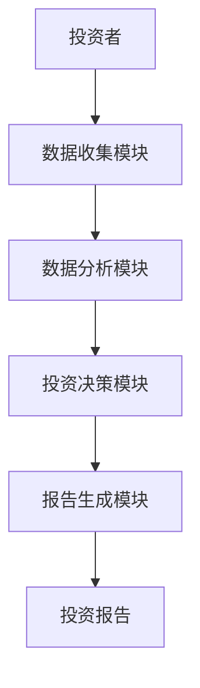
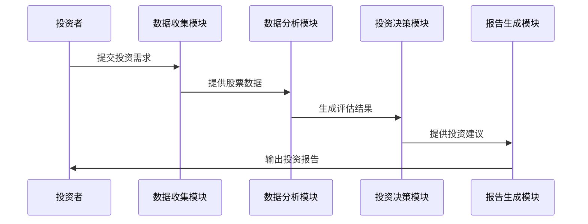

                 


---

# 成长股vs价值股：在当前市场环境中如何选择

> 关键词：成长股、价值股、投资策略、市场分析、股票估值、量化评估

> 摘要：本文详细探讨了成长股和价值股的核心概念、量化评估方法及其在当前市场环境中的应用策略。通过对比分析，帮助投资者理解两者的区别与联系，并结合实际案例，提供在不同市场环境下选择合适投资策略的指导。

---

## 第一部分: 成长股与价值股的背景与核心概念

### 第1章: 成长股与价值股的定义与区别

#### 1.1 成长股的定义与特征
##### 1.1.1 成长股的定义
成长股是指那些收入和利润增长迅速，具有较高成长潜力的公司股票。这类股票通常属于新兴产业或高增长行业，具有较高的市盈率（P/E）和市净率（P/B）。

##### 1.1.2 成长股的核心特征
- **收入增长率**：通常高于行业平均水平，表明公司业务扩展能力强。
- **净利润增长率**：表现出持续增长趋势，净利润率不断提高。
- **高市盈率**：由于高增长预期，成长股的市盈率往往高于市场平均水平。
- **高风险与高回报**：成长股的价格波动较大，但长期回报潜力高。

##### 1.1.3 成长股的高风险与高回报
- **高回报**：长期来看，成长股的收益可能远超价值股。
- **高风险**：由于高估值，成长股在市场下跌时可能面临更大的回撤风险。

#### 1.2 价值股的定义与特征
##### 1.2.1 价值股的定义
价值股是指那些市场价格低于其内在价值，通常被市场低估的公司股票。这类股票通常具有较低的市盈率和市净率，股息率较高。

##### 1.2.2 价值股的核心特征
- **低市盈率**：市场价格低于根据公司盈利计算出的合理价值。
- **低市净率**：市场价格低于根据公司资产计算出的合理价值。
- **高股息率**：通常会派发较高的股息，吸引注重收益的投资者。
- **稳定性与防御性**：价值股通常来自成熟行业，抗风险能力强。

#### 1.3 成长股与价值股的对比分析
##### 1.3.1 核心概念对比表

| 特性         | 成长股                          | 价值股                          |
|--------------|---------------------------------|---------------------------------|
| 核心驱动     | 收入和利润的高增长              | 低估值和稳定的收益              |
| 风险         | 高                             | 较低                            |
| 投资期限     | 长期                           | 短期或中短期                    |
| 适用市场     | 高增长行业，新兴产业            | 成熟行业，周期性底部            |

##### 1.3.2 成长股与价值股的优劣势对比
- **成长股的优势**：长期增长潜力大，适合风险承受能力强的投资者。
- **成长股的劣势**：短期波动大，估值过高时可能面临回调风险。
- **价值股的优势**：估值低，风险较低，股息收益稳定。
- **价值股的劣势**：增长潜力有限，行业周期性波动可能影响收益。

##### 1.3.3 两者的适用场景与投资策略
- **成长股适用场景**：经济处于上升周期，新兴行业快速发展时。
- **价值股适用场景**：经济处于下行周期，市场情绪低落时。

---

## 第2章: 当前市场环境下的投资策略

### 2.1 当前市场环境的分析
#### 2.1.1 经济周期对股票选择的影响
当前全球经济复苏乏力，通胀压力上升，央行货币政策趋于紧缩。在这种环境下，成长股可能面临估值压力，而价值股的防御性特征可能更受市场青睐。

#### 2.1.2 市场波动与投资者情绪
市场波动加剧，投资者情绪趋于保守，价值股的低估值特性更容易吸引资金流入。

#### 2.1.3 宏观经济指标对股票估值的影响
- **利率**：低利率环境有利于成长股的高估值。
- **通胀**：高通胀可能侵蚀价值股的购买力，但也会推高成长股的需求。

### 2.2 成长股与价值股的投资策略
#### 2.2.1 成长股的长期投资策略
- **行业选择**：关注人工智能、半导体、生物技术等高增长行业。
- **估值指标**：关注收入增长率和净利润增长率，合理评估成长股的估值水平。

#### 2.2.2 价值股的短期投资策略
- **行业选择**：关注传统行业、金融、公用事业等低增长但稳定行业。
- **估值指标**：关注市盈率、市净率和股息率，寻找被市场低估的价值股。

#### 2.2.3 组合投资的平衡策略
- **资产配置**：在成长股和价值股之间进行合理配置，平衡风险和收益。
- **动态调整**：根据市场变化，及时调整投资组合。

### 2.3 投资者心理与行为分析
#### 2.3.1 投资者认知偏差对决策的影响
- **过度自信**：投资者可能高估自己对市场的判断能力，导致投资失误。
- **从众心理**：市场波动时，投资者可能跟随大众情绪进行非理性投资。

#### 2.3.2 市场情绪与股票估值的关系
- **牛市**：市场情绪高涨，成长股估值可能过高。
- **熊市**：市场情绪低落，价值股可能被低估。

#### 2.3.3 如何克服非理性决策
- **制定投资计划**：明确投资目标和风险承受能力，避免情绪化决策。
- **分散投资**：通过多元化投资降低风险，避免过度集中于单一类型股票。

---

## 第3章: 成长股与价值股的核心要素分析

### 3.1 成长股的核心要素
#### 3.1.1 收入增长率
收入增长率是衡量成长股潜力的核心指标，通常要求年收入增长率超过行业平均水平。

#### 3.1.2 净利润增长率
净利润增长率反映了公司盈利能力的提升，是成长股的重要评估指标。

#### 3.1.3 资产负债表健康度
健康的资产负债表是成长股持续增长的基础，需关注公司的负债水平和现金流状况。

#### 3.1.4 行业地位与竞争优势
成长股通常来自具有竞争优势的行业领导者，需关注公司的市场占有率和技术创新能力。

### 3.2 价值股的核心要素
#### 3.2.1 市盈率（P/E）
市盈率是衡量价值股的关键指标，通常要求P/E低于行业平均水平。

#### 3.2.2 市净率（P/B）
市净率反映了股票价格与公司资产的匹配程度，是价值股的重要评估指标。

#### 3.2.3 股息率
股息率是衡量价值股收益能力的重要指标，通常要求股息率高于行业平均水平。

#### 3.2.4 财务稳定性与抗风险能力
价值股通常来自财务稳定的公司，需关注公司的盈利能力、现金流和资产负债表健康度。

### 3.3 成长股与价值股的核心要素对比
#### 3.3.1 成长股与价值股的核心要素对比表

| 特性         | 成长股                          | 价值股                          |
|--------------|---------------------------------|---------------------------------|
| 核心指标     | 收入增长率、净利润增长率        | 市盈率、市净率、股息率          |
| 财务健康度   | 较高                            | 较低                            |
| 行业地位     | 高                             | 中等                            |

---

## 第4章: 成长股与价值股的量化评估模型

### 4.1 成长股的量化评估指标
#### 4.1.1 收入增长率模型
收入增长率 = （当年收入 - 上年收入）/ 上年收入

#### 4.1.2 净利润增长率模型
净利润增长率 = （当年净利润 - 上年净利润）/ 上年净利润

#### 4.1.3 资产回报率（ROA）
ROA = 净利润 / 总资产

#### 4.1.4 股东权益回报率（ROE）
ROE = 净利润 / 股东权益

### 4.2 价值股的量化评估指标
#### 4.2.1 市盈率（P/E）
P/E = 股票价格 / 每股净利润

#### 4.2.2 市净率（P/B）
P/B = 股票价格 / 每股净资产

#### 4.2.3 股息率
股息率 = 每股股息 / 股票价格

#### 4.2.4 财务健康度模型
财务健康度 = （流动资产 / 流动负债）× 100%

### 4.3 成长股与价值股的综合评估模型
#### 4.3.1 综合评分模型
综合评分 = （收入增长率 × 30%） + （净利润增长率 × 30%） + （ROE × 20%） + （股息率 × 10%） + （P/E × 10%）

#### 4.3.2 成长股与价值股的内在联系
通过量化模型可以看出，成长股和价值股在不同市场环境下具有互补性，投资者可以根据市场周期和个人风险偏好选择合适的投资策略。

---

## 第5章: 成长股与价值股的系统分析与架构设计

### 5.1 系统功能设计
#### 5.1.1 数据收集模块
- 从金融数据库中获取股票的财务数据和市场数据。
- 数据清洗与预处理，确保数据的准确性和完整性。

#### 5.1.2 数据分析模块
- 使用Python和Pandas进行数据清洗和分析。
- 计算成长股和价值股的关键指标，如收入增长率、市盈率等。

#### 5.1.3 投资决策模块
- 根据量化模型生成投资建议，推荐适合当前市场环境的投资策略。
- 提供动态调整建议，帮助投资者及时应对市场变化。

#### 5.1.4 报告生成模块
- 自动生成投资报告，包括市场分析、股票评估和投资建议等内容。

### 5.2 系统架构设计
#### 5.2.1 系统架构图


#### 5.2.2 系统交互流程图


---

## 第6章: 成长股与价值股的项目实战

### 6.1 环境安装
#### 6.1.1 安装Python和相关库
```bash
pip install numpy pandas matplotlib
```

### 6.2 系统核心实现源代码
#### 6.2.1 数据收集与处理
```python
import pandas as pd
import numpy as np

# 数据收集模块
def collect_data(tickers):
    data = []
    for ticker in tickers:
        # 假设我们有一个函数获取股票数据
        stock_data = get_stock_data(ticker)
        data.append(stock_data)
    return pd.DataFrame(data)

# 数据清洗与预处理
def preprocess_data(df):
    df.dropna(inplace=True)
    df = df[df['P/E'] > 0]
    return df
```

#### 6.2.2 投资决策模块
```python
def evaluate_stocks(df):
    growth_stocks = df[df['收入增长率'] > industry_avg]
    value_stocks = df[df['P/E'] < market_avg]
    return growth_stocks, value_stocks
```

### 6.3 代码应用解读与分析
- **数据收集模块**：从金融数据库获取股票数据，确保数据的完整性和准确性。
- **数据清洗与预处理**：去除缺失值和异常值，确保数据可用于分析。
- **投资决策模块**：根据量化模型评估股票，生成成长股和价值股的推荐列表。

### 6.4 实际案例分析
#### 6.4.1 案例背景
假设当前市场处于经济复苏阶段，成长股和价值股的表现如何？

#### 6.4.2 数据分析
```python
# 假设我们有一个包含股票数据的DataFrame df
growth_stocks, value_stocks = evaluate_stocks(df)
print("成长股推荐:", growth_stocks)
print("价值股推荐:", value_stocks)
```

#### 6.4.3 投资建议
根据分析结果，投资者可以根据市场环境和个人风险偏好选择合适的投资策略。

### 6.5 项目小结
通过实际案例分析，我们可以看到成长股和价值股在不同市场环境下的表现差异，从而为投资者提供科学的投资决策依据。

---

## 第7章: 成长股与价值股的最佳实践

### 7.1 投资策略总结
- **成长股投资策略**：适合长期投资者，关注高增长行业，注重收入和利润增长率。
- **价值股投资策略**：适合保守投资者，关注低估值股票，注重市盈率和市净率。

### 7.2 小结
成长股和价值股各有优劣，投资者应根据市场环境和个人风险偏好进行合理配置。

### 7.3 注意事项
- **分散投资**：避免过度集中于单一类型股票，降低投资风险。
- **定期调整**：根据市场变化及时调整投资组合，保持投资策略的有效性。

### 7.4 拓展阅读
- 阅读更多关于股票投资的经典书籍，如《投资学》、《股票投资实战策略》等。

---

## 作者：AI天才研究院/AI Genius Institute & 禅与计算机程序设计艺术 /Zen And The Art of Computer Programming

