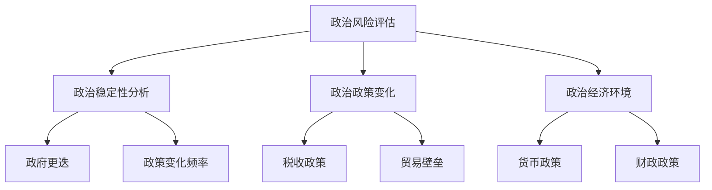
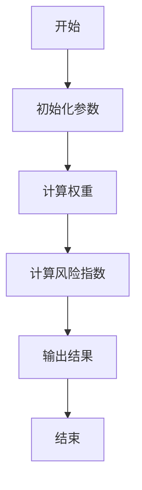
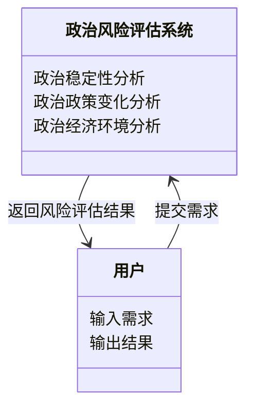
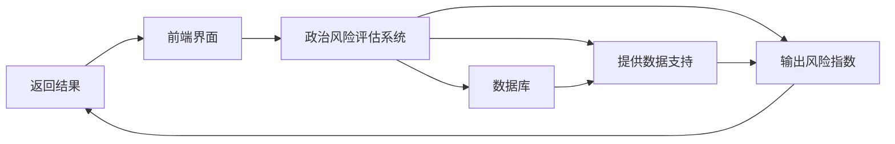

                 


# 托比亚斯·卡尔莱尔的政治风险评估模型

> **关键词**：政治风险评估模型、政治稳定性分析、风险指数计算、层次分析法、贝叶斯网络

> **摘要**：托比亚斯·卡尔莱尔的政治风险评估模型是一种用于分析和量化政治风险的系统方法。本文从模型的背景、核心概念、算法原理、系统架构到项目实战，全面解析该模型的构建逻辑、数学框架及实际应用场景。通过详细的理论阐述、算法流程图和代码实现，帮助读者理解如何运用该模型进行政治风险评估。

---

## 第一部分: 政治风险评估模型的背景与核心概念

### 第1章: 政治风险评估模型的背景介绍

#### 1.1 政治风险评估的定义与问题背景

政治风险是指由于政治因素的变化对企业、项目或投资产生的潜在影响。在国际商业环境中，政治风险的不确定性可能导致资产损失、项目延迟或法律纠纷等问题。因此，准确评估政治风险对于企业制定战略决策至关重要。

**问题背景**：企业在跨国经营中面临的政治风险包括政策变化、政府干预、社会动荡等。这些风险可能对企业的财务状况和业务稳定性造成严重影响。因此，如何量化这些风险，制定应对策略，成为企业风险管理的核心问题。

**政治风险评估的重要性**：通过评估政治风险，企业可以提前识别潜在威胁，制定风险缓解策略，优化投资决策。此外，政治风险评估还能帮助企业建立风险管理体系，提高抗风险能力。

**政治风险评估的边界与外延**：政治风险评估不仅关注国家层面的政治因素，还包括地方政策、社会运动、国际关系等多方面的影响。其外延涉及经济、法律、社会等多个领域。

#### 1.2 托比亚斯·卡尔莱尔模型的提出

**模型的提出背景**：托比亚斯·卡尔莱尔在政治经济学领域提出了一个创新的政治风险评估模型，旨在为企业提供一个系统化的风险分析框架。该模型结合了定量分析和定性分析，能够更全面地评估政治风险。

**模型的核心目标**：通过量化政治风险的影响因素，帮助企业识别关键风险点，制定应对策略。模型的核心目标是将复杂的政治因素转化为可量化的指标，便于企业进行风险管理和决策优化。

**模型的适用场景**：适用于跨国企业、投资项目、外交政策分析等领域。该模型特别适用于那些需要在复杂政治环境中进行决策的企业。

#### 1.3 政治风险评估的核心要素

**风险来源分析**：政治风险的主要来源包括政策变化、政府干预、社会动荡、国际关系等。例如，政策变化可能包括税收政策、贸易壁垒、外汇管制等。

**风险影响因素**：包括政治稳定性、政府透明度、法律体系完善程度、社会运动强度等因素。这些因素相互作用，共同影响政治风险的大小。

**风险评估指标**：常用的指标包括政治风险指数、政策变化频率、政府干预强度等。这些指标需要通过数据收集和分析来量化。

---

### 第2章: 模型的核心概念与理论基础

#### 2.1 政治风险评估的核心概念

**政治稳定性分析**：分析一个国家或地区的政治稳定性，包括政府更迭、政策变化的频率和幅度、社会动荡的发生概率等。

**政治政策变化**：分析政策变化的可能性及其对企业的影响。例如，税收政策的变化可能直接影响企业的财务状况。

**政治经济环境**：分析政治环境对经济的影响，包括经济政策、货币政策、财政政策等。

#### 2.2 模型的理论基础

**政治经济学基础**：政治经济学研究政治与经济之间的关系，为模型提供了理论支持。例如，政府干预对企业行为的影响。

**风险评估的数学模型**：模型采用层次分析法（AHP）和贝叶斯网络模型，将定性因素转化为定量指标。

**多因素分析方法**：通过分析多个因素之间的相互作用，综合评估政治风险。

#### 2.3 核心概念的联系与对比

**核心概念属性对比表**：

| 概念                | 描述                               | 影响因素                     |
|---------------------|------------------------------------|-----------------------------|
| 政治稳定性分析      | 分析政治环境的稳定性               | 政府更迭、政策变化频率       |
| 政治政策变化        | 分析政策变化的可能性及影响           | 税收政策、贸易壁垒           |
| 政治经济环境        | 分析经济政策对政治的影响             | 货币政策、财政政策           |

**实体关系图（ER图）**：



---

## 第二部分: 模型的算法原理与数学框架

### 第3章: 模型的算法原理

#### 3.1 模型的计算方法

**层次分析法（AHP）**：层次分析法是一种用于决策分析的方法，适用于多因素决策问题。托比亚斯·卡尔莱尔模型采用AHP方法，将政治风险的多个因素进行层次化，计算每个因素的权重。

**贝叶斯网络模型**：贝叶斯网络是一种概率图模型，用于分析变量之间的条件概率关系。在政治风险评估中，贝叶斯网络可以用于分析政策变化的概率。

**风险指数计算**：通过综合各因素的权重和影响程度，计算风险指数，反映政治风险的整体水平。

#### 3.2 模型的数学公式

**风险指数计算公式**：

$$ R = \sum_{i=1}^{n} w_i \cdot r_i $$

其中，$R$ 为风险指数，$w_i$ 为第 $i$ 个因素的权重，$r_i$ 为第 $i$ 个因素的风险值。

**权重分配公式**：

$$ w_i = \frac{e_i}{\sum_{j=1}^{m} e_j} $$

其中，$w_i$ 为第 $i$ 个因素的权重，$e_i$ 为第 $i$ 个因素的相对重要性指数，$m$ 为因素总数。

#### 3.3 算法流程图



---

### 第4章: 模型的数学模型与公式

#### 4.1 模型的数学框架

**风险评估的线性组合模型**：

$$ R = a_1x_1 + a_2x_2 + \dots + a_nx_n $$

其中，$R$ 为风险指数，$a_i$ 为第 $i$ 个因素的系数，$x_i$ 为第 $i$ 个因素的风险值。

---

## 第三部分: 系统分析与架构设计方案

### 第5章: 系统分析与架构设计

#### 5.1 问题场景介绍

在跨国企业投资决策中，政治风险评估是关键环节。企业需要评估目标国家的政治稳定性、政策变化的可能性等因素，以制定投资策略。

#### 5.2 系统功能设计

**领域模型（Mermaid类图）**：



**系统架构设计（Mermaid架构图）**：



---

## 第四部分: 项目实战

### 第6章: 项目实战

#### 6.1 环境安装

需要安装Python、NumPy、pymatplotlib等库。

#### 6.2 核心代码实现

**计算权重的代码**：

```python
import numpy as np

def calculate_weights(matrix):
    # 计算权重向量
    # matrix: 影响因素比较矩阵
    n = len(matrix)
    sum_matrix = np.sum(matrix, axis=1)
    weights = sum_matrix / np.sum(sum_matrix)
    return weights

# 示例比较矩阵
matrix = np.array([
    [1, 3, 2],
    [1/3, 1, 2/3],
    [1/2, 3/2, 1]
])

weights = calculate_weights(matrix)
print("权重向量为:", weights)
```

---

## 第五部分: 最佳实践与总结

### 第7章: 最佳实践与总结

#### 7.1 最佳实践

在实际应用中，建议结合具体行业特点，调整模型的参数和权重。例如，在金融行业，政策变化的影响权重可能更高。

#### 7.2 小结

托比亚斯·卡尔莱尔的政治风险评估模型提供了一种系统化的政治风险分析方法。通过层次分析法和贝叶斯网络模型，企业可以更准确地量化政治风险，制定有效的风险管理策略。

#### 7.3 注意事项

在实际应用中，需要注意数据的准确性和完整性。此外，模型的结果需要结合具体情况进行解释，避免机械应用。

#### 7.4 拓展阅读

建议阅读《政治经济学基础》和《风险评估的数学模型》等相关书籍，以进一步理解模型的理论基础。

---

**作者：AI天才研究院/AI Genius Institute & 禅与计算机程序设计艺术 /Zen And The Art of Computer Programming**

