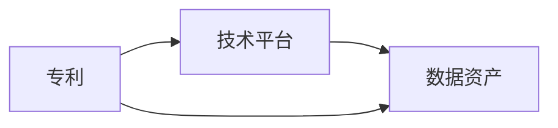
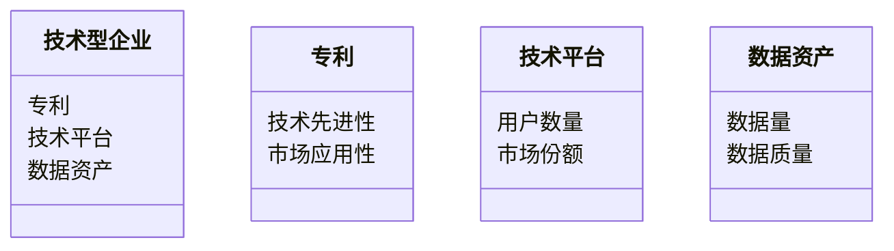
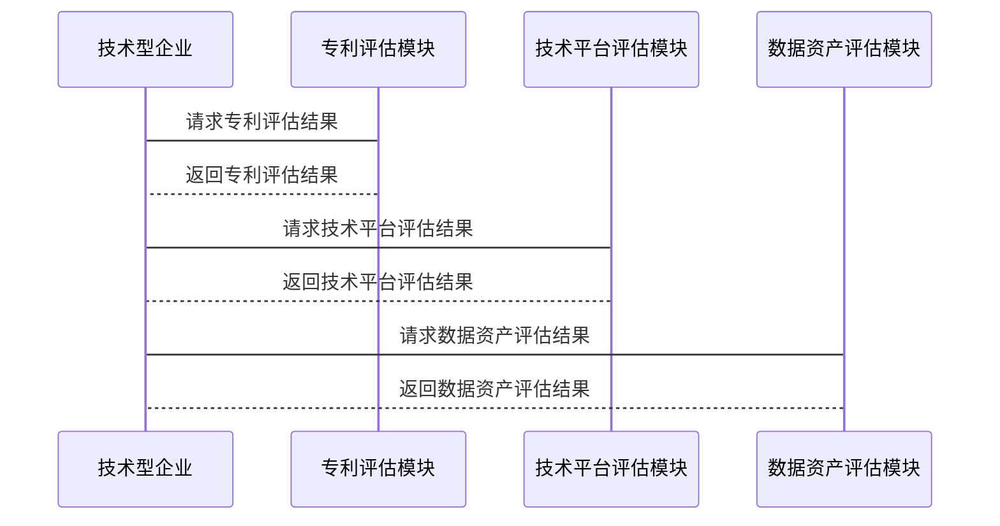

                 


# 技术型企业的特殊估值考虑

> 关键词：技术型企业，专利，技术平台，数据资产，知识产权，估值模型

> 摘要：技术型企业由于其独特的资产构成和业务模式，传统的估值方法往往难以准确反映其价值。本文将详细探讨技术型企业在专利、技术平台和数据资产等方面的特殊估值考虑，分析其核心概念、数学模型和系统架构，并结合实际案例，提供可操作的估值方法和建议。

---

## 第1章：技术型企业的特点与估值挑战

### 1.1 技术型企业的定义与特点

#### 1.1.1 技术型企业的定义
技术型企业是指以技术创新为核心竞争力，依赖专利、技术平台和数据资产等无形资产进行经营的企业。这类企业通常在科技领域（如人工智能、区块链、大数据等）具有较强的竞争力。

#### 1.1.2 技术型企业的核心特点
- **依赖无形资产**：技术型企业的主要价值来源是专利、技术平台和数据资产，而非传统的有形资产。
- **高成长性**：技术型企业通常具有较高的成长潜力，但同时也伴随着较高的风险。
- **创新驱动**：技术创新是技术型企业发展的核心动力，研发投入占比较高。

#### 1.1.3 技术型企业与传统企业的区别
| **维度**       | **技术型企业**                | **传统企业**                |
|-----------------|-------------------------------|-----------------------------|
| 资产构成         | 无形资产为主（专利、数据等）   | 有形资产为主（设备、厂房等） |
| 估值难度         | 较高，需考虑技术生命周期       | 较低，主要考虑有形资产折旧   |
| 成长潜力         | 高，依赖技术创新               | 中低，依赖现有业务模式       |

### 1.2 技术型企业估值的特殊性

#### 1.2.1 技术型企业估值的核心问题
- 如何准确评估专利的市场价值？
- 如何量化技术平台的经济贡献？
- 如何评估数据资产的潜在收益？

#### 1.2.2 技术型企业估值的难点与挑战
- 技术的不确定性和快速变化导致估值波动大。
- 无形资产的价值难以直接量化。
- 市场竞争和技术替代性对估值的影响复杂。

#### 1.2.3 技术型企业估值的重要意义
准确的估值有助于企业融资、并购和战略规划，同时也是投资者评估技术型企业价值的重要依据。

### 1.3 传统企业估值方法的局限性

#### 1.3.1 传统企业估值方法概述
- **资产基础法**：基于企业的账面资产进行估值。
- **市场法**：参考同类企业的市场交易价格。
- **收益法**：基于企业未来收益的折现值。

#### 1.3.2 技术型企业对传统估值方法的挑战
- 传统方法忽视了无形资产的价值。
- 技术型企业的收益波动大，难以准确预测。

#### 1.3.3 传统估值方法在技术型企业中的适用性分析
- **资产基础法**：仅适用于有形资产较多的传统企业。
- **市场法**：在技术型企业中，需要考虑技术的市场竞争力。
- **收益法**：需要结合技术生命周期进行调整。

---

## 第2章：特殊估值的核心概念与联系

### 2.1 核心概念的定义与属性

#### 2.1.1 专利的价值评估
- **专利的类型**：发明专利、实用新型专利、外观设计专利。
- **专利的价值影响因素**：技术先进性、市场应用性、法律保护力度。

#### 2.1.2 技术平台的评估指标
- **技术平台的功能性**：系统的稳定性和扩展性。
- **技术平台的市场竞争力**：用户数量和市场份额。

#### 2.1.3 数据资产的特征分析
- **数据的完整性**：数据的准确性和全面性。
- **数据的流动性**：数据的更新频率和使用效率。

### 2.2 核心概念的对比分析

#### 2.2.1 专利、技术平台和数据资产的对比
| **维度**       | **专利**                   | **技术平台**               | **数据资产**               |
|-----------------|----------------------------|-----------------------------|-----------------------------|
| 价值来源         | 技术创新                   | 平台的构建与运营             | 数据的收集与分析           |
| 评估难度         | 较高，需考虑法律风险       | 较高，需考虑技术复杂性       | 较高，需考虑数据质量和处理能力 |
| 价值实现方式     | 通过授权使用               | 通过平台服务               | 通过数据变现               |

#### 2.2.2 不同技术资产的评估维度
- **专利**：技术先进性、法律保护、市场应用。
- **技术平台**：用户数量、市场份额、技术稳定性。
- **数据资产**：数据量、数据质量和数据处理能力。

#### 2.2.3 核心概念之间的关系
使用Mermaid绘制概念关系图：



---

## 第3章：技术平台的分类与评估指标

### 3.1 技术平台的分类

#### 3.1.1 软件平台
- **定义**：提供软件开发和运行环境的平台。
- **例子**：操作系统、云平台。

#### 3.1.2 硬件平台
- **定义**：提供硬件设备和技术支持的平台。
- **例子**：芯片设计平台、物联网设备。

#### 3.1.3 综合平台
- **定义**：结合软件和硬件的综合性平台。
- **例子**：智能家居平台。

### 3.2 技术平台的评估指标

#### 3.2.1 技术指标
- **性能指标**：处理速度、响应时间。
- **安全性**：数据加密、访问控制。

#### 3.2.2 经济指标
- **成本效益**：投入成本与收益的比率。
- **市场占有率**：平台在市场中的份额。

#### 3.2.3 用户指标
- **用户数量**：活跃用户数。
- **用户满意度**：用户反馈和评价。

---

## 第4章：数据资产的估值与管理

### 4.1 数据资产的分类

#### 4.1.1 结构化数据
- **定义**：结构化、可量化的数据。
- **例子**：数据库中的客户信息。

#### 4.1.2 非结构化数据
- **定义**：文本、图像等不可量化的数据。
- **例子**：社交媒体上的用户评论。

### 4.2 数据资产的评估方法

#### 4.2.1 数据质量评估
- **完整性**：数据是否完整。
- **准确性**：数据是否准确。

#### 4.2.2 数据价值评估
- **数据的使用场景**：数据如何为企业创造价值。
- **数据的市场价值**：数据在市场上的交易价格。

#### 4.2.3 数据资产评估模型
$$ 数据价值 = \sum (数据质量 \times 数据使用价值) $$

### 4.3 数据资产管理

#### 4.3.1 数据存储与安全
- **数据存储**：选择合适的存储解决方案。
- **数据安全**：加密、访问控制。

#### 4.3.2 数据处理与分析
- **数据清洗**：去除噪音数据。
- **数据分析**：使用机器学习等技术进行分析。

---

## 第5章：知识产权的估值与保护

### 5.1 知识产权的分类

#### 5.1.1 专利
- **发明专利**：技术方案的具体实现。
- **实用新型专利**：技术改进。

#### 5.1.2 商标
- **注册商标**：品牌标识。

#### 5.1.3 版权
- **软件著作权**：软件代码的版权。

### 5.2 知识产权的评估方法

#### 5.2.1 专利评估
- **技术先进性**：专利的技术水平。
- **市场应用性**：专利的市场前景。

#### 5.2.2 商标评估
- **品牌价值**：商标的市场认知度。
- **法律保护**：商标的注册和保护情况。

#### 5.2.3 版权评估
- **作品价值**：作品的市场影响力。
- **版权交易**：版权的市场交易情况。

### 5.3 知识产权保护

#### 5.3.1 专利保护
- **专利申请**：提交专利申请。
- **专利维权**：保护专利权益。

#### 5.3.2 商标保护
- **商标注册**：注册商标。
- **商标维权**：防止商标侵权。

#### 5.3.3 版权保护
- **版权登记**：登记版权信息。
- **版权维权**：打击盗版行为。

---

## 第6章：技术企业的整体估值方法

### 6.1 问题场景介绍

#### 6.1.1 问题背景
- 技术型企业需要整体估值，以支持融资和并购决策。

#### 6.1.2 问题描述
- 如何综合评估专利、技术平台和数据资产的价值。

### 6.2 系统功能设计

#### 6.2.1 领域模型
使用Mermaid绘制领域模型图：



### 6.3 系统架构设计

#### 6.3.1 架构设计
使用Mermaid绘制系统架构图：

```mermaid
container 技术型企业 {
    component 专利评估模块 {
        技术先进性评估
        市场应用性评估
    }
    component 技术平台评估模块 {
        用户数量统计
        市场份额分析
    }
    component 数据资产评估模块 {
        数据量计算
        数据质量评估
    }
}
```

### 6.4 系统接口设计

#### 6.4.1 接口设计
- **专利评估接口**：提供技术先进性和市场应用性的评估结果。
- **技术平台接口**：提供用户数量和市场份额的数据。
- **数据资产接口**：提供数据量和数据质量的评估结果。

### 6.5 系统交互

#### 6.5.1 交互流程
使用Mermaid绘制交互流程图：



---

## 第7章：项目实战与案例分析

### 7.1 环境安装

#### 7.1.1 技术环境
- **编程语言**：Python
- **开发工具**：PyCharm
- **依赖库**：pandas, numpy, scikit-learn

#### 7.1.2 数据环境
- **数据存储**：MySQL
- **数据处理**：Jupyter Notebook

### 7.2 核心代码实现

#### 7.2.1 专利评估代码
```python
def calculate_patent_value(tech_advancement, market_applicability):
    return tech_advancement * market_applicability
```

#### 7.2.2 技术平台评估代码
```python
def calculate_platform_value(user_count, market_share):
    return user_count * market_share
```

#### 7.2.3 数据资产评估代码
```python
def calculate_data_value(data_volume, data_quality):
    return data_volume * data_quality
```

### 7.3 案例分析

#### 7.3.1 案例背景
某技术企业拥有多项专利、一个大型技术平台和海量数据资产。

#### 7.3.2 实施步骤
1. **专利评估**：评估专利的技术先进性和市场应用性。
2. **技术平台评估**：统计用户数量和市场份额。
3. **数据资产评估**：计算数据量和数据质量。

#### 7.3.3 分析结果
- 专利价值：$100万
- 技术平台价值：$500万
- 数据资产价值：$200万
- 总价值：$800万

### 7.4 项目小结
通过实际案例分析，验证了技术平台的估值方法的有效性，并展示了如何将理论应用于实际。

---

## 第8章：最佳实践与注意事项

### 8.1 最佳实践

#### 8.1.1 专利管理
- 定期审查专利的有效性。
- 及时更新专利技术。

#### 8.1.2 技术平台优化
- 提升平台性能。
- 优化用户体验。

#### 8.1.3 数据资产管理
- 加强数据安全。
- 提高数据处理能力。

### 8.2 小结

#### 8.2.1 核心内容回顾
技术型企业的估值需要综合考虑专利、技术平台和数据资产的价值，采用专门的估值方法。

#### 8.2.2 实践意义
准确的估值有助于企业制定合理的战略决策，提升企业的市场竞争力。

### 8.3 注意事项

#### 8.3.1 专利估值
- 注意专利的法律风险。
- 考虑专利的市场替代性。

#### 8.3.2 技术平台估值
- 评估平台的技术可行性。
- 考虑平台的可持续发展。

#### 8.3.3 数据资产估值
- 保护数据隐私。
- 加强数据质量管理。

### 8.4 拓展阅读

#### 8.4.1 推荐书籍
- 《技术型企业的估值与融资》
- 《知识产权管理与保护》

#### 8.4.2 技术博客
- 探讨技术型企业的最新估值方法。
- 分析技术平台的最新发展趋势。

---

## 作者：AI天才研究院/AI Genius Institute & 禅与计算机程序设计艺术 /Zen And The Art of Computer Programming

