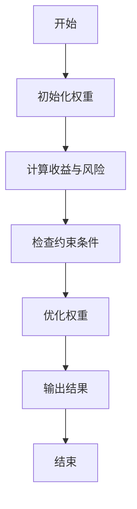
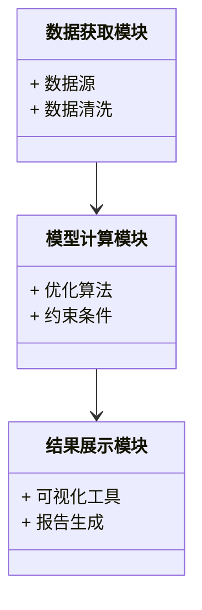

                 


```markdown
# {{投资组合优化模型：现代投资理论的实际应用}}

## {{关键词}}
- 投资组合优化
- 现代投资组合理论
- 数学模型
- 优化算法
- 系统架构设计
- 实际应用

## {{摘要}}
本文系统地介绍了投资组合优化模型的核心理论、数学模型、优化算法及其在现代投资理论中的实际应用。通过逐步分析，本文深入探讨了投资组合优化的关键概念，包括均值-方差模型、有效前沿、夏普比率等，并结合实际案例，详细讲解了如何使用Python编程语言和相关库（如NumPy、SciPy、PyTorch）实现投资组合优化算法。同时，本文还探讨了投资组合优化的系统架构设计，包括数据获取、模型计算和结果展示模块，并通过项目实战展示了如何将理论应用于实践。最后，本文总结了投资组合优化的最佳实践和未来研究方向。

## {{正文}}

### {{第1部分: 投资组合优化模型概述}}

#### {{第1章: 现代投资组合理论基础}}

##### {{1.1 投资组合优化的核心概念}}
###### {{1.1.1 投资组合优化的定义与目标}}
投资组合优化是通过科学的方法选择最优的投资组合，以在给定风险水平下最大化预期收益，或在给定收益水平下最小化风险。其核心目标是实现资产的最优配置，以满足投资者的财务目标。

###### {{1.1.2 投资组合优化的基本假设}}
- 投资者是理性的，追求效用最大化。
- 资产收益服从概率分布。
- 可以通过分散化投资降低风险。

###### {{1.1.3 投资组合优化的边界与外延}}
投资组合优化的边界包括无风险利率、市场风险等。其外延涉及资产配置、风险管理和绩效评估。

##### {{1.2 投资组合优化的关键要素}}
###### {{1.2.1 投资资产的收益与风险}}
收益是投资回报，风险是收益的不确定性。

###### {{1.2.2 投资组合的分散化效应}}
分散化通过投资不同资产降低非系统性风险。

###### {{1.2.3 投资组合的有效前沿}}
有效前沿是所有可能的投资组合中收益-风险关系最优的集合。

#### {{第2章: 投资组合优化的数学模型}}

##### {{2.1 均值-方差模型}}
###### {{2.1.1 均值-方差模型的数学公式}}
目标函数: $\min \sigma^2$  
约束条件: $\sum w_i r_i = \mu, \sum w_i = 1$

###### {{2.1.2 均值-方差模型的优化过程}}


#### {{2.2 线性规划与非线性优化}}
##### {{2.2.1 线性规划在投资组合优化中的应用}}
线性规划用于解决线性目标函数下的优化问题。

##### {{2.2.2 非线性优化的挑战与解决方案}}
非线性优化涉及复杂的目标函数，需使用更高级的算法。

#### {{第3章: 投资组合优化的算法实现}}

##### {{3.1 常用优化算法概述}}
###### {{3.1.1 梯度下降法}}
通过计算目标函数的梯度进行迭代优化。

###### {{3.1.2 内点法}}
在约束条件下寻找最优解。

###### {{3.1.3 进化算法}}
模拟生物进化过程进行优化。

##### {{3.2 基于Python的优化实现}}
###### {{3.2.1 使用SciPy优化库实现均值-方差模型}}
```python
import numpy as np
from scipy.optimize import minimize

def portfolio_variance(weights, covariance_matrix):
    return np.dot(weights.T, np.dot(covariance_matrix, weights))

def optimize_portfolio(target_return, covariance_matrix, expected_returns):
    n = len(weights)
    constraints = [{'type': 'eq', 'fun': lambda w: np.sum(w) - 1},
                   {'type': 'eq', 'fun': lambda w: np.dot(weights.T, expected_returns) - target_return}]
    result = minimize(portfolio_variance, initial_guess, method='SLSQP', constraints=constraints)
    return result.x
```

###### {{3.2.2 使用PyTorch实现非线性优化}}
```python
import torch

def loss_function(params, X, y):
    predictions = model(params, X)
    return torch.mean((predictions - y)**2)

optimizer = torch.optim.Adam(model.parameters(), lr=0.001)
criterion = torch.nn.MSELoss()

for epoch in range(num_epochs):
    outputs = model.forward(X)
    loss = criterion(outputs, y)
    loss.backward()
    optimizer.step()
```

#### {{第4章: 投资组合优化的系统架构设计}}

##### {{4.1 系统功能模块划分}}
###### {{4.1.1 数据获取模块}}
从数据源获取历史价格、收益等数据。

###### {{4.1.2 模型计算模块}}
进行投资组合优化计算，生成优化结果。

###### {{4.1.3 结果展示模块}}
以可视化方式展示优化结果。

##### {{4.2 系统架构设计}}


### {{第2部分: 投资组合优化模型的系统实现与项目实战}}

#### {{第5章: 项目实战}}

##### {{5.1 项目背景与目标}}
通过实际案例展示投资组合优化的实现过程。

##### {{5.2 项目实施步骤}}
###### {{5.2.1 数据获取与预处理}}
从Yahoo Finance获取股票数据，并进行清洗。

###### {{5.2.2 构建投资组合优化模型}}
使用均值-方差模型进行优化。

###### {{5.2.3 实现优化算法}}
使用SciPy优化库实现优化过程。

###### {{5.2.4 结果分析与可视化}}
分析优化结果，并以图表形式展示。

##### {{5.3 项目代码实现}}
###### {{5.3.1 数据获取与预处理}}
```python
import pandas as pd
import yfinance as yf

def get_data(tickers, start_date, end_date):
    data = yf.download(tickers, start_date, end_date)['Adj Close']
    return data.pct_change().dropna()
```

###### {{5.3.2 构建投资组合优化模型}}
```python
def portfolio_optimizer(returns, target_return):
    n = returns.shape[1]
    covariance_matrix = returns.cov()
    initial_guess = np.array([1.0/n] * n)
    
    def objective(weights):
        return np.dot(weights.T, np.dot(covariance_matrix, weights))
    
    constraints = [{'type': 'eq', 'fun': lambda w: sum(w) - 1},
                   {'type': 'eq', 'fun': lambda w: np.dot(returns.mean().values, w) - target_return}]
    
    result = minimize(objective, initial_guess, method='SLSQP', constraints=constraints)
    return result.x
```

###### {{5.3.3 结果分析与可视化}}
```python
import matplotlib.pyplot as plt

def plot_results(weights, returns):
    plt.figure(figsize=(10,6))
    plt.bar(weights.index, weights.values, label='权重')
    plt.title('投资组合权重分布')
    plt.xlabel('资产')
    plt.ylabel('权重')
    plt.legend()
    plt.show()
```

#### {{第6章: 投资组合优化的系统优化与风险管理}}

##### {{6.1 系统优化}}
###### {{6.1.1 约束条件的处理}}
考虑流动性约束、税收影响等。

###### {{6.1.2 系统架构的优化}}
优化数据获取、模型计算和结果展示模块的性能。

##### {{6.2 风险管理}}
###### {{6.2.1 风险度量方法}}
使用VaR、CVaR等方法进行风险度量。

###### {{6.2.2 投资组合再平衡策略}}
定期调整投资组合以维持最优配置。

#### {{第7章: 投资组合优化的拓展与延伸}}

##### {{7.1 高级主题}}
###### {{7.1.1 多目标优化}}
考虑多个优化目标，如风险、收益、流动性等。

###### {{7.1.2 非线性优化模型}}
处理非线性关系，如凸优化问题。

##### {{7.2 现实中的挑战}}
###### {{7.2.1 交易成本}}
考虑交易成本对投资组合的影响。

###### {{7.2.2 市场冲击}}
分析大额交易对市场价格的影响。

#### {{第8章: 总结与展望}}

##### {{8.1 总结}}
本文系统地介绍了投资组合优化模型的核心理论、数学模型、优化算法及其在现代投资理论中的实际应用。通过实际案例展示了如何将理论应用于实践，并提出了系统优化和风险管理的最佳实践。

##### {{8.2 展望}}
未来的研究方向包括多目标优化、非线性模型、机器学习在投资组合优化中的应用等。

### {{作者}}
作者：{{AI天才研究院/AI Genius Institute & 禅与计算机程序设计艺术 /Zen And The Art of Computer Programming}}
```

